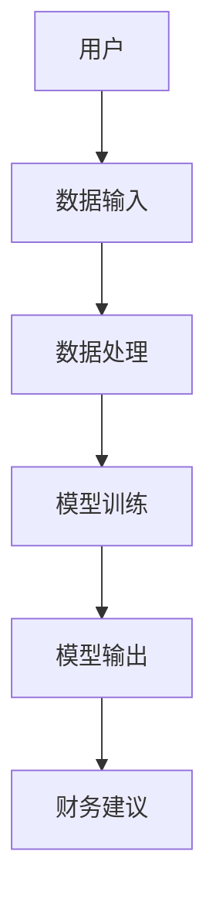
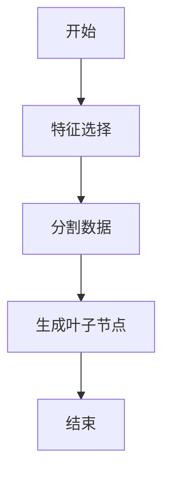
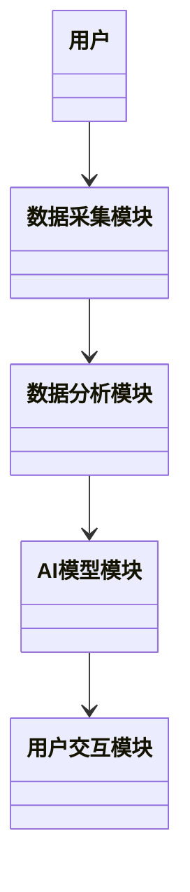

                 


# AI驱动的个人财务规划工具开发指南

> 关键词：AI驱动，个人财务规划，机器学习，自然语言处理，强化学习，系统架构设计

> 摘要：本文将深入探讨AI驱动的个人财务规划工具的开发过程，涵盖从背景分析到系统架构设计的各个方面。通过详细的技术分析和实际案例，我们将揭示如何利用AI技术提升个人财务管理的效率和准确性。

---

# 第1章: 个人财务规划工具的背景与需求

## 1.1 个人财务规划的背景

### 1.1.1 传统财务规划工具的局限性
传统财务规划工具主要依赖于固定的规则和模板，难以适应用户的个性化需求。用户需要手动输入数据，且缺乏动态调整能力，难以应对市场变化和突发情况。

### 1.1.2 AI技术如何改变财务规划
AI技术通过机器学习、自然语言处理和强化学习，能够实时分析大量数据，提供个性化的财务建议。AI驱动的工具可以自动调整投资组合，优化预算分配，帮助用户做出更明智的财务决策。

### 1.1.3 个人财务规划工具的现状与趋势
随着AI技术的快速发展，越来越多的个人财务规划工具开始采用AI驱动的方法。这些工具不仅能够提供个性化的建议，还能够通过数据分析预测市场趋势，帮助用户规避风险。

## 1.2 问题背景与描述

### 1.2.1 个人财务管理的核心问题
个人财务管理的核心问题是如何优化资产配置、降低风险、提高收益。传统方法依赖于固定的规则，难以应对复杂多变的市场环境。

### 1.2.2 数据驱动的财务规划需求
现代财务规划需要依赖大量的数据，包括市场数据、个人收支数据等。通过数据分析，可以发现潜在的财务问题，并制定有效的解决方案。

### 1.2.3 AI在财务规划中的应用边界
AI在财务规划中的应用边界包括数据收集、分析和决策支持。AI无法完全替代人类的判断，特别是在涉及道德和伦理的决策中，仍需要人类的干预。

## 1.3 问题解决与技术路线

### 1.3.1 AI驱动的解决方案概述
AI驱动的解决方案通过机器学习模型分析用户数据，提供个性化的财务建议。模型可以动态调整投资策略，帮助用户实现财务目标。

### 1.3.2 技术路线与实现框架
技术路线包括数据采集、数据预处理、模型训练、模型部署和用户交互。实现框架需要结合前端和后端技术，确保系统的高效运行。

### 1.3.3 核心概念与系统边界
核心概念包括用户数据、机器学习模型、财务建议。系统边界包括数据输入、模型运行和用户输出。

## 1.4 核心概念与联系

### 1.4.1 AI驱动的财务规划模型
AI驱动的财务规划模型通过分析用户数据，生成个性化的财务建议。模型可以动态调整，适应市场变化。

### 1.4.2 数据流与决策流程
数据流包括数据采集、预处理和分析。决策流程包括模型训练、预测和优化。

### 1.4.3 用户需求与系统功能的映射关系
用户需求如资产配置优化映射到系统功能如投资组合优化模块。

## 1.5 本章小结
本章介绍了AI驱动的个人财务规划工具的背景、问题背景、技术路线和核心概念，为后续章节的深入分析奠定了基础。

---

# 第2章: AI驱动的财务规划工具核心概念

## 2.1 AI在财务规划中的核心原理

### 2.1.1 机器学习在财务预测中的应用
机器学习可以用于预测股票价格、风险评估等。例如，使用线性回归模型预测市场趋势。

### 2.1.2 自然语言处理在财务信息提取中的应用
NLP技术可以从财务报告中提取关键信息，如公司业绩、市场趋势等。

### 2.1.3 强化学习在财务决策优化中的应用
强化学习可以用于动态调整投资组合，优化收益和风险。

## 2.2 核心概念的属性对比

### 2.2.1 传统规则引擎与AI模型的对比分析
| 特性 | 传统规则引擎 | AI模型 |
|------|--------------|--------|
| 灵活性 | 低           | 高     |
| 复杂性 | 简单         | 复杂   |

### 2.2.2 不同AI技术在财务规划中的作用对比
| 技术 | 作用 | 示例 |
|------|------|------|
| 机器学习 | 预测 | 预测股票价格 |
| NLP | 提取信息 | 分析财务报告 |
| 强化学习 | 决策优化 | 调整投资组合 |

### 2.2.3 用户交互方式的对比与优化建议
传统交互方式基于固定规则，AI交互方式基于动态模型。优化建议包括结合用户反馈，动态调整模型参数。

## 2.3 ER实体关系图

### 2.3.1 用户、数据、模型的实体关系
用户与数据的关系：用户生成和提供数据。
数据与模型的关系：数据输入模型，模型生成输出。
用户与模型的关系：用户通过模型获得财务建议。

### 2.3.2 数据流
Mermaid数据流图：


## 2.4 本章小结
本章详细分析了AI在财务规划中的核心原理，对比了不同技术的作用，并通过ER实体关系图展示了系统的数据流。

---

# 第3章: AI驱动的财务规划工具算法原理

## 3.1 算法原理概述

### 3.1.1 机器学习算法
- 线性回归：用于预测连续变量，如股票价格。
- 决策树：用于分类和回归问题，如客户风险评估。

### 3.1.2 自然语言处理算法
- 词袋模型：用于文本表示，如财务报告分析。
- TF-IDF：用于关键词提取，如提取财务报告中的关键信息。

### 3.1.3 强化学习算法
- Q-learning：用于动态决策，如投资组合优化。

## 3.2 算法实现

### 3.2.1 线性回归实现
数学公式：
$$y = \beta_0 + \beta_1x + \epsilon$$
代码示例：
```python
import numpy as np
from sklearn.linear_model import LinearRegression

X = np.array([1, 2, 3, 4, 5]).reshape(-1, 1)
y = np.array([2, 4, 5, 4, 6])

model = LinearRegression()
model.fit(X, y)
print(model.predict(X))
```

### 3.2.2 决策树实现
Mermaid流程图：


代码示例：
```python
from sklearn.tree import DecisionTreeClassifier

X = [[1, 2], [3, 4], [5, 6], [7, 8]]
y = [0, 1, 1, 0]

model = DecisionTreeClassifier()
model.fit(X, y)
print(model.predict([[9, 10]]))
```

## 3.3 算法优化与调参

### 3.3.1 参数调整
- 线性回归：调整正则化参数。
- 决策树：调整树的深度。

### 3.3.2 超参数优化
使用网格搜索（GridSearchCV）进行参数优化。

代码示例：
```python
from sklearn.model_selection import GridSearchCV

param_grid = {'max_depth': [2, 3, 4, 5]}
grid_search = GridSearchCV(model, param_grid)
grid_search.fit(X, y)
print(grid_search.best_params_)
```

## 3.4 本章小结
本章详细讲解了AI驱动的财务规划工具中常用的算法，包括线性回归、决策树和强化学习，并通过代码示例展示了这些算法的实现和优化方法。

---

# 第4章: AI驱动的财务规划工具系统架构设计

## 4.1 系统模块设计

### 4.1.1 数据采集模块
- 数据来源：用户输入、第三方API。
- 数据类型：收入、支出、资产、负债。

### 4.1.2 数据分析模块
- 数据清洗：处理缺失值、异常值。
- 数据预处理：特征提取、标准化。

### 4.1.3 AI模型模块
- 模型训练：使用训练数据训练模型。
- 模型预测：生成财务建议。

### 4.1.4 用户交互模块
- 用户界面：图形界面、命令行界面。
- 交互功能：输入数据、查看建议。

## 4.2 系统架构设计

### 4.2.1 模块关系图
Mermaid类图：


### 4.2.2 接口设计
- 数据采集接口：REST API。
- 模型调用接口：API调用。

### 4.2.3 交互设计
- 用户输入：通过表格或表单输入数据。
- 模型输出：通过图表或报告展示结果。

## 4.3 本章小结
本章详细设计了AI驱动的财务规划工具的系统架构，包括模块划分、接口设计和交互流程。

---

# 第5章: AI驱动的财务规划工具项目实战

## 5.1 环境安装与配置

### 5.1.1 安装Python
安装Python 3.8及以上版本。

### 5.1.2 安装依赖库
使用pip安装numpy、pandas、scikit-learn等库。

## 5.2 核心代码实现

### 5.2.1 数据处理
代码示例：
```python
import pandas as pd
import numpy as np

data = pd.DataFrame({
    '收入': [5000, 6000, 7000, 8000],
    '支出': [3000, 4000, 5000, 6000]
})
```

### 5.2.2 模型训练
代码示例：
```python
from sklearn.linear_model import LinearRegression

X = data[['收入']]
y = data['支出']

model = LinearRegression()
model.fit(X, y)
print(model.coef_)
```

### 5.2.3 模型预测
代码示例：
```python
new_income = np.array([[9000]])
predicted_expense = model.predict(new_income)
print(predicted_expense)
```

## 5.3 功能解读与分析

### 5.3.1 数据采集功能
用户通过界面输入收入和支出数据。

### 5.3.2 模型分析功能
模型根据输入数据生成支出预测。

### 5.3.3 结果展示功能
结果以图表形式展示，帮助用户直观理解。

## 5.4 案例分析与解读

### 5.4.1 案例背景
用户希望优化投资组合，降低风险。

### 5.4.2 数据分析
使用决策树模型分析不同投资组合的风险和收益。

### 5.4.3 结果展示
模型生成投资组合优化报告，包括收益预测和风险评估。

## 5.5 本章小结
本章通过实际案例展示了AI驱动的财务规划工具的开发过程，从环境配置到代码实现，再到结果展示，帮助读者掌握实际开发技能。

---

# 第6章: 总结与展望

## 6.1 最佳实践与注意事项

### 6.1.1 数据质量的重要性
确保数据准确性和完整性。

### 6.1.2 模型调优的必要性
通过网格搜索和交叉验证优化模型性能。

### 6.1.3 用户反馈的价值
定期收集用户反馈，优化系统功能。

## 6.2 小结
AI驱动的个人财务规划工具通过结合机器学习、NLP和强化学习，能够为用户提供个性化的财务建议，帮助用户实现财务目标。

## 6.3 注意事项

### 6.3.1 数据隐私保护
确保用户数据的安全和隐私。

### 6.3.2 模型可解释性
选择可解释性强的模型，便于用户理解和信任。

### 6.3.3 系统稳定性
确保系统稳定运行，避免数据丢失和模型崩溃。

## 6.4 拓展阅读

### 6.4.1 推荐书籍
- 《机器学习实战》
- 《自然语言处理入门》

### 6.4.2 技术博客
推荐阅读相关技术博客，了解最新的技术动态和应用案例。

## 6.5 本章小结
本章总结了全文内容，提供了最佳实践和注意事项，并推荐了进一步学习的资源。

---

# 作者：AI天才研究院 & 禅与计算机程序设计艺术

---

以上就是《AI驱动的个人财务规划工具开发指南》的完整目录和内容概要。从背景分析到系统设计，再到项目实战，文章详细讲解了AI驱动的财务规划工具的开发过程。通过丰富的代码示例和实际案例，读者可以逐步掌握相关技术，开发出高效的AI驱动的个人财务规划工具。

