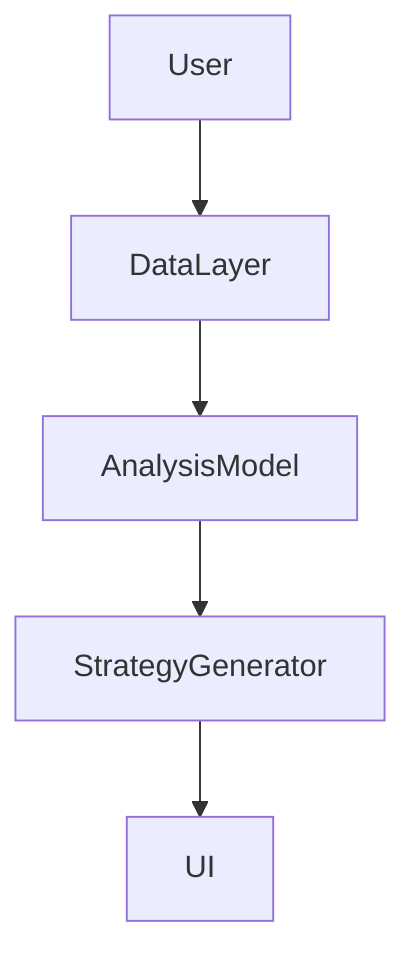
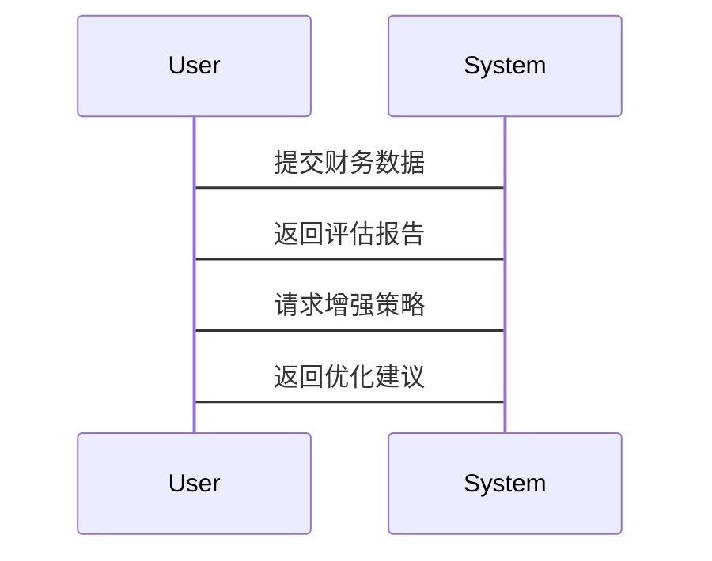

                 


# AI驱动的个人财务韧性评估与增强系统

> 关键词：AI, 个人财务, 韧性评估, 增强系统, 机器学习, 深度学习

> 摘要：  
本文探讨了AI技术在个人财务管理中的应用，提出了基于AI的个人财务韧性评估与增强系统的设计与实现。通过分析个人财务数据，利用机器学习和深度学习技术，系统能够评估个人财务状况并提供增强策略，帮助用户实现财务健康和韧性提升。文章详细介绍了系统的核心概念、算法原理、架构设计及项目实现，旨在为读者提供一套高效、智能的个人财务管理解决方案。

---

# 第一部分: AI驱动的个人财务韧性评估与增强系统概述

# 第1章: 个人财务韧性评估的背景与挑战

## 1.1 个人财务韧性的概念与重要性

### 1.1.1 财务韧性定义  
个人财务韧性是指个体在面对经济波动、收入变化或突发事件时，维持财务稳定和持续增长的能力。它衡量的是个人在不同经济环境下的抗风险能力和财务恢复能力。

### 1.1.2 财务韧性在个人生活中的作用  
- 保护家庭经济安全：在失业、疾病或意外事件时，能够维持基本生活开支。  
- 实现财务目标：通过合理规划，实现储蓄、投资和退休计划等长期目标。  
- 提高生活质量：通过优化支出和收入管理，提升整体生活质量。  

### 1.1.3 数字化时代的财务管理新需求  
随着人工智能和大数据技术的普及，个人财务管理需要更加智能化和个性化。传统的人工记录和简单分析已难以应对复杂的经济环境，用户需要实时、精准的财务评估和增强策略。

---

## 1.2 传统财务评估方法的局限性

### 1.2.1 传统财务评估指标  
传统的财务评估主要依赖以下指标：  
1. 储蓄率：可支配收入中用于储蓄的比例。  
2. 支出结构：各项支出占总收入的比例。  
3. 债务负担：债务与收入的比例。  
4. 投资回报率：投资收益与本金的比例。  

### 1.2.2 传统方法的不足  
- 数据量有限：传统方法依赖手动记录，数据收集不全面。  
- 分析维度单一：仅关注部分财务指标，难以全面评估财务健康。  
- 缺乏预测能力：无法基于历史数据预测未来的财务风险和机会。  

### 1.2.3 技术进步对财务评估的影响  
人工智能和大数据技术的引入，使得财务评估可以从多个维度（如消费习惯、市场趋势、个人信用记录）进行分析，并提供实时反馈和优化建议。

---

## 1.3 AI技术在财务评估中的应用前景

### 1.3.1 AI技术的基本概念  
人工智能（AI）是模拟人类智能的计算机系统，能够通过数据学习和模式识别完成复杂任务。

### 1.3.2 AI在财务分析中的优势  
- 数据处理能力强：AI能够快速处理大量结构化和非结构化数据。  
- 预测准确性高：通过机器学习模型，AI能够预测未来的财务风险和收益。  
- 个性化建议：基于用户的财务状况和行为习惯，提供定制化的增强策略。  

### 1.3.3 个人财务增强系统的潜力  
AI驱动的财务增强系统能够帮助用户优化支出、增加储蓄、降低债务负担，并制定合理的投资策略，从而提升个人财务韧性。

---

## 1.4 本章小结  
本章从个人财务韧性的概念出发，分析了传统财务评估方法的局限性，并探讨了AI技术在财务评估中的应用前景。AI技术的引入为个人财务管理带来了新的可能性，能够通过智能分析和预测，帮助用户更好地管理财务。

---

# 第2章: 数据驱动的财务评估原理

## 2.1 数据来源与特征提取

### 2.1.1 数据来源分析  
AI驱动的财务增强系统需要收集以下数据：  
- **收入数据**：包括工资、奖金、投资收益等。  
- **支出数据**：包括日常生活开支、债务还款、投资支出等。  
- **资产数据**：包括银行存款、房地产、股票等。  
- **信用记录**：包括信用卡使用情况、贷款记录等。  

### 2.1.2 特征提取方法  
通过数据预处理，提取关键特征：  
- **收入稳定性**：分析收入的波动情况。  
- **支出结构**：识别非必要开支比例。  
- **资产配置**：评估资产的多样性和风险分散能力。  

### 2.1.3 数据预处理技术  
- 数据清洗：处理缺失值、异常值和重复值。  
- 数据标准化：将不同量纲的数据进行标准化处理。  
- 数据增强：通过数据扩展技术增加数据多样性。  

---

## 2.2 AI模型的基本原理

### 2.2.1 机器学习基础  
机器学习是一种通过数据训练模型的技术，分为监督学习、无监督学习和强化学习。  
- **监督学习**：基于标记数据训练模型，例如线性回归和决策树。  
- **无监督学习**：在无标记数据中发现模式，例如聚类分析。  

### 2.2.2 深度学习简介  
深度学习是机器学习的一种，通过多层神经网络进行特征提取和模式识别。  
- **神经网络**：由输入层、隐藏层和输出层组成，能够处理复杂的非线性关系。  

### 2.2.3 模型训练流程  
1. 数据准备：收集、清洗和标注数据。  
2. 模型选择：根据问题类型选择合适的算法。  
3. 模型训练：通过反向传播和优化器调整模型参数。  
4. 模型评估：使用测试数据验证模型性能。  

---

## 2.3 财务韧性评估模型的构建

### 2.3.1 模型选择与优化  
- **回归模型**：预测财务指标的变化趋势。  
- **分类模型**：识别财务风险等级（如高风险、中风险、低风险）。  
- **集成模型**：结合多种算法提升预测精度。  

### 2.3.2 模型评估指标  
- **准确率**：分类模型的预测正确率。  
- **召回率**：模型识别正样本的能力。  
- **F1分数**：综合准确率和召回率的指标。  

### 2.3.3 模型部署与应用  
将训练好的模型部署到系统中，实时分析用户的财务数据，并提供增强建议。

---

## 2.4 本章小结  
本章详细介绍了AI驱动的财务增强系统所需的数据来源、特征提取方法和模型构建流程。通过机器学习和深度学习技术，系统能够准确评估个人财务状况，并提供个性化的增强策略。

---

# 第3章: 系统功能与架构设计

## 3.1 系统功能模块划分

### 3.1.1 数据采集模块  
- 通过API接口获取用户的财务数据。  
- 支持多种数据格式（如JSON、CSV）。  

### 3.1.2 评估分析模块  
- 使用机器学习模型分析用户的财务状况。  
- 输出财务韧性评估报告。  

### 3.1.3 增强策略模块  
- 根据评估结果，提供优化建议（如支出调整、投资建议）。  
- 提供财务目标规划（如储蓄目标、投资计划）。  

### 3.1.4 用户交互模块  
- 提供直观的用户界面（如仪表盘）。  
- 支持用户与系统进行实时交互。  

---

## 3.2 系统架构设计

### 3.2.1 分层架构  
系统采用分层架构：  
- **数据层**：负责数据的存储和管理。  
- **业务逻辑层**：实现核心功能（如评估分析、策略生成）。  
- **用户界面层**：提供友好的人机交互界面。  

### 3.2.2 实体关系图  
使用Mermaid绘制系统实体关系图：



---

## 3.3 接口设计与交互流程

### 3.3.1 接口设计  
- **RESTful API**：提供标准的接口供其他系统调用。  
- **安全性**：采用加密技术和认证机制保护用户数据。  

### 3.3.2 交互流程  
使用Mermaid绘制交互流程图：



---

## 3.4 本章小结  
本章从功能模块和系统架构两个方面，详细介绍了AI驱动的个人财务增强系统的整体设计。通过分层架构和模块化设计，系统能够高效地完成数据采集、评估分析和策略生成的任务。

---

# 第四部分: 项目实战与优化

## 4.1 环境搭建与数据准备

### 4.1.1 安装开发环境  
- 安装Python和必要的库（如NumPy、Pandas、Scikit-learn）。  
- 安装深度学习框架（如TensorFlow、Keras）。  

### 4.1.2 数据集准备  
- 下载或收集个人财务数据（如CSV格式）。  
- 数据预处理（如清洗、标准化）。  

---

## 4.2 核心代码实现

### 4.2.1 数据加载与预处理  
```python
import pandas as pd
import numpy as np

# 加载数据
data = pd.read_csv('financial_data.csv')

# 数据清洗
data.dropna(inplace=True)
data = data.drop_duplicates()

# 标准化处理
from sklearn.preprocessing import StandardScaler
scaler = StandardScaler()
scaled_data = scaler.fit_transform(data.drop(columns=['label']))
```

### 4.2.2 模型训练与评估  
```python
from sklearn.model_selection import train_test_split
from sklearn.linear_model import LinearRegression
from sklearn.metrics import mean_squared_error

# 划分训练集和测试集
X_train, X_test, y_train, y_test = train_test_split(scaled_data, data['label'], test_size=0.2)

# 训练模型
model = LinearRegression()
model.fit(X_train, y_train)

# 评估模型
y_pred = model.predict(X_test)
print('均方误差:', mean_squared_error(y_test, y_pred))
```

### 4.2.3 增强策略生成  
```python
# 根据模型预测结果生成增强策略
def generate_strategy(predicted_risk):
    if predicted_risk < 0.3:
        return "低风险，建议增加投资"
    elif 0.3 <= predicted_risk < 0.7:
        return "中风险，建议优化支出"
    else:
        return "高风险，建议减少负债"

predicted_risk = model.predict(...)[0]
strategy = generate_strategy(predicted_risk)
print("增强策略:", strategy)
```

---

## 4.3 案例分析与优化建议

### 4.3.1 案例分析  
以一名用户的财务数据为例，展示系统的评估和增强过程：  
- 数据输入：收入5000元/月，支出3500元/月，储蓄1500元/月，投资10000元。  
- 系统评估：财务韧性中等，支出结构不合理，投资风险较高。  
- 增强建议：减少非必要开支，优化投资组合，增加应急储备金。  

### 4.3.2 优化建议  
- 定期更新模型：根据市场变化和用户行为调整模型参数。  
- 提供用户教育：帮助用户理解财务管理和增强策略。  
- 引入实时监控：实时跟踪用户的财务状况，及时发出预警。  

---

## 4.4 本章小结  
本章通过实际项目案例，展示了AI驱动的个人财务增强系统的实现过程。通过代码示例和案例分析，读者可以理解如何将理论应用于实际。

---

# 第五部分: 最佳实践与未来展望

## 5.1 最佳实践 tips

### 5.1.1 数据隐私保护  
确保用户数据的安全性，避免数据泄露。  
- 使用加密技术保护数据。  
- 遵守相关法律法规（如GDPR）。  

### 5.1.2 模型优化建议  
- 定期更新模型，保持其预测能力。  
- 引入更多数据源，提升模型的泛化能力。  

### 5.1.3 用户教育与反馈  
- 提供用户教育材料，帮助用户理解系统功能。  
- 收集用户反馈，持续改进系统。  

---

## 5.2 未来展望

### 5.2.1 技术发展趋势  
- 更先进的AI算法（如大语言模型）的应用。  
- 跨平台集成：与其他财务工具和服务无缝对接。  

### 5.2.2 市场需求  
随着人们对财务安全的需求增加，AI驱动的财务增强系统将成为未来的主流。  
- 个性化服务：根据用户需求提供定制化的财务建议。  
- 全球化服务：支持多语言和多货币的财务管理。  

---

## 5.3 本章小结  
本章总结了AI驱动的个人财务增强系统的最佳实践，并展望了未来的发展方向。通过持续的技术创新和用户教育，系统将更好地满足用户的财务管理需求。

---

# 作者：AI天才研究院/AI Genius Institute & 禅与计算机程序设计艺术 /Zen And The Art of Computer Programming

---

希望这篇文章能够帮助您理解AI在个人财务管理中的应用，并为您提供有价值的参考！

