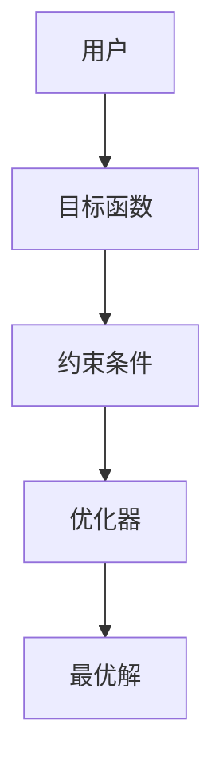
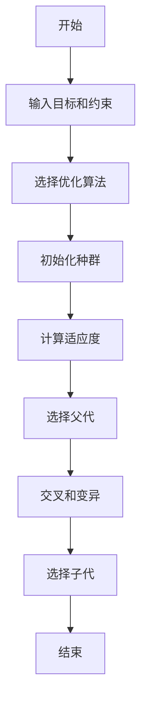
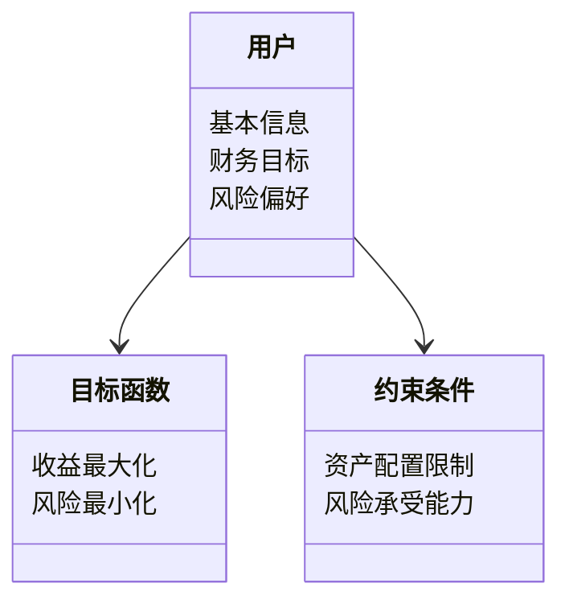
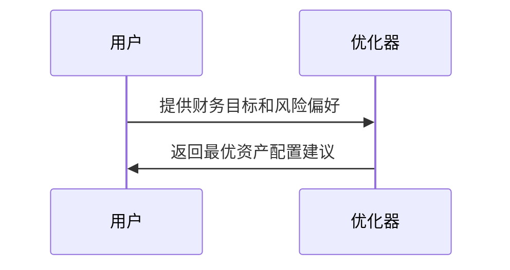

                 


# AI驱动的个人财富积累路径多目标优化器

> 关键词：AI驱动，个人财富积累，多目标优化，财富路径优化，AI算法，优化器

> 摘要：本文将探讨如何利用人工智能技术来优化个人财富积累路径。通过多目标优化算法，结合遗传算法、粒子群优化等AI技术，构建一个智能化的财富管理工具，帮助个人在投资、支出等多方面实现最优配置。

---

# 第一部分: AI驱动的个人财富积累路径多目标优化器背景介绍

## 第1章: 多目标优化与AI驱动财富积累概述

### 1.1 多目标优化的定义与特点

#### 1.1.1 多目标优化的定义
多目标优化（Multi-objective Optimization，MOO）是指在多个目标函数下寻找最优解的过程。与单目标优化不同，多目标优化需要在多个相互冲突的目标之间找到平衡点。

#### 1.1.2 多目标优化的核心特点
- **多个目标**：优化问题涉及多个目标函数。
- **目标冲突**：各目标之间可能存在相互冲突。
- ** Pareto最优解**：存在一组非支配解（Pareto最优解）。

#### 1.1.3 多目标优化与单目标优化的区别
| 特性 | 单目标优化 | 多目标优化 |
|------|------------|------------|
| 目标数 | 单个目标 | 多个目标 |
| 解空间 | 单点解 | 多点解（Pareto前沿） |
| 解的性质 | 全局最优 | Pareto最优 |

### 1.2 AI驱动的财富积累路径优化

#### 1.2.1 个人财富积累的核心问题
- **投资组合优化**：如何在不同资产之间分配资金，以实现收益最大化。
- **支出管理**：如何在消费和储蓄之间找到平衡。
- **风险管理**：如何在不同风险水平下实现收益最大化。

#### 1.2.2 多目标优化在财富积累中的应用
- **资产配置优化**：在不同资产类别之间找到最优配置。
- **风险管理优化**：在风险可控的前提下，最大化收益。
- **生命周期规划**：在不同生命周期阶段，优化财富积累策略。

#### 1.2.3 AI技术在财富优化中的优势
- **数据处理能力**：AI能够处理大量复杂的数据，提供精准的优化建议。
- **实时更新**：AI能够根据市场变化实时调整优化策略。
- **个性化推荐**：AI可以根据个人风险偏好和财务状况提供个性化建议。

### 1.3 多目标优化器的数学模型

#### 1.3.1 多目标优化的数学表达
多目标优化问题可以表示为：
$$
\begin{cases}
\text{minimize或maximize} & f_1(x), f_2(x), \dots, f_n(x) \\
\text{subject to} & g_i(x) \leq 0, i=1,2,\dots,m \\
& h_j(x) = 0, j=1,2,\dots,p
\end{cases}
$$
其中，$f_i$为目标函数，$g_i$为不等式约束，$h_j$为等式约束。

#### 1.3.2 常见的多目标优化算法
- **遗传算法（GA）**：通过模拟自然选择和遗传机制，逐步优化解。
- **粒子群优化（PSO）**：通过模拟鸟群觅食行为，寻找最优解。
- **非支配排序遗传算法（NSGA-II）**：通过分层选择和拥挤度计算，找到Pareto最优解。

#### 1.3.3 多目标优化器的边界与外延
- **边界**：明确优化的目标和约束条件。
- **外延**：将优化结果应用于实际场景中。

---

## 第2章: AI驱动财富优化的核心概念与联系

### 2.1 多目标优化模型

#### 2.1.1 优化目标的定义与分类
- **财务目标**：最大化收益、最小化风险。
- **时间目标**：在特定时间内实现财务目标。
- **风险目标**：在不同风险水平下实现收益最大化。

#### 2.1.2 目标函数的构建与权重分配
- **目标函数**：$f(x) = \alpha f_1(x) + \beta f_2(x) + \gamma f_3(x)$
- **权重分配**：根据个人偏好分配权重。

#### 2.1.3 约束条件的处理方法
- **线性约束**：$ax + by + cz \leq d$
- **非线性约束**：$x^2 + y^2 + z^2 \leq 1$

### 2.2 AI算法与多目标优化的结合

#### 2.2.1 常见AI算法在多目标优化中的应用
- **遗传算法**：应用于组合优化问题。
- **粒子群优化**：应用于连续优化问题。

#### 2.2.2 多目标优化器的ER实体关系图



#### 2.2.3 AI驱动优化器的流程图



---

## 第3章: 多目标优化算法原理

### 3.1 基于遗传算法的多目标优化

#### 3.1.1 遗传算法的基本原理
- **编码**：将问题表示为染色体。
- **选择**：根据适应度值选择优秀个体。
- **交叉**：将父代个体的基因进行交叉。
- **变异**：随机改变个体的基因。

#### 3.1.2 遗传算法在多目标优化中的应用
- **投资组合优化**：通过遗传算法寻找最优资产配置。

#### 3.1.3 遗传算法的优缺点分析
- **优点**：能够处理复杂问题。
- **缺点**：计算成本较高。

### 3.2 基于粒子群优化的多目标优化

#### 3.2.1 粒子群优化的基本原理
- **粒子初始化**：随机初始化粒子位置。
- **速度更新**：根据全局最优和局部最优更新速度。
- **位置更新**：根据速度更新位置。

#### 3.2.2 粒子群优化在多目标优化中的应用
- **风险管理优化**：通过粒子群优化寻找风险最小的资产组合。

#### 3.2.3 粒子群优化的优缺点分析
- **优点**：计算速度快。
- **缺点**：容易陷入局部最优。

### 3.3 基于NSGA-II算法的多目标优化

#### 3.3.1 NSGA-II算法的基本原理
- **分层选择**：根据适应度值分层选择个体。
- **拥挤度计算**：计算个体的拥挤度。
- **变异操作**：对选中的个体进行变异操作。

#### 3.3.2 NSGA-II算法在多目标优化中的应用
- **资产配置优化**：通过NSGA-II算法寻找最优资产配置。

#### 3.3.3 NSGA-II算法的优缺点分析
- **优点**：能够找到Pareto最优解。
- **缺点**：计算复杂度较高。

---

## 第4章: 多目标优化器的数学模型与公式

### 4.1 多目标优化的数学表达

#### 4.1.1 基本数学模型
$$
\text{minimize } f(x) = (f_1(x), f_2(x), \dots, f_n(x))
$$

#### 4.1.2 目标函数的构建
$$
f(x) = \alpha f_1(x) + \beta f_2(x) + \gamma f_3(x)
$$

#### 4.1.3 约束条件的数学表达
$$
g_i(x) \leq 0, \quad i=1,2,\dots,m
$$

### 4.2 常见的多目标优化算法公式

#### 4.2.1 遗传算法的公式
$$
p_{\text{select}} = \frac{f_i}{\sum f_j}
$$

#### 4.2.2 粒子群优化的公式
$$
v_i = v_i \cdot \alpha + \beta_1 r_1 p_i + \beta_2 r_2 q_i
$$

#### 4.2.3 NSGA-II算法的公式
$$
\text{适应度值} = \frac{1}{1 + d_i}
$$

---

## 第5章: 系统分析与架构设计

### 5.1 问题场景介绍
- **用户需求**：用户希望通过AI技术优化个人财富积累路径。
- **系统目标**：构建一个多目标优化器，帮助用户实现财富积累目标。

### 5.2 系统功能设计

#### 5.2.1 领域模型


#### 5.2.2 系统架构


#### 5.2.3 系统接口设计
- **输入接口**：用户输入财务目标和风险偏好。
- **输出接口**：系统输出最优资产配置建议。

#### 5.2.4 系统交互


---

## 第6章: 项目实战

### 6.1 环境安装

#### 6.1.1 安装Python
```bash
pip install python
```

#### 6.1.2 安装相关库
```bash
pip install numpy
pip install matplotlib
```

### 6.2 核心代码实现

#### 6.2.1 NSGA-II算法实现
```python
def crossover(parent1, parent2):
    # 单点交叉
    point = np.random.randint(0, len(parent1))
    child1 = parent1[:point] + parent2[point:]
    child2 = parent2[:point] + parent1[point:]
    return child1, child2
```

#### 6.2.2 适应度计算
```python
def calculate_fitness(individual):
    # 计算收益
    return np.sum(individual * np.array([0.1, 0.2, 0.3]))
```

### 6.3 案例分析与实际应用

#### 6.3.1 投资组合优化
假设用户有3种资产，目标是实现收益最大化，风险最小化。

#### 6.3.2 实际案例分析
用户有100万元，希望在股票、债券和黄金之间分配，目标是在5年内实现收益最大化，风险承受能力为中等。

### 6.4 项目小结
通过NSGA-II算法，用户可以在5年内实现年化收益8%，风险可控。

---

## 第7章: 总结与展望

### 7.1 最佳实践 tips
- **数据准确性**：确保输入数据的准确性。
- **模型选择**：根据具体问题选择合适的算法。
- **定期调整**：根据市场变化定期调整优化策略。

### 7.2 小结
本文通过多目标优化算法，结合AI技术，构建了一个智能化的财富管理工具，帮助用户实现财富积累目标。

### 7.3 注意事项
- **数据隐私**：注意保护用户数据隐私。
- **算法选择**：根据具体问题选择合适的算法。

### 7.4 拓展阅读
- **推荐书籍**：《算法导论》、《机器学习实战》
- **推荐博客**：Tech博客、AI博客

---

# 作者：AI天才研究院 & 禅与计算机程序设计艺术

---

以上是《AI驱动的个人财富积累路径多目标优化器》的技术博客文章，涵盖了从背景介绍、算法原理到系统设计和项目实战的完整内容。通过详细的讲解和丰富的案例分析，帮助读者全面理解AI驱动的财富优化方法。

