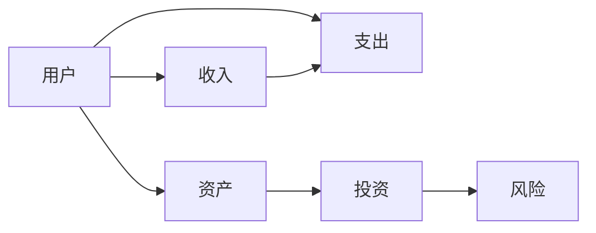

                 


# AI驱动的个人财富积累路径规划器

> 关键词：AI，财富管理，路径规划，投资策略，数据分析，机器学习，个性化推荐

> 摘要：本文探讨了利用人工智能技术进行个人财富积累路径规划的方法。通过分析AI在财富管理中的应用，提出了基于机器学习的投资策略优化和个性化推荐模型。结合实际案例和系统设计，展示了如何构建一个智能化的财富规划系统，帮助个人实现财富最大化。

---

## 第一部分：背景与概述

### 第1章：背景与问题背景

#### 1.1 AI在财富管理中的应用背景
- 1.1.1 当前财富管理的挑战与痛点
  - 传统财富管理的局限性
  - 数据量激增带来的复杂性
  - 个性化需求的增加

- 1.1.2 AI技术在金融领域的应用现状
  - 数据分析与预测
  - 个性化推荐
  - 风险评估与控制

- 1.1.3 AI驱动财富规划的必要性
  - 提高决策效率
  - 优化投资组合
  - 实现个性化服务

#### 1.2 问题背景与问题描述
- 1.2.1 传统财富规划的局限性
  - 依赖经验而非数据驱动
  - 缺乏个性化定制
  - 风险评估不全面

- 1.2.2 AI如何解决财富规划中的问题
  - 提供数据驱动的决策支持
  - 实现个性化投资建议
  - 动态优化投资组合

- 1.2.3 问题的边界与外延
  - 财富规划的目标与范围
  - AI在不同场景下的应用

#### 1.3 核心概念与问题解决路径
- 1.3.1 核心概念的定义与属性
  - 数据驱动的分析方法
  - 机器学习的应用
  - 个性化推荐的实现逻辑

- 1.3.2 问题解决的逻辑框架
  - 数据收集与处理
  - 模型训练与优化
  - 实时调整与反馈

- 1.3.3 核心要素与组成结构
  - 数据源
  - 模型算法
  - 交互界面

---

## 第二部分：核心概念与联系

### 第2章：核心概念原理与联系

#### 2.1 AI驱动财富规划的核心原理
- 2.1.1 数据驱动的分析方法
  - 数据清洗与特征提取
  - 数据建模与分析
  - 数据可视化与解释

- 2.1.2 智能算法的应用机制
  - 机器学习算法
  - 自然语言处理
  - 图神经网络

- 2.1.3 个性化推荐的实现逻辑
  - 基于用户行为的推荐
  - 基于协同过滤的推荐
  - 基于内容的推荐

#### 2.2 核心概念对比分析
- 2.2.1 不同AI算法的特征对比
  - 算法类型
  - 优缺点分析
  - 应用场景

- 2.2.2 数据来源与处理方式的对比
  - 结构化数据与非结构化数据
  - 数据清洗与预处理
  - 数据增强与降维

- 2.2.3 个性化推荐与传统推荐的对比
  - 传统推荐的局限性
  - AI推荐的优势
  - 实际案例对比

#### 2.3 ER实体关系图


---

## 第三部分：算法原理与数学模型

### 第3章：算法原理与流程

#### 3.1 数据预处理与特征提取
- 3.1.1 数据清洗与标准化
  - 数据去重
  - 异常值处理
  - 数据标准化

- 3.1.2 特征选择与工程
  - 特征重要性分析
  - 特征组合与降维
  - 新特征生成

- 3.1.3 数据增强与降维
  - 数据增强方法
  - 主成分分析（PCA）
  - 线性判别分析（LDA）

#### 3.2 模型训练与优化
- 3.2.1 机器学习模型的选择
  - 线性回归
  - 支持向量机（SVM）
  - 随机森林
  - 神经网络

- 3.2.2 算法实现与优化
  - 参数调优
  - 正则化方法
  - 集成学习

- 3.2.3 模型评估与验证
  - 准确率、召回率、F1值
  - 交叉验证
  - 过拟合与欠拟合的处理

#### 3.3 算法流程图


#### 3.4 数学模型与公式
- 3.4.1 线性回归模型
  $$ y = \beta_0 + \beta_1x_1 + \beta_2x_2 + ... + \beta_nx_n $$
  
- 3.4.2 支持向量机（SVM）
  $$ \text{maximize} \quad \frac{1}{2} \|\mathbf{w}\|^2 $$
  $$ \text{subject to} \quad y_i (\mathbf{w} \cdot \mathbf{x}_i + b) \geq 1, \forall i $$

- 3.4.3 随机森林
  - 基于决策树的集成方法
  - 投票法或平均法进行预测

---

## 第四部分：系统分析与架构设计

### 第4章：系统分析与架构设计

#### 4.1 问题场景介绍
- 系统目标：帮助用户实现财富积累的路径规划
- 问题场景：个性化投资建议、风险评估、动态调整

#### 4.2 系统功能设计
- 领域模型
  ```mermaid
  classDiagram
    class 用户 {
        用户ID
        收入
        支出
        资产
    }
    class 资产 {
        资产ID
        金额
        投资类型
    }
    class 投资建议 {
        建议ID
        投资策略
        风险评估
    }
    用户 --> 资产
    资产 --> 投资建议
  ```

- 系统架构设计
  ```mermaid
  architecture
  客户端 --> 中间件
  中间件 --> 数据库
  中间件 --> AI模型
  AI模型 --> 输出结果
  ```

- 接口设计
  - 用户输入接口
  - 数据查询接口
  - 模型调用接口

- 交互流程
  ```mermaid
  sequenceDiagram
    用户 -> 中间件: 提交财富数据
    中间件 -> 数据库: 查询历史数据
    中间件 -> AI模型: 调用预测模型
    AI模型 -> 中间件: 返回预测结果
    中间件 -> 用户: 显示投资建议
  ```

---

## 第五部分：项目实战

### 第5章：项目实战与实现

#### 5.1 环境安装与配置
- Python版本要求：Python 3.8+
- 库的安装：numpy、pandas、scikit-learn、xgboost

#### 5.2 核心代码实现
- 数据预处理代码示例
  ```python
  import pandas as pd
  import numpy as np

  # 数据加载
  df = pd.read_csv('wealth_data.csv')
  # 数据清洗
  df.dropna(inplace=True)
  # 特征提取
  X = df[['income', 'expense', 'assets']]
  y = df['wealth']
  ```

- 模型训练代码示例
  ```python
  from sklearn.ensemble import RandomForestRegressor
  from sklearn.model_selection import train_test_split

  X_train, X_test, y_train, y_test = train_test_split(X, y, test_size=0.2)
  model = RandomForestRegressor(n_estimators=100)
  model.fit(X_train, y_train)
  ```

- 结果分析与解读
  - 模型评估指标：均方误差（MSE）、R平方值
  - 可视化展示：预测值与实际值对比图

#### 5.3 案例分析与详细解读
- 案例背景：某用户的财富数据
- 模型预测结果
- 投资建议的具体内容
- 风险评估与调整建议

---

## 第六部分：总结与展望

### 第6章：总结与展望

#### 6.1 最佳实践与经验分享
- 数据质量的重要性
- 模型选择与调优的技巧
- 交互设计的用户体验优化

#### 6.2 小结
- 本文提出的AI驱动财富规划方法的优势
- 系统设计的关键点

#### 6.3 注意事项与未来展望
- 数据隐私与安全问题
- 模型的实时更新与维护
- 更高级AI技术的应用，如强化学习

#### 6.4 拓展阅读
- 推荐书籍：《机器学习实战》、《Python机器学习》
- 推荐文章：AI在金融领域的应用

---

## 作者信息

作者：AI天才研究院/AI Genius Institute & 禅与计算机程序设计艺术 /Zen And The Art of Computer Programming

---

**注意：以上目录大纲仅为文章的结构和内容框架，实际撰写时需要根据具体情况进行补充和完善，确保每个部分的内容详实、逻辑清晰。**

