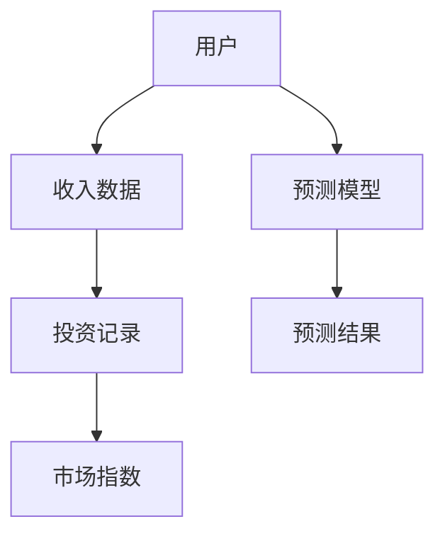
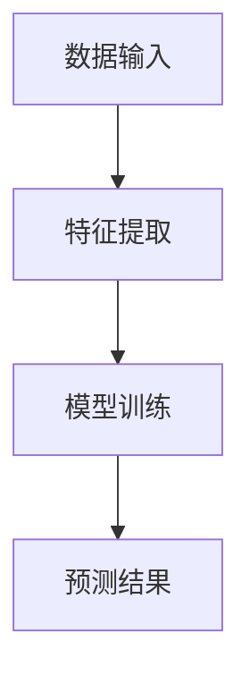
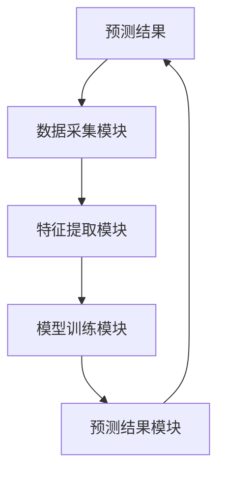

                 


# AI驱动的个人财富积累速度预测器

> 关键词：AI驱动，财富积累，预测模型，机器学习，个人理财

> 摘要：本文旨在探讨如何利用人工智能技术预测个人财富积累速度。通过分析影响财富积累的关键因素，结合机器学习算法，构建预测模型，最终实现对个人财富增长的智能化预测。本文将从背景、概念、算法原理、系统设计到项目实战，全面解析AI在财富积累预测中的应用。

---

# 第一部分: 背景与问题分析

## 第1章: 财富积累速度预测的必要性

### 1.1 问题背景

随着经济全球化和信息化的快速发展，个人财富积累的速度受到多种因素的影响，包括收入水平、投资行为、市场环境等。传统的财富积累预测方法通常依赖于人工分析和经验判断，效率低下且准确性不足。而人工智能技术的引入，为财富积累速度的预测提供了新的可能性。

#### 1.1.1 财富积累速度的定义

财富积累速度是指单位时间内财富的增量与初始财富的比率。公式表示为：

$$ 财富积累速度 = \frac{\Delta W}{W_0} $$

其中，$\Delta W$ 是财富的增量，$W_0$ 是初始财富。

#### 1.1.2 影响财富积累速度的关键因素

1. 收入水平与增长
2. 投资行为（股票、基金、房地产等）
3. 市场环境（经济周期、通货膨胀率）
4. 消费习惯
5. 税收政策

### 1.2 AI技术在财富预测中的应用前景

人工智能技术，特别是机器学习算法，能够通过分析海量数据，发现传统方法难以捕捉的模式和趋势。AI驱动的财富积累速度预测器可以帮助个人做出更明智的投资决策，优化资产配置，从而加速财富积累。

---

## 第2章: 财富积累速度预测的核心概念

### 2.1 数据驱动的预测模型

数据驱动的预测模型依赖于历史数据，通过训练机器学习算法，预测未来的财富积累速度。以下是几种常用的数据驱动预测模型：

#### 2.1.1 线性回归模型

线性回归是一种简单而强大的预测模型，适用于线性关系的预测。其数学公式为：

$$ y = \beta_0 + \beta_1 x + \epsilon $$

其中，$y$ 是预测目标，$x$ 是自变量，$\beta_0$ 和 $\beta_1$ 是回归系数，$\epsilon$ 是误差项。

#### 2.1.2 随机森林模型

随机森林是一种基于决策树的集成学习算法，具有较强的抗过拟合能力。其核心思想是通过构建多个决策树并进行投票或平均，提高预测的准确性和稳定性。

#### 2.1.3 神经网络模型

神经网络是一种模拟人脑神经网络结构的算法，能够处理复杂的非线性关系。通过多层神经网络，可以捕捉到数据中的深层特征，提高预测精度。

### 2.2 AI驱动预测的优势与局限性

#### 2.2.1 优势

1. **高精度**：AI算法能够从大量数据中提取特征，发现潜在规律。
2. **自动化**：无需手动特征工程，模型能够自动优化参数。
3. **实时性**：AI模型可以实时更新，适应市场变化。

#### 2.2.2 局限性

1. **数据依赖性**：模型性能严重依赖于数据质量和数量。
2. **黑箱特性**：AI模型的决策过程难以解释。
3. **计算成本高**：训练复杂模型需要大量计算资源。

---

## 第3章: AI驱动预测的核心概念与联系

### 3.1 财富积累速度预测的核心概念

AI驱动的财富积累速度预测器的核心概念包括数据采集、特征提取、模型训练和结果输出。以下是核心概念的详细解释：

#### 3.1.1 数据采集

数据采集是预测过程的第一步，需要收集与财富积累相关的各种数据，包括收入数据、投资记录、市场指数等。

#### 3.1.2 特征提取

特征提取是将原始数据转化为模型可识别的特征向量的过程。常见的特征包括收入增长率、投资组合风险等。

#### 3.1.3 模型训练

模型训练是通过优化算法，调整模型参数，使模型能够准确预测财富积累速度。

#### 3.1.4 结果输出

结果输出是模型预测的最终表现，通常以概率或置信区间的形式呈现。

### 3.2 核心概念属性对比

以下是对几种常用预测方法的特征对比：

| 方法 | 优势 | 局限性 |
|------|------|--------|
| 线性回归 | 简单易懂 | 适用于线性关系 |
| 随机森林 | 抗过拟合能力强 | 需要大量计算资源 |
| 神经网络 | 高精度 | 黑箱特性明显 |

### 3.3 ER实体关系图

以下是一个简单的ER实体关系图，展示了财富积累预测系统的主要实体和关系：



---

## 第4章: 算法原理与实现

### 4.1 算法原理

#### 4.1.1 线性回归

线性回归是最简单的预测模型，适用于线性关系的数据。其核心思想是通过最小二乘法，找到最佳拟合直线。

#### 4.1.2 随机森林

随机森林是一种集成学习算法，通过构建多个决策树并进行投票，提高预测精度。

#### 4.1.3 神经网络

神经网络是一种模仿人脑结构的算法，能够处理复杂的非线性关系。

### 4.2 算法流程图

以下是一个通用的算法流程图，展示了从数据输入到预测结果输出的整个过程：



### 4.3 Python实现代码

以下是使用线性回归模型实现财富积累速度预测的Python代码示例：

```python
import pandas as pd
from sklearn.linear_model import LinearRegression
from sklearn.metrics import mean_squared_error

# 数据加载
data = pd.read_csv('wealth_data.csv')

# 特征与目标分离
X = data[['income', 'investment']]
y = data['wealth_growth']

# 模型训练
model = LinearRegression()
model.fit(X, y)

# 预测结果
predictions = model.predict(X)

# 评估指标
mse = mean_squared_error(y, predictions)
print(f"均方误差: {mse}")
```

---

## 第5章: 数学模型与公式推导

### 5.1 线性回归模型

线性回归模型的数学公式为：

$$ y = \beta_0 + \beta_1 x + \epsilon $$

其中，$\beta_0$ 和 $\beta_1$ 是回归系数，$\epsilon$ 是误差项。

### 5.2 随机森林模型

随机森林模型的数学公式较为复杂，主要依赖于决策树的集成。以下是决策树的分类公式：

$$ y = \sum_{i=1}^{n} \text{投票结果} $$

### 5.3 神经网络模型

神经网络模型的数学公式涉及多层感知机，通常包括输入层、隐藏层和输出层。其核心公式为：

$$ y = f(Wx + b) $$

其中，$W$ 是权重矩阵，$x$ 是输入向量，$b$ 是偏置项，$f$ 是激活函数。

---

## 第6章: 系统分析与架构设计

### 6.1 问题场景介绍

财富积累速度预测系统需要处理大量的金融数据，包括收入、投资、市场指数等。系统的目标是通过AI算法，为用户提供个性化的财富积累速度预测服务。

### 6.2 系统功能设计

以下是系统的功能模块设计：

- 数据采集模块：负责收集与财富积累相关的数据。
- 特征提取模块：将原始数据转化为模型可识别的特征向量。
- 模型训练模块：通过优化算法，调整模型参数，使模型能够准确预测财富积累速度。
- 预测结果模块：输出模型预测的财富积累速度。

### 6.3 系统架构设计

以下是一个通用的系统架构图：



### 6.4 系统接口设计

以下是系统的接口设计：

- 数据采集接口：负责从数据库或其他数据源获取数据。
- 模型训练接口：负责训练机器学习模型。
- 预测接口：负责接收输入数据，返回预测结果。

### 6.5 系统交互流程

以下是系统的交互流程图：


---

## 第7章: 项目实战

### 7.1 环境安装

以下是需要安装的环境和工具：

- Python 3.8+
- Jupyter Notebook
- Scikit-learn
- Pandas
- Matplotlib

### 7.2 系统核心实现源代码

以下是财富积累速度预测器的核心实现代码：

```python
import pandas as pd
from sklearn.linear_model import LinearRegression
from sklearn.metrics import mean_squared_error

# 数据加载
data = pd.read_csv('wealth_data.csv')

# 特征与目标分离
X = data[['income', 'investment']]
y = data['wealth_growth']

# 模型训练
model = LinearRegression()
model.fit(X, y)

# 预测结果
predictions = model.predict(X)

# 评估指标
mse = mean_squared_error(y, predictions)
print(f"均方误差: {mse}")
```

### 7.3 代码应用解读与分析

以上代码实现了线性回归模型，通过训练数据，预测财富积累速度。均方误差（MSE）用于评估模型的预测精度，值越小，模型越准确。

### 7.4 实际案例分析

以下是一个实际案例的分析：

- 数据来源：假设我们有一组用户的收入和投资数据，目标是预测他们的财富积累速度。
- 数据预处理：清洗数据，处理缺失值和异常值。
- 模型训练：使用线性回归模型训练数据。
- 预测结果：输出预测的财富积累速度，并与实际值进行对比。

---

## 第8章: 最佳实践、小结与拓展阅读

### 8.1 最佳实践

- 数据质量是预测模型的关键，确保数据的准确性和完整性。
- 定期更新模型，适应市场变化。
- 结合多种算法，提高预测的准确性和稳定性。

### 8.2 小结

本文详细介绍了AI驱动的个人财富积累速度预测器的核心概念、算法原理和系统设计。通过实际案例分析，展示了如何利用机器学习算法，实现财富积累速度的智能化预测。

### 8.3 注意事项

- 避免过度依赖AI模型，结合人工分析。
- 注意数据隐私和安全问题。
- 定期监控模型性能，及时调整和优化。

### 8.4 拓展阅读

- 《机器学习实战》
- 《Python机器学习》
- 《深度学习》

---

作者：AI天才研究院/AI Genius Institute & 禅与计算机程序设计艺术/Zen And The Art of Computer Programming

