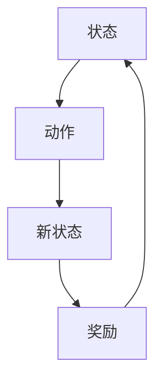
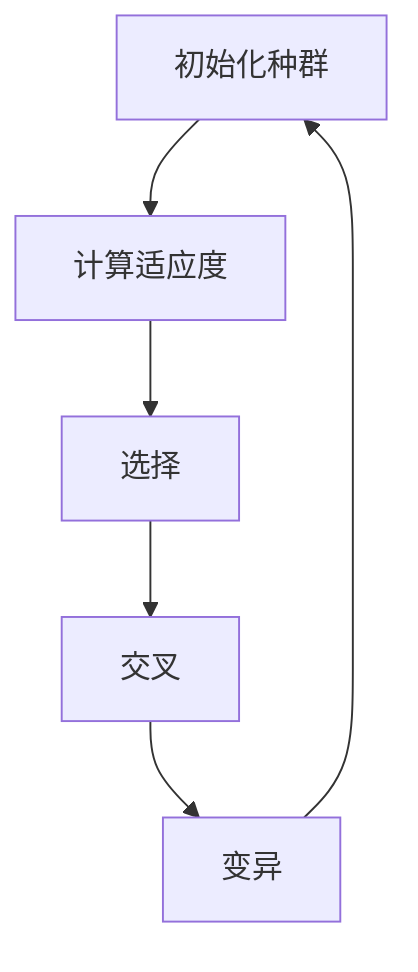
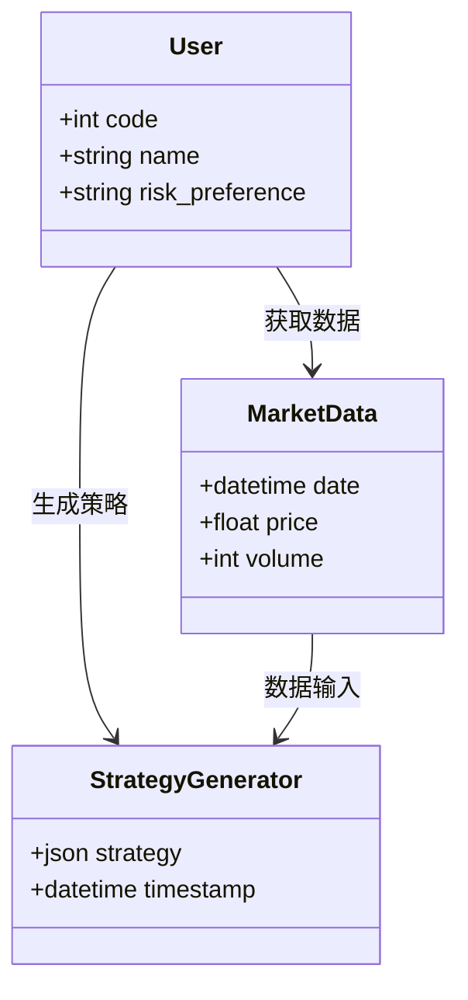
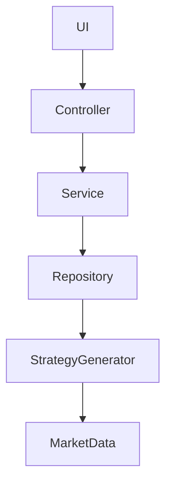

                 


# AI驱动的个人财富管理策略生成器

> 关键词：AI, 个人财富管理, 策略生成器, 强化学习, 遗传算法, 系统架构

> 摘要：本文将深入探讨如何利用人工智能技术构建个人财富管理策略生成器。通过分析AI在财富管理中的应用，结合强化学习和遗传算法，提出一种智能化、个性化的财富管理解决方案。文章内容涵盖背景介绍、核心概念、算法原理、系统架构、项目实战等多个方面，旨在为读者提供从理论到实践的全面指导。

---

## 第一部分：背景介绍

### 第1章：问题背景

#### 1.1 个人财富管理的现状与挑战
- **传统财富管理的局限性**：依赖人工经验，难以实现大规模个性化服务。
- **数据爆炸与复杂性**：金融市场数据复杂，个人需求多样化，传统方法难以应对。
- **技术驱动的变革**：AI技术的发展为财富管理带来了新的可能性。

#### 1.2 问题描述
- **目标**：实现个性化、智能化的财富管理策略生成。
- **痛点**：传统方法难以实时优化，用户需求多样化，数据处理复杂。
- **解决方案**：利用AI技术构建智能化策略生成器。

#### 1.3 问题解决
- **AI技术的优势**：数据处理能力强，算法优化速度快。
- **数据驱动的策略生成**：通过大数据分析和机器学习模型实现个性化策略。
- **个性化与智能化结合**：利用强化学习优化投资组合，实现动态调整。

#### 1.4 边界与外延
- **边界条件**：仅限于个人财富管理，不涉及机构或全球金融市场。
- **相关领域的外延**：与金融数据分析、投资组合优化等领域密切相关。
- **区别于传统财富管理**：强调技术驱动和个性化。

#### 1.5 核心要素组成
- **数据来源与处理**：整合金融市场数据、用户行为数据等。
- **算法模型构建**：基于强化学习和遗传算法构建策略生成模型。
- **系统架构设计**：设计高效的系统架构支持实时策略生成。

---

## 第二部分：核心概念与联系

### 第2章：核心概念原理

#### 2.1 数据挖掘与特征工程
- **数据来源**：金融市场数据、用户行为数据。
- **特征提取**：通过特征工程提取关键特征，如市场波动率、用户风险偏好。

#### 2.2 机器学习模型
- **模型选择**：基于强化学习构建策略生成模型。
- **模型训练**：利用历史数据训练模型，优化策略生成能力。

#### 2.3 自然语言处理技术
- **文本分析**：分析新闻、财报等文本数据，提取情感指标。
- **信息抽取**：从文本中提取关键信息，辅助策略生成。

### 第3章：概念属性特征对比

#### 3.1 数据特征对比
| 特征 | 描述 |
|------|------|
| 数据来源 | 金融市场数据、用户行为数据 |
| 数据类型 | 结构化数据、文本数据 |
| 数据规模 | 大规模数据 |

#### 3.2 算法特征对比
| 算法 | 描述 |
|------|------|
| 强化学习 | 基于Q-learning算法优化投资组合 |
| 遗传算法 | 用于策略优化的全局搜索 |

#### 3.3 系统架构特征对比
| 架构 | 描述 |
|------|------|
| 单体架构 | 适合小规模应用 |
| 分布式架构 | 适合大规模应用 |

### 第4章：ER实体关系图

```mermaid
erDiagram
    user {
        code INT
        name VARCHAR
        risk_preference VARCHAR
    }
    market_data {
        date DATETIME
        price FLOAT
        volume INT
    }
    strategy_generator {
        user_code INT
        strategy JSON
        timestamp DATETIME
    }
    user --> market_data : 获取数据
    user --> strategy_generator : 生成策略
    market_data --> strategy_generator : 数据输入
```

---

## 第三部分：算法原理讲解

### 第3章：强化学习算法

#### 3.1 Q-learning算法



代码示例：

```python
import numpy as np

class QLearning:
    def __init__(self, state_space, action_space):
        self.state_space = state_space
        self.action_space = action_space
        self.Q = np.zeros((state_space, action_space))
    
    def update(self, s, a, r, s_next, alpha=0.1, gamma=0.9):
        self.Q[s, a] += alpha * (r + gamma * np.max(self.Q[s_next, :]) - self.Q[s, a])
```

### 第4章：遗传算法

#### 4.1 算法流程图



代码示例：

```python
import numpy as np

def fitness(x):
    return np.sum(x)

def genetic_algorithm(population_size, fitness_func):
    population = np.random.rand(population_size, 2)
    while True:
        fitness = np.apply_along_axis(fitness_func, 1, population)
        selected = population[np.argsort(-fitness)[:int(population_size/2)]]
        children = np.mean(selected, axis=0)
        population = np.vstack((selected, children))
```

---

## 第四部分：数学模型与公式

### 4.1 强化学习数学模型

Q-learning公式：
$$ Q(s,a) = Q(s,a) + \alpha (r + \gamma \max Q(s',a') - Q(s,a)) $$

状态转移概率：
$$ P(s' | s,a) = \text{概率转移矩阵} $$

### 4.2 遗传算法数学模型

适应度函数：
$$ f(x) = \sum_{i=1}^{n} w_i x_i $$

选择与交叉操作：
$$ P(x) = \frac{f(x)}{\sum f(x)} $$

---

## 第五部分：系统架构与设计

### 第5章：系统架构设计

#### 5.1 系统功能设计



#### 5.2 系统架构设计



---

## 第六部分：项目实战

### 第6章：环境安装与配置

- **环境需求**：Python 3.8+, TensorFlow 2.0+, Pandas, Scikit-learn
- **安装命令**：
  ```bash
  pip install numpy pandas scikit-learn
  ```

### 第7章：系统核心实现

#### 7.1 策略生成器实现

代码示例：

```python
import numpy as np
from sklearn import preprocessing

class StrategyGenerator:
    def __init__(self, data):
        self.data = data
        self.scaler = preprocessing.MinMaxScaler()
    
    def preprocess(self):
        normalized_data = self.scaler.fit_transform(self.data)
        return normalized_data
    
    def generate_strategy(self):
        normalized_data = self.preprocess()
        # 使用强化学习生成策略
        pass
```

#### 7.2 算法实现

代码示例：

```python
class QLearningStrategy:
    def __init__(self, state_dim, action_dim):
        self.Q = np.zeros((state_dim, action_dim))
    
    def get_action(self, state):
        return np.argmax(self.Q[state])
    
    def update(self, state, action, reward, next_state, alpha=0.1, gamma=0.9):
        self.Q[state, action] += alpha * (reward + gamma * np.max(self.Q[next_state, :]) - self.Q[state, action])
```

---

## 第七部分：总结与展望

### 第8章：最佳实践

- **数据质量**：确保数据来源可靠，特征工程到位。
- **算法选择**：根据具体问题选择合适的算法。
- **系统优化**：优化系统架构，提升运行效率。

### 第9章：注意事项

- **风险管理**：AI策略生成需考虑市场波动和风险。
- **用户教育**：用户需了解AI策略的局限性。

### 第10章：拓展阅读

- 推荐书籍：《机器学习实战》、《Python金融大数据分析》
- 推荐博客：Tech blog on AI and finance

---

**作者：AI天才研究院/AI Genius Institute & 禅与计算机程序设计艺术 /Zen And The Art of Computer Programming**

