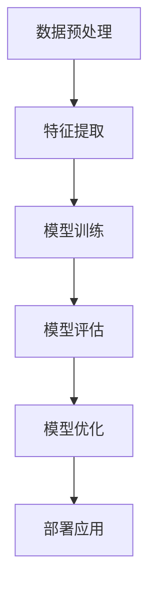
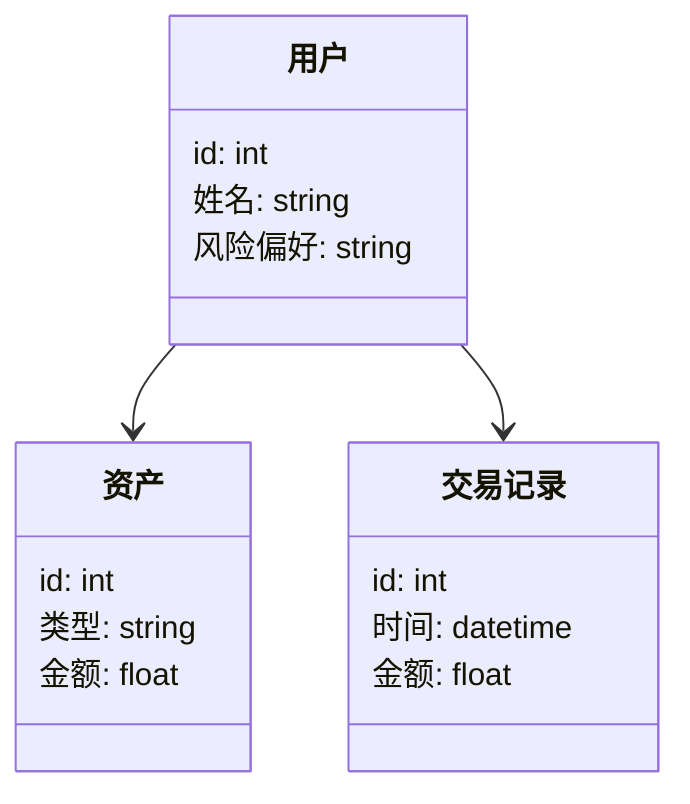
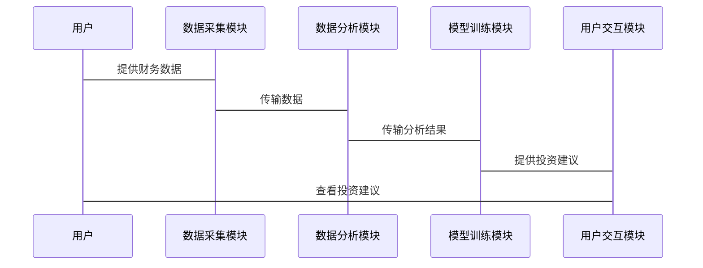

                 


# AI驱动的个人财富管理系统设计

## 关键词
AI, 个人财富管理, 系统设计, 机器学习, 大数据

## 摘要
本文将详细探讨AI在个人财富管理中的应用，从系统设计背景到核心算法实现，再到实际项目落地，全面解析如何构建一个高效的AI驱动的个人财富管理系统。文章结合理论分析与实践案例，深入探讨了系统的核心概念、算法原理、系统架构、项目实现及最佳实践。

---

# 第1章 AI驱动的个人财富管理系统概述

## 1.1 问题背景与描述
### 1.1.1 传统个人财富管理的局限性
传统的个人财富管理依赖于人工分析和经验判断，存在效率低、覆盖面窄、难以个性化等问题。例如，传统理财顾问的服务范围有限，难以覆盖所有客户群体，且主观判断可能导致决策偏差。

### 1.1.2 AI技术在财富管理中的应用潜力
AI技术可以通过大数据分析和机器学习算法，帮助投资者实现个性化投资组合优化、风险控制和收益预测。AI能够快速处理海量数据，发现潜在的财务模式，为用户提供精准的理财建议。

### 1.1.3 当前市场对智能财富管理的需求
随着金融市场的复杂化和投资者需求的多样化，市场对智能化、个性化的财富管理工具的需求日益增长。AI驱动的财富管理系统能够满足这些需求，帮助用户实现资产保值增值。

## 1.2 问题解决与边界
### 1.2.1 AI驱动财富管理的核心问题解决
AI驱动的财富管理系统通过数据挖掘、机器学习和自然语言处理等技术，解决传统财富管理中的效率低、成本高、个性化不足等问题。

### 1.2.2 系统边界与功能范围
系统主要功能包括：用户资产分析、投资组合优化、风险评估、市场预测和个性化建议。系统边界包括：仅支持单个用户的资产管理和投资建议，不涉及机构级的财富管理。

### 1.2.3 外延与限制条件
系统支持的资产类型包括股票、基金、债券等，不支持房地产、艺术品等非金融资产。系统目前仅提供参考建议，不承担投资风险。

## 1.3 核心概念与系统组成
### 1.3.1 核心概念的结构与组成
AI驱动的财富管理系统由数据采集模块、数据分析模块、模型训练模块和用户交互模块组成。

### 1.3.2 关键要素的属性与关系
- **用户属性**：用户的基本信息、财务目标、风险偏好。
- **资产属性**：资产种类、资产规模、资产分布。
- **交易属性**：交易记录、交易时间、交易金额。
- **市场属性**：市场指数、经济指标、行业动态。

### 1.3.3 系统的模块划分与功能分配
- **数据采集模块**：负责收集用户的财务数据和市场数据。
- **数据分析模块**：对数据进行清洗、转换和分析。
- **模型训练模块**：基于历史数据训练AI模型，生成投资建议。
- **用户交互模块**：与用户进行交互，提供可视化界面和实时反馈。

---

# 第2章 核心概念与系统联系

## 2.1 核心概念原理
### 2.1.1 AI算法在财富管理中的应用
- **监督学习**：用于分类和回归问题，例如预测股票价格。
- **无监督学习**：用于聚类分析，例如客户分群。
- **强化学习**：用于动态投资决策，例如智能交易策略。

### 2.1.2 大数据在个人财富管理中的作用
大数据技术能够从海量数据中提取有价值的财务信息，帮助AI模型做出更精准的预测和决策。

### 2.1.3 用户行为分析与个性化服务
通过分析用户的交易记录和风险偏好，系统能够提供个性化的投资建议和资产配置方案。

## 2.2 核心概念属性对比
### 2.2.1 不同AI模型的性能对比
| 模型类型 | 优点 | 缺点 |
|----------|------|------|
| 监督学习 | 数据需求明确 | 数据依赖性强 |
| 强化学习 | 动态决策能力强 | 训练时间长 |
| 无监督学习 | 数据适用性广 | 需要大量数据 |

### 2.2.2 数据源的特征分析
- **时间序列数据**：用于预测市场趋势。
- **结构化数据**：用于分类和回归分析。
- **非结构化数据**：用于情感分析和市场情绪预测。

### 2.2.3 系统功能模块的优劣势
- **优势**：模块化设计便于维护和扩展。
- **劣势**：模块之间需要高效协同，否则可能影响系统性能。

## 2.3 ER实体关系图
```mermaid
er
  actor: 用户
  asset: 资产
  transaction: 交易记录
  risk: 风险评估
  goal: 财务目标
  relation 用户关联资产
  relation 用户关联交易
  relation 资产关联风险
  relation 资产关联目标
```

---

# 第3章 AI驱动的财富管理算法原理

## 3.1 算法原理概述
### 3.1.1 监督学习与无监督学习的应用
- **监督学习**：用于预测股票价格。
- **无监督学习**：用于客户分群。

### 3.1.2 强化学习在投资决策中的应用
强化学习通过模拟交易环境，训练智能体做出最优投资决策。

### 3.1.3 深度学习模型的构建与训练
深度学习模型（如LSTM）用于时间序列预测和市场情绪分析。

## 3.2 算法流程图


## 3.3 算法实现代码
```python
import numpy as np
import pandas as pd
from sklearn.model_selection import train_test_split
from sklearn.linear_model import LinearRegression

# 数据加载与预处理
data = pd.read_csv('wealth_data.csv')
X = data[['income', 'age', 'risk_tolerance']]
y = data['investment_recommendation']

# 划分训练集与测试集
X_train, X_test, y_train, y_test = train_test_split(X, y, test_size=0.2, random_state=42)

# 模型训练
model = LinearRegression()
model.fit(X_train, y_train)

# 模型预测
y_pred = model.predict(X_test)
```

## 3.4 算法的数学模型与公式
### 3.4.1 线性回归模型
$$ y = \beta_0 + \beta_1x_1 + \beta_2x_2 + \ldots + \beta_nx_n $$

### 3.4.2 优化目标
$$ \text{最小化} \sum_{i=1}^{m} (y_i - \hat{y}_i)^2 $$

### 3.4.3 示例
假设用户收入为50,000，年龄30岁，风险承受能力中等，模型预测其投资建议为60%股票，30%债券，10%现金。

---

# 第4章 系统分析与架构设计

## 4.1 系统功能设计
### 4.1.1 领域模型


### 4.1.2 系统架构设计
```mermaid
container 财富管理系统 {
    component 数据采集模块 {
        接收用户数据
        接收市场数据
    }
    component 数据分析模块 {
        数据清洗
        数据分析
    }
    component 模型训练模块 {
        训练AI模型
        生成投资建议
    }
    component 用户交互模块 {
        提供可视化界面
        显示投资建议
    }
}
```

### 4.1.3 系统接口设计
- **输入接口**：用户输入财务数据和市场数据。
- **输出接口**：系统输出投资建议和资产配置方案。

### 4.1.4 系统交互图


---

# 第5章 项目实战

## 5.1 环境安装与配置
### 5.1.1 安装Python和相关库
```bash
pip install numpy pandas scikit-learn matplotlib
```

### 5.1.2 安装Jupyter Notebook
```bash
pip install jupyter
```

## 5.2 系统核心功能实现
### 5.2.1 数据预处理代码
```python
import pandas as pd
import numpy as np

# 加载数据
data = pd.read_csv('wealth_data.csv')

# 数据清洗
data.dropna(inplace=True)
data = pd.get_dummies(data, columns=['资产类型'])
```

### 5.2.2 模型训练代码
```python
from sklearn.ensemble import RandomForestClassifier
from sklearn.metrics import accuracy_score

# 划分训练集和测试集
X_train, X_test, y_train, y_test = train_test_split(data.drop('投资建议', axis=1), data['投资建议'], test_size=0.2)

# 训练模型
model = RandomForestClassifier()
model.fit(X_train, y_train)

# 预测结果
y_pred = model.predict(X_test)
print(accuracy_score(y_test, y_pred))
```

### 5.2.3 交互界面实现
```python
import tkinter as tk

root = tk.Tk()
root.title("AI财富管理")

# 定义函数
def show_recommendation():
    # 示例逻辑
    print("投资建议：60%股票，30%债券，10%现金")

button = tk.Button(root, text="获取投资建议", command=show_recommendation)
button.pack()

root.mainloop()
```

## 5.3 案例分析与详细解读
### 5.3.1 案例背景
假设用户A有100万元资金，风险偏好为中等。

### 5.3.2 系统分析
系统分析用户的财务数据，预测市场趋势，生成投资建议。

### 5.3.3 实施结果
系统建议用户A将资产分配为60%股票，30%债券，10%现金。

---

# 第6章 最佳实践与小结

## 6.1 最佳实践
### 6.1.1 数据质量
确保数据的完整性和准确性。

### 6.1.2 模型选择
根据具体场景选择合适的算法。

### 6.1.3 系统安全
保护用户数据隐私，防止数据泄露。

## 6.2 小结
AI驱动的个人财富管理系统通过大数据分析和机器学习算法，能够为用户提供高效、个性化的财富管理服务。

## 6.3 注意事项
- 定期更新模型，以适应市场变化。
- 保护用户数据隐私，遵守相关法律法规。

## 6.4 拓展阅读
- 《机器学习实战》
- 《深度学习入门：基于Python和Keras》

---

# 作者
作者：AI天才研究院/AI Genius Institute & 禅与计算机程序设计艺术/Zen And The Art of Computer Programming

