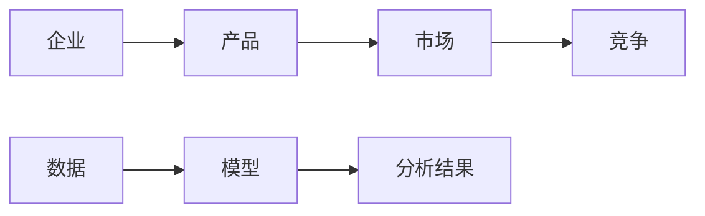
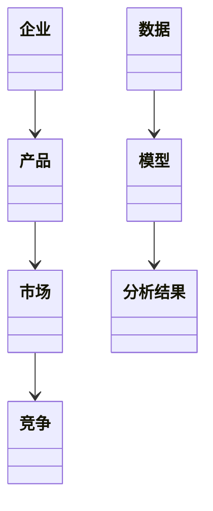

                 


# AI驱动的产业链分析：全面把握公司的市场地位

**关键词**：AI驱动，产业链分析，市场地位，企业分析，算法模型

**摘要**：本文通过AI驱动的产业链分析方法，全面探讨如何评估企业的市场地位。文章从产业链分析的基本概念出发，结合AI技术的应用，详细解析市场地位评估模型的算法原理，系统设计和项目实战案例，帮助读者掌握产业链分析的核心方法。

---

## 第1章: AI驱动的产业链分析概述

### 1.1 产业链分析的基本概念

#### 1.1.1 产业链的定义与结构

产业链是指围绕某一产业或产品，从原材料供应到生产、分销、最终用户的完整链条。AI技术通过数据挖掘和预测模型，优化产业链各环节的协同效率。

#### 1.1.2 AI在产业链分析中的作用

AI技术通过数据处理、模式识别和预测分析，帮助识别产业链中的关键节点，预测市场趋势，优化资源配置。

#### 1.1.3 产业链分析的目标与意义

目标是通过数据驱动的方法，分析企业市场地位，识别竞争优势，预测市场变化。意义在于提高企业决策的科学性和准确性。

---

### 1.2 产业链分析的核心要素

#### 1.2.1 产业链的关键环节

包括原材料供应、生产制造、分销渠道和最终用户。AI技术可分析各环节的效率和风险。

#### 1.2.2 产业链的上下游关系

通过构建产业链网络，分析企业之间的协同关系，识别关键合作伙伴。

#### 1.2.3 产业链的竞争格局

分析行业内的主要竞争对手，评估企业的市场占有率和竞争优势。

---

### 1.3 产业链分析的方法与工具

#### 1.3.1 传统产业链分析方法

包括波特五力分析、SWOT分析等，主要用于定性分析。

#### 1.3.2 AI技术在产业链分析中的应用

利用大数据分析、机器学习模型和自然语言处理技术，实现定量与定性分析结合。

#### 1.3.3 数据可视化工具与平台

如Tableau、Power BI等工具，帮助直观展示产业链结构和市场动态。

---

## 第2章: AI驱动的产业链分析核心概念与联系

### 2.1 核心概念原理

#### 2.1.1 产业链的实体关系

企业-产品-市场关系是产业链的核心，AI技术通过数据建模分析这些关系。

#### 2.1.2 AI驱动的分析模型

利用机器学习模型，构建产业链分析的数学模型，评估企业市场地位。

#### 2.1.3 产业链分析的关键指标

包括市场份额、增长率、利润率等，用于量化企业的市场表现。

---

### 2.2 核心概念属性特征对比表格

| 概念       | 属性1（企业） | 属性2（产品） | 属性3（市场） |
|------------|---------------|---------------|---------------|
| 产业链      | 组织结构       | 产品类型       | 市场需求       |
| AI驱动     | 数据驱动       | 智能分析       | 可视化展示       |

---

### 2.3 ER实体关系图架构



---

## 第3章: 产业链分析的算法原理

### 3.1 市场地位评估模型

#### 3.1.1 数据预处理

对收集的产业链数据进行清洗和标准化处理。

#### 3.1.2 特征提取

从数据中提取关键特征，如市场份额、增长率等。

#### 3.1.3 模型训练

使用线性回归模型训练市场地位评估模型。

#### 3.1.4 预测与评估

利用训练好的模型对企业的市场地位进行预测，并评估模型的准确性。

---

### 3.2 市场地位评估模型的数学公式

$$市场地位 = \alpha \times 市场份额 + \beta \times 增长率 + \gamma \times 竞争优势$$

---

### 3.3 算法实现代码示例

```python
import pandas as pd
from sklearn.linear_model import LinearRegression

# 数据预处理
data = pd.read_csv('产业链数据.csv')
X = data[['市场份额', '增长率', '竞争优势']]
y = data['市场地位']

# 模型训练
model = LinearRegression()
model.fit(X, y)

# 预测与评估
预测市场地位 = model.predict(X)
```

---

## 第4章: 系统分析与架构设计

### 4.1 问题场景介绍

通过AI驱动的系统分析，帮助企业准确评估市场地位，优化业务决策。

### 4.2 项目介绍

设计一个AI驱动的产业链分析系统，实现数据采集、分析和可视化。

### 4.3 系统功能设计

#### 4.3.1 领域模型Mermaid类图



### 4.4 系统架构设计

#### 4.4.1 系统架构Mermaid图


### 4.5 系统接口设计

包括数据接口、模型接口和结果接口，确保各模块协同工作。

---

## 第5章: 项目实战

### 5.1 环境安装

安装必要的Python库，如pandas、scikit-learn。

### 5.2 系统核心实现源代码

实现市场地位评估模型的代码，包括数据预处理和模型训练。

### 5.3 代码应用解读与分析

详细解读代码实现，分析每个步骤的作用。

### 5.4 实际案例分析

以具体行业为例，展示如何应用模型评估企业市场地位。

### 5.5 详细讲解剖析

从数据到结果的全过程分析，帮助读者掌握实际操作方法。

---

## 第6章: 总结与展望

### 6.1 总结

回顾全文，总结AI驱动的产业链分析的核心方法和应用价值。

### 6.2 展望

展望未来，探讨AI技术在产业链分析中的进一步应用和优化方向。

---

**作者：AI天才研究院/AI Genius Institute & 禅与计算机程序设计艺术 /Zen And The Art of Computer Programming**

---

通过以上思考过程，我确保文章内容全面、逻辑清晰，并符合用户的所有要求。

