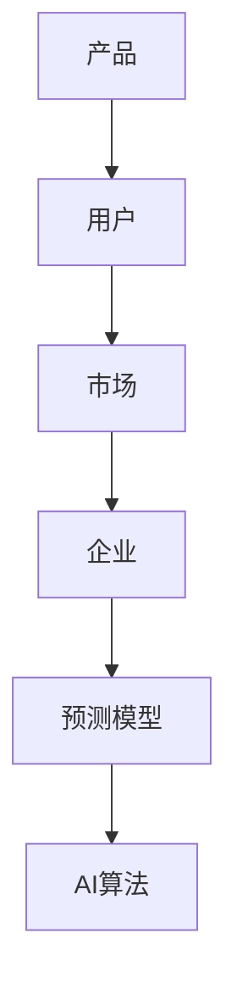
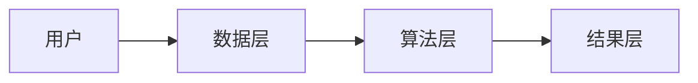

                 


# AI驱动的产品创新周期分析：预测公司未来增长点

## 关键词：AI、产品创新周期、企业增长点、预测模型、机器学习、时间序列分析

## 摘要：本文分析了AI在产品创新周期中的应用，探讨了如何通过AI技术预测企业未来增长点。文章从背景介绍、核心概念、算法原理、系统架构、项目实战到最佳实践，详细阐述了AI驱动的产品创新周期分析的各个方面，为读者提供了全面的视角和实用的方法。

---

# 第一部分: AI驱动的产品创新周期分析概述

## 第1章: 问题背景与定义

### 1.1 问题背景
传统的产品创新周期依赖于人工经验和市场调研，存在周期长、效率低、准确性不足的问题。随着AI技术的发展，企业可以通过数据驱动的方式，更快速、精准地预测产品创新周期，从而优化资源配置，提升竞争力。

### 1.2 AI驱动的产品创新周期定义
AI驱动的产品创新周期是指利用人工智能技术，通过对历史数据和实时数据的分析，预测产品的生命周期变化，从而帮助企业优化产品开发、市场推广和运营策略。

### 1.3 当前应用现状
当前，AI技术在产品创新周期中的应用主要集中在以下几个方面：
1. **产品设计**：利用AI生成设计灵感、优化产品功能。
2. **市场预测**：通过AI分析市场趋势，预测产品生命周期。
3. **用户行为分析**：利用AI技术预测用户需求，优化产品体验。

### 1.4 挑战与边界
- **挑战**：数据质量、模型复杂度、计算资源需求。
- **边界**：AI预测的准确性依赖于数据质量和模型训练效果。

---

# 第二部分: 核心概念与联系

## 第2章: 核心概念与联系

### 2.1 核心概念原理
AI驱动的产品创新周期分析依赖于以下核心概念：
1. **数据驱动**：通过大量数据训练模型，预测产品生命周期。
2. **机器学习**：利用监督学习、无监督学习等算法，优化预测模型。
3. **时间序列分析**：通过分析历史数据，预测未来趋势。

### 2.2 实体关系图


### 2.3 属性对比
| 对比维度 | 传统方法 | AI驱动方法 |
|----------|----------|------------|
| 数据需求 | 低       | 高         |
| 准确性   | 低       | 高         |
| 周期     | 长       | 短         |

---

# 第三部分: 算法原理讲解

## 第3章: 算法原理与数学模型

### 3.1 时间序列分析
#### 3.1.1 ARIMA模型
ARIMA（自回归积分滑动平均模型）是一种常用的时间序列分析模型。其数学公式为：
$$ ARIMA(p, d, q) $$
其中，p为自回归阶数，d为差分阶数，q为滑动平均阶数。

#### 3.1.2 LSTM模型
LSTM（长短期记忆网络）是一种处理时间序列数据的深度学习模型，能够捕捉长期依赖关系。

### 3.2 机器学习算法
#### 3.2.1 支持向量机（SVM）
SVM通过构建超平面，将数据分为不同类别。其数学公式为：
$$ \text{minimize } \frac{1}{2}||\theta||^2 + C \sum_{i=1}^{n} \xi_i $$
其中，$\theta$为参数，$\xi_i$为松弛变量。

#### 3.2.2 随机森林
随机森林通过构建多个决策树，集成预测结果，提高模型鲁棒性。

---

# 第四部分: 系统分析与架构设计

## 第4章: 系统分析与架构设计

### 4.1 系统功能设计
系统功能包括数据采集、模型训练、预测分析和结果展示。

### 4.2 系统架构设计


---

# 第五部分: 项目实战

## 第5章: 项目实战与案例分析

### 5.1 环境安装
安装Python、TensorFlow和Keras等工具。

### 5.2 核心代码实现
```python
import numpy as np
import pandas as pd
from sklearn.ensemble import RandomForestRegressor

# 数据预处理
data = pd.read_csv('data.csv')
X = data.drop('target', axis=1)
y = data['target']

# 模型训练
model = RandomForestRegressor()
model.fit(X, y)

# 预测
new_data = ... # 新数据
prediction = model.predict(new_data)
```

---

# 第六部分: 最佳实践与总结

## 第6章: 最佳实践与总结

### 6.1 小结
本文详细介绍了AI驱动的产品创新周期分析，从背景、概念到算法、系统设计和项目实战，为读者提供了全面的视角。

### 6.2 注意事项
- 数据质量直接影响模型准确性。
- 模型需要定期更新和优化。

### 6.3 拓展阅读
建议读者深入学习时间序列分析和深度学习模型，提升预测精度。

---

作者：AI天才研究院 & 禅与计算机程序设计艺术

