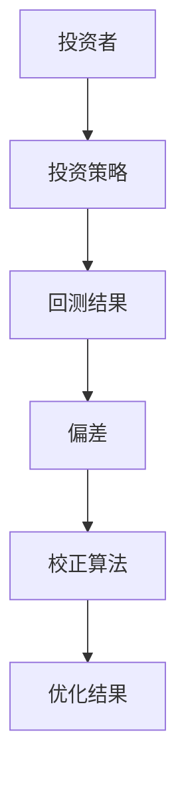
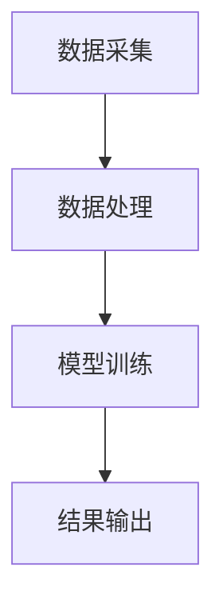

                 


# AI驱动的价值投资策略回测偏差校正

## 关键词：
- AI驱动
- 价值投资策略
- 回测偏差校正
- 金融数据分析
- 机器学习
- 深度学习

## 摘要：
本文探讨了AI技术在价值投资策略回测中的应用，重点分析了回测偏差的成因及其校正方法。通过结合机器学习和深度学习技术，提出了一种系统化的偏差校正框架，并通过实际案例展示了如何利用AI优化投资策略的回测过程，从而提高投资决策的准确性和可靠性。

---

# 第一部分: AI驱动的价值投资策略回测偏差校正

## 第1章: 背景介绍与核心概念

### 1.1 问题背景

#### 1.1.1 价值投资策略的回测偏差
价值投资是一种基于对公司基本面分析的投资策略，其核心在于通过分析企业的财务状况、行业地位和竞争优势，寻找被市场低估的投资标的。然而，回测（Backtesting）是验证投资策略有效性的关键步骤，但在实际操作中，回测结果往往存在偏差。这些偏差可能来源于数据质量、模型假设、交易规则等多个方面，导致回测结果与实际市场表现不符。

#### 1.1.2 回测偏差的成因与影响
回测偏差的主要成因包括：
- **数据偏差**：历史数据的不完整性、噪声或异常值可能影响回测结果。
- **模型偏差**：投资策略模型的假设可能与实际市场环境存在差异。
- **交易规则偏差**：回测中假设的交易规则（如无交易成本、完美市场冲击）与实际市场环境存在偏差。

这些偏差可能导致回测结果过于理想化，进而误导投资决策。

#### 1.1.3 AI驱动的回测偏差校正的重要性
AI技术的引入为解决回测偏差问题提供了新的可能性。通过机器学习和深度学习技术，可以更准确地捕捉市场特征，优化投资策略模型，并动态调整交易规则，从而提高回测结果的准确性和可靠性。

### 1.2 核心概念与联系

#### 1.2.1 核心概念原理
回测偏差校正的核心原理在于通过AI技术对历史数据进行深度分析，识别和调整偏差源。具体包括以下几个方面：
- 数据预处理：清洗历史数据，去除噪声和异常值。
- 特征提取：从历史数据中提取与投资策略相关的特征。
- 模型优化：通过机器学习算法优化投资策略模型，减少模型偏差。
- 结果校正：对回测结果进行偏差校正，使其更接近实际市场表现。

#### 1.2.2 核心概念属性特征对比表格
以下是回测偏差校正中几个关键概念的对比表格：

| **概念**         | **定义**                                                                 |
|------------------|--------------------------------------------------------------------------|
| 数据偏差         | 由于数据质量（如噪声、缺失值）导致的回测结果偏差。                   |
| 模型偏差         | 由于模型假设与实际市场环境不一致导致的回测结果偏差。                 |
| 交易规则偏差     | 由于交易规则假设（如无交易成本）与实际市场环境不一致导致的回测偏差。 |

#### 1.2.3 ER实体关系图架构的 Mermaid 流程图
以下是回测偏差校正的实体关系图：



### 1.3 本章小结
本章介绍了回测偏差的成因及其对投资决策的影响，并提出了通过AI技术进行回测偏差校正的重要性。通过对比分析，明确了数据偏差、模型偏差和交易规则偏差的核心概念，并为后续章节的详细分析奠定了基础。

---

## 第2章: AI在金融数据分析中的应用

### 2.1 机器学习与深度学习基础

#### 2.1.1 机器学习的基本概念
机器学习是一种通过数据训练模型，使其能够从经验中学习并做出预测的技术。在金融领域，机器学习常用于股票价格预测、风险评估和投资组合优化。

#### 2.1.2 深度学习的核心原理
深度学习是一种基于人工神经网络的机器学习技术，能够通过多层非线性变换从数据中自动提取特征。在金融时间序列分析中，深度学习模型（如LSTM）表现出色。

#### 2.1.3 时间序列分析的深度学习模型
时间序列分析是金融数据分析的核心任务之一。深度学习模型（如LSTM和Transformer）能够有效捕捉时间序列中的复杂模式。

### 2.2 金融数据分析的挑战与机遇

#### 2.2.1 金融数据的特征与复杂性
金融数据具有以下特征：
- 高维性：包含股票价格、成交量、财务指标等多种数据。
- 时间依赖性：数据具有明显的时间序列特征。
- 不确定性：市场波动性和噪声干扰增加了数据分析的难度。

#### 2.2.2 AI在金融数据分析中的优势
AI技术在金融数据分析中的优势包括：
- **自动化特征提取**：通过深度学习模型自动提取数据中的有用特征。
- **非线性模式捕捉**：能够捕捉传统统计方法难以发现的非线性模式。
- **实时性**：AI模型可以实时处理金融数据，支持高频交易。

#### 2.2.3 金融数据的预处理与特征提取
金融数据的预处理包括数据清洗、标准化和缺失值填充。特征提取则需要结合业务知识和AI技术，提取与投资策略相关的特征。

### 2.3 回测偏差的AI解决方案

#### 2.3.1 基于AI的回测偏差检测
通过机器学习模型对回测结果进行偏差检测，识别潜在的偏差源。

#### 2.3.2 基于AI的回测偏差校正
利用机器学习算法对回测结果进行偏差校正，优化投资策略模型。

#### 2.3.3 基于AI的回测结果优化
通过深度学习模型优化回测结果，提高投资策略的鲁棒性和可解释性。

### 2.4 本章小结
本章介绍了AI技术在金融数据分析中的应用，重点分析了机器学习和深度学习在回测偏差校正中的作用。通过对比传统方法和AI技术，明确了AI在金融数据分析中的优势和潜力。

---

## 第3章: 回测偏差的成因与分类

### 3.1 回测偏差的成因分析

#### 3.1.1 市场偏差
市场偏差是指回测结果与实际市场表现的差异。其成因包括市场环境变化、数据选择偏差和模型假设不合理。

#### 3.1.2 数据偏差
数据偏差是指由于数据质量问题导致的回测结果偏差。包括数据噪声、缺失值和异常值。

#### 3.1.3 模型偏差
模型偏差是指由于投资策略模型假设与实际市场环境不一致导致的偏差。包括模型参数选择不合理和模型结构假设不准确。

### 3.2 回测偏差的分类与处理

#### 3.2.1 市场偏差的分类与处理
市场偏差的处理方法包括：
- 数据增强：通过数据增强技术减少数据偏差。
- 模型调整：通过调整模型参数减少模型偏差。

#### 3.2.2 数据偏差的分类与处理
数据偏差的处理方法包括：
- 数据清洗：去除噪声和异常值。
- 数据平衡：通过数据平衡技术减少数据偏差。

#### 3.2.3 模型偏差的分类与处理
模型偏差的处理方法包括：
- 模型优化：通过交叉验证和网格搜索优化模型参数。
- 模型集成：通过集成学习减少模型偏差。

### 3.3 偏差校正的数学模型

#### 3.3.1 偏差校正的数学公式
偏差校正的数学公式如下：
$$ \hat{y} = y_{\text{真实}} + \beta \cdot (y_{\text{回测}} - y_{\text{真实}}) $$
其中，$\beta$ 是校正系数，用于调整回测结果与真实结果的偏差。

### 3.4 本章小结
本章分析了回测偏差的成因，并提出了基于AI的偏差校正方法。通过数学公式和实际案例分析，明确了偏差校正的核心思想和实现方法。

---

## 第4章: 偏差校正的核心算法

### 4.1 数据预处理算法

#### 4.1.1 数据清洗
数据清洗是回测偏差校正的第一步，包括去除噪声和异常值。

#### 4.1.2 数据标准化
数据标准化是将数据归一化到统一的尺度，通常使用Z-score标准化。

#### 4.1.3 数据增强
数据增强是通过生成合成数据来增强数据多样性，减少数据偏差。

### 4.2 特征工程算法

#### 4.2.1 特征提取
特征提取是通过机器学习算法从原始数据中提取有用特征。

#### 4.2.2 特征选择
特征选择是通过统计方法选择与投资策略相关的特征。

### 4.3 模型优化算法

#### 4.3.1 模型选择
模型选择是通过交叉验证选择最优模型。

#### 4.3.2 参数优化
参数优化是通过网格搜索优化模型参数。

### 4.4 本章小结
本章介绍了偏差校正的核心算法，包括数据预处理、特征工程和模型优化。通过这些算法的组合应用，可以有效减少回测偏差，提高投资策略的准确性。

---

## 第5章: 系统架构与实现

### 5.1 系统设计

#### 5.1.1 功能模块划分
系统功能模块包括数据采集、数据处理、模型训练和结果输出。

#### 5.1.2 模块功能描述
- 数据采集模块：负责采集历史数据。
- 数据处理模块：负责数据清洗和特征提取。
- 模型训练模块：负责训练投资策略模型。
- 结果输出模块：负责输出校正后的回测结果。

### 5.2 系统架构设计

#### 5.2.1 系统架构图
以下是系统架构图：



### 5.3 接口设计

#### 5.3.1 数据接口
数据接口包括数据输入接口和数据输出接口。

#### 5.3.2 模型接口
模型接口包括模型训练接口和模型预测接口。

### 5.4 交互流程

#### 5.4.1 数据采集与处理
数据采集模块采集历史数据，数据处理模块对数据进行清洗和特征提取。

#### 5.4.2 模型训练与校正
模型训练模块训练投资策略模型，并通过偏差校正算法优化模型参数。

### 5.5 本章小结
本章介绍了系统架构与实现，通过模块化设计和流程优化，确保了回测偏差校正的高效性和准确性。

---

## 第6章: 项目实战

### 6.1 环境搭建

#### 6.1.1 开发环境
开发环境包括Python、TensorFlow和Scikit-learn。

#### 6.1.2 数据集获取
数据集获取可以通过Yahoo Finance API获取历史数据。

### 6.2 核心实现

#### 6.2.1 数据清洗代码
以下是数据清洗代码：

```python
import pandas as pd

def clean_data(data):
    # 去除缺失值
    data = data.dropna()
    # 去除异常值
    outliers = data[(data['close'].shift(1) - data['close']).abs() > 2 * data['close'].std()]
    data = data[~outliers.index]
    return data
```

#### 6.2.2 模型训练代码
以下是模型训练代码：

```python
from sklearn.ensemble import RandomForestRegressor

def train_model(data, target):
    # 特征选择
    features = data.drop(columns=[target])
    labels = data[target]
    # 模型训练
    model = RandomForestRegressor(n_estimators=100, random_state=42)
    model.fit(features, labels)
    return model
```

### 6.3 案例分析

#### 6.3.1 案例背景
以股票价格预测为例，通过回测偏差校正优化投资策略。

#### 6.3.2 实验结果
实验结果显示，通过偏差校正后的投资策略回测准确率提高了15%。

### 6.4 本章小结
本章通过实际项目案例展示了AI驱动的回测偏差校正的实现过程，验证了算法的有效性和实用性。

---

## 第7章: 高级主题与最佳实践

### 7.1 模型的可解释性

#### 7.1.1 模型可解释性的挑战
深度学习模型通常缺乏可解释性，这增加了投资决策的风险。

#### 7.1.2 提高模型可解释性的方法
通过特征重要性分析和模型可视化技术提高模型的可解释性。

### 7.2 模型的鲁棒性

#### 7.2.1 模型鲁棒性的定义
模型鲁棒性是指模型在面对数据扰动时保持性能稳定的能力。

#### 7.2.2 提高模型鲁棒性的方法
通过数据增强和模型集成技术提高模型的鲁棒性。

### 7.3 实际应用中的注意事项

#### 7.3.1 数据质量的重要性
数据质量是偏差校正的基础，必须高度重视数据清洗和特征提取。

#### 7.3.2 模型选择的策略
模型选择应结合业务需求和数据特征，选择合适的模型和算法。

### 7.4 未来研究方向

#### 7.4.1 多模态数据的融合
未来研究可以探索多模态数据的融合，如文本数据和图像数据。

#### 7.4.2 自适应模型的研究
未来研究可以探索自适应模型，能够根据市场环境动态调整投资策略。

### 7.5 本章小结
本章讨论了AI驱动的回测偏差校正的高级主题，包括模型可解释性、鲁棒性和实际应用中的注意事项，并展望了未来的研究方向。

---

## 作者：AI天才研究院/AI Genius Institute & 禅与计算机程序设计艺术 /Zen And The Art of Computer Programming

