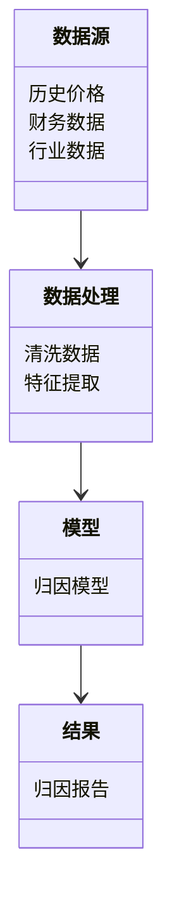
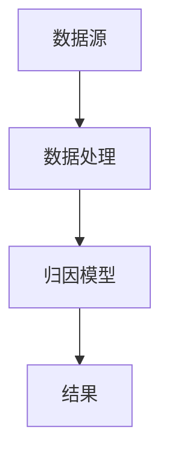
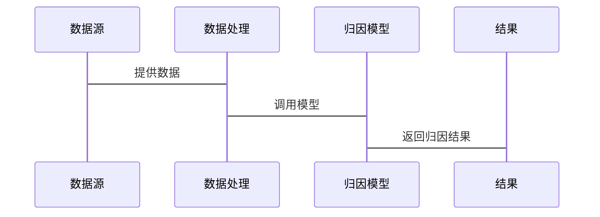

                 


# AI驱动的价值投资策略归因分析

> 关键词：AI驱动，价值投资，归因分析，投资策略，因子分解模型，机器学习，时间序列分析

> 摘要：本文详细探讨了AI驱动的价值投资策略归因分析，从理论基础到实际应用，逐步解析了AI如何助力投资策略的优化与归因分析。通过因子分解模型、时间序列分析等算法，结合系统架构设计与项目实战，揭示了AI在价值投资中的潜力与实现路径。

---

# 第1章 价值投资策略与AI驱动的背景

## 1.1 价值投资策略的定义与特点
### 1.1.1 价值投资的核心概念
- 价值投资是一种基于对公司内在价值的分析，寻找市场定价低于其真实价值的股票的投资策略。
- 关键特征包括长期导向、注重基本面分析、逆向思维等。

### 1.1.2 价值投资策略的关键特征
- 长期投资：关注公司的长期价值，而非短期波动。
- 低估值：寻找市场价格低于内在价值的股票。
- 高质量：筛选具有强大竞争优势和良好治理结构的公司。

### 1.1.3 价值投资策略的应用场景
- 适用于长期投资者、机构投资者和追求稳定收益的个人投资者。

## 1.2 AI驱动投资策略的必要性
### 1.2.1 传统投资策略的局限性
- 传统投资策略依赖人工分析，存在主观性强、效率低、覆盖面窄等问题。
- 无法有效处理海量数据，难以捕捉市场中的复杂模式。

### 1.2.2 AI技术在投资领域的优势
- 数据处理能力：AI能够快速处理海量数据，发现潜在的市场规律。
- 模式识别：通过机器学习算法，AI可以识别传统方法难以察觉的市场信号。
- 自适应性：AI系统可以根据市场变化动态调整投资策略。

### 1.2.3 价值投资与AI结合的潜力
- AI可以辅助筛选低估值、高质量的公司，提升投资决策的效率和准确性。
- 通过大数据分析，AI可以帮助投资者发现被市场低估的投资机会。

## 1.3 投资策略归因分析的重要性
### 1.3.1 归因分析的定义
- 归因分析是一种将投资组合的收益分解为各个因素贡献的方法，用于评估投资策略的有效性。

### 1.3.2 归因分析在投资决策中的作用
- 帮助投资者了解投资收益的来源，识别策略的优势和不足。
- 为投资策略的优化提供数据支持。

### 1.3.3 AI驱动归因分析的创新点
- 通过机器学习模型，AI可以更精确地量化各个因素对投资收益的贡献。
- 实现实时归因分析，帮助投资者快速调整投资策略。

## 1.4 本章小结
本章介绍了价值投资策略的基本概念、特点及其在现代投资中的局限性。同时，阐述了AI技术在投资领域的潜力，特别是AI驱动的归因分析在提升投资决策效率和准确性方面的重要作用。

---

# 第2章 AI驱动归因分析的核心要素

## 2.1 AI驱动归因分析的原理
### 2.1.1 数据驱动的归因方法
- 数据驱动的归因方法依赖于大量历史数据，通过统计分析和机器学习模型，识别影响投资收益的关键因素。

### 2.1.2 模型驱动的归因方法
- 模型驱动的归因方法基于特定的金融模型，如因子模型，分解投资收益的来源。

### 2.1.3 统计学与机器学习的结合
- 通过统计学方法（如回归分析）和机器学习算法（如随机森林、神经网络）的结合，实现更精准的归因分析。

## 2.2 核心概念对比分析
### 2.2.1 数据特征对比
| 数据特征 | 传统归因分析 | AI驱动归因分析 |
|----------|---------------|-----------------|
| 数据量   | 小            | 大              |
| 数据类型 | 结构化数据     | 结构化+非结构化 |

### 2.2.2 模型特征对比
| 模型特征 | 传统归因分析 | AI驱动归因分析 |
|----------|---------------|-----------------|
| 模型复杂度 | 低            | 高              |
| 可解释性 | 高            | 中              |

### 2.2.3 方法论对比
| 方法论 | 传统归因分析 | AI驱动归因分析 |
|--------|---------------|-----------------|
| 依赖基础 | 统计学         | 机器学习         |

## 2.3 实体关系图（ER图）分析
### 2.3.1 数据流分析
- 数据从原始市场数据开始，经过清洗、特征提取、建模等步骤，最终生成归因结果。

### 2.3.2 实体关系分析


## 2.4 本章小结
本章详细分析了AI驱动归因分析的核心要素，包括数据驱动和模型驱动的归因方法，以及统计学与机器学习的结合。通过对比分析和ER图展示，帮助读者理解AI驱动归因分析的系统构成。

---

# 第3章 归因分析算法的数学模型

## 3.1 因子分解模型
### 3.1.1 因子分解的定义
- 因子分解是一种将观测数据分解为隐含因子的方法，常用于降维和数据压缩。

### 3.1.2 因子分解的数学表达
$$X = U \cdot \Sigma \cdot V^T$$

其中，$X$是数据矩阵，$U$和$V$是因子矩阵，$\Sigma$是特征值矩阵。

### 3.1.3 因子分解的应用
- 用于分解投资收益的来源，识别关键因子对收益的贡献。

## 3.2 贡献度计算模型
### 3.2.1 贡献度计算的公式
$$C_i = \frac{w_i}{\sum w_j}$$

其中，$C_i$是第$i$个因子的贡献度，$w_i$是第$i$个因子的权重。

### 3.2.2 贡献度计算的步骤
1. 计算各因子的权重。
2. 根据权重计算各因子的贡献度。
3. 对贡献度进行排序和分析。

## 3.3 时间序列分析模型
### 3.3.1 时间序列分解
- 时间序列分解将数据分解为趋势、季节性和随机性三部分。

### 3.3.2 ARIMA模型应用
- ARIMA（自回归积分滑动平均模型）用于预测时间序列数据。

### 3.3.3 LSTM模型应用
- LSTM（长短期记忆网络）用于捕捉时间序列中的长期依赖关系。

## 3.4 本章小结
本章通过数学模型详细阐述了归因分析算法的核心原理，包括因子分解模型、贡献度计算模型和时间序列分析模型。这些模型为AI驱动的归因分析提供了理论基础。

---

# 第4章 系统架构设计方案

## 4.1 项目场景介绍
### 4.1.1 问题场景描述
- 需要对投资组合的收益进行归因分析，识别关键因子对收益的贡献。

### 4.1.2 项目目标设定
- 构建一个基于AI的归因分析系统，实现投资收益的多维度分解。

### 4.1.3 项目范围界定
- 数据范围：历史价格、财务数据、行业数据。
- 分析范围：因子分解、贡献度计算、时间序列分析。

## 4.2 系统功能设计
### 4.2.1 领域模型设计


### 4.2.2 系统架构设计


### 4.2.3 系统接口设计
- 数据接口：提供数据输入和输出的接口。
- 模型接口：提供归因模型的调用接口。

### 4.2.4 系统交互流程图


## 4.3 本章小结
本章通过系统架构设计方案，详细描述了AI驱动归因分析系统的构建过程，包括数据处理、模型设计和系统交互等方面。

---

# 第5章 项目实战

## 5.1 环境安装
### 5.1.1 安装Python
- 使用Anaconda安装Python 3.8以上版本。

### 5.1.2 安装依赖库
- 安装numpy、pandas、scikit-learn、xgboost等依赖库。

## 5.2 系统核心实现
### 5.2.1 数据处理代码
```python
import pandas as pd
import numpy as np

# 读取数据
data = pd.read_csv('input.csv')

# 数据清洗
data = data.dropna()
```

### 5.2.2 归因模型实现
```python
from sklearn.decomposition import FactorAnalysis

# 初始化因子分解模型
fa = FactorAnalysis(n_components=5)

# 模型训练
fa.fit(data)
```

### 5.2.3 贡献度计算
```python
# 计算因子权重
weights = np.abs(fa.components_)

# 计算贡献度
contributions = weights / np.sum(weights)
```

## 5.3 代码解读与分析
### 5.3.1 数据处理部分
- 读取数据并进行清洗，处理缺失值和异常值。

### 5.3.2 归因模型部分
- 使用因子分解模型对数据进行降维，提取隐含因子。

### 5.3.3 贡献度计算部分
- 计算各因子的权重，并根据权重计算贡献度。

## 5.4 案例分析
### 5.4.1 数据来源
- 使用历史股票数据进行分析。

### 5.4.2 模型训练
- 训练因子分解模型，提取关键因子。

### 5.4.3 结果分析
- 通过贡献度分析，识别对投资收益贡献最大的因子。

## 5.5 本章小结
本章通过实际案例，详细展示了AI驱动归因分析系统的实现过程，从数据处理到模型训练，再到结果分析，帮助读者掌握系统的实际应用。

---

# 第6章 最佳实践与注意事项

## 6.1 最佳实践
### 6.1.1 数据质量管理
- 确保数据的完整性和准确性，避免数据偏差。

### 6.1.2 模型调优
- 使用交叉验证等方法优化模型参数，提升模型性能。

### 6.1.3 结果验证
- 通过回测和风险分析，验证投资策略的有效性。

## 6.2 小结
- AI驱动的归因分析为价值投资提供了新的工具和方法，能够显著提升投资决策的效率和准确性。

## 6.3 注意事项
- 数据质量和模型选择对归因分析结果有重要影响，需谨慎处理。
- 模型的可解释性可能较低，需结合实际情况进行解读。

## 6.4 未来展望
- 随着AI技术的发展，归因分析将更加精准和实时，为投资决策提供更有力的支持。

---

# 附录

## 附录A 工具安装指南
- Python安装指南
- 依赖库安装命令

## 附录B 数据集
- 数据格式说明
- 数据来源说明

## 附录C 参考文献
- 相关书籍和论文推荐

---

# 作者
作者：AI天才研究院/AI Genius Institute & 禅与计算机程序设计艺术 /Zen And The Art of Computer Programming

