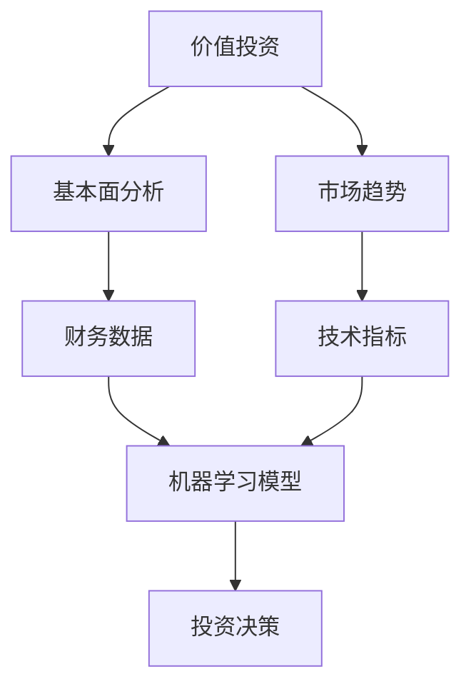
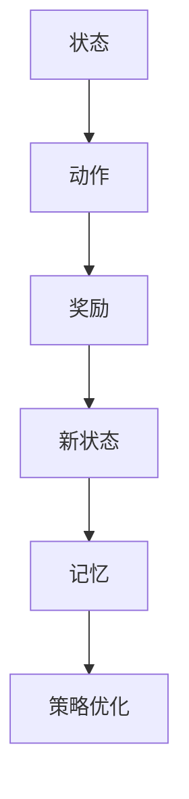
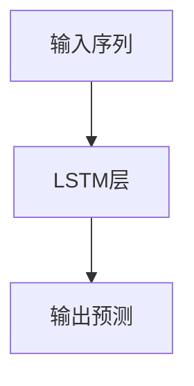
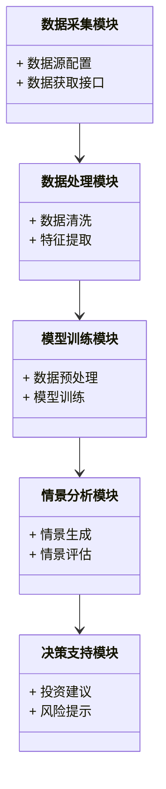

                 


# AI驱动的价值投资策略情景分析

---

## 关键词：  
价值投资、人工智能、情景分析、投资策略、机器学习、金融数据

---

## 摘要：  
本文深入探讨了人工智能技术在价值投资中的应用，特别是如何利用AI驱动的情景分析来优化投资策略。文章从价值投资的基本概念和AI在金融领域的应用背景出发，详细分析了AI驱动的情景分析的算法原理、数学模型、系统架构以及实际项目案例。通过对比传统方法与AI技术的差异，展示了AI在提升投资决策效率和准确性的显著优势，同时提出了未来的发展方向和建议。

---

## 第1章：价值投资与AI的结合

### 1.1 价值投资的定义与核心理念  
价值投资是一种以基本面分析为基础的投资策略，旨在通过识别市场中被低估的资产来实现长期收益。其核心理念包括：  
1. **内在价值**：资产的真实价值与其未来现金流的现值密切相关。  
2. **安全边际**：以低于内在价值的价格买入资产，以降低风险。  
3. **长期视角**：关注企业的长期盈利能力，而非短期市场波动。  

### 1.2 AI在金融领域的应用背景  
随着大数据和机器学习技术的快速发展，AI在金融领域的应用越来越广泛。AI技术可以帮助投资者快速处理海量数据、识别市场趋势、优化投资组合。  
- **数据处理**：AI能够高效处理非结构化数据（如新闻、社交媒体）和结构化数据（如财务报表）。  
- **预测能力**：通过机器学习模型，AI可以预测股票价格、市场波动等关键指标。  
- **决策支持**：AI辅助投资者制定更加科学的投资策略，降低人为情绪对决策的影响。  

### 1.3 问题背景与目标  
传统价值投资依赖于人工分析，存在以下局限性：  
- 数据量大、信息分散，难以快速提取有效信息。  
- 市场波动频繁，人工分析难以捕捉短期变化。  
- 投资决策容易受到主观情绪影响。  
通过引入AI技术，可以弥补上述不足，目标是：  
- 提高数据处理效率，挖掘潜在投资机会。  
- 建立动态模型，适应市场变化。  
- 提供量化支持，降低决策风险。  

### 1.4 核心概念与联系  
价值投资与AI的结合可以通过以下方式实现：  

通过上述关系图可以看出，AI技术可以整合基本面分析和技术分析，为价值投资提供更全面的支持。

---

## 第2章：AI驱动价值投资的情景分析原理  

### 2.1 情景分析的基本概念  
情景分析是一种假设性分析方法，通过构建不同的市场情景，评估资产在不同条件下的表现。AI驱动的情景分析可以通过以下步骤实现：  
1. **数据收集**：获取历史价格、财务数据、市场新闻等信息。  
2. **模型构建**：使用机器学习算法生成多个情景。  
3. **情景评估**：分析不同情景对投资组合的影响。  

### 2.2 数据特征与分析维度  
价值投资的情景分析需要考虑以下数据特征：  
- **市场趋势**：如宏观经济指标、行业趋势。  
- **公司基本面**：如净利润、营收增长率、资产负债率等。  
- **市场情绪**：如新闻情感、社交媒体热度。  

### 2.3 AI模型的选择与构建  
选择合适的AI模型是情景分析的关键。常用的模型包括：  
- **强化学习**：适用于动态市场环境下的策略优化。  
- **时间序列分析**：适用于预测股票价格和市场趋势。  
- **聚类分析**：适用于识别市场中的相似资产。  

---

## 第3章：AI驱动价值投资情景分析的算法原理  

### 3.1 强化学习在情景分析中的应用  
强化学习是一种通过试错机制优化决策的算法。例如，可以使用Q-learning算法来模拟投资决策过程：  

通过不断迭代，模型可以学习到最优投资策略。

### 3.2 时间序列分析与预测模型  
时间序列分析是情景分析的重要工具。例如，使用LSTM（长短期记忆网络）进行股票价格预测：  

LSTM能够捕捉时间序列中的长期依赖关系，适合处理股票价格的非线性变化。

---

## 第4章：数学模型与公式推导  

### 4.1 价值投资的数学模型  
资本资产定价模型（CAPM）是价值投资的重要工具：  
$$ E(r_i) = r_f + \beta_i (E(r_m) - r_f) $$  
其中，$E(r_i)$是资产的预期收益，$r_f$是无风险利率，$\beta_i$是资产的贝塔系数，$E(r_m)$是市场预期收益。

### 4.2 风险评估模型的构建  
风险价值（VaR）模型可以量化投资组合的风险：  
$$ VaR = \mu - z \cdot \sigma $$  
其中，$\mu$是平均收益，$z$是标准正态分布的分位数，$\sigma$是收益的标准差。

---

## 第5章：系统分析与架构设计  

### 5.1 问题场景介绍  
在实际应用中，投资者需要处理实时数据、分析市场趋势、制定投资策略。系统需要具备以下功能：  
- **数据采集**：从多种数据源获取实时信息。  
- **模型训练**：构建并优化AI模型。  
- **情景分析**：生成并评估不同市场情景。  
- **决策支持**：提供投资建议和风险提示。  

### 5.2 系统功能设计  
系统功能模块包括：  


### 5.3 系统架构设计  
系统架构采用分层设计：  


### 5.4 系统接口与交互流程  
系统交互流程包括：  
- 用户输入查询请求。  
- 系统调用数据采集模块获取数据。  
- 数据处理模块对数据进行清洗和特征提取。  
- 模型训练模块生成AI模型。  
- 情景分析模块生成并评估情景。  
- 决策支持模块提供投资建议。  

---

## 第6章：项目实战与案例分析  

### 6.1 项目环境配置  
需要安装以下工具：  
- Python 3.8+  
- TensorFlow/PyTorch  
- Pandas/Numpy  

### 6.2 核心代码实现  
以下是使用Python实现的股票价格预测代码示例：  
```python
import numpy as np
import pandas as pd
from tensorflow.keras.models import Sequential
from tensorflow.keras.layers import LSTM, Dense

# 数据预处理
data = pd.read_csv('stock_data.csv')
train_data = data[:800]
test_data = data[800:]

# 模型构建
model = Sequential()
model.add(LSTM(128, input_shape=(timesteps, features)))
model.add(Dense(1))
model.compile(loss='mean_squared_error', optimizer='adam')

# 训练模型
model.fit(train_data, epochs=10, batch_size=32)
```

### 6.3 案例分析与解读  
通过实际案例分析，展示了AI驱动的情景分析在投资决策中的应用效果。例如，模型可以在市场下跌时提前发出预警，帮助投资者规避风险。

---

## 第7章：总结与展望  

### 7.1 核心内容回顾  
本文详细介绍了AI驱动的价值投资策略情景分析，涵盖了从理论到实践的全过程。通过AI技术，投资者可以更高效地分析市场、制定策略、规避风险。  

### 7.2 未来展望与发展趋势  
未来，随着AI技术的不断进步，价值投资的情景分析将更加智能化和个性化。投资者可以利用更复杂的模型和更多的数据源，制定更加精准的投资策略。  

---

## 附录：参考文献与工具推荐  

### 8.1 参考文献  
1. Fama, E. F. (1970). Efficient Capital Markets: A Review of Theory and Empirical Work. Journal of Finance.  
2. Campbell, J. Y., & Shiller, R. J. (1988). Stock Prices, earnings, and expected dividends. Journal of Finance.  
3. Hochreiter, S., & Schmidhuber, J. (2014). LSTM: A Recurrent Neural Network for Learning Long-Term Dependencies.  

### 8.2 工具推荐  
- **数据源**：Yahoo Finance、Google Finance  
- **编程工具**：Python（Pandas, Numpy, TensorFlow）  
- **可视化工具**：Matplotlib, Plotly  

---

## 作者：  
AI天才研究院 & 禅与计算机程序设计艺术

