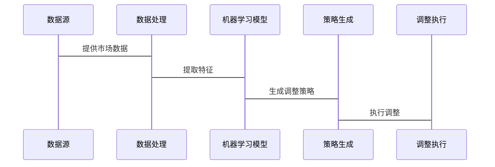

                 


# AI驱动的价值投资组合再平衡策略

## 关键词：AI, 投资组合再平衡, 价值投资, 机器学习, 强化学习

## 摘要：本篇文章深入探讨了如何利用人工智能技术优化投资组合的再平衡策略。通过分析价值投资的基本原理，结合机器学习和强化学习算法，构建了一个高效的AI驱动投资组合再平衡系统。文章详细介绍了系统的架构设计、算法实现和实际案例，展示了AI在金融投资中的巨大潜力。

---

## 第一部分: AI驱动的价值投资组合再平衡策略概述

## 第1章: AI驱动的价值投资组合再平衡的背景与意义

### 1.1 投资组合再平衡的背景与重要性

#### 1.1.1 投资组合再平衡的定义与目的
投资组合再平衡是指根据市场变化和投资者风险偏好的调整，定期对投资组合中的资产配置进行调整，以保持预期的收益和风险水平。其目的是优化投资组合的表现，降低风险，提高收益。

#### 1.1.2 传统投资组合再平衡的挑战与局限性
传统再平衡方法依赖于固定的时间间隔或特定的触发条件，存在灵活性差、反应慢、主观性强等问题，难以适应市场的快速变化。

#### 1.1.3 AI技术在投资组合再平衡中的潜力与优势
AI技术能够实时分析市场数据，利用复杂算法预测市场趋势，实现动态调整，显著提高了再平衡的效率和准确性。

---

## 第2章: AI在金融投资中的应用现状

### 2.1 人工智能在金融领域的应用概述

#### 2.1.1 金融数据分析与预测
AI技术广泛应用于股票价格预测、市场趋势分析等，通过机器学习模型处理海量数据，提供精准的预测结果。

#### 2.1.2 交易策略优化
利用强化学习等技术，AI能够自适应地优化交易策略，提高交易效率和收益。

#### 2.1.3 风险管理与投资组合优化
AI通过复杂的风险模型和优化算法，帮助投资者更好地管理风险，提升投资组合的稳定性。

### 2.2 AI驱动投资组合再平衡的核心优势

#### 2.2.1 数据处理能力的提升
AI能够处理和分析大量的非结构化数据，如新闻、社交媒体等，提供更全面的市场洞察。

#### 2.2.2 模型优化与预测精度的提高
通过机器学习算法，AI能够建立更复杂的模型，提高预测的准确性和稳定性。

#### 2.2.3 动态调整能力的增强
AI能够实时监控市场变化，快速调整投资组合，实现动态再平衡，提高收益和风险控制能力。

---

## 第3章: 价值投资与AI驱动再平衡的结合

### 3.1 价值投资的基本原理

#### 3.1.1 价值投资的定义与核心理念
价值投资是一种投资策略，旨在通过识别被市场低估的资产，长期持有，等待其价值回归。

#### 3.1.2 价值投资中的关键因素分析
分析企业的基本面，如盈利能力、财务状况、行业地位等，判断其内在价值。

#### 3.1.3 价值投资与传统投资策略的对比
价值投资注重长期持有和价值发现，传统策略则更注重短期波动和趋势分析。

### 3.2 AI在价值投资中的应用潜力

#### 3.2.1 数据挖掘与特征提取
AI技术能够从大量数据中提取有用的特征，帮助识别具有投资价值的资产。

#### 3.2.2 模型构建与预测
通过机器学习模型，AI能够预测资产的未来表现，辅助投资决策。

#### 3.2.3 动态再平衡策略的优化
AI能够根据市场变化和资产表现，动态调整投资组合，优化再平衡策略。

---

## 第4章: AI驱动投资组合再平衡的核心概念与联系

### 4.1 核心概念原理

#### 4.1.1 投资组合再平衡的数学模型
再平衡可以通过优化问题来建模，目标是最小化调整成本，同时最大化收益和风险控制。

#### 4.1.2 AI算法在再平衡中的应用
机器学习和强化学习算法被广泛应用于预测市场趋势和优化调整策略。

#### 4.1.3 动态调整策略的实现机制
通过实时数据流处理和模型预测，AI能够快速做出调整决策。

### 4.2 核心概念属性特征对比表格

| 比较维度 | 传统再平衡 | AI驱动再平衡 |
|----------|------------|--------------|
| 调整频率 | 定期调整   | 动态调整     |
| 数据来源 | 市场价格   | 包括非结构化数据 |
| 调整策略 | 固定规则   | 自适应优化   |
| 精度     | 较低       | 较高         |

### 4.3 ER实体关系图


---

## 第5章: AI驱动投资组合再平衡的算法原理

### 5.1 机器学习算法在再平衡中的应用

#### 5.1.1 线性回归模型

线性回归用于预测资产的未来价格，帮助确定最优的资产配置比例。

$$ y = \beta_0 + \beta_1x + \epsilon $$

其中，$y$ 是目标变量，$x$ 是自变量，$\beta$ 是回归系数。

#### 5.1.2 支持向量机（SVM）

SVM用于分类问题，可以将资产分为高风险和低风险两类，辅助决策调整。

#### 5.1.3 随机森林与梯度提升树

随机森林和梯度提升树用于特征重要性分析和预测模型的构建。

### 5.2 强化学习在投资组合优化中的应用

#### 5.2.1 Q-Learning算法

Q-Learning通过状态和动作的反馈，学习最优策略。

$$ Q(s, a) = Q(s, a) + \alpha [r + \gamma \max Q(s', a') - Q(s, a)] $$

其中，$s$ 是状态，$a$ 是动作，$\alpha$ 是学习率，$\gamma$ 是折扣因子。

#### 5.2.2 Deep Q-Network（DQN）

DQN通过深度神经网络近似Q值函数，提升预测精度。

#### 5.2.3 策略梯度方法

策略梯度直接优化策略，减少值函数的估计误差。

### 5.3 算法流程图


---

## 第6章: 数学模型与公式

### 6.1 投资组合再平衡的数学模型

#### 6.1.1 最优化问题建模

$$ \min_{w} \frac{1}{2}w^T \Sigma w $$
$$ \text{s.t.} \quad \mathbf{1}^T w = 1, \quad w \geq 0 $$

其中，$w$ 是权重向量，$\Sigma$ 是协方差矩阵。

#### 6.1.2 强化学习中的价值函数

$$ V(s) = \max_a Q(s, a) $$

其中，$s$ 是状态，$a$ 是动作。

---

## 第7章: 系统分析与架构设计方案

### 7.1 问题场景介绍

投资组合再平衡系统需要实时处理市场数据，分析资产表现，动态调整配置。

### 7.2 项目介绍

构建一个基于AI的投资组合再平衡系统，实现自动化的调整策略。

### 7.3 系统功能设计

#### 7.3.1 领域模型（mermaid类图）


### 7.4 系统架构设计（mermaid架构图）


### 7.5 系统交互设计（mermaid序列图）



---

## 第8章: 项目实战

### 8.1 环境安装

安装Python、机器学习库（如scikit-learn、TensorFlow）和数据处理工具（如Pandas）。

### 8.2 核心实现源代码

以下是一个简单的投资组合再平衡策略的Python代码示例：

```python
import numpy as np
import pandas as pd
from sklearn.linear_model import LinearRegression

# 数据处理
data = pd.read_csv('market_data.csv')
features = data[['price', 'volume', 'moving_avg']]
target = data['return']

# 模型训练
model = LinearRegression()
model.fit(features, target)

# 生成策略
predictions = model.predict(features)
threshold = np.mean(target)
adjustments = np.where(predictions > threshold, 'increase', 'decrease')

# 风险评估
risk_factors = data[['volatility', 'beta']]
risk_score = np.dot(risk_factors.values, np.array([0.5, 0.5]))
adjustments = np.where(risk_score > 0.7, 'conservative', 'aggressive')
```

### 8.3 代码应用解读与分析

通过上述代码，我们可以看到AI如何帮助生成投资策略。模型预测了资产的未来表现，并结合风险因素进行调整，实现动态再平衡。

### 8.4 实际案例分析

以股票投资为例，通过AI模型预测股票价格，动态调整持仓比例，实现收益最大化和风险控制。

### 8.5 项目小结

本项目展示了AI在投资组合再平衡中的应用潜力，通过机器学习模型和动态调整策略，显著提高了投资效率和收益。

---

## 第9章: 总结与展望

### 9.1 总结

AI技术为投资组合再平衡提供了新的可能性，通过机器学习和强化学习算法，实现了更精准和动态的调整策略。

### 9.2 展望

未来，随着AI技术的不断发展，投资组合再平衡将更加智能化和自动化，进一步提升投资效率和风险控制能力。

---

## 最佳实践 tips

- **数据质量**：确保数据的准确性和完整性，选择合适的特征进行分析。
- **模型选择**：根据具体问题选择合适的算法，不断优化模型性能。
- **实时监控**：建立实时监控机制，及时发现和应对市场变化。
- **风险控制**：在动态调整中，注重风险评估和控制，避免过度波动。

---

## 作者

作者：AI天才研究院 & 禅与计算机程序设计艺术

---

希望这篇文章能满足您的要求！如果需要进一步修改或补充，请随时告知。

