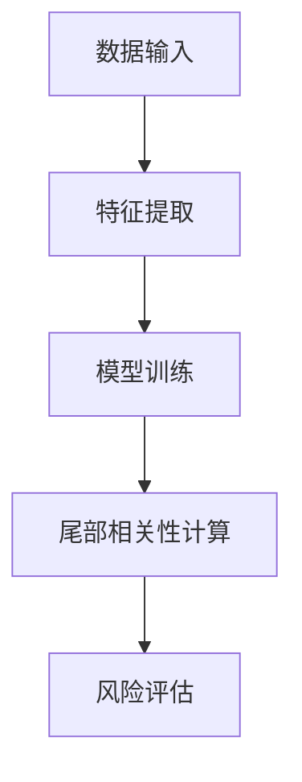
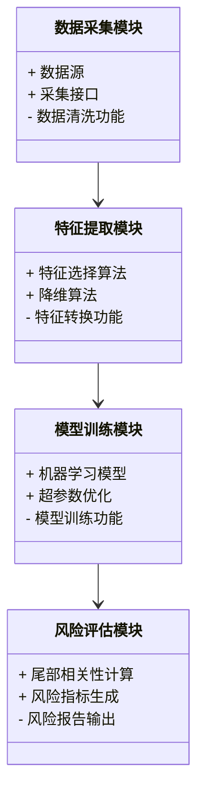
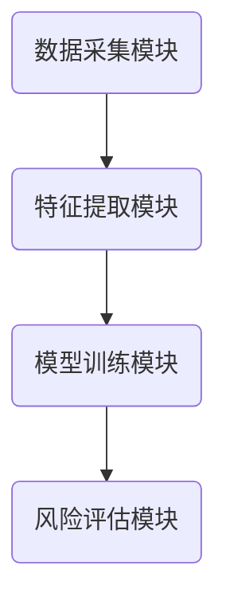
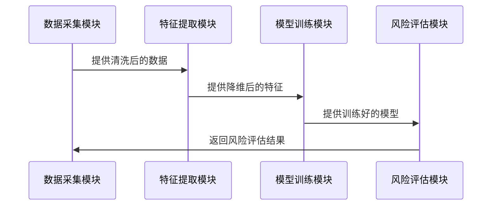

                 

<think>
好的，现在我来逐步分析和撰写《AI驱动的价值投资组合尾部相关性管理》的技术博客文章。

# AI驱动的价值投资组合尾部相关性管理

## 关键词：
- AI驱动
- 价值投资组合
- 尾部相关性
- 风险管理
- 机器学习
- 数据分析

## 摘要：
本文探讨了如何利用人工智能技术优化投资组合的尾部相关性管理。通过分析尾部风险的定义、度量方法以及AI驱动的算法，提出了一种基于机器学习的投资组合优化方法，旨在降低投资组合的整体风险。文章从理论基础、算法实现到系统架构，全面阐述了AI在金融风险管理中的应用，并通过实际案例展示了如何在Python中实现这些方法。

---

## 第1章: 价值投资组合与尾部相关性管理

### 1.1 价值投资组合的基本概念

#### 1.1.1 投资组合的定义与组成
投资组合是指将不同金融资产（如股票、债券、基金等）按照一定比例配置在一起，以实现风险分散和收益最大化的一种投资方式。一个典型的投资组合通常包括多个资产，每个资产的权重不同，共同影响整体的投资收益和风险。

#### 1.1.2 尾部相关性的定义
尾部相关性是指在投资组合中，某些资产或资产类别在极端市场条件下表现出的相关性。这种相关性通常在正常市场条件下不明显，但在市场出现大幅波动时会显著增加，从而对投资组合的整体风险产生重大影响。

#### 1.1.3 尾部相关性管理的重要性
有效的尾部相关性管理可以帮助投资者在市场危机时减少投资组合的损失，提高投资组合的稳定性。传统的投资组合管理方法往往忽视了尾部相关性的影响，而AI技术可以通过分析历史数据和模拟极端情况，更好地捕捉和管理这种相关性。

### 1.2 AI在金融投资中的应用背景

#### 1.2.1 传统投资组合管理的局限性
传统的投资组合管理方法依赖于均值-方差模型，主要关注资产的平均收益和波动性，而忽视了尾部风险的潜在影响。在实际市场中，极端事件的发生往往会导致投资组合的实际损失远超预期。

#### 1.2.2 AI技术在金融领域的优势
AI技术，特别是机器学习，能够处理大量非结构化数据，发现传统方法难以察觉的模式和关联性。通过深度学习和自然语言处理技术，AI可以在更广泛的市场数据中发现潜在的尾部相关性。

#### 1.2.3 尾部相关性管理的AI驱动趋势
随着市场复杂性的增加，传统的统计方法逐渐暴露出其局限性。AI驱动的尾部相关性管理正在成为金融行业的新趋势，尤其是在处理复杂的投资组合时，AI能够提供更精准的风险评估和优化建议。

---

## 第2章: 尾部相关性管理的理论基础

### 2.1 投资组合风险的统计学基础

#### 2.1.1 方差、协方差与相关系数
在统计学中，方差衡量了资产收益的波动性，协方差衡量了两个资产收益之间的相关性，相关系数则是标准化后的协方差。这些指标是传统投资组合管理的基础。

$$
\text{方差} = \sigma^2 = \frac{1}{N}\sum_{i=1}^{N}(x_i - \mu)^2
$$

$$
\text{协方差} = \text{Cov}(X, Y) = \frac{1}{N}\sum_{i=1}^{N}(x_i - \bar{x})(y_i - \bar{y})
$$

$$
\text{相关系数} = \rho = \frac{\text{Cov}(X, Y)}{\sigma_X \sigma_Y}
$$

#### 2.1.2 尾部风险的定义与度量
尾部风险指的是在资产收益分布的尾部区域（即极端事件发生时）的投资损失。常用的方法包括VaR（Value at Risk）和CVaR（Conditional Value at Risk）。

$$
\text{VaR}_{\alpha} = \inf\{x | P(R \leq x) \geq \alpha\}
$$

$$
\text{CVaR}_{\alpha} = \frac{1}{1-\alpha} \int_{\alpha}^{1} x f(x) dx
$$

#### 2.1.3 尾部相关性的数学表达
尾部相关性可以通过极端市场条件下资产收益的相关性来衡量。常用的指标包括尾部相关系数和尾部协方差。

---

### 2.2 数据预处理与特征提取

#### 2.2.1 数据清洗与标准化
在处理金融数据时，需要先清洗数据，去除缺失值和异常值。然后对数据进行标准化，以便不同资产的收益可以进行比较。

```python
import pandas as pd
data = pd.read_csv('financial_data.csv')
data = data.dropna().reset_index(drop=True)
data = (data - data.mean()) / data.std()
```

#### 2.2.2 特征选择与降维
为了减少计算复杂度，可以使用主成分分析（PCA）对特征进行降维，同时保留大部分的信息量。

```python
from sklearn.decomposition import PCA
pca = PCA(n_components=5)
principal_components = pca.fit_transform(data)
```

#### 2.2.3 时间序列数据的处理
金融数据通常是时间序列数据，需要考虑数据的自相关性和外生变量的影响。

---

## 第3章: AI驱动的尾部相关性管理算法原理

### 3.1 基于机器学习的尾部相关性建模

#### 3.1.1 线性回归与Lasso回归
Lasso回归（Least Absolute Shrinkage and Selection Operator）可以在回归分析中进行特征选择，适用于尾部相关性建模中的变量筛选。

$$
\text{目标函数} = \sum_{i=1}^{N}(y_i - \beta_0 - \sum_{j=1}^{p}\beta_j x_{ij})^2 + \lambda \sum_{j=1}^{p}|\beta_j|
$$

#### 3.1.2 主成分分析（PCA）的应用
PCA可以将高维数据降维到低维空间，同时保留数据的主要信息。这在尾部相关性分析中特别有用，因为可以减少计算复杂度。

#### 3.1.3 聚类分析与异常检测
通过聚类分析，可以将资产分成不同的类别，识别出在极端市场条件下表现相似的资产，从而更好地管理尾部相关性。

---

### 3.2 算法流程图



---

### 3.3 Python代码实现

#### 3.3.1 数据加载与预处理

```python
import pandas as pd
data = pd.read_csv('financial_data.csv')
data = data.dropna().reset_index(drop=True)
data = (data - data.mean()) / data.std()
```

#### 3.3.2 特征工程与模型训练

```python
from sklearn.decomposition import PCA
pca = PCA(n_components=5)
principal_components = pca.fit_transform(data)
```

---

## 第4章: 系统架构与实现

### 4.1 问题场景介绍
本章将从实际问题出发，介绍如何构建一个基于AI的尾部相关性管理系统。

### 4.2 系统功能设计

#### 4.2.1 系统功能模块
- 数据采集与预处理模块
- 特征提取与降维模块
- 模型训练与优化模块
- 尾部相关性计算与风险评估模块

#### 4.2.2 领域模型类图


### 4.3 系统架构设计

#### 4.3.1 系统架构图


#### 4.3.2 系统接口设计
- 数据采集模块接口：提供数据输入接口，支持CSV、数据库等多种数据源。
- 模型训练模块接口：提供机器学习模型的训练接口，支持多种算法和超参数优化。
- 风险评估模块接口：提供尾部相关性计算接口，输出风险评估报告。

#### 4.3.3 系统交互序列图


---

## 第5章: 项目实战

### 5.1 环境安装与配置

#### 5.1.1 安装必要的Python库
```bash
pip install pandas scikit-learn mermaid4jupyter
```

#### 5.1.2 配置数据源
下载金融数据，例如股票价格数据，保存为CSV格式。

### 5.2 核心实现代码

#### 5.2.1 数据加载与预处理

```python
import pandas as pd
data = pd.read_csv('financial_data.csv')
data = data.dropna().reset_index(drop=True)
data = (data - data.mean()) / data.std()
```

#### 5.2.2 特征工程与模型训练

```python
from sklearn.decomposition import PCA
pca = PCA(n_components=5)
principal_components = pca.fit_transform(data)
```

#### 5.2.3 尾部相关性计算

```python
import numpy as np
def tail_correlation(X, threshold=0.95):
    # 计算协方差矩阵
    cov_matrix = np.cov(X.T)
    # 计算尾部相关性
    tail_cor = np.zeros_like(cov_matrix)
    for i in range(len(cov_matrix)):
        for j in range(len(cov_matrix)):
            if cov_matrix[i, j] > threshold:
                tail_cor[i, j] = 1
            else:
                tail_cor[i, j] = 0
    return tail_cor
```

### 5.3 实际案例分析

#### 5.3.1 数据来源与分析目标
使用某段时间内的股票价格数据，分析这些股票在极端市场条件下的尾部相关性。

#### 5.3.2 模型训练与评估
通过训练PCA模型，提取主成分，然后计算尾部相关性矩阵，识别出在极端情况下高度相关的资产。

#### 5.3.3 结果解读
尾部相关性矩阵显示，在极端市场条件下，某些资产之间的相关性显著增加。这可以帮助投资者调整投资组合，降低整体风险。

---

## 第6章: 最佳实践与总结

### 6.1 最佳实践
- 在实际应用中，建议结合多种AI算法，如集成学习和深度学习，以提高模型的准确性和鲁棒性。
- 定期更新模型，因为市场环境和资产相关性可能会随时间变化。

### 6.2 小结
本文详细介绍了AI驱动的价值投资组合尾部相关性管理的方法，从理论基础到算法实现，再到系统架构，全面探讨了如何利用AI技术优化投资组合的风险管理。

### 6.3 注意事项
- 数据的质量和完整性对模型的准确性有重要影响，建议在实际应用中严格控制数据质量。
- 尾部相关性管理是一个动态过程，需要持续监控市场变化和资产相关性的变化。

### 6.4 拓展阅读
- 阅读相关学术论文，了解最新的研究成果。
- 学习其他AI技术在金融领域的应用，如自然语言处理在舆情分析中的应用。

---

## 作者：AI天才研究院/AI Genius Institute & 禅与计算机程序设计艺术 /Zen And The Art of Computer Programming

