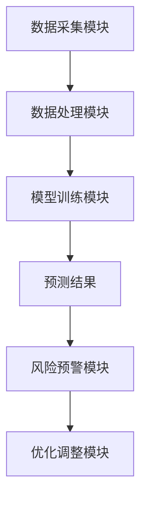

                 


# AI驱动的价值投资组合流动性管理

> 关键词：AI，投资组合，流动性管理，机器学习，风险管理，金融应用

> 摘要：本文探讨了如何利用人工智能技术优化投资组合的流动性管理。通过分析流动性管理的核心概念、算法原理、系统架构及项目实战，本文展示了AI在金融领域的应用潜力，并提出了未来的发展方向。

---

## 第1章：价值投资组合流动性管理的背景与挑战

### 1.1 价值投资组合的基本概念

#### 1.1.1 投资组合的定义与构成
投资组合是由多种金融资产组成的集合，旨在通过多样化配置降低风险并提高收益。常见的资产包括股票、债券、基金等。

#### 1.1.2 流动性在投资组合中的重要性
流动性指的是资产快速转换为现金而不损失价值的能力。高流动性资产如现金和短期债券易于变现，而低流动性资产如房地产和长期债券变现难度较大。

#### 1.1.3 传统流动性管理的局限性
传统方法依赖于历史数据和经验判断，难以应对复杂多变的市场环境。例如，金融危机期间，传统模型可能低估流动性风险，导致投资组合损失。

### 1.2 AI在金融领域的应用背景

#### 1.2.1 AI技术在金融领域的应用现状
AI技术广泛应用于金融领域的价格预测、风险评估、交易策略优化等方面。例如，量化交易基金利用算法进行高频交易。

#### 1.2.2 流动性管理中的AI技术潜力
AI能够通过分析海量数据，识别潜在风险，优化资产配置。例如，机器学习模型可以预测市场流动性变化，提前调整投资组合。

#### 1.2.3 当前市场对AI驱动流动性管理的需求
随着金融市场的复杂化，投资者对实时、动态的流动性管理需求日益增长。AI技术能够提供更精准的预测和优化，满足这一需求。

---

## 第2章：AI驱动流动性管理的核心概念与原理

### 2.1 流动性管理的核心概念

#### 2.1.1 流动性风险的定义与分类
流动性风险指无法以合理价格迅速变现资产的风险。可分为市场风险和信用风险。

#### 2.1.2 投资组合流动性管理的目标与策略
目标是平衡流动性和收益，策略包括资产分散化、动态调整投资比例等。

#### 2.1.3 AI在流动性管理中的角色与作用
AI通过数据挖掘和预测模型，辅助决策者优化资产配置，降低流动性风险。

### 2.2 AI驱动流动性管理的原理

#### 2.2.1 数据驱动的流动性预测模型
基于市场数据和投资者行为，构建预测模型，评估未来流动性风险。

#### 2.2.2 机器学习算法在流动性预测中的应用
使用随机森林、神经网络等算法，分析历史数据，识别影响流动性的因素。

#### 2.2.3 自适应优化策略的实现机制
AI系统实时监测市场变化，动态调整投资组合，确保流动性需求与收益目标的平衡。

---

## 第3章：AI驱动流动性管理的算法原理与实现

### 3.1 常见的流动性预测算法

#### 3.1.1 时间序列分析模型
ARIMA模型常用于预测未来的流动性水平。通过分析历史数据，模型识别趋势和周期性变化。

#### 3.1.2 机器学习模型（如随机森林、神经网络）
随机森林通过特征重要性分析，识别影响流动性风险的关键因素。神经网络则通过非线性关系，捕捉复杂市场动态。

#### 3.1.3 深度学习模型（如LSTM）
LSTM网络能够捕捉时间序列中的长期依赖关系，适用于流动性预测。

### 3.2 基于机器学习的流动性预测流程

#### 3.2.1 数据预处理与特征提取
清洗数据，去除噪声，提取有用的特征，如市场波动率、投资者情绪等。

#### 3.2.2 模型训练与优化
使用训练数据训练模型，调整参数，确保模型泛化能力。

#### 3.2.3 模型评估与部署
通过回测验证模型效果，部署到实时系统中，进行动态调整。

### 3.3 算法实现的数学模型与公式

#### 3.3.1 时间序列模型的数学表达
ARIMA模型的差分方程：
$$ y_t - \phi y_{t-1} = \theta \epsilon_t + \epsilon_{t-1} $$

#### 3.3.2 神经网络模型的结构与训练过程
神经网络结构包括输入层、隐藏层和输出层，使用反向传播算法训练权重。

#### 3.3.3 LSTM模型的长短期记忆机制
LSTM通过门控机制，控制信息的流动，避免长期依赖问题。

---

## 第4章：系统架构与设计方案

### 4.1 系统总体架构设计

#### 4.1.1 系统模块划分
数据采集、模型训练、风险预警和优化调整四个模块。

#### 4.1.2 各模块之间的交互关系
数据采集模块提供实时数据，模型训练模块生成预测结果，风险预警模块发出警报，优化调整模块动态调整投资组合。

#### 4.1.3 系统的可扩展性与灵活性
模块化设计便于功能扩展，支持多种算法的集成。

### 4.2 系统功能设计

#### 4.2.1 数据采集与处理模块
从多个数据源获取市场数据，清洗和预处理。

#### 4.2.2 模型训练与预测模块
训练机器学习模型，生成流动性预测结果。

#### 4.2.3 流动性风险预警与优化模块
根据预测结果，发出风险预警，并优化投资组合配置。

### 4.3 系统架构图



---

## 第5章：项目实战与案例分析

### 5.1 项目环境搭建

#### 5.1.1 开发工具与库的安装
使用Python、TensorFlow、Pandas等工具和库。

#### 5.1.2 数据集的获取与预处理
从Yahoo Finance获取历史数据，清洗和特征提取。

#### 5.1.3 环境配置代码
```python
import pandas as pd
import numpy as np
import tensorflow as tf
```

### 5.2 核心代码实现

#### 5.2.1 数据预处理代码
```python
data = pd.read_csv('market_data.csv')
features = data[['volume', 'price', 'returns']]
```

#### 5.2.2 模型训练代码
```python
model = tf.keras.Sequential([
    tf.keras.layers.Dense(64, activation='relu'),
    tf.keras.layers.Dense(1, activation='linear')
])
model.compile(optimizer='adam', loss='mse')
model.fit(features, labels, epochs=100)
```

#### 5.2.3 案例分析
以某段时间的数据为例，展示模型预测结果与实际数据的对比，评估模型的准确性。

### 5.3 项目总结

#### 5.3.1 项目成果
成功实现了AI驱动的流动性预测系统，提高了投资组合的管理效率。

#### 5.3.2 经验教训
数据质量对模型性能影响重大，需确保数据的准确性和完整性。

---

## 第6章：总结与展望

### 6.1 内容总结
本文详细探讨了AI在投资组合流动性管理中的应用，从理论到实践，展示了AI技术的优势和潜力。

### 6.2 未来展望
未来，随着技术的进步，AI将在金融领域发挥更大的作用，如实时预测、个性化投资策略等。

### 6.3 最佳实践tips
- 确保数据质量和多样性。
- 定期更新模型，适应市场变化。
- 结合人工策略，优化AI模型的表现。

---

## 作者：AI天才研究院/AI Genius Institute & 禅与计算机程序设计艺术 /Zen And The Art of Computer Programming

---

本文通过系统性的分析和实践，展示了AI技术在投资组合流动性管理中的应用潜力，为金融从业者提供了新的思路和工具。

