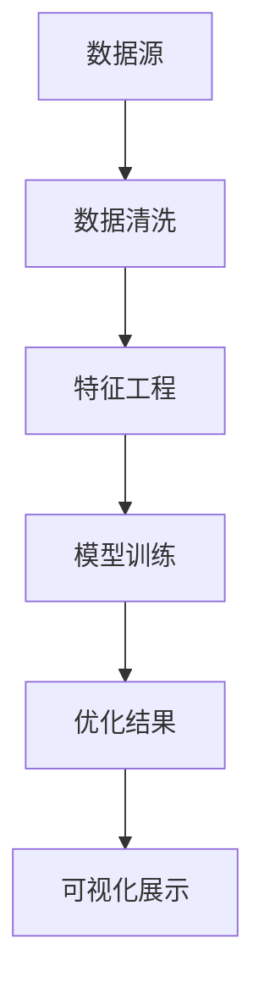

                 


```markdown
# AI驱动的价值投资组合风险预算管理

> 关键词：AI, 价值投资, 投资组合, 风险预算, 风险管理, 算法优化, 金融技术

> 摘要：本文探讨了如何利用人工智能技术优化投资组合的风险预算管理。通过结合价值投资策略与AI算法，提出了一种创新的组合管理方法，实现投资风险的有效控制和价值最大化。文章详细分析了AI驱动的组合优化模型、风险预算算法及其在实际投资中的应用，提供了系统的解决方案和最佳实践。

---

## 第一部分: AI驱动的价值投资组合风险预算管理概述

### 第1章: AI与金融投资的结合

#### 1.1 AI在金融投资中的应用
##### 1.1.1 AI技术在金融领域的应用现状
人工智能（AI）技术在金融领域的应用日益广泛，尤其是在投资决策、风险管理、市场预测等方面展现出巨大潜力。AI通过大数据分析和机器学习算法，帮助投资者更准确地识别市场趋势、评估资产风险并优化投资组合。

##### 1.1.2 AI如何驱动投资决策
AI通过实时数据分析和复杂模型计算，能够快速生成投资建议，帮助投资者做出更明智的决策。例如，自然语言处理（NLP）技术可以分析新闻和社交媒体，预测市场情绪变化；强化学习算法可以在模拟环境中测试不同的投资策略，寻找最优解。

##### 1.1.3 价值投资与风险预算的结合
价值投资强调长期持有优质资产，而风险预算是对投资组合中各资产的风险敞口进行合理分配。AI技术可以同时优化这两方面，通过量化分析和动态调整，实现价值最大化和风险最小化。

---

### 第2章: 价值投资与风险预算的基本原理

#### 2.1 价值投资的理论基础
##### 2.1.1 价值投资的核心理念
价值投资主张以低于内在价值的价格购买优质资产，长期持有，通过时间的推移获得收益。这种策略强调基本面分析和长期视角，AI技术可以辅助识别具有潜在价值的资产，并预测其未来的增值潜力。

##### 2.1.2 投资组合的构建方法
投资组合的构建需要考虑资产的多样性、风险承受能力和收益目标。AI可以通过多因子模型和优化算法，帮助投资者构建最优的投资组合，平衡风险与收益。

##### 2.1.3 价值投资中的风险管理
风险管理是价值投资的重要组成部分。AI技术可以通过实时监控市场变化和资产表现，动态调整投资组合，降低潜在风险。

---

## 第二部分: AI驱动的组合管理方法论

### 第3章: 投资组合优化的AI算法

#### 3.1 均值-方差优化模型
##### 3.1.1 模型原理
均值-方差优化是一种经典的组合优化方法，目标是找到在给定风险水平下收益最大的投资组合。通过AI技术，可以高效计算资产的期望收益、方差和协方差矩阵，优化组合配置。

##### 3.1.2 算法实现
使用Python和机器学习库（如scikit-learn）实现均值-方差优化。以下是优化过程的代码示例：

```python
import numpy as np
import pandas as pd
from sklearn.covariance import LedoitWolf

# 假设我们有资产的收益率数据
returns = pd.DataFrame(...)

# 计算协方差矩阵
cov_matrix = LedoitWolf().fit(returns).covariance_

# 优化目标：最大化收益，最小化风险
# 使用scipy.optimize中的minimize函数进行优化
import scipy.optimize as optimize

# 定义目标函数（最小化风险）
def portfolio_variance(weights, covariance):
    return np.dot(weights.T, np.dot(covariance, weights))

# 约束条件：权重之和为1
def constraint(weights):
    return np.sum(weights) - 1

# 初始权重（均等分配）
initial_weights = np.array([1.0 / returns.shape[1]] * returns.shape[1])

# 优化
result = optimize.minimize(portfolio_variance, initial_weights, args=cov_matrix, method='SLSQP', 
                            constraints={'type': 'eq', 'fun': constraint})

# 优化后的权重
optimal_weights = result.x
```

##### 3.1.3 应用案例
通过一个简单的资产组合优化案例，展示AI如何帮助投资者实现风险收益的平衡。

---

### 第4章: 风险预算管理的AI实现

#### 4.1 风险识别与量化
##### 4.1.1 风险识别方法
使用AI技术，如聚类分析和异常检测，识别投资组合中的高风险资产。

##### 4.1.2 风险量化模型
基于VaR（Value at Risk）和CVaR（Conditional Value at Risk）等风险度量指标，量化投资组合的整体风险敞口。

#### 4.2 风险分解与对冲策略
##### 4.2.1 风险分解方法
将投资组合的整体风险分解为各个资产的风险贡献，识别风险的主要来源。

##### 4.2.2 AI驱动的对冲策略
利用算法交易和动态再平衡，对冲投资组合中的高风险资产，降低整体风险水平。

---

## 第三部分: 系统架构与技术实现

### 第5章: 系统架构设计

#### 5.1 系统功能模块
##### 5.1.1 数据获取模块
从多个数据源获取资产的市场数据、财务报表和新闻信息。

##### 5.1.2 特征工程模块
对原始数据进行清洗、转换和特征提取，生成适合模型输入的特征向量。

##### 5.1.3 模型训练模块
使用机器学习算法（如随机森林、神经网络）训练投资组合优化和风险预算模型。

##### 5.1.4 结果展示模块
将优化结果以可视化形式展示，方便投资者理解和决策。

#### 5.2 系统架构图


---

### 第6章: 项目实战

#### 6.1 环境搭建
安装必要的Python库，如pandas、numpy、scikit-learn和Plotly。

#### 6.2 数据获取与预处理
从金融数据API获取历史价格数据，清洗缺失值和异常值。

#### 6.3 特征工程
提取资产的收益率、波动率、相关系数等特征，构建特征矩阵。

#### 6.4 模型训练与优化
使用机器学习算法训练投资组合优化模型，并进行超参数调优。

#### 6.5 结果分析
展示优化后的投资组合配置，分析其风险收益比和回撤情况。

---

## 第四部分: 最佳实践与总结

### 第7章: 实践中的注意事项

#### 7.1 数据质量问题
确保数据的准确性和完整性，避免因数据偏差导致的错误决策。

#### 7.2 模型选择与调优
根据实际需求选择合适的算法，并进行充分的模型验证和调优。

#### 7.3 风险管理的重要性
即使在AI的帮助下，也需要持续监控市场变化，及时调整投资策略。

---

## 结语

AI驱动的价值投资组合风险预算管理不仅提高了投资效率，还为投资者提供了更科学的决策支持。通过结合AI技术和金融理论，投资者可以在复杂多变的市场中实现风险可控、收益最优的投资目标。

---

## 作者：AI天才研究院/AI Genius Institute & 禅与计算机程序设计艺术 /Zen And The Art of Computer Programming
```

