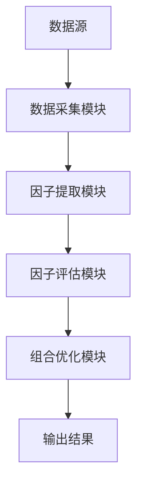
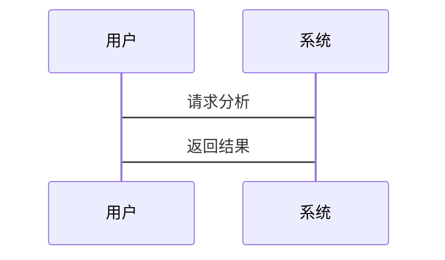

                 


# AI驱动的价值投资风格因子分析

> 关键词：价值投资、风格因子、人工智能、量化分析、机器学习

> 摘要：本文深入探讨了如何利用人工智能技术分析和优化价值投资中的风格因子。通过系统化的分析流程、数学模型的构建以及实际案例的分析，展示了AI在风格因子识别、筛选与组合优化中的独特优势。文章内容涵盖从理论基础到算法实现，再到系统架构设计的全链条，为读者提供了一个完整的AI驱动的价值投资风格因子分析框架。

---

# 第1章: 价值投资与风格因子分析概述

## 1.1 价值投资的基本概念

### 1.1.1 价值投资的定义与核心理念

价值投资是一种以基本面分析为基础的投资策略，其核心理念是寻找市场价格低于其内在价值的资产。投资者通过分析公司的财务状况、行业地位、竞争优势等因素，寻找被市场低估的投资标的。价值投资强调长期持有的理念，注重安全边际和风险控制。

### 1.1.2 价值投资与成长投资的区别

- **价值投资**：关注低估值、高分红、稳定增长的公司，强调安全边际和风险控制。
- **成长投资**：关注高成长性、高潜力的公司，注重未来收益的高增长。

### 1.1.3 风险控制在价值投资中的重要性

价值投资者通过分析公司的财务状况、行业地位等因素，寻找具有安全边际的公司，避免投资于高风险的资产。风险控制是价值投资的核心理念之一。

## 1.2 风格因子分析的背景与意义

### 1.2.1 风格因子的定义与分类

风格因子是描述资产或组合在特定维度上的特征，常见的风格因子包括市值、价值、动量、波动率等。这些因子可以帮助投资者理解和预测资产的收益和风险。

### 1.2.2 风格因子分析在投资决策中的作用

风格因子分析可以帮助投资者识别出具有特定特征的资产，从而构建出更优的投资组合。通过分析风格因子，投资者可以更好地理解市场的波动性，捕捉投资机会。

### 1.2.3 AI技术在风格因子分析中的应用前景

AI技术可以通过对大量数据的分析和挖掘，发现传统方法难以识别的风格因子。AI技术还可以帮助投资者实时监控市场变化，动态调整投资组合。

## 1.3 本书的核心目标与框架

### 1.3.1 本书的核心目标

本文旨在探讨如何利用人工智能技术分析和优化价值投资中的风格因子。通过系统化的分析流程、数学模型的构建以及实际案例的分析，展示AI在风格因子识别、筛选与组合优化中的独特优势。

### 1.3.2 本书的结构安排

- 第1章：价值投资与风格因子分析概述
- 第2章：AI驱动的风格因子分析基础
- 第3章：风格因子的数学模型与算法原理
- 第4章：系统架构与设计
- 第5章：项目实战
- 第6章：总结与展望

### 1.3.3 本书的适用读者

本文适合对价值投资、风格因子分析以及人工智能技术感兴趣的读者，特别是金融从业者、研究人员以及对量化投资感兴趣的学生。

## 1.4 本章小结

本章主要介绍了价值投资的核心理念、风格因子分析的背景与意义，以及本书的核心目标与框架。通过本章的介绍，读者可以对AI驱动的价值投资风格因子分析有一个全面的了解。

---

# 第2章: AI驱动的风格因子分析基础

## 2.1 风格因子的核心概念

### 2.1.1 风格因子的分类与特征

常见的风格因子包括市值、价值、动量、波动率、成长性等。每个因子都有其独特的特征和作用。

### 2.1.2 风格因子的量化方法

通过量化的方法，投资者可以将风格因子转化为具体的指标，例如市盈率（P/E）、市净率（P/B）、股息率等。

### 2.1.3 风格因子的动态变化

市场环境的变化会影响风格因子的权重和表现，因此投资者需要动态调整风格因子的权重。

## 2.2 AI在风格因子分析中的优势

### 2.2.1 AI技术在数据处理中的优势

AI技术可以通过自然语言处理（NLP）技术分析新闻、财报等非结构化数据，提取有用的特征。

### 2.2.2 AI在因子筛选中的应用

通过机器学习算法，AI可以自动筛选出具有预测能力的风格因子。

### 2.2.3 AI在因子组合优化中的作用

AI技术可以帮助投资者优化因子组合，降低组合的风险，提高收益。

## 2.3 风格因子分析的流程

### 2.3.1 数据采集与预处理

通过收集历史价格、财务数据、市场情绪等数据，进行清洗和标准化处理。

### 2.3.2 因子提取与特征选择

通过主成分分析（PCA）等方法提取特征，选择具有解释力的因子。

### 2.3.3 因子评估与组合优化

通过回归分析等方法评估因子的预测能力，优化因子组合。

## 2.4 本章小结

本章介绍了风格因子的核心概念、AI在风格因子分析中的优势以及风格因子分析的流程。通过本章的介绍，读者可以了解AI在风格因子分析中的具体应用。

---

# 第3章: 风格因子的数学模型与算法原理

## 3.1 风格因子的数学模型

### 3.1.1 风格因子的线性回归模型

通过线性回归模型，可以分析风格因子对资产收益的影响。

$$
R_i = \beta_0 + \beta_1 F_i + \epsilon_i
$$

其中，$R_i$ 是资产收益，$F_i$ 是风格因子，$\beta_1$ 是因子的回归系数。

### 3.1.2 风格因子的聚类分析模型

聚类分析可以将资产按照风格因子的相似性进行分类。

### 3.1.3 风格因子的主成分分析模型

主成分分析（PCA）可以将多个风格因子降维，提取出主要的因子。

## 3.2 AI算法在风格因子分析中的应用

### 3.2.1 线性回归模型的实现

通过最小二乘法，可以估计出回归系数。

### 3.2.2 支持向量机（SVM）的应用

SVM可以用于风格因子的分类和回归分析。

### 3.2.3 随机森林与XGBoost的实现

随机森林和XGBoost可以通过集成学习提高模型的预测能力。

## 3.3 算法原理的数学推导

### 3.3.1 线性回归的最小二乘法推导

最小二乘法通过最小化残差平方和，找到最佳回归系数。

$$
\hat{\beta} = (X^T X)^{-1} X^T y
$$

### 3.3.2 主成分分析的协方差矩阵分解

通过协方差矩阵的特征值分解，提取主成分。

$$
Cov(X) = X^T X / (n-1)
$$

### 3.3.3 随机森林的投票机制

随机森林通过投票机制，集成多个决策树的预测结果。

## 3.4 本章小结

本章详细介绍了风格因子的数学模型和AI算法在风格因子分析中的应用。通过本章的介绍，读者可以了解AI在风格因子分析中的具体算法和实现。

---

# 第4章: 系统架构与设计

## 4.1 系统分析与需求定义

### 4.1.1 问题场景介绍

投资者需要通过AI技术分析和优化风格因子，构建最优投资组合。

### 4.1.2 项目目标与范围

本项目旨在开发一个基于AI的风格因子分析系统，帮助投资者优化投资组合。

### 4.1.3 系统功能需求

- 数据采集模块：收集历史价格、财务数据等。
- 因子提取模块：提取风格因子。
- 因子评估模块：评估因子的预测能力。
- 组合优化模块：优化因子组合。

## 4.2 系统功能设计

### 4.2.1 数据采集模块

通过API接口获取数据，清洗和预处理。

### 4.2.2 因子提取模块

通过PCA等方法提取特征，选择具有解释力的因子。

### 4.2.3 因子评估模块

通过回归分析等方法评估因子的预测能力。

### 4.2.4 组合优化模块

通过优化算法，优化因子组合，降低组合风险。

## 4.3 系统架构设计

### 4.3.1 系统架构图



### 4.3.2 系统交互图



## 4.4 本章小结

本章介绍了系统架构与设计，包括系统功能模块和系统架构图。通过本章的介绍，读者可以了解AI驱动的风格因子分析系统的整体架构。

---

# 第5章: 项目实战

## 5.1 环境安装

### 5.1.1 安装Python

安装Python 3.8以上版本。

### 5.1.2 安装相关库

安装pandas、numpy、scikit-learn等库。

## 5.2 系统核心实现

### 5.2.1 数据采集模块

```python
import pandas as pd
import requests

def get_data(symbol):
    url = f'https://api.example.com/{symbol}'
    response = requests.get(url)
    data = pd.DataFrame(response.json())
    return data
```

### 5.2.2 因子提取模块

```python
from sklearn.decomposition import PCA

def extract_factors(data):
    pca = PCA(n_components=3)
    factors = pca.fit_transform(data)
    return factors
```

### 5.2.3 因子评估模块

```python
from sklearn.linear_model import LinearRegression

def evaluate_factors(factors, returns):
    model = LinearRegression()
    model.fit(factors, returns)
    return model.coef_
```

### 5.2.4 组合优化模块

```python
from sklearn.ensemble import RandomForestRegressor

def optimize_portfolio(factors, returns):
    model = RandomForestRegressor()
    model.fit(factors, returns)
    return model.predict(factors)
```

## 5.3 实际案例分析

### 5.3.1 数据准备

加载历史数据，清洗和预处理。

### 5.3.2 因子提取

通过PCA提取主成分。

### 5.3.3 因子评估

通过线性回归模型评估因子的预测能力。

### 5.3.4 组合优化

通过随机森林模型优化因子组合。

## 5.4 项目小结

本章通过实际案例展示了AI驱动的风格因子分析系统的实现过程，包括数据采集、因子提取、因子评估和组合优化。

---

# 第6章: 总结与展望

## 6.1 总结

本文深入探讨了AI驱动的价值投资风格因子分析，通过系统化的分析流程、数学模型的构建以及实际案例的分析，展示了AI在风格因子识别、筛选与组合优化中的独特优势。

## 6.2 展望

未来，随着AI技术的不断发展，风格因子分析将更加智能化和自动化。投资者可以通过更加复杂的模型和算法，实现更优的投资组合。

---

# 作者

作者：AI天才研究院/AI Genius Institute & 禅与计算机程序设计艺术/Zen And The Art of Computer Programming

