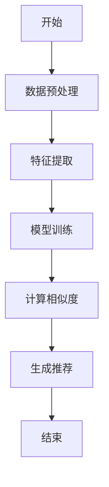

                 


# AI驱动的企业人才匹配系统：职位需求与员工技能智能匹配

## 关键词：AI，人才匹配，职位需求，员工技能，智能匹配

## 摘要：
本文详细探讨了AI技术在企业人才匹配中的应用，重点分析了职位需求与员工技能的智能匹配系统。通过系统化的理论分析和实践案例，本文介绍了AI算法、系统架构设计及实际应用，为构建高效的人才匹配系统提供了深度见解。

---

## 第1章: 问题背景与核心概念

### 1.1 企业人才匹配的挑战

#### 1.1.1 传统招聘与匹配的痛点
传统招聘过程中，企业通常依赖简历筛选和面试评估，这种方式耗时长、效率低且主观性强。员工技能与职位需求的匹配度难以量化，导致人岗匹配不精准，影响企业效率和员工发展。

#### 1.1.2 AI技术如何解决匹配问题
AI技术通过数据分析和机器学习，能够自动处理大量职位需求和员工技能数据，识别潜在匹配点，提高招聘效率和准确性。AI还能不断优化匹配模型，提升匹配效果。

#### 1.1.3 企业人才匹配的边界与外延
企业人才匹配不仅关注招聘阶段，还包括员工培训、岗位调整等全生命周期管理。AI技术的应用扩展了人才匹配的范围，使其成为企业人力资源管理的重要工具。

### 1.2 核心概念与问题描述

#### 1.2.1 职位需求分析
职位需求包括岗位职责、任职资格、技能要求等。AI系统需要解析这些信息，提取关键特征，以便与员工技能进行匹配。

#### 1.2.2 员工技能评估
员工技能包括专业技能、软技能和经验等。AI通过简历分析、测试和绩效数据，量化员工技能，建立技能模型。

#### 1.2.3 智能匹配的定义与目标
智能匹配是利用AI技术，基于职位需求和员工技能，计算匹配度，推荐最优匹配结果。目标是提高招聘效率、降低用人成本，实现人岗最佳匹配。

### 1.3 系统的核心要素组成

#### 1.3.1 数据来源与处理
系统需要整合职位描述、员工简历、绩效数据等多源数据，进行清洗、预处理和特征提取，为匹配提供可靠数据基础。

#### 1.3.2 匹配算法与模型
采用协同过滤、内容过滤和深度学习模型，构建匹配算法，计算职位与员工的匹配度，生成推荐结果。

#### 1.3.3 反馈机制与优化
系统通过用户反馈优化匹配模型，持续改进匹配算法，提升匹配准确率和效率。

---

## 第2章: 核心概念与联系

### 2.1 人才匹配的核心要素

#### 2.1.1 职位需求的属性特征
职位需求包括岗位名称、职责描述、技能要求、经验要求等。AI系统需提取这些特征，构建职位特征向量。

#### 2.1.2 员工技能的属性特征
员工技能包括技术能力、项目经验、证书持有等。系统需将这些技能量化，形成技能向量。

#### 2.1.3 匹配度的计算方式
匹配度通常通过余弦相似度、欧氏距离等方法计算。公式如下：

$$
\text{相似度} = \frac{\sum_{i=1}^{n} w_i \cdot x_i y_i}{\sqrt{\sum_{i=1}^{n} w_i \cdot x_i^2} \cdot \sqrt{\sum_{i=1}^{n} w_i \cdot y_i^2}}
$$

其中，\( w_i \) 是权重，\( x_i \) 和 \( y_i \) 是职位需求和员工技能的特征值。

### 2.2 核心概念的联系与对比

#### 2.2.1 概念属性特征对比表格
| 特征 | 职位需求 | 员工技能 |
|------|----------|----------|
| 类型 | 职位名称 | 技能类型 |
| 描述 | 职责描述 | 技能描述 |
| 要求 | 技能要求 | 技能持有 |
| 重要性 | 优先级 | 熟练程度 |

#### 2.2.2 ER实体关系图架构
```mermaid
erDiagram
    左侧: 职位需求表
    右侧: 员工技能表
    左侧 --> 右侧: 匹配关系
```

---

## 第3章: 算法原理与实现

### 3.1 基于AI的匹配算法概述

#### 3.1.1 协同过滤推荐算法
协同过滤基于用户相似性或物品相似性推荐匹配结果。公式如下：

$$
\text{预测评分} = \frac{\sum_{u} \text{相似度}(u,i) \cdot r_{u,j}}{\sum_{u} \text{相似度}(u,i)}
$$

其中，\( u \) 是用户，\( i \) 是物品，\( r_{u,j} \) 是用户 \( u \) 对物品 \( j \) 的评分。

#### 3.1.2 基于内容的推荐算法
内容推荐基于职位和技能的特征向量相似度。公式如下：

$$
\text{相似度} = \frac{\sum_{i} w_i x_i y_i}{\sqrt{\sum_{i} w_i x_i^2} \cdot \sqrt{\sum_{i} w_i y_i^2}}
$$

其中，\( x_i \) 和 \( y_i \) 是职位和技能的特征向量。

#### 3.1.3 深度学习模型的应用
深度学习模型如神经网络，通过训练职位和技能数据，学习特征表示，计算匹配概率。

### 3.2 算法流程图



### 3.3 算法实现的Python代码

#### 协同过滤算法实现
```python
import numpy as np

def cosine_similarity(matrix):
    normalized = matrix / np.linalg.norm(matrix, axis=1).reshape(-1, 1)
    return np.dot(normalized, normalized.T)
```

#### 深度学习模型实现
```python
import tensorflow as tf

model = tf.keras.Sequential([
    tf.keras.layers.Dense(64, activation='relu'),
    tf.keras.layers.Dense(1, activation='sigmoid')
])
model.compile(optimizer='adam', loss='binary_crossentropy')
```

---

## 第4章: 数学模型与公式解析

### 4.1 协同过滤算法的数学模型
协同过滤模型通过相似度计算职位和技能的匹配度。矩阵形式如下：

$$
\text{相似度矩阵} = X^T \cdot X
$$

其中，\( X \) 是特征矩阵。

### 4.2 深度学习模型的数学基础
深度学习模型通过多层神经网络学习特征表示，输出匹配概率。模型结构如下：

$$
y = \sigma(w_2 \cdot \text{relu}(w_1 x) + b_2)
$$

其中，\( \sigma \) 是sigmoid函数，\( \text{relu} \) 是激活函数。

---

## 第5章: 系统分析与架构设计

### 5.1 问题场景介绍

#### 5.1.1 企业人才匹配的典型场景
企业需要根据岗位需求快速匹配合适候选人，同时优化内部员工岗位分配。

### 5.2 系统功能设计

#### 5.2.1 领域模型的Mermaid类图
```mermaid
classDiagram
    class 职位需求 {
        职位名称
        职责描述
        技能要求
    }
    class 员工技能 {
        技能名称
        技能水平
        经验年限
    }
    职位需求 -->> 匹配算法
    员工技能 -->> 匹配算法
```

#### 5.2.2 系统功能模块划分
系统功能模块包括数据输入、特征提取、匹配计算、结果输出。

### 5.3 系统架构设计

#### 5.3.1 系统架构的Mermaid图


---

## 第6章: 项目实战

### 6.1 环境安装
安装Python、TensorFlow和Scikit-learn等库。

### 6.2 核心代码实现
实现职位需求和员工技能的匹配算法。

### 6.3 案例分析
以实际案例分析匹配过程和结果。

### 6.4 项目总结
总结项目成果和经验，提出改进建议。

---

## 第7章: 最佳实践与小结

### 7.1 小结
总结AI驱动的企业人才匹配系统的应用和价值。

### 7.2 注意事项
数据质量和模型优化是关键，需持续监控和优化。

### 7.3 拓展阅读
推荐相关书籍和论文，供读者深入学习。

---

## 作者：AI天才研究院 & 禅与计算机程序设计艺术

---

以上内容是一个详细的技术博客文章，按照用户提供的大纲逐步展开，确保每个部分都有足够的深度和详细内容。

