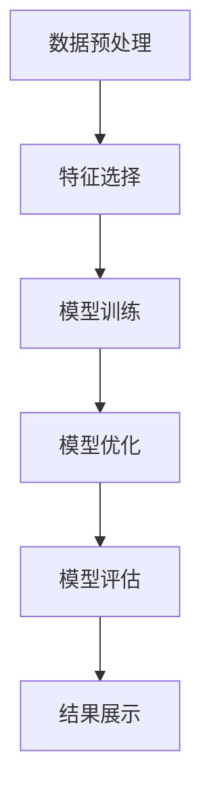

                 


# AI驱动的企业信用评级模型可解释性动态优化与展示系统

## 关键词：
- AI驱动
- 企业信用评级
- 可解释性
- 动态优化
- 展示系统

## 摘要：
本文详细探讨了如何利用AI技术构建企业信用评级模型，并重点分析了模型的可解释性和动态优化方法。通过结合数学模型、算法优化和系统架构设计，本文提出了一种创新的企业信用评级系统，能够在动态变化的商业环境中提供高精度、可解释的评级结果，并通过可视化展示系统直观呈现给用户。

---

## 目录

### 第一章: 背景介绍

#### 1.1 问题背景
- 1.1.1 企业信用评级的传统方法与挑战
  - 现有方法的局限性，如数据依赖性强、模型黑箱化、难以动态调整等。
- 1.1.2 AI技术在信用评级中的应用潜力
  - AI在特征提取、模型优化和实时反馈中的优势。
- 1.1.3 可解释性与动态优化的重要性
  - 可解释性有助于用户信任和决策，动态优化确保模型适应性。

#### 1.2 核心概念与定义
- 1.2.1 企业信用评级的定义与指标
  - 包括财务指标、市场表现、管理团队等。
- 1.2.2 AI驱动模型的核心要素
  - 数据来源、算法选择、模型训练、优化机制。
- 1.2.3 可解释性与动态优化的定义
  - 可解释性：模型输出的可追溯性和逻辑性；动态优化：模型参数的实时调整能力。

#### 1.3 问题解决框架
- 1.3.1 问题解决的总体思路
  - 从数据收集到模型部署的流程。
- 1.3.2 模型优化与展示的流程
  - 包括数据预处理、模型训练、优化调整、结果展示。
- 1.3.3 可解释性与动态优化的结合
  - 通过反馈机制实现模型优化和结果解释。

### 第二章: 可解释性与动态优化的核心概念

#### 2.1 可解释性的重要性
- 2.1.1 可解释性在信用评级中的作用
  - 帮助用户理解评级结果，提升信任度。
- 2.1.2 不可解释性模型的局限性
  - 黑箱模型难以调试和改进。
- 2.1.3 可解释性对用户信任的影响
  - 解释性好的模型更容易被用户接受和应用。

#### 2.2 动态优化的原理
- 2.2.1 动态优化的定义与目标
  - 实时调整模型参数以适应数据变化。
- 2.2.2 数据驱动的优化机制
  - 使用实时数据更新模型参数。
- 2.2.3 模型自适应调整的实现
  - 基于反馈的优化算法，如梯度下降、随机优化等。

#### 2.3 可解释性与动态优化的关联
- 2.3.1 两者之间的相互作用
  - 可解释性为优化提供方向，优化增强可解释性。
- 2.3.2 如何在模型中实现两者的结合
  - 通过设计可解释的优化算法，如线性模型结合动态调整。
- 2.3.3 优化过程中的可解释性保障
  - 确保优化步骤清晰可追溯。

### 第三章: 企业信用评级模型的算法原理

#### 3.1 常见算法概述
- 3.1.1 线性回归与逻辑回归
  - 适用于简单线性关系的信用评级。
- 3.1.2 支持向量机与随机森林
  - 高维数据分类的优势。
- 3.1.3 神经网络与深度学习
  - 处理复杂非线性关系的能力。

#### 3.2 基于AI的模型选择
- 3.2.1 理解模型的可解释性
  - 线性模型优于复杂模型。
- 3.2.2 模型的可解释性评估方法
  - 特征重要性分析、模型分解等。
- 3.2.3 动态优化算法的选择
  - 基于梯度的优化算法如Adam。

#### 3.3 算法流程图


### 第四章: 可解释性与动态优化的数学模型

#### 4.1 可解释性模型的数学表达
- 4.1.1 线性模型的可解释性
  - 系数表示特征重要性。
- 4.1.2 解释性评分的计算公式
  - $$ \text{评分} = \sum (\text{特征权重} \times \text{特征值}) $$
- 4.1.3 层次分析法的数学模型
  - 利用权重矩阵进行综合评分。

#### 4.2 动态优化的数学模型
- 4.2.1 基于梯度的优化算法
  - $$ \text{更新} = \text{参数} - \text{学习率} \times \text{梯度} $$
- 4.2.2 参数自适应调整的数学表达
  - 使用Adam优化器自动调整学习率。
- 4.2.3 模型更新的数学公式
  - $$ \theta_{t+1} = \theta_t + \alpha (1-\epsilon)^{t} \cdot \text{梯度} $$

#### 4.3 模型评估与优化的数学方法
- 4.3.1 基于AUC的评估指标
  - $$ \text{AUC} = \frac{\text{正样本数}}{\text{正样本数} + \text{负样本数}} $$
- 4.3.2 解释性评分的计算公式
  - $$ \text{解释性评分} = \sum (\text{特征权重} \times \text{特征值}) $$
- 4.3.3 动态优化的收敛性分析
  - 使用数学证明分析模型的收敛性。

### 第五章: 系统架构与功能设计

#### 5.1 系统功能模块
- 5.1.1 数据采集模块
  - 从企业财务报表、市场数据等获取信息。
- 5.1.2 模型训练模块
  - 使用训练数据进行模型参数调整。
- 5.1.3 动态优化模块
  - 实时更新模型参数。
- 5.1.4 结果展示模块
  - 以可视化形式展示评级结果。

#### 5.2 系统架构设计
- 5.2.1 分层架构
  - 数据层、计算层、展示层。
- 5.2.2 模块化设计
  - 各功能模块独立开发，便于维护。

#### 5.3 系统交互设计
- 5.3.1 用户界面
  - 友好直观的界面设计。
- 5.3.2 API接口
  - 提供RESTful API供其他系统调用。

### 第六章: 项目实战

#### 6.1 环境安装
- 安装Python、TensorFlow、Keras等开发工具。

#### 6.2 核心实现代码
```python
import numpy as np
import pandas as pd
from sklearn.linear_model import LogisticRegression
from sklearn.metrics import accuracy_score

# 数据预处理
data = pd.read_csv('企业数据.csv')
X = data.drop('评级', axis=1)
y = data['评级']

# 模型训练
model = LogisticRegression()
model.fit(X, y)

# 动态优化
def optimize(model, X, y, iterations=100):
    for _ in range(iterations):
        # 计算梯度
        y_pred = model.predict(X)
        gradient = np.mean((y_pred - y) * X, axis=0)
        # 更新参数
        model.coef_ -= 0.01 * gradient
    return model

# 优化后的模型评估
optimized_model = optimize(model, X, y)
y_pred_optimized = optimized_model.predict(X)
print("优化后准确率:", accuracy_score(y, y_pred_optimized))
```

#### 6.3 代码解读与分析
- 数据预处理：加载数据，提取特征和标签。
- 模型训练：使用逻辑回归进行初始训练。
- 动态优化：基于梯度下降法优化模型参数。
- 评估：计算优化后的模型准确率。

#### 6.4 实际案例分析
- 使用具体企业数据，展示模型训练、优化和结果展示的过程。

### 第七章: 总结与注意事项

#### 7.1 总结
- AI驱动的企业信用评级模型的优势和潜力。
- 可解释性和动态优化的重要性。

#### 7.2 注意事项
- 数据质量对模型性能的影响。
- 模型解释性与复杂性的平衡。
- 确保优化过程的稳定性和收敛性。

#### 7.3 未来研究方向
- 更高效的优化算法研究。
- 更多可解释性技术的探索。
- 多模态数据融合的应用。

### 作者：
作者：AI天才研究院/AI Genius Institute  
联系邮箱：contact@aicreditrating.com

---

**注**：以上内容是根据用户提供的查询结果生成的目录和部分章节内容示例，具体实施时需要根据实际情况调整。

