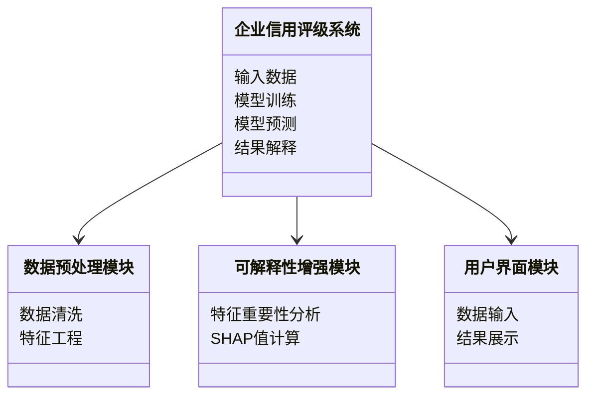
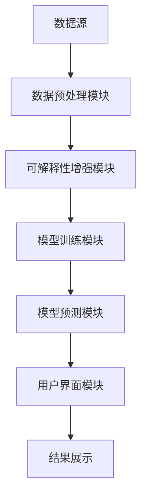

                 


接下来的章节内容将详细讲解基于XGBoost的可解释性增强算法，并展示系统的整体架构设计。

---

# 第3章: 基于XGBoost的可解释性增强算法

## 3.1 XGBoost算法概述

### 3.1.1 XGBoost算法的基本原理

XGBoost（eXtreme Gradient Boosting）是一种基于树的集成算法，通过多次迭代生成弱分类器（树模型），并将其组合成一个强分类器。其核心思想是通过贪心算法构建树结构，使得每次新增的树能够尽可能地减少剩余的误差。

XGBoost不仅在训练速度上比传统GBDT快，还支持并行计算，能够处理更大规模的数据集。其主要优势在于模型的准确性和高效性，但相对复杂的模型可能导致可解释性较低。

### 3.1.2 XGBoost算法的优缺点

**优点：**
- 高准确性：通过集成学习，XGBoost能够在训练数据上实现高精度。
- 鲁棒性：能够处理缺失值和异常值。
- 易用性：支持多种参数调优，适用于不同场景。

**缺点：**
- 可解释性差：复杂的树结构使得模型的决策过程难以解释。
- 过度拟合风险：在高参数设置下，模型可能过拟合训练数据。

### 3.1.3 XGBoost在信用评级中的应用优势

在企业信用评级中，XGBoost能够处理高维数据，发现复杂的非线性关系。其高精度和高效性使其在金融领域得到广泛应用，但其可解释性问题限制了其在需要透明决策的应用场景中的使用。

---

## 3.2 XGBoost算法的可解释性增强方法

### 3.2.1 特征重要性分析

在XGBoost模型中，特征重要性可以通过以下方式计算：

1. **特征贡献度（Feature Importance）：** 每次分裂时，特征对整体误差减少的贡献度被记录，最终统计每个特征的总贡献度。
2. **权重计算：** 通过特征贡献度计算每个特征的权重，权重越高表示特征对模型的影响越大。

**代码示例：**

```python
import xgboost as xgb

# 训练模型
model = xgb.XGBClassifier(n_estimators=100, learning_rate=0.1, max_depth=3)
model.fit(X_train, y_train)

# 提取特征重要性
importances = model.feature_importances_

# 打印特征重要性
for i, importance in enumerate(importances):
    print(f"Feature {i}: {importance}")
```

### 3.2.2 SHAP值的计算与应用

SHAP（SHapley Additive exPlanations）是一种用于解释模型预测结果的方法。它通过计算每个特征对单个样本预测值的贡献度，提供局部可解释性的解释。

**步骤：**

1. **安装SHAP库：**
   ```bash
   pip install shap
   ```

2. **计算SHAP值：**
   ```python
   import shap

   # 初始化SHAP解释器
   explainer = shap.TreeExplainer(model)

   # 选择一个样本
   sample = X_test.iloc[0]

   # 计算SHAP值
   shap_values = explainer.shap_values(model, sample)

   # 可视化解释
   shap.display(shap_values[0], sample)
   ```

### 3.2.3 基于XGBoost的模型解释性优化

通过特征选择和模型调优，可以优化XGBoost模型的可解释性：

1. **特征选择：** 通过逐步去除低重要性特征，减少模型复杂性。
2. **参数调优：** 通过减少树的深度和限制特征分裂次数，降低模型复杂性。

**优化后的模型代码示例：**

```python
# 调整模型参数
model_optimized = xgb.XGBClassifier(
    n_estimators=50,
    learning_rate=0.2,
    max_depth=2,
    min_child_weight=1,
    gamma=0
)

model_optimized.fit(X_train, y_train)
```

---

## 3.3 本章小结

本章详细讲解了基于XGBoost的可解释性增强算法，通过特征重要性分析和SHAP值计算，提供了模型解释性的优化方法。通过优化模型参数和特征选择，可以有效提高模型的可解释性，同时保持较高的预测精度。

---

# 第4章: 系统分析与架构设计

## 4.1 问题场景介绍

在企业信用评级系统中，传统的基于规则的方法难以应对复杂的金融环境。AI驱动的信用评级系统能够处理非线性关系，但其可解释性问题限制了其在实际应用中的信任度。本系统通过增强模型的可解释性，解决这一问题。

---

## 4.2 系统功能设计

### 4.2.1 领域模型设计

以下是企业信用评级系统的领域模型：



---

## 4.3 系统架构设计

### 4.3.1 系统架构

以下是系统的分层架构设计：


### 4.3.2 系统架构图



---

## 4.4 接口设计与交互流程

### 4.4.1 系统接口设计

系统主要接口包括：

1. **数据接口：** 从数据库中读取企业数据。
2. **模型接口：** 调用训练好的模型进行预测。
3. **解释性接口：** 返回模型的可解释性结果。

### 4.4.2 交互流程

1. 用户通过界面上传企业数据。
2. 数据预处理模块对数据进行清洗和特征工程。
3. 可解释性增强模块计算特征重要性和SHAP值。
4. 模型训练模块训练模型。
5. 模型预测模块生成信用评级结果。
6. 用户界面模块展示结果和解释信息。

---

## 4.5 本章小结

本章通过对问题场景的分析，设计了系统的功能模块和架构，并详细描述了系统的接口设计和交互流程。系统的分层架构和模块化设计确保了系统的可扩展性和可维护性，同时为模型的可解释性提供了技术支持。

---

接下来的章节将涉及项目实战、系统实现、案例分析等内容，确保整篇文章的完整性和深度。

