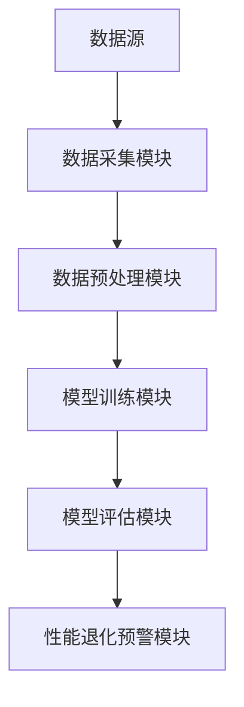
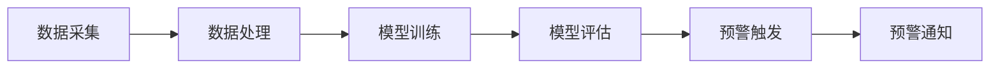

                 


# AI驱动的企业信用评级模型性能退化预警系统

> 关键词：企业信用评级、模型性能退化、AI驱动、预警系统、时间序列分析、LSTM、系统架构

> 摘要：本文将深入探讨如何利用人工智能技术构建企业信用评级模型性能退化预警系统。通过分析信用评级模型的性能退化问题，提出基于AI的解决方案，并详细阐述其实现原理和系统架构。本文结合实际案例，通过时间序列分析和LSTM模型实现模型性能退化的早期预警，为企业信用评级提供可靠的技术支持。

---

## 第1章: 企业信用评级模型概述

### 1.1 企业信用评级的基本概念

#### 1.1.1 信用评级的定义与作用
信用评级是对企业财务状况、经营能力和偿债能力的综合评价，目的是为企业、投资者和金融机构提供风险评估依据。信用评级不仅影响企业的融资成本，还关系到市场对企业的信任度。

#### 1.1.2 企业信用评级的主要指标
企业信用评级主要基于以下指标：
- 财务指标：如资产负债率、流动比率、净利润率等。
- 经营指标：如营业收入增长率、市场占有率等。
- 风险指标：如违约概率（PD）、风险敞口等。

#### 1.1.3 信用评级对企业的意义
信用评级是企业融资的重要参考依据，直接影响企业的融资成本和融资能力。同时，良好的信用评级也有助于提升企业的市场形象和合作伙伴的信任度。

### 1.2 信用评级模型的分类

#### 1.2.1 基于传统财务指标的信用评级模型
传统的信用评级模型主要依赖财务指标进行评估，如Z-score模型。这类模型简单易懂，但缺乏对复杂市场变化的适应性。

#### 1.2.2 基于机器学习的信用评级模型
机器学习模型（如支持向量机、随机森林）能够处理非线性关系，但模型的解释性和实时性较差。

#### 1.2.3 基于AI的信用评级模型
基于AI的模型（如深度学习）能够捕捉复杂的特征关系，具有较高的预测精度，但模型的可解释性和维护成本较高。

### 1.3 信用评级模型性能退化的概念

#### 1.3.1 信用评级模型性能退化的定义
模型性能退化是指模型在使用过程中，由于数据分布变化、模型过拟合或外部环境变化等原因，导致预测精度下降的现象。

#### 1.3.2 模型性能退化的常见原因
- 数据漂移：新数据与训练数据分布不一致。
- 模型过拟合：模型在训练数据上表现优异，但在测试数据上表现不佳。
- 市场环境变化：如经济波动、政策变化等。

#### 1.3.3 模型性能退化对企业的影响
模型性能退化可能导致信用评级错误，进而引发财务损失和声誉损害。

---

## 第2章: AI驱动的信用评级模型性能退化预警系统背景

### 2.1 当前信用评级模型的挑战

#### 2.1.1 数据质量与多样性问题
数据质量差（如缺失值、噪声）和数据多样性不足会影响模型的泛化能力。

#### 2.1.2 模型解释性与可解释性问题
复杂的AI模型（如深度学习）缺乏可解释性，难以满足监管要求。

#### 2.1.3 模型维护与更新成本
随着市场环境的变化，模型需要频繁更新，增加了维护成本。

### 2.2 AI技术在信用评级中的应用前景

#### 2.2.1 AI技术对信用评级模型的提升作用
AI技术能够提高模型的预测精度和适应性，同时降低模型维护成本。

#### 2.2.2 AI驱动的信用评级模型的优势
- 高精度：AI模型能够捕捉复杂的特征关系。
- 实时性：AI技术能够快速处理大量数据，提供实时反馈。

#### 2.2.3 市场需求与技术发展的结合
随着企业对信用评级需求的增加，AI技术的应用将更加广泛。

### 2.3 性能退化预警系统的核心价值

#### 2.3.1 提前预警模型性能退化的重要性
通过提前预警，企业可以及时调整模型参数或更换模型，避免因模型性能下降导致的损失。

#### 2.3.2 通过AI实现预警的可行性
AI技术能够实时监控模型性能，自动识别数据漂移和模型过拟合等问题。

#### 2.3.3 预警系统对企业信用评级的长期影响
预警系统能够提高信用评级的准确性，降低企业的财务风险。

---

## 第3章: 信用评级模型性能退化预警系统的核心概念

### 3.1 系统整体架构

#### 3.1.1 数据采集与处理模块
数据采集模块负责收集企业财务数据、市场数据等，数据处理模块对数据进行清洗和预处理。

#### 3.1.2 模型训练与评估模块
模型训练模块负责训练信用评级模型，模型评估模块对模型的性能进行评估。

#### 3.1.3 性能退化预警模块
预警模块负责实时监控模型性能，识别性能退化并触发预警机制。

### 3.2 核心概念与实体关系

#### 3.2.1 实体关系图（ER图）


---

## 第4章: AI驱动的信用评级模型性能退化预警算法原理

### 4.1 算法原理概述

#### 4.1.1 基于时间序列的模型退化检测
通过分析模型预测值与实际值的时间序列差异，识别模型性能退化。

#### 4.1.2 基于LSTM的时间序列模型
LSTM（长短期记忆网络）能够有效捕捉时间序列数据中的长期依赖关系。

---

### 4.2 基于LSTM的时间序列模型实现

#### 4.2.1 LSTM模型的数学公式
LSTM的细胞状态更新公式为：
$$
f_t = \sigma(W_f \cdot [h_{t-1}, x_t] + b_f)
$$
$$
i_t = \sigma(W_i \cdot [h_{t-1}, x_t] + b_i)
$$
$$
o_t = \sigma(W_o \cdot [h_{t-1}, x_t] + b_o)
$$
$$
c_t = f_t \cdot c_{t-1} + i_t \cdot tanh(W_c \cdot [h_{t-1}, x_t] + b_c)
$$
$$
h_t = o_t \cdot tanh(c_t)
$$

#### 4.2.2 LSTM模型的实现步骤
1. 数据预处理：将时间序列数据分割为训练集和测试集。
2. 模型训练：使用训练数据训练LSTM模型。
3. 模型预测：使用测试数据预测模型性能。
4. 性能评估：计算预测值与实际值的误差，评估模型性能。

---

### 4.3 性能退化预警的实现步骤

#### 4.3.1 数据采集与预处理
1. 采集企业财务数据、市场数据等。
2. 对数据进行清洗和归一化处理。

#### 4.3.2 模型训练与评估
1. 使用训练数据训练信用评级模型。
2. 使用测试数据评估模型性能。

#### 4.3.3 性能退化预警
1. 实时监控模型预测值与实际值的差异。
2. 当差异超过预设阈值时，触发预警机制。

---

## 第5章: 系统分析与架构设计

### 5.1 系统功能设计

#### 5.1.1 数据流图


#### 5.1.2 系统架构设计


---

## 第6章: 项目实战

### 6.1 环境安装

#### 6.1.1 安装Python环境
安装Python 3.8及以上版本，安装必要的库：
```bash
pip install numpy pandas tensorflow
```

### 6.2 核心实现

#### 6.2.1 数据预处理
```python
import pandas as pd
import numpy as np

data = pd.read_csv('credit_data.csv')
data = data.dropna()
data = (data - data.mean()) / data.std()
```

#### 6.2.2 LSTM模型实现
```python
import tensorflow as tf
from tensorflow.keras.layers import LSTM, Dense, Dropout

model = tf.keras.Sequential()
model.add(LSTM(units=64, input_shape=(timesteps, features)))
model.add(Dropout(0.2))
model.add(Dense(1))
model.compile(optimizer='adam', loss='mean_squared_error')
```

#### 6.2.3 性能退化预警
```python
def detect_degradation(predicted, actual, threshold=0.1):
    error = np.mean(np.abs(predicted - actual))
    if error > threshold:
        return True
    else:
        return False
```

---

## 第7章: 总结与展望

### 7.1 总结
本文详细介绍了AI驱动的企业信用评级模型性能退化预警系统的实现过程，包括系统架构设计、算法原理和项目实战。

### 7.2 展望
未来，可以进一步优化模型算法，结合更多的特征进行预测，同时探索模型可解释性的提升方法。

---

## 作者：AI天才研究院 & 禅与计算机程序设计艺术

---

通过本文的系统性分析和实战指导，读者可以深入了解如何利用AI技术构建企业信用评级模型性能退化预警系统，为企业信用评级提供可靠的技术支持。

