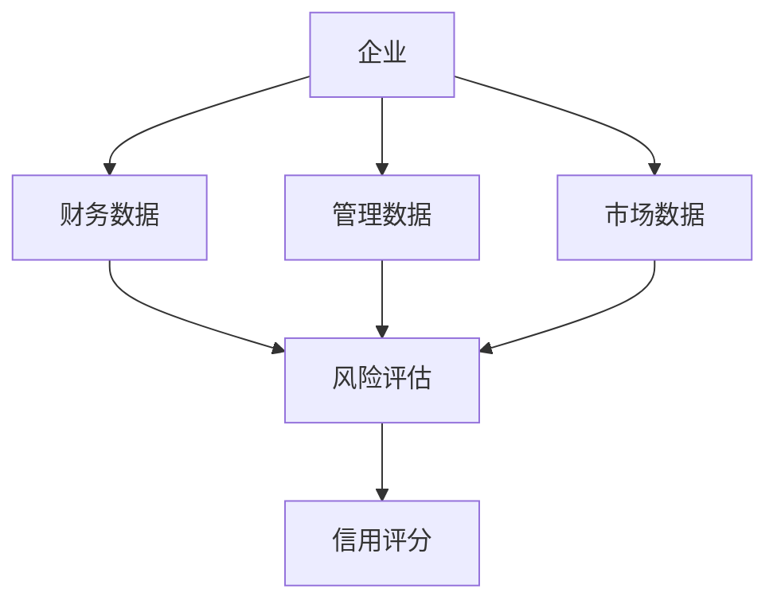
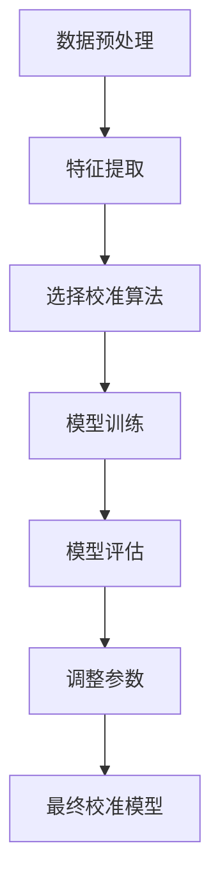
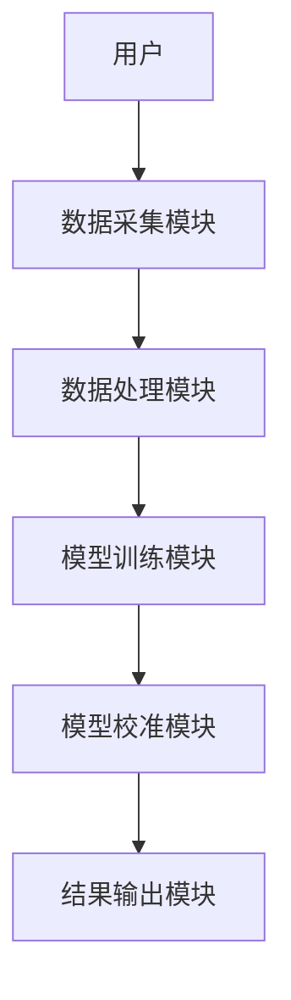

                 


# AI驱动的企业信用评级模型校准系统

> 关键词：AI驱动，企业信用评级，模型校准，机器学习，深度学习，信用评分，系统设计

> 摘要：本文深入探讨了如何利用人工智能技术构建企业信用评级模型校准系统。通过分析企业信用评级的核心概念、AI驱动模型的优势、模型校准的算法原理、系统设计与实现，以及实际案例分析，本文为读者提供了从理论到实践的全面指导。通过系统化的分析和设计，本文展示了如何利用AI技术提高信用评级的准确性和效率。

---

# 第一部分: AI驱动的企业信用评级模型校准系统概述

## 第1章: 企业信用评级与AI驱动模型概述

### 1.1 企业信用评级的基本概念
#### 1.1.1 企业信用评级的定义与作用
企业信用评级是通过对企业的财务状况、经营能力和市场表现等多维度数据进行分析，评估其在特定条件下的信用风险等级。信用评级结果直接影响企业的融资成本和市场信誉，是企业风险管理的重要工具。

#### 1.1.2 传统信用评级方法的局限性
传统信用评级方法依赖于经验丰富的专家进行主观判断，存在以下问题：
- 数据维度有限，难以覆盖企业的全貌。
- 人工判断主观性强，存在人为误差。
- 无法实时更新，难以适应市场变化。

#### 1.1.3 AI技术在信用评级中的应用前景
AI技术通过大数据分析和机器学习算法，能够从海量数据中提取特征，并建立高精度的预测模型。AI技术的应用可以显著提高信用评级的准确性和效率，降低人为误差。

### 1.2 AI驱动模型的核心优势
#### 1.2.1 数据驱动的精准性
AI模型能够处理结构化和非结构化数据，从多个维度对企业进行综合评估，提高评级的准确性。

#### 1.2.2 自动化特征提取能力
AI技术可以自动提取数据中的特征，并通过特征工程优化模型性能。

#### 1.2.3 模型的动态校准能力
AI模型能够实时更新，根据市场变化和企业动态调整评级结果，提高模型的适应性。

### 1.3 企业信用评级模型校准系统的必要性
#### 1.3.1 模型偏差的来源与影响
模型偏差可能来源于数据偏差、算法选择不当或模型过拟合等问题，导致评级结果不准确。

#### 1.3.2 校准系统的目标与意义
校准系统的目的是消除模型偏差，提高评级结果的准确性和可靠性。

#### 1.3.3 系统的边界与外延
校准系统不仅需要关注模型本身的优化，还需要考虑数据来源、模型部署环境和用户需求等因素。

### 1.4 本章小结
本章介绍了企业信用评级的基本概念、传统方法的局限性以及AI技术在信用评级中的应用前景。同时，强调了AI驱动模型的核心优势和校准系统的必要性。

---

# 第二部分: 企业信用评级模型校准的核心概念与联系

## 第2章: 核心概念与原理

### 2.1 信用评级模型的基本原理
#### 2.1.1 信用评分卡模型
信用评分卡模型是基于统计学的评分系统，通过对企业历史数据的分析，建立评分卡规则，评估企业的信用风险。

#### 2.1.2 机器学习模型
机器学习模型（如随机森林、支持向量机）通过学习企业的特征数据，预测企业的信用评级。

#### 2.1.3 深度学习模型
深度学习模型（如LSTM、Transformer）能够处理复杂的数据模式，适用于非结构化数据的分析。

### 2.2 模型校准的数学基础
#### 2.2.1 概率论基础
概率论是模型校准的基础，用于评估模型预测结果的概率分布。

#### 2.2.2 统计学基础
统计学方法（如回归分析）用于模型的参数估计和假设检验。

#### 2.2.3 优化理论基础
优化理论用于模型的参数调整和校准过程中的优化问题求解。

### 2.3 核心概念的ER实体关系图



---

## 第3章: 校准算法原理

### 3.1 传统校准方法
#### 3.1.1 概率校准
概率校准通过调整模型输出的概率分布，使实际概率与预测概率一致。

#### 3.1.2 回归校准
回归校准通过回归分析调整模型的预测值，使其更接近真实值。

#### 3.1.3 阈值移动校准
阈值移动校准通过调整分类阈值，优化模型的分类性能。

### 3.2 基于机器学习的校准方法
#### 3.2.1 XGBoost校准
XGBoost是一种强大的集成学习算法，能够有效处理复杂的特征关系。

#### 3.2.2 神经网络校准
神经网络校准通过深度学习模型，自动提取数据特征并进行校准。

#### 3.2.3 调度学习校准
调度学习校准通过任务调度优化模型性能，适用于多任务场景。

### 3.3 基于深度学习的校准方法
#### 3.3.1 LSTM校准
LSTM校准通过长短期记忆网络，捕捉数据的时间依赖性，适用于时间序列数据。

#### 3.3.2 Transformer校准
Transformer校准通过自注意力机制，捕捉数据的全局关系，适用于复杂的数据模式。

#### 3.3.3 图神经网络校准
图神经网络校准通过图结构数据建模，适用于企业间的关系网络分析。

### 3.4 算法流程图



---

## 第4章: 模型校准的数学模型

### 4.1 概率校准的数学模型
$$ P(y|x) = \frac{P(y|x, \theta)}{\sum_{\theta'} P(y|x, \theta')} $$

### 4.2 回归校准的数学模型
$$ y = \beta_0 + \beta_1 x_1 + \beta_2 x_2 + \epsilon $$

### 4.3 阈值移动校准的数学模型
$$ \text{调整后的概率} = \text{原始概率} \times \text{调整因子} $$

---

# 第三部分: 系统设计与实现

## 第5章: 系统架构设计

### 5.1 系统功能设计
#### 5.1.1 数据采集模块
负责采集企业的财务、管理、市场等数据。

#### 5.1.2 数据处理模块
对采集的数据进行清洗、特征提取和数据转换。

#### 5.1.3 模型训练模块
利用机器学习或深度学习算法训练信用评级模型。

#### 5.1.4 模型校准模块
通过校准算法消除模型偏差，提高评级准确性。

#### 5.1.5 结果输出模块
输出校准后的信用评分和相关分析报告。

### 5.2 系统架构图



---

## 第6章: 系统实现与案例分析

### 6.1 环境配置
需要安装Python、机器学习库（如scikit-learn、XGBoost）和深度学习框架（如TensorFlow、PyTorch）。

### 6.2 核心代码实现
```python
import pandas as pd
from sklearn.ensemble import GradientBoostingClassifier
from sklearn.metrics import accuracy_score

# 数据加载
data = pd.read_csv('enterprise_data.csv')

# 特征与标签分离
X = data.drop('credit_rating', axis=1)
y = data['credit_rating']

# 模型训练
model = GradientBoostingClassifier()
model.fit(X, y)

# 模型预测
y_pred = model.predict(X)

# 模型评估
print(accuracy_score(y, y_pred))
```

### 6.3 案例分析
以某企业为例，分析其财务数据、管理数据和市场数据，利用校准后的模型进行信用评级，并对比传统方法的结果，验证模型的优越性。

### 6.4 项目总结
总结项目实施过程中的经验教训，提出改进建议。

---

## 第7章: 高级主题与扩展

### 7.1 模型优化
通过超参数调优和模型融合进一步提高评级准确性。

### 7.2 风险控制
结合企业风险敞口和市场风险，优化评级结果。

### 7.3 前沿技术
探索图神经网络、强化学习等前沿技术在信用评级中的应用。

### 7.4 未来发展方向
随着AI技术的不断进步，企业信用评级模型校准系统将更加智能化和自动化。

---

# 作者：AI天才研究院/AI Genius Institute & 禅与计算机程序设计艺术 /Zen And The Art of Computer Programming

