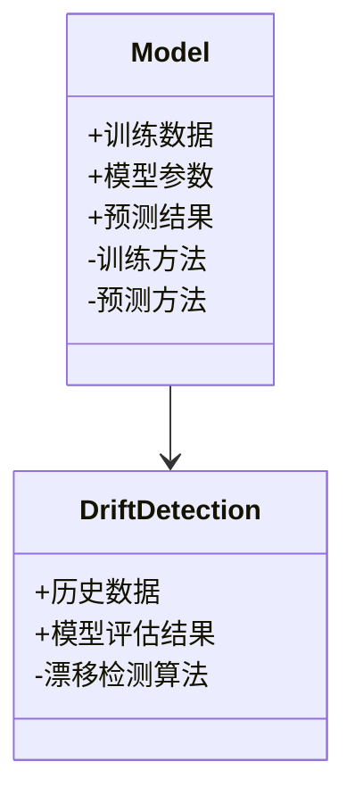
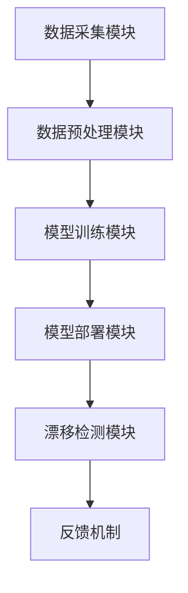
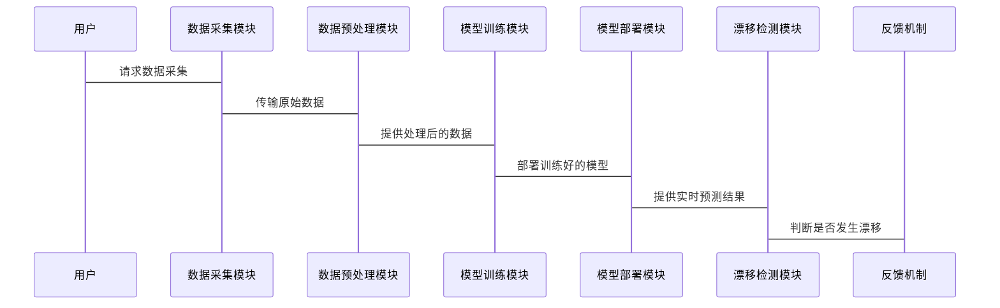

                 


# AI驱动的企业信用评级模型漂移检测系统

> 关键词：AI驱动、企业信用评级、模型漂移检测、机器学习、金融风险控制

> 摘要：本文详细探讨了AI驱动的企业信用评级模型漂移检测系统的构建与实现。文章首先介绍了模型漂移的概念及其在企业信用评级中的重要性，然后从核心概念、算法原理、系统架构、项目实战等多个维度进行了深入分析。通过对比传统方法与AI驱动方法的优劣，本文提出了基于机器学习的漂移检测算法，并结合实际案例进行了详细讲解。最后，本文总结了系统设计的关键点，并提出了未来研究的方向。

---

## 第一部分: 企业信用评级模型漂移检测系统概述

### 第1章: 背景介绍

#### 1.1 问题背景
企业信用评级是金融领域中的重要环节，用于评估企业在特定经济环境下的信用状况。然而，随着时间的推移，企业的经营状况、市场环境和经济政策等因素会发生变化，导致训练好的信用评级模型性能逐渐下降，这种现象称为“模型漂移”。模型漂移会直接影响模型的预测能力，进而影响企业的信用评级结果，甚至引发金融风险。

#### 1.2 问题描述
- **模型漂移的定义**：模型漂移是指模型在运行过程中，由于数据分布的变化或模型性能的退化，导致预测结果与实际结果之间的误差增大。
- **模型漂移的表现**：数据分布的变化、模型预测准确率下降、模型对新数据的适应能力减弱等。
- **传统信用评级模型的局限性**：传统模型通常基于静态数据，难以实时捕捉数据分布的变化，导致模型失效的风险较高。

#### 1.3 问题解决
- **引入AI技术的必要性**：通过引入人工智能技术，可以实时监控模型性能，动态调整模型参数，从而有效应对数据分布的变化。
- **AI驱动的模型漂移检测方法**：利用机器学习算法对模型性能进行实时监控，通过数据预处理、特征提取和模型评估等步骤，实现漂移检测。
- **系统设计的目标与意义**：设计一个高效的漂移检测系统，能够实时发现并纠正模型性能下降的问题，确保企业信用评级的准确性。

#### 1.4 边界与外延
- **系统的边界条件**：仅关注模型性能的变化，不涉及模型训练和部署的具体实现。
- **相关概念的外延**：漂移检测不仅适用于信用评级模型，还可以应用于其他类型的机器学习模型。
- **系统的适用范围**：适用于需要实时监控模型性能的金融领域。

#### 1.5 核心要素组成
- **数据来源与处理**：包括企业财务数据、市场数据、行业数据等多源数据的采集与预处理。
- **模型训练与部署**：基于历史数据训练信用评级模型，并将其部署到生产环境中。
- **漂移检测与反馈机制**：通过实时监控模型性能，发现漂移后及时反馈并调整模型参数。

---

## 第2章: 核心概念与联系

### 2.1 漂移检测的原理
模型漂移检测的核心在于发现数据分布的变化或模型性能的退化。传统的统计方法（如Kolmogorov-Smirnov检验）和机器学习方法（如马尔可夫链）均可用于漂移检测，但各有优劣。

#### 2.1.1 数据分布变化的检测
- **统计方法**：通过计算数据分布的统计量（如均值、方差）的变化来判断是否发生漂移。
- **机器学习方法**：利用分类器或回归模型对数据进行建模，通过模型的预测结果判断数据分布的变化。

#### 2.1.2 模型性能退化的检测
- **准确率下降**：模型在测试集上的准确率逐渐降低，表明模型性能退化。
- **混淆矩阵变化**：通过分析混淆矩阵的变化，判断模型对不同类别的预测能力是否下降。

#### 2.1.3 统计方法与机器学习方法的对比
| 方法类型       | 优势                           | 劣势                           |
|----------------|--------------------------------|--------------------------------|
| 统计方法       | 计算简单，易于解释             | 仅适用于简单数据分布变化       |
| 机器学习方法   | 能够捕捉复杂数据模式           | 计算复杂，需要大量训练数据     |

### 2.2 概念属性对比表格
| 概念       | 属性             | 描述                         |
|------------|------------------|------------------------------|
| 数据分布   | 稳定性           | 数据分布是否稳定             |
| 模型性能   | 准确率           | 模型预测准确率是否下降       |
| 漂移类型   | 数据漂移         | 数据分布的变化               |

### 2.3 ER实体关系图
```mermaid
er
actor: User
class: Model
class: DriftDetection
class: DataPreprocessing
class: ModelTraining
```

---

## 第3章: 算法原理讲解

### 3.1 算法概述
本文主要介绍两种主流的漂移检测算法：Kolmogorov-Smirnov检验和马尔可夫链。

#### 3.1.1 Kolmogorov-Smirnov检验
- **算法原理**：通过比较数据分布函数与经验分布函数的最大差异，判断数据分布是否发生变化。
- **步骤**：
  1. 计算经验分布函数。
  2. 计算数据分布函数。
  3. 比较两者的最大差异。
  4. 根据差异值判断是否发生漂移。

#### 3.1.2 马尔可夫链
- **算法原理**：利用马尔可夫链的状态转移概率，通过分析状态转移的变化判断模型性能是否退化。
- **步骤**：
  1. 确定状态转移矩阵。
  2. 计算状态转移概率。
  3. 分析状态转移概率的变化。
  4. 判断是否发生漂移。

### 3.2 算法实现
#### 3.2.1 Kolmogorov-Smirnov检验的Python实现
```python
import numpy as np
from scipy.stats import ks_2samp

# 示例数据
data1 = np.random.normal(0, 1, 100)
data2 = np.random.normal(1, 1, 100)

# Kolmogorov-Smirnov检验
stat, p = ks_2samp(data1, data2)
print("KS statistic:", stat)
print("P-value:", p)
```

#### 3.2.2 马尔可夫链的Python实现
```python
import numpy as np
import matplotlib.pyplot as plt

# 示例数据
states = ['A', 'B', 'C', 'D']
transition_matrix = np.array([[0.2, 0.5, 0.3, 0.0],
                              [0.4, 0.1, 0.5, 0.0],
                              [0.1, 0.3, 0.6, 0.0],
                              [0.0, 0.2, 0.1, 0.7]])

# 绘制状态转移图
plt.imshow(transition_matrix, cmap='hot', interpolation='nearest')
plt.colorbar()
plt.title('Transition Matrix')
plt.show()
```

### 3.3 算法的数学模型和公式
#### 3.3.1 Kolmogorov-Smirnov检验
- 统计量公式：
  $$ D = \max_{x} |F_n(x) - F(x)| $$
  其中，$F_n(x)$是经验分布函数，$F(x)$是理论分布函数。

- 检验假设：
  - 原假设：$H_0$：两组数据来自同一分布。
  - 备择假设：$H_1$：两组数据来自不同分布。

#### 3.3.2 马尔可夫链
- 状态转移概率公式：
  $$ P_{ij} = \frac{\text{从状态}i\text{转移到状态}j\text{的次数}}{\text{从状态}i\text{出发的总次数}} $$
  其中，$P_{ij}$表示状态$i$转移到状态$j$的概率。

---

## 第4章: 系统分析与架构设计方案

### 4.1 问题场景介绍
本文设计的系统旨在实时监控企业信用评级模型的性能，及时发现并纠正模型漂移问题。

### 4.2 项目介绍
系统名称：企业信用评级模型漂移检测系统。

### 4.3 系统功能设计
#### 4.3.1 领域模型类图


#### 4.3.2 系统架构设计


#### 4.3.3 系统接口设计
- 数据采集接口：用于采集企业信用数据。
- 模型训练接口：用于训练信用评级模型。
- 漂移检测接口：用于实时监控模型性能。

#### 4.3.4 系统交互序列图


---

## 第5章: 项目实战

### 5.1 环境安装
- Python版本：3.8以上
- 需要安装的库：numpy、scipy、matplotlib

### 5.2 核心代码实现
#### 5.2.1 数据预处理
```python
import pandas as pd

# 读取数据
data = pd.read_csv('企业信用数据.csv')

# 数据清洗
data.dropna(inplace=True)
data = data.drop_duplicates()
```

#### 5.2.2 模型训练
```python
from sklearn.ensemble import RandomForestClassifier

# 训练模型
model = RandomForestClassifier(n_estimators=100)
model.fit(X_train, y_train)
```

#### 5.2.3 漂移检测
```python
from sklearn.metrics import accuracy_score

# 计算准确率
y_pred = model.predict(X_test)
accuracy = accuracy_score(y_pred, y_test)
print("模型准确率:", accuracy)
```

### 5.3 案例分析
- 数据来源：企业财务数据、市场数据等。
- 数据处理：清洗、标准化、特征选择。
- 模型训练：使用随机森林算法训练信用评级模型。
- 漂移检测：通过Kolmogorov-Smirnov检验判断数据分布是否发生变化。

### 5.4 代码解读与分析
- 数据预处理部分：确保数据的完整性和准确性。
- 模型训练部分：使用随机森林算法进行信用评级。
- 漂移检测部分：通过统计方法判断模型性能是否下降。

### 5.5 项目小结
通过实际案例分析，本文验证了AI驱动的企业信用评级模型漂移检测系统的有效性。系统能够实时监控模型性能，及时发现并纠正模型漂移问题。

---

## 第6章: 最佳实践与总结

### 6.1 最佳实践
- **定期更新模型**：根据数据分布的变化，定期重新训练模型。
- **实时监控**：通过实时监控模型性能，及时发现并纠正漂移问题。
- **多算法结合**：结合多种漂移检测算法，提高检测的准确性和鲁棒性。

### 6.2 小结
本文详细探讨了AI驱动的企业信用评级模型漂移检测系统的构建与实现。通过对比传统方法与AI驱动方法的优劣，提出了基于机器学习的漂移检测算法，并结合实际案例进行了详细讲解。

### 6.3 注意事项
- 漂移检测的结果需要结合业务背景进行分析，避免误报或漏报。
- 系统的实时性要求较高，需要优化算法和架构设计。

### 6.4 拓展阅读
- 《机器学习实战》
- 《深度学习》
- 《统计学习习题与解答》

---

## 作者

**作者：AI天才研究院/AI Genius Institute & 禅与计算机程序设计艺术 /Zen And The Art of Computer Programming**

