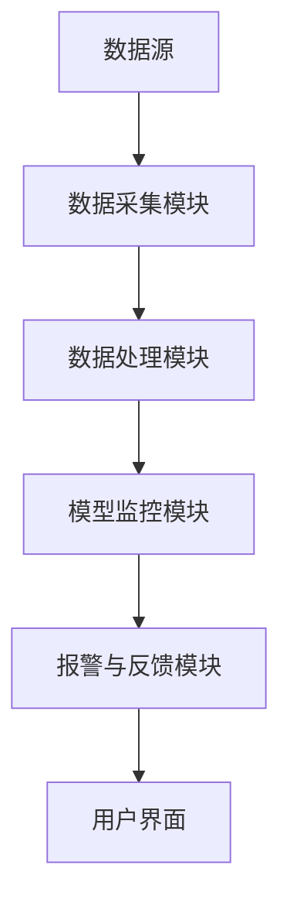

                 


---

# AI驱动的企业信用评级模型稳定性监控系统

> **关键词**：企业信用评级、AI驱动、模型稳定性、监控系统、数据漂移检测、模型解释性

> **摘要**：本文详细探讨了AI驱动的企业信用评级模型稳定性监控系统的设计与实现。通过分析企业信用评级模型在实际应用中的挑战，结合AI技术，提出了基于数据特征分析、模型性能监控和模型解释性的监控方法。文章从系统架构设计到算法实现，全面介绍了如何利用AI技术确保企业信用评级模型的稳定性和可靠性。

---

## 第一部分：AI驱动的企业信用评级模型稳定性监控系统概述

---

### 第1章：企业信用评级模型稳定性监控的背景与挑战

#### 1.1 企业信用评级模型的背景

企业信用评级是企业在金融市场上获得融资的重要依据，直接关系到企业的信用风险和融资成本。传统信用评级模型主要基于财务指标和历史数据，存在以下问题：

- **数据维度有限**：传统模型通常仅依赖财务数据，忽略了市场、行业和非结构化数据。
- **模型解释性不足**：复杂的AI模型（如深度学习模型）难以解释其决策过程，影响监管合规性。
- **模型更新周期长**：市场环境变化快，模型更新不及时可能导致信用评估误差。

AI技术的引入，为信用评级模型带来了新的可能性。通过自然语言处理（NLP）、机器学习（ML）和大数据分析，企业信用评级模型可以更准确地捕捉企业风险。

---

#### 1.2 模型稳定性监控的重要性

模型稳定性是确保信用评级模型长期有效性的关键。AI驱动的模型容易受到数据漂移和环境变化的影响，导致性能下降。以下是模型稳定性监控的重要性：

- **及时发现模型漂移**：通过实时监控模型输出和数据特征的变化，可以快速识别模型性能下降的迹象。
- **降低金融风险**：信用评级模型的不稳定性可能导致错误的信用评估，进而引发金融风险。
- **提高模型可解释性**：通过监控模型的决策过程，可以更好地理解模型行为，确保其符合监管要求。

---

#### 1.3 当前信用评级模型监控的挑战

尽管AI技术为信用评级模型带来了诸多优势，但也面临以下挑战：

- **数据质量与多样性问题**：企业信用数据可能包含缺失值、噪声和偏差，影响模型监控的准确性。
- **模型解释性不足**：复杂的AI模型难以解释其决策过程，增加了监控的难度。
- **监控系统实时性与效率的平衡**：实时监控需要高效的数据处理和模型评估能力，但在大规模数据下实现这一点具有挑战性。

---

### 1.4 本章小结

本章从企业信用评级模型的背景出发，分析了AI驱动模型的优势和必要性，并提出了模型稳定性监控的重要性。同时，探讨了当前信用评级模型监控面临的挑战，为后续章节的设计奠定了基础。

---

## 第2章：AI驱动模型监控的核心概念与原理

---

### 2.1 模型监控的核心概念

#### 2.1.1 模型监控的定义

模型监控是通过持续监测模型的输入数据、输出结果和性能指标，确保模型在实际应用中保持稳定性和有效性的过程。

---

#### 2.1.2 模型监控的关键指标

- **数据特征指标**：包括数据分布的变化、特征重要性的变化等。
- **模型性能指标**：包括准确率、召回率、F1值等。
- **模型稳定性指标**：包括模型输出的波动性、模型参数的变化等。

---

#### 2.1.3 模型监控的实现流程

1. 数据采集与预处理
2. 数据特征分析
3. 模型性能评估
4. 模型稳定性监控
5. 报警与反馈

---

### 2.2 模型稳定性监控的原理

#### 2.2.1 数据特征分析

- **数据分布分析**：通过统计分析和可视化工具，观察数据分布的变化。
- **数据漂移检测**：使用统计方法（如Kolmogorov-Smirnov检验）或机器学习方法（如Isolation Forest）检测数据分布的变化。

---

#### 2.2.2 模型输出的异常检测

- **基于阈值的异常检测**：设定性能指标的阈值，当模型性能低于阈值时触发报警。
- **基于统计的异常检测**：使用统计方法（如Z-score）检测模型输出的异常值。
- **基于机器学习的异常检测**：使用异常检测模型（如One-Class SVM）识别异常输出。

---

#### 2.2.3 模型性能的动态评估

- **动态评估指标**：包括模型在不同时间段的性能变化。
- **性能趋势分析**：通过时间序列分析（如ARIMA模型）预测模型性能的变化趋势。

---

### 2.3 模型监控与AI的关系

#### 2.3.1 AI在模型监控中的作用

- **数据处理**：AI技术可以帮助处理复杂的数据特征，提取有用的信息。
- **模型评估**：AI技术可以实时评估模型性能，发现潜在问题。
- **自动反馈**：AI技术可以自动调整模型参数，优化模型性能。

---

#### 2.3.2 AI驱动监控的优势

- **自动化**：AI技术可以实现模型监控的自动化，减少人工干预。
- **高效性**：AI技术可以快速处理大量数据，提高监控效率。
- **准确性**：AI技术可以通过复杂的算法，提高监控结果的准确性。

---

### 2.4 本章小结

本章详细介绍了AI驱动模型监控的核心概念和原理，包括模型监控的定义、关键指标、实现流程以及AI在模型监控中的作用。这些内容为后续章节的设计和实现奠定了理论基础。

---

## 第3章：信用评级模型稳定性监控的系统架构

---

### 3.1 系统架构设计

#### 3.1.1 系统整体架构

以下是信用评级模型稳定性监控系统的整体架构：



---

#### 3.1.2 数据采集模块

- **功能**：从企业数据库、公开数据源等获取信用评级相关数据。
- **工具**：使用Python的Pandas库进行数据清洗和预处理。

---

#### 3.1.3 数据处理模块

- **功能**：对采集的数据进行清洗、标准化和特征提取。
- **工具**：使用机器学习库（如Scikit-learn）进行数据预处理。

---

#### 3.1.4 模型监控模块

- **功能**：实时监控模型的性能和数据特征的变化。
- **工具**：使用深度学习框架（如TensorFlow）进行模型监控。

---

#### 3.1.5 报警与反馈模块

- **功能**：当模型性能下降或数据特征变化较大时，触发报警并反馈给相关人员。
- **工具**：使用消息队列（如Kafka）进行报警信息的传输。

---

### 3.2 系统功能设计

#### 3.2.1 数据采集与预处理

- **数据采集**：从企业数据库中获取财务数据、市场数据等。
- **数据清洗**：处理缺失值、异常值和重复值。
- **特征提取**：通过NLP技术提取文本数据中的关键词。

---

#### 3.2.2 模型性能监控

- **性能评估**：使用指标（如准确率、召回率）评估模型性能。
- **性能趋势分析**：通过时间序列分析预测模型性能的变化趋势。

---

#### 3.2.3 模型解释性分析

- **模型解释性工具**：使用SHAP值和LIME方法解释模型决策过程。
- **特征重要性分析**：通过特征重要性评分确定关键特征。

---

### 3.3 本章小结

本章详细介绍了信用评级模型稳定性监控系统的整体架构和功能设计，为后续章节的系统实现提供了框架支持。

---

## 第4章：信用评级模型稳定性监控的算法原理

---

### 4.1 数据特征分析

#### 4.1.1 数据分布分析

- **方法**：使用直方图和箱线图分析数据分布。
- **工具**：使用Matplotlib库进行数据可视化。

---

#### 4.1.2 数据漂移检测

- **统计方法**：Kolmogorov-Smirnov检验。
- **机器学习方法**：Isolation Forest算法。

---

### 4.2 模型性能监控算法

#### 4.2.1 基于阈值的性能监控

- **方法**：设定性能指标的阈值，当性能低于阈值时触发报警。
- **代码示例**：

```python
def monitor_performance(current_performance, threshold):
    if current_performance < threshold:
        return "alarm"
    else:
        return "normal"
```

---

#### 4.2.2 基于统计的性能监控

- **方法**：使用Z-score检测性能异常。
- **代码示例**：

```python
import numpy as np
from scipy import stats

def z_score(current_performance, mean, std):
    z = (current_performance - mean) / std
    if abs(z) > 3:
        return "alarm"
    else:
        return "normal"
```

---

#### 4.2.3 基于机器学习的性能监控

- **方法**：使用异常检测模型（如One-Class SVM）进行性能监控。
- **代码示例**：

```python
from sklearn.svm import OneClassSVM

def train_one_class_svm(X_train):
    model = OneClassSVM()
    model.fit(X_train)
    return model

def predict_anomalies(model, X_test):
    return model.predict(X_test)
```

---

### 4.3 模型解释性分析

#### 4.3.1 SHAP值解释

- **方法**：使用SHAP值解释模型的决策过程。
- **代码示例**：

```python
import shap

def explain_model(model, X_test):
    explainer = shap.TreeExplainer(model)
    shap_values = explainer.shap_values(X_test)
    return shap_values
```

---

#### 4.3.2 LIME解释

- **方法**：使用LIME解释模型的决策过程。
- **代码示例**：

```python
import lime
from lime import lime lime lime lime lime lime lime lime lime lime lime lime lime lime lime lime lime lime lime lime lime lime lime lime lime lime lime lime lime lime lime lime lime lime lime lime lime lime lime lime lime lime lime lime lime lime lime lime lime lime lime lime lime lime lime lime lime lime lime lime lime lime lime lime lime lime lime lime lime lime lime lime lime lime lime lime lime lime lime lime lime lime lime lime lime lime lime lime lime lime lime lime lime lime lime lime lime lime lime lime lime lime lime lime lime lime lime lime lime lime lime lime lime lime lime lime lime lime lime lime lime lime lime lime lime lime lime lime lime lime lime lime lime lime lime lime lime lime lime lime lime lime lime lime lime lime lime lime lime lime lime lime lime lime lime lime lime lime lime lime lime lime lime lime lime lime lime lime lime lime lime lime lime lime lime lime lime lime lime lime lime lime lime lime lime lime lime lime lime lime lime lime lime lime lime lime lime lime lime lime lime lime lime lime lime lime lime lime lime lime lime lime lime lime lime lime lime lime lime lime lime lime lime lime lime lime lime lime lime lime lime lime lime lime lime lime lime lime lime lime lime lime lime lime lime lime lime lime lime lime lime lime lime lime lime lime lime lime lime lime lime lime lime lime lime lime lime lime lime lime lime lime lime lime lime lime lime lime lime lime lime lime lime lime lime lime lime lime lime lime lime lime lime lime lime lime lime lime lime lime lime lime lime lime lime lime lime lime lime lime lime lime lime lime lime lime lime lime lime lime lime lime lime lime lime lime lime lime lime lime lime lime lime lime lime lime lime lime lime lime lime lime lime lime lime lime lime lime lime lime lime lime lime lime lime lime lime lime lime lime lime lime lime lime lime lime lime lime lime lime lime lime lime lime lime lime lime lime lime lime lime lime lime lime lime lime lime lime lime lime lime lime lime lime lime lime lime lime lime lime lime lime lime lime lime lime lime lime lime lime lime lime lime lime lime lime lime lime lime lime lime lime lime lime lime lime lime lime lime lime lime lime lime lime lime lime lime lime lime lime lime lime lime lime lime lime lime lime lime lime lime lime lime lime lime lime lime lime lime lime lime lime lime lime lime lime lime lime lime lime lime lime lime lime lime lime lime lime lime lime lime lime lime lime lime lime lime lime lime lime lime lime lime lime lime lime lime lime lime lime lime lime lime lime lime lime lime lime lime lime lime lime lime lime lime lime lime lime lime lime lime lime lime lime lime lime lime lime lime lime lime lime lime lime lime lime lime lime lime lime lime lime lime lime lime lime lime lime lime lime lime lime lime lime lime lime lime lime lime lime lime lime lime lime lime lime lime lime lime lime lime lime lime lime lime lime lime lime lime lime lime lime lime lime lime lime lime lime lime lime lime lime lime lime lime lime lime lime lime lime lime lime lime lime lime lime lime lime lime lime lime lime lime lime lime lime lime lime lime lime lime lime lime lime lime lime lime lime lime lime lime lime lime lime lime lime lime lime lime lime lime lime lime lime lime lime lime lime lime lime lime lime lime lime lime lime lime lime lime lime lime lime lime lime lime lime lime lime lime lime lime lime lime lime lime lime lime lime lime lime lime lime lime lime lime lime lime lime lime lime lime lime lime lime lime lime lime lime lime lime lime lime lime lime lime lime lime lime lime lime lime lime lime lime lime lime lime lime lime lime lime lime lime lime lime lime lime lime lime lime lime lime lime lime lime lime lime lime lime lime lime lime lime lime lime lime lime lime lime lime lime lime lime lime lime lime lime lime lime lime lime lime lime lime lime lime lime lime lime lime lime lime lime lime lime lime lime lime lime lime lime lime lime lime lime lime lime lime lime lime lime lime lime lime lime lime lime lime lime lime lime lime lime lime lime lime lime lime lime lime lime lime lime lime lime lime lime lime lime lime lime lime lime lime lime lime lime lime lime lime lime lime lime lime lime lime lime lime lime lime lime lime lime lime lime lime lime lime lime lime lime lime lime lime lime lime lime lime lime lime lime lime lime lime lime lime lime lime lime lime lime lime lime lime lime lime lime lime lime lime lime lime lime lime lime lime lime lime lime lime lime lime lime lime lime lime lime lime lime lime lime lime lime lime lime lime lime lime lime lime lime lime lime lime lime lime lime lime lime lime lime lime lime lime lime lime lime lime lime lime lime lime lime lime lime lime lime lime lime lime lime lime lime lime lime lime lime lime lime lime lime lime lime lime lime lime lime lime lime lime lime lime lime lime lime lime lime lime lime lime lime lime lime lime lime lime lime lime lime lime lime lime lime lime lime lime lime lime lime lime lime lime lime lime lime lime lime lime lime lime lime lime lime lime lime lime lime lime lime lime lime lime lime lime lime lime lime lime lime lime lime lime lime lime lime lime lime lime lime lime lime lime lime lime lime lime lime lime lime lime lime lime lime lime lime lime lime lime lime lime lime lime lime lime lime lime lime lime lime lime lime lime lime lime lime lime lime lime lime lime lime lime lime lime lime lime lime lime lime lime lime lime lime lime lime lime lime lime lime lime lime lime lime lime lime lime lime lime lime lime lime lime lime lime lime lime lime lime lime lime lime lime lime lime lime lime lime lime lime lime lime lime lime lime lime lime lime lime lime lime lime lime lime lime lime lime lime lime lime lime lime lime lime lime lime lime lime lime lime lime lime lime lime lime lime lime lime lime lime lime lime lime lime lime lime lime lime lime lime lime lime lime lime lime lime lime lime lime lime lime lime lime lime lime lime lime lime lime lime lime lime lime lime lime lime lime lime lime lime lime lime lime lime lime lime lime lime lime lime lime lime lime lime lime lime lime lime lime lime lime lime lime lime lime lime lime lime lime lime lime lime lime lime lime lime lime lime lime lime lime lime lime lime lime lime lime lime lime lime lime lime lime lime lime lime lime lime lime lime lime lime lime lime lime lime lime lime lime lime lime lime lime lime lime lime lime lime lime lime lime lime lime lime lime lime lime lime lime lime lime lime lime lime lime lime lime lime lime lime lime lime lime lime lime lime lime lime lime lime lime lime lime lime lime lime lime lime lime lime lime lime lime lime lime lime lime lime lime lime lime lime lime lime lime lime lime lime lime lime lime lime lime lime lime lime lime lime lime lime lime lime lime lime lime lime lime lime lime lime lime lime lime lime lime lime lime lime lime lime lime lime lime lime lime lime lime lime lime lime lime lime lime lime lime lime lime lime lime lime lime lime lime lime lime lime lime lime lime lime lime lime lime lime lime lime lime lime lime lime lime lime lime lime lime lime lime lime lime lime lime lime lime lime lime lime lime lime lime lime lime lime lime lime lime lime lime lime lime lime lime lime lime lime lime lime lime lime lime lime lime lime lime lime lime lime lime lime lime lime lime lime lime lime lime lime lime lime lime lime lime lime lime lime lime lime lime lime lime lime lime lime lime lime lime lime lime lime lime lime lime lime lime lime lime lime lime lime lime lime lime lime lime lime lime lime lime lime lime lime lime lime lime lime lime lime lime lime lime lime lime lime lime lime lime lime lime lime lime lime lime lime lime lime lime lime lime lime lime lime lime lime lime lime lime lime lime lime lime lime lime lime lime lime lime lime lime lime lime lime lime lime lime lime lime lime lime lime lime lime lime lime lime lime lime lime lime lime lime lime lime lime lime lime lime lime lime lime lime lime lime lime lime lime lime lime lime lime lime lime lime lime lime lime lime lime lime lime lime lime lime lime lime lime lime lime lime lime lime lime lime lime lime lime lime lime lime lime lime lime lime lime lime lime lime lime lime lime lime lime lime lime lime lime lime lime lime lime lime lime lime lime lime lime lime lime lime lime lime lime lime lime lime lime lime lime lime lime lime lime lime lime lime lime lime lime lime lime lime lime lime lime lime lime lime lime lime lime lime lime lime lime lime lime lime lime lime lime lime lime lime lime lime lime lime lime lime lime lime lime lime lime lime lime lime lime lime lime lime lime lime lime lime lime lime lime lime lime lime lime lime lime lime lime lime lime lime lime lime lime lime lime lime lime lime lime lime lime lime lime lime lime lime lime lime lime lime lime lime lime lime lime lime lime lime lime lime lime lime lime lime lime lime lime lime lime lime lime lime lime lime lime lime lime lime lime lime lime lime lime lime lime lime lime lime lime lime lime lime lime lime lime lime lime lime lime lime lime lime lime lime lime lime lime lime lime lime lime lime lime lime lime lime lime lime lime lime lime lime lime lime lime lime lime lime lime lime lime lime lime lime lime lime lime lime lime lime lime lime lime lime lime lime lime lime lime lime lime lime lime lime lime lime lime lime lime lime lime lime lime lime lime lime lime lime lime lime lime lime lime lime lime lime lime lime lime lime lime lime lime lime lime lime lime lime lime lime lime lime lime lime lime lime lime lime lime lime lime lime lime lime lime lime lime lime lime lime lime lime lime lime lime lime lime lime lime lime lime lime lime lime lime lime lime lime lime lime lime lime lime lime lime lime lime lime lime lime lime lime lime lime lime lime lime lime lime lime lime lime lime lime lime lime lime lime lime lime lime lime lime lime lime lime lime lime lime lime lime lime lime lime lime lime lime lime lime lime lime lime lime lime lime lime lime lime lime lime lime lime lime lime lime lime lime lime lime lime lime lime lime lime lime lime lime lime lime lime lime lime lime lime lime lime lime lime lime lime lime lime lime lime lime lime lime lime lime lime lime lime lime lime lime lime lime lime lime lime lime lime lime lime lime lime lime lime lime lime lime lime lime lime lime lime lime lime lime lime lime lime lime lime lime lime lime lime lime lime lime lime lime lime lime lime lime lime lime lime lime lime lime lime lime lime lime lime lime lime lime lime lime lime lime lime lime lime lime lime lime lime lime lime lime lime lime lime lime lime lime lime lime lime lime lime lime lime lime lime lime lime lime lime lime lime lime lime lime lime lime lime lime lime lime lime lime lime lime lime lime lime lime lime lime lime lime lime lime lime lime lime lime lime lime lime lime lime lime lime lime lime lime lime lime lime lime lime lime lime lime lime lime lime lime lime lime lime lime lime lime lime lime lime lime lime lime lime lime lime lime lime lime lime lime lime lime lime lime lime lime lime lime lime lime lime lime lime lime lime lime lime lime lime lime lime lime lime lime lime lime lime lime lime lime lime lime lime lime lime lime lime lime lime lime lime lime lime lime lime lime lime lime lime lime lime lime lime lime lime lime lime lime lime lime lime lime lime lime lime lime lime lime lime lime lime lime lime lime lime lime lime lime lime lime lime lime lime lime lime lime lime lime lime lime lime lime lime lime lime lime lime lime lime lime lime lime lime lime lime lime lime lime lime lime lime lime lime lime lime lime lime lime lime lime lime lime lime lime lime lime lime lime lime lime lime lime lime lime lime lime lime lime lime lime lime lime lime lime lime lime lime lime lime lime lime lime lime lime lime lime lime lime lime lime lime lime lime lime lime lime lime lime lime lime lime lime lime lime lime lime lime lime lime lime lime lime lime lime lime lime lime lime lime lime lime lime lime lime lime lime lime lime lime lime lime lime lime lime lime lime lime lime lime lime lime lime lime lime lime lime lime lime lime lime lime lime lime lime lime lime lime lime lime lime lime lime lime lime lime lime lime lime lime lime lime lime lime lime lime lime lime lime lime lime lime lime lime lime lime lime lime lime lime lime lime lime lime lime lime lime lime lime lime lime lime lime lime lime lime lime lime lime lime lime lime lime lime lime lime lime lime lime lime lime lime lime lime lime lime lime lime lime lime lime lime lime lime lime lime lime lime lime lime lime lime lime lime lime lime lime lime lime lime lime lime lime lime lime lime lime lime lime lime lime lime lime lime lime lime lime lime lime lime lime lime lime lime lime lime lime lime lime lime lime lime lime lime lime lime lime lime lime lime lime lime lime lime lime lime lime lime lime lime lime lime lime lime lime lime lime lime lime lime lime lime lime lime lime lime lime lime lime lime lime lime lime lime lime lime lime lime lime lime lime lime lime lime lime lime lime lime lime lime lime lime lime lime lime lime lime lime lime lime lime lime lime lime lime lime lime lime lime lime lime lime lime lime lime lime lime lime lime lime lime lime lime lime lime lime lime lime lime lime lime lime lime lime lime lime lime lime lime lime lime lime lime lime lime lime lime lime lime lime lime lime lime lime lime lime lime lime lime lime lime lime lime lime lime lime lime lime lime lime lime lime lime lime lime lime lime lime lime lime lime lime lime lime lime lime lime lime lime lime lime lime lime lime lime lime lime lime lime lime lime lime lime lime lime lime lime lime lime lime lime lime lime lime lime lime lime lime lime lime lime lime lime lime lime lime lime lime lime lime lime lime lime lime lime lime lime lime lime lime lime lime lime lime lime lime lime lime lime lime lime lime lime lime lime lime lime lime lime lime lime lime lime lime lime lime lime lime lime lime lime lime lime lime lime lime lime lime lime lime lime lime lime lime lime lime lime lime lime lime lime lime lime lime lime lime lime lime lime lime lime lime lime lime lime lime lime lime lime lime lime lime lime lime lime lime lime lime lime lime lime lime lime lime lime lime lime lime lime lime lime lime lime lime lime lime lime lime lime lime lime lime lime lime lime lime lime lime lime lime lime lime lime lime lime lime lime lime lime lime lime lime lime lime lime lime lime lime lime lime lime lime lime lime lime lime lime lime lime lime lime lime lime lime lime lime lime lime lime lime lime lime lime lime lime lime lime lime lime lime lime lime lime lime lime lime lime lime lime lime lime lime lime lime lime lime lime lime lime lime lime lime lime lime lime lime lime lime lime lime lime lime lime lime lime lime lime lime lime lime lime lime lime lime lime lime lime lime lime lime lime lime lime lime lime lime lime lime lime lime lime lime lime lime lime lime lime lime lime lime lime lime lime lime lime lime lime lime lime lime lime lime lime lime lime lime lime lime lime lime lime lime lime lime lime lime lime lime lime lime lime lime lime lime lime lime lime lime lime lime lime lime lime lime lime lime lime lime lime lime lime lime lime lime lime lime lime lime lime lime lime lime lime lime lime lime lime lime lime lime lime lime lime lime lime lime lime lime lime lime lime lime lime lime lime lime lime lime lime lime lime lime lime lime lime lime lime lime lime lime lime lime lime lime lime lime lime lime lime lime lime lime lime lime lime lime lime lime lime lime lime lime lime lime lime lime lime lime lime lime lime lime lime lime lime lime lime lime lime lime lime lime lime lime lime lime lime lime lime lime lime lime lime lime lime lime lime lime lime lime lime lime lime lime lime lime lime lime lime lime lime lime lime lime lime lime lime lime lime lime lime lime lime lime lime lime lime lime lime lime lime lime lime lime lime lime lime lime lime lime lime lime lime lime lime lime lime lime lime lime lime lime lime lime lime lime lime lime lime lime lime lime lime lime lime lime lime lime lime lime lime lime lime lime lime lime lime lime lime lime lime lime lime lime lime lime lime lime lime lime lime lime lime lime lime lime lime lime lime lime lime lime lime lime lime lime lime lime lime lime lime lime lime lime lime lime lime lime lime lime lime lime lime lime lime lime lime lime lime lime lime lime lime lime lime lime lime lime lime lime lime lime lime lime lime lime lime lime lime lime lime lime lime lime lime lime lime lime lime lime lime lime lime lime lime lime lime lime lime lime lime lime lime lime lime lime lime lime lime lime lime lime lime lime lime lime lime lime lime lime lime lime lime lime lime lime lime lime lime lime lime lime lime lime lime lime lime lime lime lime lime lime lime lime lime lime lime lime lime lime lime lime lime lime lime lime lime lime lime lime lime lime lime lime lime lime lime lime lime lime lime lime lime lime lime lime lime lime lime lime lime lime lime lime lime lime lime lime lime lime lime lime lime lime lime lime lime lime lime lime lime lime lime lime lime lime lime lime lime lime lime lime lime lime lime lime lime lime lime lime lime lime lime lime lime lime lime lime lime lime lime lime lime lime lime lime lime lime lime lime lime lime lime lime lime lime lime lime lime lime lime lime lime lime lime lime lime lime lime lime lime lime lime lime lime lime lime lime lime lime lime lime lime lime lime lime lime lime lime lime lime lime lime lime lime lime lime lime lime lime lime lime lime lime lime lime lime lime lime lime lime lime lime lime lime lime lime lime lime lime lime lime lime lime lime lime lime lime lime lime lime lime lime lime lime lime lime lime lime lime lime lime lime lime lime lime lime lime lime lime lime lime lime lime lime lime lime lime lime lime lime lime lime lime lime lime lime lime lime lime lime lime lime lime lime lime lime lime lime lime lime lime lime lime lime lime lime lime lime lime lime lime lime lime lime lime lime lime lime lime lime lime lime lime lime lime lime lime lime lime lime lime lime lime lime lime lime lime lime lime lime lime lime lime lime lime lime lime lime lime lime lime lime lime lime lime lime lime lime lime lime lime lime lime lime lime lime lime lime lime lime lime lime lime lime lime lime lime lime lime lime lime lime lime lime lime lime lime lime lime lime lime lime lime lime lime lime lime lime lime lime lime lime lime lime lime lime lime lime lime lime lime lime lime lime lime lime lime lime lime lime lime lime lime lime lime lime lime lime lime lime lime lime lime lime lime lime lime lime lime lime lime lime lime lime lime lime lime lime lime lime lime lime lime lime lime lime lime lime lime lime lime lime lime lime lime lime lime lime lime lime lime lime lime lime lime lime lime lime lime lime lime lime lime lime lime lime lime lime lime lime lime lime lime lime lime lime lime lime lime lime lime lime lime lime lime lime lime lime lime lime lime lime lime lime lime lime lime lime lime lime lime lime lime lime lime lime lime lime lime lime lime lime lime lime lime lime lime lime lime lime lime lime lime lime lime lime lime lime lime lime lime lime lime lime lime lime lime lime lime lime lime lime lime lime lime lime lime lime lime lime lime lime lime lime lime lime lime lime lime lime lime lime lime lime lime lime lime lime lime lime lime lime lime lime lime lime lime lime lime lime lime lime lime lime lime lime lime lime lime lime lime lime lime lime lime lime lime lime lime lime lime lime lime lime lime lime lime lime lime lime lime lime lime lime lime lime lime lime lime lime lime lime lime lime lime lime lime lime lime lime lime lime lime lime lime lime lime lime lime lime lime lime lime lime lime lime lime lime lime lime lime lime lime lime lime lime lime lime lime lime lime lime lime lime lime lime lime lime lime lime lime lime lime lime lime lime lime lime lime lime lime lime lime lime lime lime lime lime lime lime lime lime lime lime lime lime lime lime lime lime lime lime lime lime lime lime lime lime lime lime lime lime lime lime lime lime lime lime lime lime lime lime lime lime lime lime lime lime lime lime lime lime lime lime lime lime lime lime lime lime lime lime lime lime lime lime lime lime lime lime lime lime lime lime lime lime lime lime lime lime lime lime lime lime lime lime lime lime lime lime lime lime lime lime lime lime lime lime lime lime lime lime lime lime lime lime lime lime lime lime lime lime lime lime lime lime lime lime lime lime lime lime lime lime lime lime lime lime lime lime lime lime lime lime lime lime lime lime lime lime lime lime lime lime lime lime lime lime lime lime lime lime lime lime lime lime lime lime lime lime lime lime lime lime lime lime lime lime lime lime lime lime lime lime lime lime lime lime lime lime lime lime lime lime lime lime lime lime lime lime lime lime lime lime lime lime lime lime lime lime lime lime lime lime lime lime lime lime lime lime lime lime lime lime lime lime lime lime lime lime lime lime lime lime lime lime lime lime lime lime lime lime lime lime lime lime lime lime lime lime lime lime lime lime lime lime lime lime lime lime lime lime lime lime lime lime lime lime lime lime lime lime lime lime lime lime lime lime lime lime lime lime lime lime lime lime lime lime lime lime lime lime lime lime lime lime lime lime lime lime lime lime lime lime lime lime lime lime lime lime lime lime lime lime lime lime lime lime lime lime lime lime lime lime lime lime lime lime lime lime lime lime lime lime lime lime lime lime lime lime lime lime lime lime lime lime lime lime lime lime lime lime lime lime lime lime lime lime lime lime lime lime lime lime lime lime lime lime lime lime lime lime lime lime lime lime lime lime lime lime lime lime lime lime lime lime lime lime lime lime lime lime lime lime lime lime lime lime lime lime lime lime lime lime lime lime lime lime lime lime lime lime lime lime lime lime lime lime lime lime lime lime lime lime lime lime lime lime lime lime lime lime lime lime lime lime lime lime lime lime lime lime lime lime lime lime lime lime lime lime lime lime lime lime lime lime lime lime lime lime lime lime lime lime lime lime lime lime lime lime lime lime lime lime lime lime lime lime lime lime lime lime lime lime lime lime lime lime lime lime lime lime lime lime lime lime lime lime lime lime lime lime lime lime lime lime lime lime lime lime lime lime lime lime lime lime lime lime lime lime lime lime lime lime lime lime lime lime lime lime lime lime lime lime lime lime lime lime lime lime lime lime lime lime lime lime lime lime lime lime lime lime lime lime lime lime lime lime lime lime lime lime lime lime lime lime lime lime lime lime lime lime lime lime lime lime lime lime lime lime lime lime lime lime lime lime lime lime lime lime lime lime lime lime lime lime lime lime lime lime lime lime lime lime lime lime lime lime lime lime lime lime lime lime lime lime lime lime lime lime lime lime lime lime lime lime lime lime lime lime lime lime lime lime lime lime lime lime lime lime lime lime lime lime lime lime lime lime lime lime lime lime lime lime lime lime lime lime lime lime lime lime lime lime lime lime lime lime lime lime lime lime lime lime lime lime lime lime lime lime lime lime lime lime lime lime lime lime lime lime lime lime lime lime lime lime lime lime lime lime lime lime lime lime lime lime lime lime lime lime lime lime lime lime lime lime lime lime lime lime lime lime lime lime lime lime lime lime lime lime lime lime lime lime lime lime lime lime lime lime lime lime lime lime lime lime lime lime lime lime lime lime lime lime lime lime lime lime lime lime lime lime lime lime lime lime lime lime lime lime lime lime lime lime lime lime lime lime lime lime lime lime lime lime lime lime lime lime lime lime lime lime lime lime lime lime lime lime lime lime lime lime lime lime lime lime lime lime lime lime lime lime lime lime lime lime lime lime lime lime lime lime lime lime lime lime lime lime lime lime lime lime lime lime lime lime lime lime lime lime lime lime lime lime lime lime lime lime lime lime lime lime lime lime lime lime lime lime lime lime lime lime lime lime lime lime lime lime lime lime lime lime lime lime lime lime lime lime lime lime lime lime lime lime lime lime lime lime lime lime lime lime lime lime lime lime lime lime lime lime lime lime lime lime lime lime lime lime lime lime lime lime lime lime lime lime lime lime lime lime lime lime lime lime lime lime lime lime lime lime lime lime lime lime lime lime lime lime lime lime lime lime lime lime lime lime lime lime lime lime lime lime lime lime lime lime lime lime lime lime lime lime lime lime lime lime lime lime lime lime lime lime lime lime lime lime lime lime lime lime lime lime lime lime lime lime lime lime lime lime lime lime lime lime lime lime lime lime lime lime lime lime lime lime lime lime lime lime lime lime lime lime lime lime lime lime lime lime lime lime lime lime lime lime lime lime lime lime lime lime lime lime lime lime lime lime lime lime lime lime lime lime lime lime lime lime lime lime lime lime lime lime lime lime lime lime lime lime lime lime lime lime lime lime lime lime lime lime lime lime lime lime lime lime lime lime lime lime lime lime lime lime lime lime lime lime lime lime lime lime lime lime lime lime lime lime lime lime lime lime lime lime lime lime lime lime lime lime lime lime lime lime lime lime lime lime lime lime lime lime lime lime lime lime lime lime lime lime lime lime lime lime lime lime lime lime lime lime lime lime lime lime lime lime lime lime lime lime lime lime lime lime lime lime lime lime lime lime lime lime lime lime lime lime lime lime lime lime lime lime lime lime lime lime lime lime lime lime lime lime lime lime lime lime lime lime lime lime lime lime lime lime lime lime lime lime lime lime lime lime lime lime lime lime lime lime lime lime lime lime lime lime lime lime lime lime lime lime lime lime lime lime lime lime lime lime lime lime lime lime lime lime lime lime lime lime lime lime lime lime lime lime lime lime lime lime lime lime lime lime lime lime lime lime lime lime lime lime lime lime lime lime lime lime lime lime lime lime lime lime lime lime lime lime lime lime lime lime lime lime lime lime lime lime lime lime lime lime lime lime lime lime lime lime lime lime lime lime lime lime lime lime lime lime lime lime lime lime lime lime lime lime lime lime lime lime lime lime lime lime lime lime lime lime lime lime lime lime lime lime lime lime lime lime lime lime lime lime lime lime lime lime lime lime lime lime lime lime lime lime lime lime lime lime lime lime lime lime lime lime lime lime lime lime lime lime lime lime lime lime lime lime lime lime lime lime lime lime lime lime lime lime lime lime lime lime lime lime lime lime lime lime lime lime lime lime lime lime lime lime lime lime lime lime lime lime lime lime lime lime lime lime lime lime lime lime lime lime lime lime lime lime lime lime lime lime lime lime lime lime lime lime lime lime lime lime lime lime lime lime lime lime lime lime lime lime lime lime lime lime lime lime lime lime lime lime lime lime lime lime lime lime lime lime lime lime lime lime lime lime lime lime lime lime lime lime lime lime lime lime lime lime lime lime lime lime lime lime lime lime lime lime lime lime lime lime lime lime lime lime lime lime lime lime lime lime lime lime lime lime lime lime lime lime lime lime lime lime lime lime lime lime lime lime lime lime lime lime lime lime lime lime lime lime lime lime lime lime lime lime lime lime lime lime lime lime lime lime lime lime lime lime lime lime lime lime lime lime lime lime lime lime lime lime lime lime lime lime lime lime lime lime lime lime lime lime lime lime lime lime lime lime lime lime lime lime lime lime lime lime lime lime lime lime lime lime lime lime lime lime lime lime lime lime lime lime lime lime lime lime lime lime lime lime lime lime lime lime lime lime lime lime lime lime lime lime lime lime lime lime lime lime lime lime lime lime lime lime lime lime lime lime lime lime lime lime lime lime lime lime lime lime lime lime lime lime lime lime lime lime lime lime lime lime lime lime lime lime lime lime lime lime lime lime lime lime lime lime lime lime lime lime lime lime lime lime lime lime lime lime lime lime lime lime lime lime lime lime lime lime lime lime lime lime lime lime lime lime lime lime lime lime lime lime lime lime lime lime lime lime lime lime lime lime lime lime lime lime lime lime lime lime lime lime lime lime lime lime lime lime lime lime lime lime lime lime lime lime lime lime lime lime lime lime lime lime lime lime lime lime lime lime lime lime lime lime lime lime lime lime lime lime lime lime lime lime lime lime lime lime lime lime lime lime lime lime lime lime lime lime lime lime lime lime lime lime lime lime lime lime lime lime lime lime lime lime lime lime lime lime lime lime lime lime lime lime lime lime lime lime lime lime lime lime lime lime lime lime lime lime lime lime lime lime lime lime lime lime lime lime lime lime lime lime lime lime lime lime lime lime lime lime lime lime lime lime lime lime lime lime lime lime lime lime lime lime lime lime lime lime lime lime lime lime lime lime lime lime lime lime lime lime lime lime lime lime lime lime lime lime lime lime lime lime lime lime lime lime lime lime lime lime lime lime lime lime lime lime lime lime lime lime lime lime lime lime lime lime lime lime lime lime lime lime lime lime lime lime lime lime lime lime lime lime lime lime lime lime lime lime lime lime lime lime lime lime lime lime lime lime lime lime lime lime lime lime lime lime lime lime lime lime lime lime lime lime lime lime lime lime lime lime lime lime lime lime lime lime lime lime lime lime lime lime lime lime lime lime lime lime lime lime lime lime lime lime lime lime lime lime lime lime lime lime lime lime lime lime lime lime lime lime lime lime lime lime lime lime lime lime lime lime lime lime lime lime lime lime lime lime lime lime lime lime lime lime lime lime lime lime lime lime lime lime lime lime lime lime lime lime lime lime lime lime lime lime lime lime lime lime lime lime lime lime lime lime lime lime lime lime lime lime lime lime lime lime lime lime lime lime lime lime lime lime lime lime lime lime lime lime lime lime lime lime lime lime lime lime lime lime lime lime lime lime lime lime lime lime lime lime lime lime lime lime lime lime lime lime lime lime lime lime lime lime lime lime lime lime lime lime lime lime lime lime lime lime lime lime lime lime lime lime lime lime lime lime lime lime lime lime lime lime lime lime lime lime lime lime lime lime lime lime lime lime lime lime lime lime lime lime lime lime lime lime lime lime lime lime lime lime lime lime lime lime lime lime lime lime lime lime lime lime lime lime lime lime lime lime lime lime lime lime lime lime lime lime lime lime lime lime lime lime lime lime lime lime lime lime lime lime lime lime lime lime lime lime lime lime lime lime lime lime lime lime lime lime lime lime lime lime lime lime lime lime lime lime lime lime lime lime lime lime lime lime lime lime lime lime lime lime lime lime lime lime lime lime lime lime lime lime lime lime lime lime lime lime lime lime lime lime lime lime lime lime lime lime lime lime lime lime lime lime lime lime lime lime lime lime lime lime lime lime lime lime lime lime lime lime lime lime lime lime lime lime lime lime lime lime lime lime lime lime lime lime lime lime lime lime lime lime lime lime lime lime lime lime lime lime lime lime lime lime lime lime lime lime lime lime lime lime lime lime lime lime lime lime lime lime lime lime lime lime lime lime lime lime lime lime lime lime lime lime lime lime lime lime lime lime lime lime lime lime lime lime lime lime lime lime lime lime lime lime lime lime lime lime lime lime lime lime lime lime lime lime lime lime lime lime lime lime lime lime lime lime lime lime lime lime lime lime lime lime lime lime lime lime lime lime lime lime lime lime lime lime lime lime lime lime lime lime lime lime lime lime lime lime lime lime lime lime lime lime lime lime lime lime lime lime lime lime lime lime lime lime lime lime lime lime lime lime lime lime lime lime lime lime lime lime lime lime lime lime lime lime lime lime lime lime lime lime lime lime lime lime lime lime lime lime lime lime lime lime lime lime lime lime lime lime lime lime lime lime lime lime lime lime lime lime lime lime lime lime lime lime lime lime lime lime lime lime lime lime lime lime lime lime lime lime lime lime lime lime lime lime lime lime lime lime lime lime lime lime lime lime lime lime lime lime lime lime lime lime lime lime lime lime lime lime lime lime lime lime lime lime lime lime lime lime lime lime lime lime lime lime lime lime lime lime lime lime lime lime lime lime lime lime lime lime lime lime lime lime lime lime lime lime lime lime lime lime lime lime lime lime lime lime lime lime lime lime lime lime lime lime lime lime lime lime lime lime lime lime lime lime lime lime lime lime lime lime lime lime lime lime lime lime lime lime lime lime lime lime lime lime lime lime lime lime lime lime lime lime lime lime lime lime lime lime lime lime lime lime lime lime lime lime lime lime lime lime lime lime lime lime lime lime lime lime lime lime lime lime lime lime lime lime lime lime lime lime lime lime lime lime lime lime lime lime lime lime lime lime lime lime lime lime lime lime lime lime lime lime lime lime lime lime lime lime lime lime lime lime lime lime lime lime lime lime lime lime lime lime lime lime lime lime lime lime lime lime lime lime lime lime lime lime lime lime lime lime lime lime lime lime lime lime lime lime lime lime lime lime lime lime lime lime lime lime lime lime lime lime lime lime lime lime lime lime lime lime lime lime lime lime lime lime lime lime lime lime lime lime lime lime lime lime lime lime lime lime lime lime lime lime lime lime lime lime lime lime lime lime lime lime lime lime lime lime lime lime lime lime lime lime lime lime lime lime lime lime lime lime lime lime lime lime lime lime lime lime lime lime lime lime lime lime lime lime lime lime lime lime lime lime lime lime lime lime lime lime lime lime lime lime lime lime lime lime lime lime lime lime lime lime lime lime lime lime lime lime lime lime lime lime lime lime lime lime lime lime lime lime lime lime lime lime lime lime lime lime lime lime lime lime lime lime lime lime lime lime lime lime lime lime lime lime lime lime lime lime lime lime lime lime lime lime lime lime lime lime lime lime lime lime lime lime lime lime lime lime lime lime lime lime lime lime lime lime lime lime lime lime lime lime lime lime lime lime lime lime lime lime lime lime lime lime lime lime lime lime lime lime lime lime lime lime lime lime lime lime lime lime lime lime lime lime lime lime lime lime lime lime lime lime lime lime lime lime lime lime lime lime lime lime lime lime lime lime lime lime lime lime lime lime lime lime lime lime lime lime lime lime lime lime lime lime lime lime lime lime lime lime lime lime lime lime lime lime lime lime lime lime lime lime lime lime lime lime lime lime lime lime lime lime lime lime lime lime lime lime lime lime lime lime lime lime lime lime lime lime lime lime lime lime lime lime lime lime lime lime lime lime lime lime lime lime lime lime lime lime lime lime lime lime lime lime lime lime lime lime lime lime lime lime lime lime lime lime lime lime lime lime lime lime lime lime lime lime lime lime lime lime lime lime lime lime lime lime lime lime lime lime lime lime lime lime lime lime lime lime lime lime lime lime lime lime lime lime lime lime lime lime lime lime lime lime lime lime lime lime lime lime lime lime lime lime lime lime lime lime lime lime lime lime lime lime lime lime lime lime lime lime lime lime lime lime lime lime lime lime lime lime lime lime lime lime lime lime lime lime lime lime lime lime lime lime lime lime lime lime lime lime lime lime lime lime lime lime lime lime lime lime lime lime lime lime lime lime lime lime lime lime lime lime lime lime lime lime lime lime lime lime lime lime lime lime lime lime lime lime lime lime lime lime lime lime lime lime lime lime lime lime lime lime lime lime lime lime lime lime lime lime lime lime lime lime lime lime lime lime lime lime lime lime lime lime lime lime lime lime lime lime lime lime lime lime lime lime lime lime lime lime lime lime lime lime lime lime lime lime lime lime lime lime lime lime lime lime lime lime lime lime lime lime lime lime lime lime lime lime lime lime lime lime lime lime lime lime lime lime lime lime lime lime lime lime lime lime lime lime lime lime lime lime lime lime lime lime lime lime lime lime lime lime lime lime lime lime lime lime lime lime lime lime lime lime lime lime lime lime lime lime lime lime lime lime lime lime lime lime lime lime lime lime lime lime lime lime lime lime lime lime lime lime lime lime lime lime lime lime lime lime lime lime lime lime lime lime lime lime lime lime lime lime lime lime lime lime lime lime lime lime lime lime lime lime lime lime lime lime lime lime lime lime lime lime lime lime lime lime lime lime lime lime lime lime lime lime lime lime lime lime lime lime lime lime lime lime lime lime lime lime lime lime lime lime lime lime lime lime lime lime lime lime lime lime lime lime lime lime lime lime lime lime lime lime lime lime lime lime lime lime lime lime lime lime lime lime lime lime lime lime lime lime lime lime lime lime lime lime lime lime lime lime lime lime lime lime lime lime lime lime lime lime lime lime lime lime lime lime lime lime lime lime lime lime lime lime lime lime lime lime lime lime lime lime lime lime lime lime lime lime lime lime lime lime lime lime lime lime lime lime lime lime lime lime lime lime lime lime lime lime lime lime lime lime lime lime lime lime lime lime lime lime lime lime lime lime lime lime lime lime lime lime lime lime lime lime lime lime lime lime lime lime lime lime lime lime lime lime lime lime lime lime lime lime lime lime lime lime lime lime lime lime lime lime lime lime lime lime lime lime lime lime lime lime lime lime lime lime lime lime lime lime lime lime lime lime lime lime lime lime lime lime lime lime lime lime lime lime lime lime lime lime lime lime lime lime lime lime lime lime lime lime lime lime lime lime lime lime lime lime lime lime lime lime lime lime lime lime lime lime lime lime lime lime lime lime lime lime lime lime lime lime lime lime lime lime lime lime lime lime lime lime lime lime lime lime lime lime lime lime lime lime lime lime lime lime lime lime lime lime lime lime lime lime lime lime lime lime lime lime lime lime lime lime lime lime lime lime lime lime lime lime lime lime lime lime lime lime lime lime lime lime lime lime lime lime lime lime lime lime lime lime lime lime lime lime lime lime lime lime lime lime lime lime lime lime lime lime lime lime lime lime lime lime lime lime lime lime lime lime lime lime lime lime lime lime lime lime lime lime lime lime lime lime lime lime lime lime lime lime lime lime lime lime lime lime lime lime lime lime lime lime lime lime lime lime lime lime lime lime lime lime lime lime lime lime lime lime lime lime lime lime lime lime lime lime lime lime lime lime lime lime lime lime lime lime lime lime lime lime lime lime lime lime lime lime lime lime lime lime lime lime lime lime lime lime lime lime lime lime lime lime lime lime lime lime lime lime lime lime lime lime lime lime lime lime lime lime lime lime lime lime lime lime lime lime lime lime lime lime lime lime lime lime lime lime lime lime lime lime lime lime lime lime lime lime lime lime lime lime lime lime lime lime lime lime lime lime lime lime lime lime lime lime lime lime lime lime lime lime lime lime lime lime lime lime lime lime lime lime lime lime lime lime lime lime lime lime lime lime lime lime lime lime lime lime lime lime lime lime lime lime lime lime lime lime lime lime lime lime lime lime lime lime lime lime lime lime lime lime lime lime lime lime lime lime lime lime lime lime lime lime lime lime lime lime lime lime lime lime lime lime lime lime lime lime lime lime lime lime lime lime lime lime lime lime lime lime lime lime lime lime lime lime lime lime lime lime lime lime lime lime lime lime lime lime lime lime lime lime lime lime lime lime lime lime lime lime lime lime lime lime lime lime lime lime lime lime lime lime lime lime lime lime lime lime lime lime lime lime lime lime lime lime lime lime lime lime lime lime lime lime lime lime lime lime lime lime lime lime lime lime lime lime lime lime lime lime lime lime lime lime lime lime lime lime lime lime lime lime lime lime lime lime lime lime lime lime lime lime lime lime lime lime lime lime lime lime lime lime lime lime lime lime lime lime lime lime lime lime lime lime lime lime lime lime lime lime lime lime lime lime lime lime lime lime lime lime lime lime lime lime lime lime lime lime lime lime lime lime lime lime lime lime lime lime lime lime lime lime lime lime lime lime lime lime lime lime lime lime lime lime lime lime lime lime lime lime lime lime lime lime lime lime lime lime lime lime lime lime lime lime lime lime lime lime lime lime lime lime lime lime lime lime lime lime lime lime lime lime lime lime lime lime lime lime lime lime lime lime lime lime lime lime lime lime lime lime lime lime lime lime lime lime lime lime lime lime lime lime lime lime lime lime lime lime lime lime lime lime lime lime lime lime lime lime lime lime lime lime lime lime lime lime lime lime lime lime lime lime lime lime lime lime lime lime lime lime lime lime lime lime lime lime lime lime lime lime lime lime lime lime lime lime lime lime lime lime lime lime lime lime lime lime lime lime lime lime lime lime lime lime lime lime lime lime lime lime lime lime lime lime lime lime lime lime lime lime lime lime lime lime lime lime lime lime lime lime lime lime lime lime lime lime lime lime lime lime lime lime lime lime lime lime lime lime lime lime lime lime lime lime lime lime lime lime lime lime lime lime lime lime lime lime lime lime lime lime lime lime lime lime lime lime lime lime lime lime lime lime lime lime lime lime lime lime lime lime lime lime lime lime lime lime lime lime lime lime lime lime lime lime lime lime lime lime lime lime lime lime lime lime lime lime lime lime lime lime lime lime lime lime lime lime lime lime lime lime lime lime lime lime lime lime lime lime lime lime lime lime lime lime lime lime lime lime lime lime lime lime lime lime lime lime lime lime lime lime lime lime lime lime lime lime lime lime lime lime lime lime lime lime lime lime lime lime lime lime lime lime lime lime lime lime lime lime lime lime lime lime lime lime lime lime lime lime lime lime lime lime lime lime lime lime lime lime lime lime lime lime lime lime lime lime lime lime lime lime lime lime lime lime lime lime lime lime lime lime lime lime lime lime lime lime lime lime lime lime lime lime lime lime lime lime lime lime lime lime lime lime lime lime lime lime lime lime lime lime lime lime lime lime lime lime lime lime lime lime lime lime lime lime lime lime lime lime lime lime lime lime lime lime lime lime lime lime lime lime lime lime lime lime lime lime lime lime lime lime lime lime lime lime lime lime lime lime lime lime lime lime lime lime lime lime lime lime lime lime lime lime lime lime lime lime lime lime lime lime lime lime lime lime lime lime lime lime lime lime lime lime lime lime lime lime lime lime lime lime lime lime lime lime lime lime lime lime lime lime lime lime lime lime lime lime lime lime lime lime lime lime lime lime lime lime lime lime lime lime lime lime lime lime lime lime lime lime lime lime lime lime lime lime lime lime lime lime lime lime lime lime lime lime lime lime lime lime lime lime lime lime lime lime lime lime lime lime lime lime lime lime lime lime lime lime lime lime lime lime lime lime lime lime lime lime lime lime lime lime lime lime lime lime lime lime lime lime lime lime lime lime lime lime lime lime lime lime lime lime lime lime lime lime lime lime lime lime lime lime lime lime lime lime lime lime lime lime lime lime lime lime lime lime lime lime lime lime lime lime lime lime lime lime lime lime lime lime lime lime lime lime lime lime lime lime lime lime lime lime lime lime lime lime lime lime lime lime lime lime lime lime lime lime lime lime lime lime lime lime lime lime lime lime lime lime lime lime lime lime lime lime lime lime lime lime lime lime lime lime lime lime lime lime lime lime lime lime lime lime lime lime lime lime lime lime lime lime lime lime lime lime lime lime lime lime lime lime lime lime lime lime lime lime lime lime lime lime lime lime lime lime lime lime lime lime lime lime lime lime lime lime lime lime lime lime lime lime lime lime lime lime lime lime lime lime lime lime lime lime lime lime lime lime lime lime lime lime lime lime lime lime lime lime lime lime lime lime lime lime lime lime lime lime lime lime lime lime lime lime lime lime lime lime lime lime lime lime lime lime lime lime lime lime lime lime lime lime lime lime lime lime lime lime lime lime lime lime lime lime lime lime lime lime lime lime lime lime lime lime lime lime lime lime lime lime lime lime lime lime lime lime lime lime lime lime lime lime lime lime lime lime lime lime lime lime lime lime lime lime lime lime lime lime lime lime lime lime lime lime lime lime lime lime lime lime lime lime lime lime lime lime lime lime lime lime lime lime lime lime lime lime lime lime lime lime lime lime lime lime lime lime lime lime lime lime lime lime lime lime lime lime lime lime lime lime lime lime lime lime lime lime lime lime lime lime lime lime lime lime lime lime lime lime lime lime lime lime lime lime lime lime lime lime lime lime lime lime lime lime lime lime lime lime lime lime lime lime lime lime lime lime lime lime lime lime lime lime lime lime lime lime lime lime lime lime lime lime lime lime lime lime lime lime lime lime lime lime lime lime lime lime lime lime lime lime lime lime lime lime lime lime lime lime lime lime lime lime lime lime lime lime lime lime lime lime lime lime lime lime lime lime lime lime lime lime lime lime lime lime lime lime lime lime lime lime lime lime lime lime lime lime lime lime lime lime lime lime lime lime lime lime lime lime lime lime lime lime lime lime lime lime lime lime lime lime lime lime lime lime lime lime lime lime lime lime lime lime lime lime lime lime lime lime lime lime lime lime lime lime lime lime lime lime lime lime lime lime lime lime lime lime lime lime lime lime lime lime lime lime lime lime lime lime lime lime lime lime lime lime lime lime lime lime lime lime lime lime lime lime lime lime lime lime lime lime lime lime lime lime lime lime lime lime lime lime lime lime lime lime lime lime lime lime lime lime lime lime lime lime lime lime lime lime lime lime lime lime lime lime lime lime lime lime lime lime lime lime lime lime lime lime lime lime lime lime lime lime lime lime lime lime lime lime lime lime lime lime lime lime lime lime lime lime lime lime lime lime lime lime lime lime lime lime lime lime lime lime lime lime lime lime lime lime lime lime lime lime lime lime lime lime lime lime lime lime lime lime lime lime lime lime lime lime lime lime lime lime lime lime lime lime lime lime lime lime lime lime lime lime lime lime lime lime lime lime lime lime lime lime lime lime lime lime lime lime lime lime lime lime lime lime lime lime lime lime lime lime lime lime lime lime lime lime lime lime lime lime lime lime lime lime lime lime lime lime lime lime lime lime lime lime lime lime lime lime lime lime lime lime lime lime lime lime lime lime lime lime lime lime lime lime lime lime lime lime lime lime lime lime lime lime lime lime lime lime lime lime lime lime lime lime lime lime lime lime lime lime lime lime lime lime lime lime lime lime lime lime lime lime lime lime lime lime lime lime lime lime lime lime lime lime lime lime lime lime lime lime lime lime lime lime lime lime lime lime lime lime lime lime lime lime lime lime lime lime lime lime lime lime lime lime lime lime lime lime lime lime lime lime lime lime lime lime lime lime lime lime lime lime lime lime lime lime lime lime lime lime lime lime lime lime lime lime lime lime lime lime lime lime lime lime lime lime lime lime lime lime lime lime lime lime lime lime lime lime lime lime lime lime lime lime lime lime lime lime lime lime lime lime lime lime lime lime lime lime lime lime lime lime lime lime lime lime lime lime lime lime lime lime lime lime lime lime lime lime lime lime lime lime lime lime lime lime lime lime lime lime lime lime lime lime lime lime lime lime lime lime lime lime lime lime lime lime lime lime lime lime lime lime lime lime lime lime lime lime lime lime lime lime lime lime lime lime lime lime lime lime lime lime lime lime lime lime lime lime lime lime lime lime lime lime lime lime lime lime lime lime lime lime lime lime lime lime lime lime lime lime lime lime lime lime lime lime lime lime lime lime lime lime lime lime lime lime lime lime lime lime lime lime lime lime lime lime lime lime lime lime lime lime lime lime lime lime lime lime lime lime lime lime lime lime lime lime lime lime lime lime lime lime lime lime lime lime lime lime lime lime lime lime lime lime lime lime lime lime lime lime lime lime lime lime lime lime lime lime lime lime lime lime lime lime lime lime lime lime lime lime lime lime lime lime lime lime lime lime lime lime lime lime lime lime lime lime lime lime lime lime lime lime lime lime lime lime lime lime lime lime lime lime lime lime lime lime lime lime lime lime lime lime lime lime lime lime lime lime lime lime lime lime lime lime lime lime lime lime lime lime lime lime lime lime lime lime lime lime lime lime lime lime lime lime lime lime lime lime lime lime lime lime lime lime lime lime lime lime lime lime lime lime lime lime lime lime lime lime lime lime lime lime lime lime lime lime lime lime lime lime lime lime lime lime lime lime lime lime lime lime lime lime lime lime lime lime lime lime lime lime lime lime lime lime lime lime lime lime lime lime lime lime lime lime lime lime lime lime lime lime lime lime lime lime lime lime lime lime lime lime lime lime lime lime lime lime lime lime lime lime lime lime lime lime lime lime lime lime lime lime lime lime lime lime lime lime lime lime lime lime lime lime lime lime lime lime lime lime lime lime lime lime lime lime lime lime lime lime lime lime lime lime lime lime lime lime lime lime lime lime lime lime lime lime lime lime lime lime lime lime lime lime lime lime lime lime lime lime lime lime lime lime lime lime lime lime lime lime lime lime lime lime lime lime lime lime lime lime lime lime lime lime lime lime lime lime lime lime lime lime lime lime lime lime lime lime lime lime lime lime lime lime lime lime lime lime lime lime lime lime lime lime lime lime lime lime lime lime lime lime lime lime lime lime lime lime lime lime lime lime lime lime lime lime lime lime lime lime lime lime lime lime lime lime lime lime lime lime lime lime lime lime lime lime lime lime lime lime lime lime lime lime lime lime lime lime lime lime lime lime lime lime lime lime lime lime lime lime lime lime lime lime lime lime lime lime lime lime lime lime lime lime lime lime lime lime lime lime lime lime lime lime lime lime lime lime lime lime lime lime lime lime lime lime lime lime lime lime lime lime lime lime lime lime lime lime lime lime lime lime lime lime lime lime lime lime lime lime lime lime lime lime lime lime lime lime lime lime lime lime lime lime lime lime lime lime lime lime lime lime lime lime lime lime lime lime lime lime lime lime lime lime lime lime lime lime lime lime lime lime lime lime lime lime lime lime lime lime lime lime lime lime lime lime lime lime lime lime lime lime lime lime lime lime lime lime lime lime lime lime lime lime lime lime lime lime lime lime lime lime lime lime lime lime lime lime lime lime lime lime lime lime lime lime lime lime lime lime lime lime lime lime lime lime lime lime lime lime lime lime lime lime lime lime lime lime lime lime lime lime lime lime lime lime lime lime lime lime lime lime lime lime lime lime lime lime lime lime lime lime lime lime lime lime lime lime lime lime lime lime lime lime lime lime lime lime lime lime lime lime lime lime lime lime lime lime lime lime lime lime lime lime lime lime lime lime lime lime lime lime lime lime lime lime lime lime lime lime lime lime lime lime lime lime lime lime lime lime lime lime lime lime lime lime lime lime lime lime lime lime lime lime lime lime lime lime lime lime lime lime lime lime lime lime lime lime lime lime lime lime lime lime lime lime lime lime lime lime lime lime lime lime lime lime lime lime lime lime lime lime lime lime lime lime lime lime lime lime lime lime lime lime lime lime lime lime lime lime lime lime lime lime lime lime lime lime lime lime lime lime lime lime lime lime lime lime lime lime lime lime lime lime lime lime lime lime lime lime lime lime lime lime lime lime lime lime lime lime lime lime lime lime lime lime lime lime lime lime lime lime lime lime lime lime lime lime lime lime lime lime lime lime lime lime lime lime lime lime lime lime lime lime lime lime lime lime lime lime lime lime lime lime lime lime lime lime lime lime lime lime lime lime lime lime lime lime lime lime lime lime lime lime lime lime lime lime lime lime lime lime lime lime lime lime lime lime lime lime lime lime lime lime lime lime lime lime lime lime lime lime lime lime lime lime lime lime lime lime lime lime lime lime lime lime lime lime lime lime lime lime lime lime lime lime lime lime lime lime lime lime lime lime lime lime lime lime lime lime lime lime lime lime lime lime lime lime lime lime lime lime lime lime lime lime lime lime lime lime lime lime lime lime lime lime lime lime lime lime lime lime lime lime lime lime lime lime lime lime lime lime lime lime lime lime lime lime lime lime lime lime lime lime lime lime lime lime lime lime lime lime lime lime lime lime lime lime lime lime lime lime lime lime lime lime lime lime lime lime lime lime lime lime lime lime lime lime lime lime lime lime lime lime lime lime lime lime lime lime lime lime lime lime lime lime lime lime lime lime lime lime lime lime lime lime lime lime lime lime lime lime lime lime lime lime lime lime lime lime lime lime lime lime lime lime lime lime lime lime lime lime lime lime lime lime lime lime lime lime lime lime lime lime lime lime lime lime lime lime lime lime lime lime lime lime lime lime lime lime lime lime lime lime lime lime lime lime lime lime lime lime lime lime lime lime lime lime lime lime lime lime lime lime lime lime lime lime lime lime lime lime lime lime lime lime lime lime lime lime lime lime lime lime lime lime lime lime lime lime lime lime lime lime lime lime lime lime lime lime lime lime lime lime lime lime lime lime lime lime lime lime lime lime lime lime lime lime lime lime lime lime lime lime lime lime lime lime lime lime lime lime lime lime lime lime lime lime lime lime lime lime lime lime lime lime lime lime lime lime lime lime lime lime lime lime lime lime lime lime lime lime lime lime lime lime lime lime lime lime lime lime lime lime lime lime lime lime lime lime lime lime lime lime lime lime lime lime lime lime lime lime lime lime lime lime lime lime lime lime lime lime lime lime lime lime lime lime lime lime lime lime lime lime lime lime lime lime lime lime lime lime lime lime lime lime lime lime lime lime lime lime lime lime lime lime lime lime lime lime lime lime lime lime lime lime lime lime lime lime lime lime lime lime lime lime lime lime lime lime lime lime lime lime lime lime lime lime lime lime lime lime lime lime lime lime lime lime lime lime lime lime lime lime lime lime lime lime lime lime lime lime lime lime lime lime lime lime lime lime lime lime lime lime lime lime lime lime lime lime lime lime lime lime lime lime lime lime lime lime lime lime lime lime lime lime lime lime lime lime lime lime lime lime lime lime lime lime lime lime lime lime lime lime lime lime lime lime lime lime lime lime lime lime lime lime lime lime lime lime lime lime lime lime lime lime lime lime lime lime lime lime lime lime lime lime lime lime lime lime lime lime lime lime lime lime lime lime lime lime lime lime lime lime lime lime lime lime lime lime lime lime lime lime lime lime lime lime lime lime lime lime lime lime lime lime lime lime lime lime lime lime lime lime lime lime lime lime lime lime lime lime lime lime lime lime lime lime lime lime lime lime lime lime lime lime lime lime lime lime lime lime lime lime lime lime lime lime lime lime lime lime lime lime lime lime lime lime lime lime lime lime lime lime lime lime lime lime lime lime lime lime lime lime lime lime lime lime lime lime lime lime lime lime lime lime lime lime lime lime lime lime lime lime lime lime lime lime lime lime lime lime lime lime lime lime lime lime lime lime lime lime lime lime lime lime lime lime lime lime lime lime lime lime lime lime lime lime lime lime lime lime lime lime lime lime lime lime lime lime lime lime lime lime lime lime lime lime lime lime lime lime lime lime lime lime lime lime lime lime lime lime lime lime lime lime lime lime lime lime lime lime lime lime lime lime lime lime lime lime lime lime lime lime lime lime lime lime lime lime lime lime lime lime lime lime lime lime lime lime lime lime lime lime lime lime lime lime lime lime lime lime lime lime lime lime lime lime lime lime lime lime lime lime lime lime lime lime lime lime lime lime lime lime lime lime lime lime lime lime lime lime lime lime lime lime lime lime lime lime lime lime lime lime lime lime lime lime lime lime lime lime lime lime lime lime lime lime lime lime lime lime lime lime lime lime lime lime lime lime lime lime lime lime lime lime lime lime lime lime lime lime lime lime lime lime lime lime lime lime lime lime lime lime lime lime lime lime lime lime lime lime lime lime lime lime lime lime lime lime lime lime lime lime lime lime lime lime lime lime lime lime lime lime lime lime lime lime lime lime lime lime lime lime lime lime lime lime lime lime lime lime lime lime lime lime lime lime lime lime lime lime lime lime lime lime lime lime lime lime lime lime lime lime lime lime lime lime lime lime lime lime lime lime lime lime lime lime lime lime lime lime lime lime lime lime lime lime lime lime lime lime lime lime lime lime lime lime lime lime lime lime lime lime lime lime lime lime lime lime lime lime lime lime lime lime lime lime lime lime lime lime lime lime lime lime lime lime lime lime lime lime lime lime lime lime lime lime lime lime lime lime lime lime lime lime lime lime lime lime lime lime lime lime lime lime lime lime lime lime lime lime lime lime lime lime lime lime lime lime lime lime lime lime lime lime lime lime lime lime lime lime lime lime lime lime lime lime lime lime lime lime lime lime lime lime lime lime lime lime lime lime lime lime lime lime lime lime lime lime lime lime lime lime lime lime lime lime lime lime lime lime lime lime lime lime lime lime lime lime lime lime lime lime lime lime lime lime lime lime lime lime lime lime lime lime lime lime lime lime lime lime lime lime lime lime lime lime lime lime lime lime lime lime lime lime lime lime lime lime lime lime lime lime lime lime lime lime lime lime lime lime lime lime lime lime lime lime lime lime lime lime lime lime lime lime lime lime lime lime lime lime lime lime lime lime lime lime lime lime lime lime lime lime lime lime lime lime lime lime lime lime lime lime lime lime lime lime lime lime lime lime lime lime lime lime lime lime lime lime lime lime lime lime lime lime lime lime lime lime lime lime lime lime lime lime lime lime lime lime lime lime lime lime lime lime lime lime lime lime lime lime lime lime lime lime lime lime lime lime lime lime lime lime lime lime lime lime lime lime lime lime lime lime lime lime lime lime lime lime lime lime lime lime lime lime lime lime lime lime lime lime lime lime lime lime lime lime lime lime lime lime lime lime lime lime lime lime lime lime lime lime lime lime lime lime lime lime lime lime lime lime lime lime lime lime lime lime lime lime lime lime lime lime lime lime lime lime lime lime lime lime lime lime lime lime lime lime lime lime lime lime lime lime lime lime lime lime lime lime lime lime lime lime lime lime lime lime lime lime lime lime lime lime lime lime lime lime lime lime lime lime lime lime lime lime lime lime lime lime lime lime lime lime lime lime lime lime lime lime lime lime lime lime lime lime lime lime lime lime lime lime lime lime lime lime lime lime lime lime lime lime lime lime lime lime lime lime lime lime lime lime lime lime lime lime lime lime lime lime lime lime lime lime lime lime lime lime lime lime lime lime lime lime lime lime lime lime lime lime lime lime lime lime lime lime lime lime lime lime lime lime lime lime lime lime lime lime lime lime lime lime lime lime lime lime lime lime lime lime lime lime lime lime lime lime lime lime lime lime lime lime lime lime lime lime lime lime lime lime lime lime lime lime lime lime lime lime lime lime lime lime lime lime lime lime lime lime lime lime lime lime lime lime lime lime lime lime lime lime lime lime lime lime lime lime lime lime lime lime lime lime lime lime lime lime lime lime lime lime lime lime lime lime lime lime lime lime lime lime lime lime lime lime lime lime lime lime lime lime lime lime lime lime lime lime lime lime lime lime lime lime lime lime lime lime lime lime lime lime lime lime lime lime lime lime lime lime lime lime lime lime lime lime lime lime lime lime lime lime lime lime lime lime lime lime lime lime lime lime lime lime lime lime lime lime lime lime lime lime lime lime lime lime lime lime lime lime lime lime lime lime lime lime lime lime lime lime lime lime lime lime lime lime lime lime lime lime lime lime lime lime lime lime lime lime lime lime lime lime lime lime lime lime lime lime lime lime lime lime lime lime lime lime lime lime lime lime lime lime lime lime lime lime lime lime lime lime lime lime lime lime lime lime lime lime lime lime lime lime lime lime lime lime lime lime lime lime lime lime lime lime lime lime lime lime lime lime lime lime lime lime lime lime lime lime lime lime lime lime lime lime lime lime lime lime lime lime lime lime lime lime lime lime lime lime lime lime lime lime lime lime lime lime lime lime lime lime lime lime lime lime lime lime lime lime lime lime lime lime lime lime lime lime lime lime lime lime lime lime lime lime lime lime lime lime lime lime lime lime lime lime lime lime lime lime lime lime lime lime lime lime lime lime lime lime lime lime lime lime lime lime lime lime lime lime lime lime lime lime lime lime lime lime lime lime lime lime lime lime lime lime lime lime lime lime lime lime lime lime lime lime lime lime lime lime lime lime lime lime lime lime lime lime lime lime lime lime lime lime lime lime lime lime lime lime lime lime lime lime lime lime lime lime lime lime lime lime lime lime lime lime lime lime lime lime lime lime lime lime lime lime lime lime lime lime lime lime lime lime lime lime lime lime lime lime lime lime lime lime lime lime lime lime lime lime lime lime lime lime lime lime lime lime lime lime lime lime lime lime lime lime lime lime lime lime lime lime lime lime lime lime lime lime lime lime lime lime lime lime lime lime lime lime lime lime lime lime lime lime lime lime lime lime lime lime lime lime lime lime lime lime lime lime lime lime lime lime lime lime lime lime lime lime lime lime lime lime lime lime lime lime lime lime lime lime lime lime lime lime lime lime lime lime lime lime lime lime lime lime lime lime lime lime lime lime lime lime lime lime lime lime lime lime lime lime lime lime lime lime lime lime lime lime lime lime lime lime lime lime lime lime lime lime lime lime lime lime lime lime lime lime lime lime lime lime lime lime lime lime lime lime lime lime lime lime lime lime lime lime lime lime lime lime lime lime lime lime lime lime lime lime lime lime lime lime lime lime lime lime lime lime lime lime lime lime lime lime lime lime lime lime lime lime lime lime lime lime lime lime lime lime lime lime lime lime lime lime lime lime lime lime lime lime lime lime lime lime lime lime lime lime lime lime lime lime lime lime lime lime lime lime lime lime lime lime lime lime lime lime lime lime lime lime lime lime lime lime lime lime lime lime lime lime lime lime lime lime lime lime lime lime lime lime lime lime lime lime lime lime lime lime lime lime lime lime lime lime lime lime lime lime lime lime lime lime lime lime lime lime lime lime lime lime lime lime lime lime lime lime lime lime lime lime lime lime lime lime lime lime lime lime lime lime lime lime lime lime lime lime lime lime lime lime lime lime lime lime lime lime lime lime lime lime lime lime lime lime lime lime lime lime lime lime lime lime lime lime lime lime lime lime lime lime lime lime lime lime lime lime lime lime lime lime lime lime lime lime lime lime lime lime lime lime lime lime lime lime lime lime lime lime lime lime lime lime lime lime lime lime lime lime lime lime lime lime lime lime lime lime lime lime lime lime lime lime lime lime lime lime lime lime lime lime lime lime lime lime lime lime lime lime lime lime lime lime lime lime lime lime lime lime lime lime lime lime lime lime lime lime lime lime lime lime lime lime lime lime lime lime lime lime lime lime lime lime lime lime lime lime lime lime lime lime lime lime lime lime lime lime lime lime lime lime lime lime lime lime lime lime lime lime lime lime lime lime lime lime lime lime lime lime lime lime lime lime lime lime lime lime lime lime lime lime lime lime lime lime lime lime lime lime lime lime lime lime lime lime lime lime lime lime lime lime lime lime lime lime lime lime lime lime lime lime lime lime lime lime lime lime lime lime lime lime lime lime lime lime lime lime lime lime lime lime lime lime lime lime lime lime lime lime lime lime lime lime lime lime lime lime lime lime lime lime lime lime lime lime lime lime lime lime lime lime lime lime lime lime lime lime lime lime lime lime lime lime lime lime lime lime lime lime lime lime lime lime lime lime lime lime lime lime lime lime lime lime lime lime lime lime lime lime lime lime lime lime lime lime lime lime lime lime lime lime lime lime lime lime lime lime lime lime lime lime lime lime lime lime lime lime lime lime lime lime lime lime lime lime lime lime lime lime lime lime lime lime lime lime lime lime lime lime lime lime lime lime lime lime lime lime lime lime lime lime lime lime lime lime lime lime lime lime lime lime lime lime lime lime lime lime lime lime lime lime lime lime lime lime lime lime lime lime lime lime lime lime lime lime lime lime lime lime lime lime lime lime lime lime lime lime lime lime lime lime lime lime lime lime lime lime lime lime lime lime lime lime lime lime lime lime lime lime lime lime lime lime lime lime lime lime lime lime lime lime lime lime lime lime lime lime lime lime lime lime lime lime lime lime lime lime lime lime lime lime lime lime lime lime lime lime lime lime lime lime lime lime lime lime lime lime lime lime lime lime lime lime lime lime lime lime lime lime lime lime lime lime lime lime lime lime lime lime lime lime lime lime lime lime lime lime lime lime lime lime lime lime lime lime lime lime lime lime lime lime lime lime lime lime lime lime lime lime lime lime lime lime lime lime lime lime lime lime lime lime lime lime lime lime lime lime lime lime lime lime lime lime lime lime lime lime lime lime lime lime lime lime lime lime lime lime lime lime lime lime lime lime lime lime lime lime lime lime lime lime lime lime lime lime lime lime lime lime lime lime lime lime lime lime lime lime lime lime lime lime lime lime lime lime lime lime lime lime lime lime lime lime lime lime lime lime lime lime lime lime lime lime lime lime lime lime lime lime lime lime lime lime lime lime lime lime lime lime lime lime lime lime lime lime lime lime lime lime lime lime lime lime lime lime lime lime lime lime lime lime lime lime lime lime lime lime lime lime lime lime lime lime lime lime lime lime lime lime lime lime lime lime lime lime lime lime lime lime lime lime lime lime lime lime lime lime lime lime lime lime lime lime lime lime lime lime lime lime lime lime lime lime lime lime lime lime lime lime lime lime lime lime lime lime lime lime lime lime lime lime lime lime lime lime lime lime lime lime lime lime lime lime lime lime lime lime lime lime lime lime lime lime lime lime lime lime lime lime lime lime lime lime lime lime lime lime lime lime lime lime lime lime lime lime lime lime lime lime lime lime lime lime lime lime lime lime lime lime lime lime lime lime lime lime lime lime lime lime lime lime lime lime lime lime lime lime lime lime lime lime lime lime lime lime lime lime lime lime lime lime lime lime lime lime lime lime lime lime lime lime lime lime lime lime lime lime lime lime lime lime lime lime lime lime lime lime lime lime lime lime lime lime lime lime lime lime lime lime lime lime lime lime lime lime lime lime lime lime lime lime lime lime lime lime lime lime lime lime lime lime lime lime lime lime lime lime lime lime lime lime lime lime lime lime lime lime lime lime lime lime lime lime lime lime lime lime lime lime lime lime lime lime lime lime lime lime lime lime lime lime lime lime lime lime lime lime lime lime lime lime lime lime lime lime lime lime lime lime lime lime lime lime lime lime lime lime lime lime lime lime lime lime lime lime lime lime lime lime lime lime lime lime lime lime lime lime lime lime lime lime lime lime lime lime lime lime lime lime lime lime lime lime lime lime lime lime lime lime lime lime lime lime lime lime lime lime lime lime lime lime lime lime lime lime lime lime lime lime lime lime lime lime lime lime lime lime lime lime lime lime lime lime lime lime lime lime lime lime lime lime lime lime lime lime lime lime lime lime lime lime lime lime lime lime lime lime lime lime lime lime lime lime lime lime lime lime lime lime lime lime lime lime lime lime lime lime lime lime lime lime lime lime lime lime lime lime lime lime lime lime lime lime lime lime lime lime lime lime lime lime lime lime lime lime lime lime lime lime lime lime lime lime lime lime lime lime lime lime lime lime lime lime lime lime lime lime lime lime lime lime lime lime lime lime lime lime lime lime lime lime lime lime lime lime lime lime lime lime lime lime lime lime lime lime lime lime lime lime lime lime lime lime lime lime lime lime lime lime lime lime lime lime lime lime lime lime lime lime lime lime lime lime lime lime lime lime lime lime lime lime lime lime lime lime lime lime lime lime lime lime lime lime lime lime lime lime lime lime lime lime lime lime lime lime lime lime lime lime lime lime lime lime lime lime lime lime lime lime lime lime lime lime lime lime lime lime lime lime lime lime lime lime lime lime lime lime lime lime lime lime lime lime lime lime lime lime lime lime lime lime lime lime lime lime lime lime lime lime lime lime lime lime lime lime lime lime lime lime lime lime lime lime lime lime lime lime lime lime lime lime lime lime lime lime lime lime lime lime lime lime lime lime lime lime lime lime lime lime lime lime lime lime lime lime lime lime lime lime lime lime lime lime lime lime lime lime lime lime lime lime lime lime lime lime lime lime lime lime lime lime lime lime lime lime lime lime lime lime lime lime lime lime lime lime lime lime lime lime lime lime lime lime lime lime lime lime lime lime lime lime lime lime lime lime lime lime lime lime lime lime lime lime lime lime lime lime lime lime lime lime lime lime lime lime lime lime lime lime lime lime lime lime lime lime lime lime lime lime lime lime lime lime lime lime lime lime lime lime lime lime lime lime lime lime lime lime lime lime lime lime lime lime lime lime lime lime lime lime lime lime lime lime lime lime lime lime lime lime lime lime lime lime lime lime lime lime lime lime lime lime lime lime lime lime lime lime lime lime lime lime lime lime lime lime lime lime lime lime lime lime lime lime lime lime lime lime lime lime lime lime lime lime lime lime lime lime lime lime lime lime lime lime lime lime lime lime lime lime lime lime lime lime lime lime lime lime lime lime lime lime lime lime lime lime lime lime lime lime lime lime lime lime lime lime lime lime lime lime lime lime lime lime lime lime lime lime lime lime lime lime lime lime lime lime lime lime lime lime lime lime lime lime lime lime lime lime lime lime lime lime lime lime lime lime lime lime lime lime lime lime lime lime lime lime lime lime lime lime lime lime lime lime lime lime lime lime lime lime lime lime lime lime lime lime lime lime lime lime lime lime lime lime lime lime lime lime lime lime lime lime lime lime lime lime lime lime lime lime lime lime lime lime lime lime lime lime lime lime lime lime lime lime lime lime lime lime lime lime lime lime lime lime lime lime lime lime lime lime lime lime lime lime lime lime lime lime lime lime lime lime lime lime lime lime lime lime lime lime lime lime lime lime lime lime lime lime lime lime lime lime lime lime lime lime lime lime lime lime lime lime lime lime lime lime lime lime lime lime lime lime lime lime lime lime lime lime lime lime lime lime lime lime lime lime lime lime lime lime lime lime lime lime lime lime lime lime lime lime lime lime lime lime lime lime lime lime lime lime lime lime lime lime lime lime lime lime lime lime lime lime lime lime lime lime lime lime lime lime lime lime lime lime lime lime lime lime lime lime lime lime lime lime lime lime lime lime lime lime lime lime lime lime lime lime lime lime lime lime lime lime lime lime lime lime lime lime lime lime lime lime lime lime lime lime lime lime lime lime lime lime lime lime lime lime lime lime lime lime lime lime lime lime lime lime lime lime lime lime lime lime lime lime lime lime lime lime lime lime lime lime lime lime lime lime lime lime lime lime lime lime lime lime lime lime lime lime lime lime lime lime lime lime lime lime lime lime lime lime lime lime lime lime lime lime lime lime lime lime lime lime lime lime lime lime lime lime lime lime lime lime lime lime lime lime lime lime lime lime lime lime lime lime lime lime lime lime lime lime lime lime lime lime lime lime lime lime lime lime lime lime lime lime lime lime lime lime lime lime lime lime lime lime lime lime lime lime lime lime lime lime lime lime lime lime lime lime lime lime lime lime lime lime lime lime lime lime lime lime lime lime lime lime lime lime lime lime lime lime lime lime lime lime lime lime lime lime lime lime lime lime lime lime lime lime lime lime lime lime lime lime lime lime lime lime lime lime lime lime lime lime lime lime lime lime lime lime lime lime lime lime lime lime lime lime lime lime lime lime lime lime lime lime lime lime lime lime lime lime lime lime lime lime lime lime lime lime lime lime lime lime lime lime lime lime lime lime lime lime lime lime lime lime lime lime lime lime lime lime lime lime lime lime lime lime lime lime lime lime lime lime lime lime lime lime lime lime lime lime lime lime lime lime lime lime lime lime lime lime lime lime lime lime lime lime lime lime lime lime lime lime lime lime lime lime lime lime lime lime lime lime lime lime lime lime lime lime lime lime lime lime lime lime lime lime lime lime lime lime lime lime lime lime lime lime lime lime lime lime lime lime lime lime lime lime lime lime lime lime lime lime lime lime lime lime lime lime lime lime lime lime lime lime lime lime lime lime lime lime lime lime lime lime lime lime lime lime lime lime lime lime lime lime lime lime lime lime lime lime lime lime lime lime lime lime lime lime lime lime lime lime lime lime lime lime lime lime lime lime lime lime lime lime lime lime lime lime lime lime lime lime lime lime lime lime lime lime lime lime lime lime lime lime lime lime lime lime lime lime lime lime lime lime lime lime lime lime lime lime lime lime lime lime lime lime lime lime lime lime lime lime lime lime lime lime lime lime lime lime lime lime lime lime lime lime lime lime lime lime lime lime lime lime lime lime lime lime lime lime lime lime lime lime lime lime lime lime lime lime lime lime lime lime lime lime lime lime lime lime lime lime lime lime lime lime lime lime lime lime lime lime lime lime lime lime lime lime lime lime lime lime lime lime lime lime lime lime lime lime lime lime lime lime lime lime lime lime lime lime lime lime lime lime lime lime lime lime lime lime lime lime lime lime lime lime lime lime lime lime lime lime lime lime lime lime lime lime lime lime lime lime lime lime lime lime lime lime lime lime lime lime lime lime lime lime lime lime lime lime lime lime lime lime lime lime lime lime lime lime lime lime lime lime lime lime lime lime lime lime lime lime lime lime lime lime lime lime lime lime lime lime lime lime lime lime lime lime lime lime lime lime lime lime lime lime lime lime lime lime lime lime lime lime lime lime lime lime lime lime lime lime lime lime lime lime lime lime lime lime lime lime lime lime lime lime lime lime lime lime lime lime lime lime lime lime lime lime lime lime lime lime lime lime lime lime lime lime lime lime lime lime lime lime lime lime lime lime lime lime lime lime lime lime lime lime lime lime lime lime lime lime lime lime lime lime lime lime lime lime lime lime lime lime lime lime lime lime lime lime lime lime lime lime lime lime lime lime lime lime lime lime lime lime lime lime lime lime lime lime lime lime lime lime lime lime lime lime lime lime lime lime lime lime lime lime lime lime lime lime lime lime lime lime lime lime lime lime lime lime lime lime lime lime lime lime lime lime lime lime lime lime lime lime lime lime lime lime lime lime lime lime lime lime lime lime lime lime lime lime lime lime lime lime lime lime lime lime lime lime lime lime lime lime lime lime lime lime lime lime lime lime lime lime lime lime lime lime lime lime lime lime lime lime lime lime lime lime lime lime lime lime lime lime lime lime lime lime lime lime lime lime lime lime lime lime lime lime lime lime lime lime lime lime lime lime lime lime lime lime lime lime lime lime lime lime lime lime lime lime lime lime lime lime lime lime lime lime lime lime lime lime lime lime lime lime lime lime lime lime lime lime lime lime lime lime lime lime lime lime lime lime lime lime lime lime lime lime lime lime lime lime lime lime lime lime lime lime lime lime lime lime lime lime lime lime lime lime lime lime lime lime lime lime lime lime lime lime lime lime lime lime lime lime lime lime lime lime lime lime lime lime lime lime lime lime lime lime lime lime lime lime lime lime lime lime lime lime lime lime lime lime lime lime lime lime lime lime lime lime lime lime lime lime lime lime lime lime lime lime lime lime lime lime lime lime lime lime lime lime lime lime lime lime lime lime lime lime lime lime lime lime lime lime lime lime lime lime lime lime lime lime lime lime lime lime lime lime lime lime lime lime lime lime lime lime lime lime lime lime lime lime lime lime lime lime lime lime lime lime lime lime lime lime lime lime lime lime lime lime lime lime lime lime lime lime lime lime lime lime lime lime lime lime lime lime lime lime lime lime lime lime lime lime lime lime lime lime lime lime lime lime lime lime lime lime lime lime lime lime lime lime lime lime lime lime lime lime lime lime lime lime lime lime lime lime lime lime lime lime lime lime lime lime lime lime lime lime lime lime lime lime lime lime lime lime lime lime lime lime lime lime lime lime lime lime lime lime lime lime lime lime lime lime lime lime lime lime lime lime lime lime lime lime lime lime lime lime lime lime lime lime lime lime lime lime lime lime lime lime lime lime lime lime lime lime lime lime lime lime lime lime lime lime lime lime lime lime lime lime lime lime lime lime lime lime lime lime lime lime lime lime lime lime lime lime lime lime lime lime lime lime lime lime lime lime lime lime lime lime lime lime lime lime lime lime lime lime lime lime lime lime lime lime lime lime lime lime lime lime lime lime lime lime lime lime lime lime lime lime lime lime lime lime lime lime lime lime lime lime lime lime lime lime lime lime lime lime lime lime lime lime lime lime lime lime lime lime lime lime lime lime lime lime lime lime lime lime lime lime lime lime lime lime lime lime lime lime lime lime lime lime lime lime lime lime lime lime lime lime lime lime lime lime lime lime lime lime lime lime lime lime lime lime lime lime lime lime lime lime lime lime lime lime lime lime lime lime lime lime lime lime lime lime lime lime lime lime lime lime lime lime lime lime lime lime lime lime lime lime lime lime lime lime lime lime lime lime lime lime lime lime lime lime lime lime lime lime lime lime lime lime lime lime lime lime lime lime lime lime lime lime lime lime lime lime lime lime lime lime lime lime lime lime lime lime lime lime lime lime lime lime lime lime lime lime lime lime lime lime lime lime lime lime lime lime lime lime lime lime lime lime lime lime lime lime lime lime lime lime lime lime lime lime lime lime lime lime lime lime lime lime lime lime lime lime lime lime lime lime lime lime lime lime lime lime lime lime lime lime lime lime lime lime lime lime lime lime lime lime lime lime lime lime lime lime lime lime lime lime lime lime lime lime lime lime lime lime lime lime lime lime lime lime lime lime lime lime lime lime lime lime lime lime lime lime lime lime lime lime lime lime lime lime lime lime lime lime lime lime lime lime lime lime lime lime lime lime lime lime lime lime lime lime lime lime lime lime lime lime lime lime lime lime lime lime lime lime lime lime lime lime lime lime lime lime lime lime lime lime lime lime lime lime lime lime lime lime lime lime lime lime lime lime lime lime lime lime lime lime lime lime lime lime lime lime lime lime lime lime lime lime lime lime lime lime lime lime lime lime lime lime lime lime lime lime lime lime lime lime lime lime lime lime lime lime lime lime lime lime lime lime lime lime lime lime lime lime lime lime lime lime lime lime lime lime lime lime lime lime lime lime lime lime lime lime lime lime lime lime lime lime lime lime lime lime lime lime lime lime lime lime lime lime lime lime lime lime lime lime lime lime lime lime lime lime lime lime lime lime lime lime lime lime lime lime lime lime lime lime lime lime lime lime lime lime lime lime lime lime lime lime lime lime lime lime lime lime lime lime lime lime lime lime lime lime lime lime lime lime lime lime lime lime lime lime lime lime lime lime lime lime lime lime lime lime lime lime lime lime lime lime lime lime lime lime lime lime lime lime lime lime lime lime lime lime lime lime lime lime lime lime lime lime lime lime lime lime lime lime lime lime lime lime lime lime lime lime lime lime lime lime lime lime lime lime lime lime lime lime lime lime lime lime lime lime lime lime lime lime lime lime lime lime lime lime lime lime lime lime lime lime lime lime lime lime lime lime lime lime lime lime lime lime lime lime lime lime lime lime lime lime lime lime lime lime lime lime lime lime lime lime lime lime lime lime lime lime lime lime lime lime lime lime lime lime lime lime lime lime lime lime lime lime lime lime lime lime lime lime lime lime lime lime lime lime lime lime lime lime lime lime lime lime lime lime lime lime lime lime lime lime lime lime lime lime lime lime lime lime lime lime lime lime lime lime lime lime lime lime lime lime lime lime lime lime lime lime lime lime lime lime lime lime lime lime lime lime lime lime lime lime lime lime lime lime lime lime lime lime lime lime lime lime lime lime lime lime lime lime lime lime lime lime lime lime lime lime lime lime lime lime lime lime lime lime lime lime lime lime lime lime lime lime lime lime lime lime lime lime lime lime lime lime lime lime lime lime lime lime lime lime lime lime lime lime lime lime lime lime lime lime lime lime lime lime lime lime lime lime lime lime lime lime lime lime lime lime lime lime lime lime lime lime lime lime lime lime lime lime lime lime lime lime lime lime lime lime lime lime lime lime lime lime lime lime lime lime lime lime lime lime lime lime lime lime lime lime lime lime lime lime lime lime lime lime lime lime lime lime lime lime lime lime lime lime lime lime lime lime lime lime lime lime lime lime lime lime lime lime lime lime lime lime lime lime lime lime lime lime lime lime lime lime lime lime lime lime lime lime lime lime lime lime lime lime lime lime lime lime lime lime lime lime lime lime lime lime lime lime lime lime lime lime lime lime lime lime lime lime lime lime lime lime lime lime lime lime lime lime lime lime lime lime lime lime lime lime lime lime lime lime lime lime lime lime lime lime lime lime lime lime lime lime lime lime lime lime lime lime lime lime lime lime lime lime lime lime lime lime lime lime lime lime lime lime lime lime lime lime lime lime lime lime lime lime lime lime lime lime lime lime lime lime lime lime lime lime lime lime lime lime lime lime lime lime lime lime lime lime lime lime lime lime lime lime lime lime lime lime lime lime lime lime lime lime lime lime lime lime lime lime lime lime lime lime lime lime lime lime lime lime lime lime lime lime lime lime lime lime lime lime lime lime lime lime lime lime lime lime lime lime lime lime lime lime lime lime lime lime lime lime lime lime lime lime lime lime lime lime lime lime lime lime lime lime lime lime lime lime lime lime lime lime lime lime lime lime lime lime lime lime lime lime lime lime lime lime lime lime lime lime lime lime lime lime lime lime lime lime lime lime lime lime lime lime lime lime lime lime lime lime lime lime lime lime lime lime lime lime lime lime lime lime lime lime lime lime lime lime lime lime lime lime lime lime lime lime lime lime lime lime lime lime lime lime lime lime lime lime lime lime lime lime lime lime lime lime lime lime lime lime lime lime lime lime lime lime lime lime lime lime lime lime lime lime lime lime lime lime lime lime lime lime lime lime lime lime lime lime lime lime lime lime lime lime lime lime lime lime lime lime lime lime lime lime lime lime lime lime lime lime lime lime lime lime lime lime lime lime lime lime lime lime lime lime lime lime lime lime lime lime lime lime lime lime lime lime lime lime lime lime lime lime lime lime lime lime lime lime lime lime lime lime lime lime lime lime lime lime lime lime lime lime lime lime lime lime lime lime lime lime lime lime lime lime lime lime lime lime lime lime lime lime lime lime lime lime lime lime lime lime lime lime lime lime lime lime lime lime lime lime lime lime lime lime lime lime lime lime lime lime lime lime lime lime lime lime lime lime lime lime lime lime lime lime lime lime lime lime lime lime lime lime lime lime lime lime lime lime lime lime lime lime lime lime lime lime lime lime lime lime lime lime lime lime lime lime lime lime lime lime lime lime lime lime lime lime lime lime lime lime lime lime lime lime lime lime lime lime lime lime lime lime lime lime lime lime lime lime lime lime lime lime lime lime lime lime lime lime lime lime lime lime lime lime lime lime lime lime lime lime lime lime lime lime lime lime lime lime lime lime lime lime lime lime lime lime lime lime lime lime lime lime lime lime lime lime lime lime lime lime lime lime lime lime lime lime lime lime lime lime lime lime lime lime lime lime lime lime lime lime lime lime lime lime lime lime lime lime lime lime lime lime lime lime lime lime lime lime lime lime lime lime lime lime lime lime lime lime lime lime lime lime lime lime lime lime lime lime lime lime lime lime lime lime lime lime lime lime lime lime lime lime lime lime lime lime lime lime lime lime lime lime lime lime lime lime lime lime lime lime lime lime lime lime lime lime lime lime lime lime lime lime lime lime lime lime lime lime lime lime lime lime lime lime lime lime lime lime lime lime lime lime lime lime lime lime lime lime lime lime lime lime lime lime lime lime lime lime lime lime lime lime lime lime lime lime lime lime lime lime lime lime lime lime lime lime lime lime lime lime lime lime lime lime lime lime lime lime lime lime lime lime lime lime lime lime lime lime lime lime lime lime lime lime lime lime lime lime lime lime lime lime lime lime lime lime lime lime lime lime lime lime lime lime lime lime lime lime lime lime lime lime lime lime lime lime lime lime lime lime lime lime lime lime lime lime lime lime lime lime lime lime lime lime lime lime lime lime lime lime lime lime lime lime lime lime lime lime lime lime lime lime lime lime lime lime lime lime lime lime lime lime lime lime lime lime lime lime lime lime lime lime lime lime lime lime lime lime lime lime lime lime lime lime lime lime lime lime lime lime lime lime lime lime lime lime lime lime lime lime lime lime lime lime lime lime lime lime lime lime lime lime lime lime lime lime lime lime lime lime lime lime lime lime lime lime lime lime lime lime lime lime lime lime lime lime lime lime lime lime lime lime lime lime lime lime lime lime lime lime lime lime lime lime lime lime lime lime lime lime lime lime lime lime lime lime lime lime lime lime lime lime lime lime lime lime lime lime lime lime lime lime lime lime lime lime lime lime lime lime lime lime lime lime lime lime lime lime lime lime lime lime lime lime lime lime lime lime lime lime lime lime lime lime lime lime lime lime lime lime lime lime lime lime lime lime lime lime lime lime lime lime lime lime lime lime lime lime lime lime lime lime lime lime lime lime lime lime lime lime lime lime lime lime lime lime lime lime lime lime lime lime lime lime lime lime lime lime lime lime lime lime lime lime lime lime lime lime lime lime lime lime lime lime lime lime lime lime lime lime lime lime lime lime lime lime lime lime lime lime lime lime lime lime lime lime lime lime lime lime lime lime lime lime lime lime lime lime lime lime lime lime lime lime lime lime lime lime lime lime lime lime lime lime lime lime lime lime lime lime lime lime lime lime lime lime lime lime lime lime lime lime lime lime lime lime lime lime lime lime lime lime lime lime lime lime lime lime lime lime lime lime lime lime lime lime lime lime lime lime lime lime lime lime lime lime lime lime lime lime lime lime lime lime lime lime lime lime lime lime lime lime lime lime lime lime lime lime lime lime lime lime lime lime lime lime lime lime lime lime lime lime lime lime lime lime lime lime lime lime lime lime lime lime lime lime lime lime lime lime lime lime lime lime lime lime lime lime lime lime lime lime lime lime lime lime lime lime lime lime lime lime lime lime lime lime lime lime lime lime lime lime lime lime lime lime lime lime lime lime lime lime lime lime lime lime lime lime lime lime lime lime lime lime lime lime lime lime lime lime lime lime lime lime lime lime lime lime lime lime lime lime lime lime lime lime lime lime lime lime lime lime lime lime lime lime lime lime lime lime lime lime lime lime lime lime lime lime lime lime lime lime lime lime lime lime lime lime lime lime lime lime lime lime lime lime lime lime lime lime lime lime lime lime lime lime lime lime lime lime lime lime lime lime lime lime lime lime lime lime lime lime lime lime lime lime lime lime lime lime lime lime lime lime lime lime lime lime lime lime lime lime lime lime lime lime lime lime lime lime lime lime lime lime lime lime lime lime lime lime lime lime lime lime lime lime lime lime lime lime lime lime lime lime lime lime lime lime lime lime lime lime lime lime lime lime lime lime lime lime lime lime lime lime lime lime lime lime lime lime lime lime lime lime lime lime lime lime lime lime lime lime lime lime lime lime lime lime lime lime lime lime lime lime lime lime lime lime lime lime lime lime lime lime lime lime lime lime lime lime lime lime lime lime lime lime lime lime lime lime lime lime lime lime lime lime lime lime lime lime lime lime lime lime lime lime lime lime lime lime lime lime lime lime lime lime lime lime lime lime lime lime lime lime lime lime lime lime lime lime lime lime lime lime lime lime lime lime lime lime lime lime lime lime lime lime lime lime lime lime lime lime lime lime lime lime lime lime lime lime lime lime lime lime lime lime lime lime lime lime lime lime lime lime lime lime lime lime lime lime lime lime lime lime lime lime lime lime lime lime lime lime lime lime lime lime lime lime lime lime lime lime lime lime lime lime lime lime lime lime lime lime lime lime lime lime lime lime lime lime lime lime lime lime lime lime lime lime lime lime lime lime lime lime lime lime lime lime lime lime lime lime lime lime lime lime lime lime lime lime lime lime lime lime lime lime lime lime lime lime lime lime lime lime lime lime lime lime lime lime lime lime lime lime lime lime lime lime lime lime lime lime lime lime lime lime lime lime lime lime lime lime lime lime lime lime lime lime lime lime lime lime lime lime lime lime lime lime lime lime lime lime lime lime lime lime lime lime lime lime lime lime lime lime lime lime lime lime lime lime lime lime lime lime lime lime lime lime lime lime lime lime lime lime lime lime lime lime lime lime lime lime lime lime lime lime lime lime lime lime lime lime lime lime lime lime lime lime lime lime lime lime lime lime lime lime lime lime lime lime lime lime lime lime lime lime lime lime lime lime lime lime lime lime lime lime lime lime lime lime lime lime lime lime lime lime lime lime lime lime lime lime lime lime lime lime lime lime lime lime lime lime lime lime lime lime lime lime lime lime lime lime lime lime lime lime lime lime lime lime lime lime lime lime lime lime lime lime lime lime lime lime lime lime lime lime lime lime lime lime lime lime lime lime lime lime lime lime lime lime lime lime lime lime lime lime lime lime lime lime lime lime lime lime lime lime lime lime lime lime lime lime lime lime lime lime lime lime lime lime lime lime lime lime lime lime lime lime lime lime lime lime lime lime lime lime lime lime lime lime lime lime lime lime lime lime lime lime lime lime lime lime lime lime lime lime lime lime lime lime lime lime lime lime lime lime lime lime lime lime lime lime lime lime lime lime lime lime lime lime lime lime lime lime lime lime lime lime lime lime lime lime lime lime lime lime lime lime lime lime lime lime lime lime lime lime lime lime lime lime lime lime lime lime lime lime lime lime lime lime lime lime lime lime lime lime lime lime lime lime lime lime lime lime lime lime lime lime lime lime lime lime lime lime lime lime lime lime lime lime lime lime lime lime lime lime lime lime lime lime lime lime lime lime lime lime lime lime lime lime lime lime lime lime lime lime lime lime lime lime lime lime lime lime lime lime lime lime lime lime lime lime lime lime lime lime lime lime lime lime lime lime lime lime lime lime lime lime lime lime lime lime lime lime lime lime lime lime lime lime lime lime lime lime lime lime lime lime lime lime lime lime lime lime lime lime lime lime lime lime lime lime lime lime lime lime lime lime lime lime lime lime lime lime lime lime lime lime lime lime lime lime lime lime lime lime lime lime lime lime lime lime lime lime lime lime lime lime lime lime lime lime lime lime lime lime lime lime lime lime lime lime lime lime lime lime lime lime lime lime lime lime lime lime lime lime lime lime lime lime lime lime lime lime lime lime lime lime lime lime lime lime lime lime lime lime lime lime lime lime lime lime lime lime lime lime lime lime lime lime lime lime lime lime lime lime lime lime lime lime lime lime lime lime lime lime lime lime lime lime lime lime lime lime lime lime lime lime lime lime lime lime lime lime lime lime lime lime lime lime lime lime lime lime lime lime lime lime lime lime lime lime lime lime lime lime lime lime lime lime lime lime lime lime lime lime lime lime lime lime lime lime lime lime lime lime lime lime lime lime lime lime lime lime lime lime lime lime lime lime lime lime lime lime lime lime lime lime lime lime lime lime lime lime lime lime lime lime lime lime lime lime lime lime lime lime lime lime lime lime lime lime lime lime lime lime lime lime lime lime lime lime lime lime lime lime lime lime lime lime lime lime lime lime lime lime lime lime lime lime lime lime lime lime lime lime lime lime lime lime lime lime lime lime lime lime lime lime lime lime lime lime lime lime lime lime lime lime lime lime lime lime lime lime lime lime lime lime lime lime lime lime lime lime lime lime lime lime lime lime lime lime lime lime lime lime lime lime lime lime lime lime lime lime lime lime lime lime lime lime lime lime lime lime lime lime lime lime lime lime lime lime lime lime lime lime lime lime lime lime lime lime lime lime lime lime lime lime lime lime lime lime lime lime lime lime lime lime lime lime lime lime lime lime lime lime lime lime lime lime lime lime lime lime lime lime lime lime lime lime lime lime lime lime lime lime lime lime lime lime lime lime lime lime lime lime lime lime lime lime lime lime lime lime lime lime lime lime lime lime lime lime lime lime lime lime lime lime lime lime lime lime lime lime lime lime lime lime lime lime lime lime lime lime lime lime lime lime lime lime lime lime lime lime lime lime lime lime lime lime lime lime lime lime lime lime lime lime lime lime lime lime lime lime lime lime lime lime lime lime lime lime lime lime lime lime lime lime lime lime lime lime lime lime lime lime lime lime lime lime lime lime lime lime lime lime lime lime lime lime lime lime lime lime lime lime lime lime lime lime lime lime lime lime lime lime lime lime lime lime lime lime lime lime lime lime lime lime lime lime lime lime lime lime lime lime lime lime lime lime lime lime lime lime lime lime lime lime lime lime lime lime lime lime lime lime lime lime lime lime lime lime lime lime lime lime lime lime lime lime lime lime lime lime lime lime lime lime lime lime lime lime lime lime lime lime lime lime lime lime lime lime lime lime lime lime lime lime lime lime lime lime lime lime lime lime lime lime lime lime lime lime lime lime lime lime lime lime lime lime lime lime lime lime lime lime lime lime lime lime lime lime lime lime lime lime lime lime lime lime lime lime lime lime lime lime lime lime lime lime lime lime lime lime lime lime lime lime lime lime lime lime lime lime lime lime lime lime lime lime lime lime lime lime lime lime lime lime lime lime lime lime lime lime lime lime lime lime lime lime lime lime lime lime lime lime lime lime lime lime lime lime lime lime lime lime lime lime lime lime lime lime lime lime lime lime lime lime lime lime lime lime lime lime lime lime lime lime lime lime lime lime lime lime lime lime lime lime lime lime lime lime lime lime lime lime lime lime lime lime lime lime lime lime lime lime lime lime lime lime lime lime lime lime lime lime lime lime lime lime lime lime lime lime lime lime lime lime lime lime lime lime lime lime lime lime lime lime lime lime lime lime lime lime lime lime lime lime lime lime lime lime lime lime lime lime lime lime lime lime lime lime lime lime lime lime lime lime lime lime lime lime lime lime lime lime lime lime lime lime lime lime lime lime lime lime lime lime lime lime lime lime lime lime lime lime lime lime lime lime lime lime lime lime lime lime lime lime lime lime lime lime lime lime lime lime lime lime lime lime lime lime lime lime lime lime lime lime lime lime lime lime lime lime lime lime lime lime lime lime lime lime lime lime lime lime lime lime lime lime lime lime lime lime lime lime lime lime lime lime lime lime lime lime lime lime lime lime lime lime lime lime lime lime lime lime lime lime lime lime lime lime lime lime lime lime lime lime lime lime lime lime lime lime lime lime lime lime lime lime lime lime lime lime lime lime lime lime lime lime lime lime lime lime lime lime lime lime lime lime lime lime lime lime lime lime lime lime lime lime lime lime lime lime lime lime lime lime lime lime lime lime lime lime lime lime lime lime lime lime lime lime lime lime lime lime lime lime lime lime lime lime lime lime lime lime lime lime lime lime lime lime lime lime lime lime lime lime lime lime lime lime lime lime lime lime lime lime lime lime lime lime lime lime lime lime lime lime lime lime lime lime lime lime lime lime lime lime lime lime lime lime lime lime lime lime lime lime lime lime lime lime lime lime lime lime lime lime lime lime lime lime lime lime lime lime lime lime lime lime lime lime lime lime lime lime lime lime lime lime lime lime lime lime lime lime lime lime lime lime lime lime lime lime lime lime lime lime lime lime lime lime lime lime lime lime lime lime lime lime lime lime lime lime lime lime lime lime lime lime lime lime lime lime lime lime lime lime lime lime lime lime lime lime lime lime lime lime lime lime lime lime lime lime lime lime lime lime lime lime lime lime lime lime lime lime lime lime lime lime lime lime lime lime lime lime lime lime lime lime lime lime lime lime lime lime lime lime lime lime lime lime lime lime lime lime lime lime lime lime lime lime lime lime lime lime lime lime lime lime lime lime lime lime lime lime lime lime lime lime lime lime lime lime lime lime lime lime lime lime lime lime lime lime lime lime lime lime lime lime lime lime lime lime lime lime lime lime lime lime lime lime lime lime lime lime lime lime lime lime lime lime lime lime lime lime lime lime lime lime lime lime lime lime lime lime lime lime lime lime lime lime lime lime lime lime lime lime lime lime lime lime lime lime lime lime lime lime lime lime lime lime lime lime lime lime lime lime lime lime lime lime lime lime lime lime lime lime lime lime lime lime lime lime lime lime lime lime lime lime lime lime lime lime lime lime lime lime lime lime lime lime lime lime lime lime lime lime lime lime lime lime lime lime lime lime lime lime lime lime lime lime lime lime lime lime lime lime lime lime lime lime lime lime lime lime lime lime lime lime lime lime lime lime lime lime lime lime lime lime lime lime lime lime lime lime lime lime lime lime lime lime lime lime lime lime lime lime lime lime lime lime lime lime lime lime lime lime lime lime lime lime lime lime lime lime lime lime lime lime lime lime lime lime lime lime lime lime lime lime lime lime lime lime lime lime lime lime lime lime lime lime lime lime lime lime lime lime lime lime lime lime lime lime lime lime lime lime lime lime lime lime lime lime lime lime lime lime lime lime lime lime lime lime lime lime lime lime lime lime lime lime lime lime lime lime lime lime lime lime lime lime lime lime lime lime lime lime lime lime lime lime lime lime lime lime lime lime lime lime lime lime lime lime lime lime lime lime lime lime lime lime lime lime lime lime lime lime lime lime lime lime lime lime lime lime lime lime lime lime lime lime lime lime lime lime lime lime lime lime lime lime lime lime lime lime lime lime lime lime lime lime lime lime lime lime lime lime lime lime lime lime lime lime lime lime lime lime lime lime lime lime lime lime lime lime lime lime lime lime lime lime lime lime lime lime lime lime lime lime lime lime lime lime lime lime lime lime lime lime lime lime lime lime lime lime lime lime lime lime lime lime lime lime lime lime lime lime lime lime lime lime lime lime lime lime lime lime lime lime lime lime lime lime lime lime lime lime lime lime lime lime lime lime lime lime lime lime lime lime lime lime lime lime lime lime lime lime lime lime lime lime lime lime lime lime lime lime lime lime lime lime lime lime lime lime lime lime lime lime lime lime lime lime lime lime lime lime lime lime lime lime lime lime lime lime lime lime lime lime lime lime lime lime lime lime lime lime lime lime lime lime lime lime lime lime lime lime lime lime lime lime lime lime lime lime lime lime lime lime lime lime lime lime lime lime lime lime lime lime lime lime lime lime lime lime lime lime lime lime lime lime lime lime lime lime lime lime lime lime lime lime lime lime lime lime lime lime lime lime lime lime lime lime lime lime lime lime lime lime lime lime lime lime lime lime lime lime lime lime lime lime lime lime lime lime lime lime lime lime lime lime lime lime lime lime lime lime lime lime lime lime lime lime lime lime lime lime lime lime lime lime lime lime lime lime lime lime lime lime lime lime lime lime lime lime lime lime lime lime lime lime lime lime lime lime lime lime lime lime lime lime lime lime lime lime lime lime lime lime lime lime lime lime lime lime lime lime lime lime lime lime lime lime lime lime lime lime lime lime lime lime lime lime lime lime lime lime lime lime lime lime lime lime lime lime lime lime lime lime lime lime lime lime lime lime lime lime lime lime lime lime lime lime lime lime lime lime lime lime lime lime lime lime lime lime lime lime lime lime lime lime lime lime lime lime lime lime lime lime lime lime lime lime lime lime lime lime lime lime lime lime lime lime lime lime lime lime lime lime lime lime lime lime lime lime lime lime lime lime lime lime lime lime lime lime lime lime lime lime lime lime lime lime lime lime lime lime lime lime lime lime lime lime lime lime lime lime lime lime lime lime lime lime lime lime lime lime lime lime lime lime lime lime lime lime lime lime lime lime lime lime lime lime lime lime lime lime lime lime lime lime lime lime lime lime lime lime lime lime lime lime lime lime lime lime lime lime lime lime lime lime lime lime lime lime lime lime lime lime lime lime lime lime lime lime lime lime lime lime lime lime lime lime lime lime lime lime lime lime lime lime lime lime lime lime lime lime lime lime lime lime lime lime lime lime lime lime lime lime lime lime lime lime lime lime lime lime lime lime lime lime lime lime lime lime lime lime lime lime lime lime lime lime lime lime lime lime lime lime lime lime lime lime lime lime lime lime lime lime lime lime lime lime lime lime lime lime lime lime lime lime lime lime lime lime lime lime lime lime lime lime lime lime lime lime lime lime lime lime lime lime lime lime lime lime lime lime lime lime lime lime lime lime lime lime lime lime lime lime lime lime lime lime lime lime lime lime lime lime lime lime lime lime lime lime lime lime lime lime lime lime lime lime lime lime lime lime lime lime lime lime lime lime lime lime lime lime lime lime lime lime lime lime lime lime lime lime lime lime lime lime lime lime lime lime lime lime lime lime lime lime lime lime lime lime lime lime lime lime lime lime lime lime lime lime lime lime lime lime lime lime lime lime lime lime lime lime lime lime lime lime lime lime lime lime lime lime lime lime lime lime lime lime lime lime lime lime lime lime lime lime lime lime lime lime lime lime lime lime lime lime lime lime lime lime lime lime lime lime lime lime lime lime lime lime lime lime lime lime lime lime lime lime lime lime lime lime lime lime lime lime lime lime lime lime lime lime lime lime lime lime lime lime lime lime lime lime lime lime lime lime lime lime lime lime lime lime lime lime lime lime lime lime lime lime lime lime lime lime lime lime lime lime lime lime lime lime lime lime lime lime lime lime lime lime lime lime lime lime lime lime lime lime lime lime lime lime lime lime lime lime lime lime lime lime lime lime lime lime lime lime lime lime lime lime lime lime lime lime lime lime lime lime lime lime lime lime lime lime lime lime lime lime lime lime lime lime lime lime lime lime lime lime lime lime lime lime lime lime lime lime lime lime lime lime lime lime lime lime lime lime lime lime lime lime lime lime lime lime lime lime lime lime lime lime lime lime lime lime lime lime lime lime lime lime lime lime lime lime lime lime lime lime lime lime lime lime lime lime lime lime lime lime lime lime lime lime lime lime lime lime lime lime lime lime lime lime lime lime lime lime lime lime lime lime lime lime lime lime lime lime lime lime lime lime lime lime lime lime lime lime lime lime lime lime lime lime lime lime lime lime lime lime lime lime lime lime lime lime lime lime lime lime lime lime lime lime lime lime lime lime lime lime lime lime lime lime lime lime lime lime lime lime lime lime lime lime lime lime lime lime lime lime lime lime lime lime lime lime lime lime lime lime lime lime lime lime lime lime lime lime lime lime lime lime lime lime lime lime lime lime lime lime lime lime lime lime lime lime lime lime lime lime lime lime lime lime lime lime lime lime lime lime lime lime lime lime lime lime lime lime lime lime lime lime lime lime lime lime lime lime lime lime lime lime lime lime lime lime lime lime lime lime lime lime lime lime lime lime lime lime lime lime lime lime lime lime lime lime lime lime lime lime lime lime lime lime lime lime lime lime lime lime lime lime lime lime lime lime lime lime lime lime lime lime lime lime lime lime lime lime lime lime lime lime lime lime lime lime lime lime lime lime lime lime lime lime lime lime lime lime lime lime lime lime lime lime lime lime lime lime lime lime lime lime lime lime lime lime lime lime lime lime lime lime lime lime lime lime lime lime lime lime lime lime lime lime lime lime lime lime lime lime lime lime lime lime lime lime lime lime lime lime lime lime lime lime lime lime lime lime lime lime lime lime lime lime lime lime lime lime lime lime lime lime lime lime lime lime lime lime lime lime lime lime lime lime lime lime lime lime lime lime lime lime lime lime lime lime lime lime lime lime lime lime lime lime lime lime lime lime lime lime lime lime lime lime lime lime lime lime lime lime lime lime lime lime lime lime lime lime lime lime lime lime lime lime lime lime lime lime lime lime lime lime lime lime lime lime lime lime lime lime lime lime lime lime lime lime lime lime lime lime lime lime lime lime lime lime lime lime lime lime lime lime lime lime lime lime lime lime lime lime lime lime lime lime lime lime lime lime lime lime lime lime lime lime lime lime lime lime lime lime lime lime lime lime lime lime lime lime lime lime lime lime lime lime lime lime lime lime lime lime lime lime lime lime lime lime lime lime lime lime lime lime lime lime lime lime lime lime lime lime lime lime lime lime lime lime lime lime lime lime lime lime lime lime lime lime lime lime lime lime lime lime lime lime lime lime lime lime lime lime lime lime lime lime lime lime lime lime lime lime lime lime lime lime lime lime lime lime lime lime lime lime lime lime lime lime lime lime lime lime lime lime lime lime lime lime lime lime lime lime lime lime lime lime lime lime lime lime lime lime lime lime lime lime lime lime lime lime lime lime lime lime lime lime lime lime lime lime lime lime lime lime lime lime lime lime lime lime lime lime lime lime lime lime lime lime lime lime lime lime lime lime lime lime lime lime lime lime lime lime lime lime lime lime lime lime lime lime lime lime lime lime lime lime lime lime lime lime lime lime lime lime lime lime lime lime lime lime lime lime lime lime lime lime lime lime lime lime lime lime lime lime lime lime lime lime lime lime lime lime lime lime lime lime lime lime lime lime lime lime lime lime lime lime lime lime lime lime lime lime lime lime lime lime lime lime lime lime lime lime lime lime lime lime lime lime lime lime lime lime lime lime lime lime lime lime lime lime lime lime lime lime lime lime lime lime lime lime lime lime lime lime lime lime lime lime lime lime lime lime lime lime lime lime lime lime lime lime lime lime lime lime lime lime lime lime lime lime lime lime lime lime lime lime lime lime lime lime lime lime lime lime lime lime lime lime lime lime lime lime lime lime lime lime lime lime lime lime lime lime lime lime lime lime lime lime lime lime lime lime lime lime lime lime lime lime lime lime lime lime lime lime lime lime lime lime lime lime lime lime lime lime lime lime lime lime lime lime lime lime lime lime lime lime lime lime lime lime lime lime lime lime lime lime lime lime lime lime lime lime lime lime lime lime lime lime lime lime lime lime lime lime lime lime lime lime lime lime lime lime lime lime lime lime lime lime lime lime lime lime lime lime lime lime lime lime lime lime lime lime lime lime lime lime lime lime lime lime lime lime lime lime lime lime lime lime lime lime lime lime lime lime lime lime lime lime lime lime lime lime lime lime lime lime lime lime lime lime lime lime lime lime lime lime lime lime lime lime lime lime lime lime lime lime lime lime lime lime lime lime lime lime lime lime lime lime lime lime lime lime lime lime lime lime lime lime lime lime lime lime lime lime lime lime lime lime lime lime lime lime lime lime lime lime lime lime lime lime lime lime lime lime lime lime lime lime lime lime lime lime lime lime lime lime lime lime lime lime lime lime lime lime lime lime lime lime lime lime lime lime lime lime lime lime lime lime lime lime lime lime lime lime lime lime lime lime lime lime lime lime lime lime lime lime lime lime lime lime lime lime lime lime lime lime lime lime lime lime lime lime lime lime lime lime lime lime lime lime lime lime lime lime lime lime lime lime lime lime lime lime lime lime lime lime lime lime lime lime lime lime lime lime lime lime lime lime lime lime lime lime lime lime lime lime lime lime lime lime lime lime lime lime lime lime lime lime lime lime lime lime lime lime lime lime lime lime lime lime lime lime lime lime lime lime lime lime lime lime lime lime lime lime lime lime lime lime lime lime lime lime lime lime lime lime lime lime lime lime lime lime lime lime lime lime lime lime lime lime lime lime lime lime lime lime lime lime lime lime lime lime lime lime lime lime lime lime lime lime lime lime lime lime lime lime lime lime lime lime lime lime lime lime lime lime lime lime lime lime lime lime lime lime lime lime lime lime lime lime lime lime lime lime lime lime lime lime lime lime lime lime lime lime lime lime lime lime lime lime lime lime lime lime lime lime lime lime lime lime lime lime lime lime lime lime lime lime lime lime lime lime lime lime lime lime lime lime lime lime lime lime lime lime lime lime lime lime lime lime lime lime lime lime lime lime lime lime lime lime lime lime lime lime lime lime lime lime lime lime lime lime lime lime lime lime lime lime lime lime lime lime lime lime lime lime lime lime lime lime lime lime lime lime lime lime lime lime lime lime lime lime lime lime lime lime lime lime lime lime lime lime lime lime lime lime lime lime lime lime lime lime lime lime lime lime lime lime lime lime lime lime lime lime lime lime lime lime lime lime lime lime lime lime lime lime lime lime lime lime lime lime lime lime lime lime lime lime lime lime lime lime lime lime lime lime lime lime lime lime lime lime lime lime lime lime lime lime lime lime lime lime lime lime lime lime lime lime lime lime lime lime lime lime lime lime lime lime lime lime lime lime lime lime lime lime lime lime lime lime lime lime lime lime lime lime lime lime lime lime lime lime lime lime lime lime lime lime lime lime lime lime lime lime lime lime lime lime lime lime lime lime lime lime lime lime lime lime lime lime lime lime lime lime lime lime lime lime lime lime lime lime lime lime lime lime lime lime lime lime lime lime lime lime lime lime lime lime lime lime lime lime lime lime lime lime lime lime lime lime lime lime lime lime lime lime lime lime lime lime lime lime lime lime lime lime lime lime lime lime lime lime lime lime lime lime lime lime lime lime lime lime lime lime lime lime lime lime lime lime lime lime lime lime lime lime lime lime lime lime lime lime lime lime lime lime lime lime lime lime lime lime lime lime lime lime lime lime lime lime lime lime lime lime lime lime lime lime lime lime lime lime lime lime lime lime lime lime lime lime lime lime lime lime lime lime lime lime lime lime lime lime lime lime lime lime lime lime lime lime lime lime lime lime lime lime lime lime lime lime lime lime lime lime lime lime lime lime lime lime lime lime lime lime lime lime lime lime lime lime lime lime lime lime lime lime lime lime lime lime lime lime lime lime lime lime lime lime lime lime lime lime lime lime lime lime lime lime lime lime lime lime lime lime lime lime lime lime lime lime lime lime lime lime lime lime lime lime lime lime lime lime lime lime lime lime lime lime lime lime lime lime lime lime lime lime lime lime lime lime lime lime lime lime lime lime lime lime lime lime lime lime lime lime lime lime lime lime lime lime lime lime lime lime lime lime lime lime lime lime lime lime lime lime lime lime lime lime lime lime lime lime lime lime lime lime lime lime lime lime lime lime lime lime lime lime lime lime lime lime lime lime lime lime lime lime lime lime lime lime lime lime lime lime lime lime lime lime lime lime lime lime lime lime lime lime lime lime lime lime lime lime lime lime lime lime lime lime lime lime lime lime lime lime lime lime lime lime lime lime lime lime lime lime lime lime lime lime lime lime lime lime lime lime lime lime lime lime lime lime lime lime lime lime lime lime lime lime lime lime lime lime lime lime lime lime lime lime lime lime lime lime lime lime lime lime lime lime lime lime lime lime lime lime lime lime lime lime lime lime lime lime lime lime lime lime lime lime lime lime lime lime lime lime lime lime lime lime lime lime lime lime lime lime lime lime lime lime lime lime lime lime lime lime lime lime lime lime lime lime lime lime lime lime lime lime lime lime lime lime lime lime lime lime lime lime lime lime lime lime lime lime lime lime lime lime lime lime lime lime lime lime lime lime lime lime lime lime lime lime lime lime lime lime lime lime lime lime lime lime lime lime lime lime lime lime lime lime lime lime lime lime lime lime lime lime lime lime lime lime lime lime lime lime lime lime lime lime lime lime lime lime lime lime lime lime lime lime lime lime lime lime lime lime lime lime lime lime lime lime lime lime lime lime lime lime lime lime lime lime lime lime lime lime lime lime lime lime lime lime lime lime lime lime lime lime lime lime lime lime lime lime lime lime lime lime lime lime lime lime lime lime lime lime lime lime lime lime lime lime lime lime lime lime lime lime lime lime lime lime lime lime lime lime lime lime lime lime lime lime lime lime lime lime lime lime lime lime lime lime lime lime lime lime lime lime lime lime lime lime lime lime lime lime lime lime lime lime lime lime lime lime lime lime lime lime lime lime lime lime lime lime lime lime lime lime lime lime lime lime lime lime lime lime lime lime lime lime lime lime lime lime lime lime lime lime lime lime lime lime lime lime lime lime lime lime lime lime lime lime lime lime lime lime lime lime lime lime lime lime lime lime lime lime lime lime lime lime lime lime lime lime lime lime lime lime lime lime lime lime lime lime lime lime lime lime lime lime lime lime lime lime lime lime lime lime lime lime lime lime lime lime lime lime lime lime lime lime lime lime lime lime lime lime lime lime lime lime lime lime lime lime lime lime lime lime lime lime lime lime lime lime lime lime lime lime lime lime lime lime lime lime lime lime lime lime lime lime lime lime lime lime lime lime lime lime lime lime lime lime lime lime lime lime lime lime lime lime lime lime lime lime lime lime lime lime lime lime lime lime lime lime lime lime lime lime lime lime lime lime lime lime lime lime lime lime lime lime lime lime lime lime lime lime lime lime lime lime lime lime lime lime lime lime lime lime lime lime lime lime lime lime lime lime lime lime lime lime lime lime lime lime lime lime lime lime lime lime lime lime lime lime lime lime lime lime lime lime lime lime lime lime lime lime lime lime lime lime lime lime lime lime lime lime lime lime lime lime lime lime lime lime lime lime lime lime lime lime lime lime lime lime lime lime lime lime lime lime lime lime lime lime lime lime lime lime lime lime lime lime lime lime lime lime lime lime lime lime lime lime lime lime lime lime lime lime lime lime lime lime lime lime lime lime lime lime lime lime lime lime lime lime lime lime lime lime lime lime lime lime lime lime lime lime lime lime lime lime lime lime lime lime lime lime lime lime lime lime lime lime lime lime lime lime lime lime lime lime lime lime lime lime lime lime lime lime lime lime lime lime lime lime lime lime lime lime lime lime lime lime lime lime lime lime lime lime lime lime lime lime lime lime lime lime lime lime lime lime lime lime lime lime lime lime lime lime lime lime lime lime lime lime lime lime lime lime lime lime lime lime lime lime lime lime lime lime lime lime lime lime lime lime lime lime lime lime lime lime lime lime lime lime lime lime lime lime lime lime lime lime lime lime lime lime lime lime lime lime lime lime lime lime lime lime lime lime lime lime lime lime lime lime lime lime lime lime lime lime lime lime lime lime lime lime lime lime lime lime lime lime lime lime lime lime lime lime lime lime lime lime lime lime lime lime lime lime lime lime lime lime lime lime lime lime lime lime lime lime lime lime lime lime lime lime lime lime lime lime lime lime lime lime lime lime lime lime lime lime lime lime lime lime lime lime lime lime lime lime lime lime lime lime lime lime lime lime lime lime lime lime lime lime lime lime lime lime lime lime lime lime lime lime lime lime lime lime lime lime lime lime lime lime lime lime lime lime lime lime lime lime lime lime lime lime lime lime lime lime lime lime lime lime lime lime lime lime lime lime lime lime lime lime lime lime lime lime lime lime lime lime lime lime lime lime lime lime lime lime lime lime lime lime lime lime lime lime lime lime lime lime lime lime lime lime lime lime lime lime lime lime lime lime lime lime lime lime lime lime lime lime lime lime lime lime lime lime lime lime lime lime lime lime lime lime lime lime lime lime lime lime lime lime lime lime lime lime lime lime lime lime lime lime lime lime lime lime lime lime lime lime lime lime lime lime lime lime lime lime lime lime lime lime lime lime lime lime lime lime lime lime lime lime lime lime lime lime lime lime lime lime lime lime lime lime lime lime lime lime lime lime lime lime lime lime lime lime lime lime lime lime lime lime lime lime lime lime lime lime lime lime lime lime lime lime lime lime lime lime lime lime lime lime lime lime lime lime lime lime lime lime lime lime lime lime lime lime lime lime lime lime lime lime lime lime lime lime lime lime lime lime lime lime lime lime lime lime lime lime lime lime lime lime lime lime lime lime lime lime lime lime lime lime lime lime lime lime lime lime lime lime lime lime lime lime lime lime lime lime lime lime lime lime lime lime lime lime lime lime lime lime lime lime lime lime lime lime lime lime lime lime lime lime lime lime lime lime lime lime lime lime lime lime lime lime lime lime lime lime lime lime lime lime lime lime lime lime lime lime lime lime lime lime lime lime lime lime lime lime lime lime lime lime lime lime lime lime lime lime lime lime lime lime lime lime lime lime lime lime lime lime lime lime lime lime lime lime lime lime lime lime lime lime lime lime lime lime lime lime lime lime lime lime lime lime lime lime lime lime lime lime lime lime lime lime lime lime lime lime lime lime lime lime lime lime lime lime lime lime lime lime lime lime lime lime lime lime lime lime lime lime lime lime lime lime lime lime lime lime lime lime lime lime lime lime lime lime lime lime lime lime lime lime lime lime lime lime lime lime lime lime lime lime lime lime lime lime lime lime lime lime lime lime lime lime lime lime lime lime lime lime lime lime lime lime lime lime lime lime lime lime lime lime lime lime lime lime lime lime lime lime lime lime lime lime lime lime lime lime lime lime lime lime lime lime lime lime lime lime lime lime lime lime lime lime lime lime lime lime lime lime lime lime lime lime lime lime lime lime lime lime lime lime lime lime lime lime lime lime lime lime lime lime lime lime lime lime lime lime lime lime lime lime lime lime lime lime lime lime lime lime lime lime lime lime lime lime lime lime lime lime lime lime lime lime lime lime lime lime lime lime lime lime lime lime lime lime lime lime lime lime lime lime lime lime lime lime lime lime lime lime lime lime lime lime lime lime lime lime lime lime lime lime lime lime lime lime lime lime lime lime lime lime lime lime lime lime lime lime lime lime lime lime lime lime lime lime lime lime lime lime lime lime lime lime lime lime lime lime lime lime lime lime lime lime lime lime lime lime lime lime lime lime lime lime lime lime lime lime lime lime lime lime lime lime lime lime lime lime lime lime lime lime lime lime lime lime lime lime lime lime lime lime lime lime lime lime lime lime lime lime lime lime lime lime lime lime lime lime lime lime lime lime lime lime lime lime lime lime lime lime lime lime lime lime lime lime lime lime lime lime lime lime lime lime lime lime lime lime lime lime lime lime lime lime lime lime lime lime lime lime lime lime lime lime lime lime lime lime lime lime lime lime lime lime lime lime lime lime lime lime lime lime lime lime lime lime lime lime lime lime lime lime lime lime lime lime lime lime lime lime lime lime lime lime lime lime lime lime lime lime lime lime lime lime lime lime lime lime lime lime lime lime lime lime lime lime lime lime lime lime lime lime lime lime lime lime lime lime lime lime lime lime lime lime lime lime lime lime lime lime lime lime lime lime lime lime lime lime lime lime lime lime lime lime lime lime lime lime lime lime lime lime lime lime lime lime lime lime lime lime lime lime lime lime lime lime lime lime lime lime lime lime lime lime lime lime lime lime lime lime lime lime lime lime lime lime lime lime lime lime lime lime lime lime lime lime lime lime lime lime lime lime lime lime lime lime lime lime lime lime lime lime lime lime lime lime lime lime lime lime lime lime lime lime lime lime lime lime lime lime lime lime lime lime lime lime lime lime lime lime lime lime lime lime lime lime lime lime lime lime lime lime lime lime lime lime lime lime lime lime lime lime lime lime lime lime lime lime lime lime lime lime lime lime lime lime lime lime lime lime lime lime lime lime lime lime lime lime lime lime lime lime lime lime lime lime lime lime lime lime lime lime lime lime lime lime lime lime lime lime lime lime lime lime lime lime lime lime lime lime lime lime lime lime lime lime lime lime lime lime lime lime lime lime lime lime lime lime lime lime lime lime lime lime lime lime lime lime lime lime lime lime lime lime lime lime lime lime lime lime lime lime lime lime lime lime lime lime lime lime lime lime lime lime lime lime lime lime lime lime lime lime lime lime lime lime lime lime lime lime lime lime lime lime lime lime lime lime lime lime lime lime lime lime lime lime lime lime lime lime lime lime lime lime lime lime lime lime lime lime lime lime lime lime lime lime lime lime lime lime lime lime lime lime lime lime lime lime lime lime lime lime lime lime lime lime lime lime lime lime lime lime lime lime lime lime lime lime lime lime lime lime lime lime lime lime lime lime lime lime lime lime lime lime lime lime lime lime lime lime lime lime lime lime lime lime lime lime lime lime lime lime lime lime lime lime lime lime lime lime lime lime lime lime lime lime lime lime lime lime lime lime lime lime lime lime lime lime lime lime lime lime lime lime lime lime lime lime lime lime lime lime lime lime lime lime lime lime lime lime lime lime lime lime lime lime lime lime lime lime lime lime lime lime lime lime lime lime lime lime lime lime lime lime lime lime lime lime lime lime lime lime lime lime lime lime lime lime lime lime lime lime lime lime lime lime lime lime lime lime lime lime lime lime lime lime lime lime lime lime lime lime lime lime lime lime lime lime lime lime lime lime lime lime lime lime lime lime lime lime lime lime lime lime lime lime lime lime lime lime lime lime lime lime lime lime lime lime lime lime lime lime lime lime lime lime lime lime lime lime lime lime lime lime lime lime lime lime lime lime lime lime lime lime lime lime lime lime lime lime lime lime lime lime lime lime lime lime lime lime lime lime lime lime lime lime lime lime lime lime lime lime lime lime lime lime lime lime lime lime lime lime lime lime lime lime lime lime lime lime lime lime lime lime lime lime lime lime lime lime lime lime lime lime lime lime lime lime lime lime lime lime lime lime lime lime lime lime lime lime lime lime lime lime lime lime lime lime lime lime lime lime lime lime lime lime lime lime lime lime lime lime lime lime lime lime lime lime lime lime lime lime lime lime lime lime lime lime lime lime lime lime lime lime lime lime lime lime lime lime lime lime lime lime lime lime lime lime lime lime lime lime lime lime lime lime lime lime lime lime lime lime lime lime lime lime lime lime lime lime lime lime lime lime lime lime lime lime lime lime lime lime lime lime lime lime lime lime lime lime lime lime lime lime lime lime lime lime lime lime lime lime lime lime lime lime lime lime lime lime lime lime lime lime lime lime lime lime lime lime lime lime lime lime lime lime lime lime lime lime lime lime lime lime lime lime lime lime lime lime lime lime lime lime lime lime lime lime lime lime lime lime lime lime lime lime lime lime lime lime lime lime lime lime lime lime lime lime lime lime lime lime lime lime lime lime lime lime lime lime lime lime lime lime lime lime lime lime lime lime lime lime lime lime lime lime lime lime lime lime lime lime lime lime lime lime lime lime lime lime lime lime lime lime lime lime lime lime lime lime lime lime lime lime lime lime lime lime lime lime lime lime lime lime lime lime lime lime lime lime lime lime lime lime lime lime lime lime lime lime lime lime lime lime lime lime lime lime lime lime lime lime lime lime lime lime lime lime lime lime lime lime lime lime lime lime lime lime lime lime lime lime lime lime lime lime lime lime lime lime lime lime lime lime lime lime lime lime lime lime lime lime lime lime lime lime lime lime lime lime lime lime lime lime lime lime lime lime lime lime lime lime lime lime lime lime lime lime lime lime lime lime lime lime lime lime lime lime lime lime lime lime lime lime lime lime lime lime lime lime lime lime lime lime lime lime lime lime lime lime lime lime lime lime lime lime lime lime lime lime lime lime lime lime lime lime lime lime lime lime lime lime lime lime lime lime lime lime lime lime lime lime lime lime lime lime lime lime lime lime lime lime lime lime lime lime lime lime lime lime lime lime lime lime lime lime lime lime lime lime lime lime lime lime lime lime lime lime lime lime lime lime lime lime lime lime lime lime lime lime lime lime lime lime lime lime lime lime lime lime lime lime lime lime lime lime lime lime lime lime lime lime lime lime lime lime lime lime lime lime lime lime lime lime lime lime lime lime lime lime lime lime lime lime lime lime lime lime lime lime lime lime lime lime lime lime lime lime lime lime lime lime lime lime lime lime lime lime lime lime lime lime lime lime lime lime lime lime lime lime lime lime lime lime lime lime lime lime lime lime lime lime lime lime lime lime lime lime lime lime lime lime lime lime lime lime lime lime lime lime lime lime lime lime lime lime lime lime lime lime lime lime lime lime lime lime lime lime lime lime lime lime lime lime lime lime lime lime lime lime lime lime lime lime lime lime lime lime lime lime lime lime lime lime lime lime lime lime lime lime lime lime lime lime lime lime lime lime lime lime lime lime lime lime lime lime lime lime lime lime lime lime lime lime lime lime lime lime lime lime lime lime lime lime lime lime lime lime lime lime lime lime lime lime lime lime lime lime lime lime lime lime lime lime lime lime lime lime lime lime lime lime lime lime lime lime lime lime lime lime lime lime lime lime lime lime lime lime lime lime lime lime lime lime lime lime lime lime lime lime lime lime lime lime lime lime lime lime lime lime lime lime lime lime lime lime lime lime lime lime lime lime lime lime lime lime lime lime lime lime lime lime lime lime lime lime lime lime lime lime lime lime lime lime lime lime lime lime lime lime lime lime lime lime lime lime lime lime lime lime lime lime lime lime lime lime lime lime lime lime lime lime lime lime lime lime lime lime lime lime lime lime lime lime lime lime lime lime lime lime lime lime lime lime lime lime lime lime lime lime lime lime lime lime lime lime lime lime

