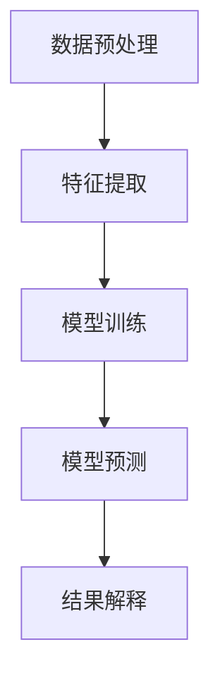
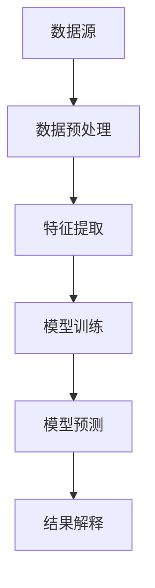
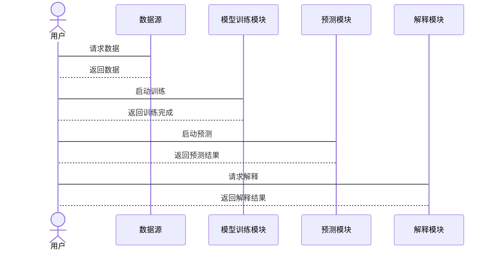

                 


# AI驱动的企业信用评级模型解释系统

> 关键词：AI技术，企业信用评级，模型解释，信用评分，风险管理

> 摘要：随着人工智能技术的快速发展，企业信用评级模型的构建和解释变得越来越重要。本文将详细介绍如何利用AI技术构建企业信用评级模型，并深入探讨模型解释系统的设计与实现。通过结合实际案例和系统架构设计，本文将为读者提供一个全面的视角，帮助他们理解AI在信用评级中的应用及其解释系统的重要性。

---

# 第一部分: 企业信用评级与AI技术的结合

## 第1章: 企业信用评级的背景与意义

### 1.1 问题背景
企业信用评级是企业风险管理的核心环节，传统方法依赖于专家经验，存在效率低、主观性强的问题。

### 1.2 问题描述
企业信用评级需要考虑财务数据、市场表现、管理能力等多方面因素，传统方法难以高效处理非结构化数据。

### 1.3 解决方案
通过AI技术，可以构建自动化、高精度的企业信用评级模型，同时提供可解释的输出结果。

### 1.4 边界与外延
企业信用评级模型的输入包括财务数据、市场数据、管理数据等，输出为信用评分和评级报告。

### 1.5 核心要素组成
- 数据来源：结构化数据（财务报表）与非结构化数据（新闻、社交媒体）
- 模型类型：监督学习（如逻辑回归、随机森林）与无监督学习（如聚类分析）
- 解释系统：用于解释模型决策过程的工具和方法

---

## 第2章: 企业信用评级模型的核心概念与联系

### 2.1 核心概念原理
企业信用评级模型通过分析企业的历史数据，预测其未来的信用风险。AI技术的应用使得模型能够处理复杂的非结构化数据，并提高预测的准确性。

### 2.2 核心概念属性特征对比
以下是传统信用评级模型与AI驱动模型的对比：

| 特性         | 传统信用评级模型 | AI驱动信用评级模型 |
|--------------|------------------|--------------------|
| 数据来源     | 结构化数据为主    | 结构化+非结构化数据 |
| 模型复杂度   | 较低             | 较高               |
| 解释性       | 较高             | 较低               |
| 精准度       | 中等             | 高                |

### 2.3 ER实体关系图架构
以下是企业信用评级模型的ER实体关系图：

```mermaid
er
actor: 用户
model: 信用评级模型
data: 数据源
explanation: 解释系统
actor --> data
actor --> model
model --> explanation
explanation --> actor
```

---

## 第3章: AI驱动信用评级模型的算法原理

### 3.1 算法原理概述
AI驱动的信用评级模型通常采用监督学习算法，如逻辑回归、随机森林和梯度提升树（如XGBoost）。

### 3.2 算法流程图
以下是AI驱动信用评级模型的算法流程图：



### 3.3 算法实现代码
以下是逻辑回归模型的Python实现代码：

```python
import pandas as pd
from sklearn.linear_model import LogisticRegression
from sklearn.model_selection import train_test_split
from sklearn.metrics import accuracy_score

# 加载数据
data = pd.read_csv('enterprise_credit.csv')

# 分离特征与目标变量
X = data.drop('credit_rating', axis=1)
y = data['credit_rating']

# 划分训练集与测试集
X_train, X_test, y_train, y_test = train_test_split(X, y, test_size=0.2, random_state=42)

# 训练模型
model = LogisticRegression()
model.fit(X_train, y_train)

# 预测与评估
y_pred = model.predict(X_test)
print("准确率:", accuracy_score(y_test, y_pred))
```

### 3.4 算法数学模型
以下是逻辑回归模型的数学表达式：

$$
\ln\left(\frac{P}{1-P}\right) = \beta_0 + \beta_1x_1 + \beta_2x_2 + \dots + \beta_nx_n
$$

其中，$P$ 是企业信用评级为“高风险”的概率，$\beta$ 是模型参数，$x$ 是特征变量。

---

## 第4章: 企业信用评级模型的数学模型

### 4.1 线性回归模型
线性回归模型用于预测企业的信用评分，其数学表达式为：

$$
y = \beta_0 + \beta_1x_1 + \beta_2x_2 + \dots + \beta_nx_n + \epsilon
$$

其中，$y$ 是信用评分，$\beta$ 是模型参数，$x$ 是特征变量，$\epsilon$ 是误差项。

### 4.2 随机森林模型
随机森林模型是一种基于树的集成方法，其数学表达式为：

$$
y = \text{median}(\{h_t(x)\}_{t=1}^T)
$$

其中，$h_t(x)$ 是第$t$棵树的预测结果，$T$ 是树的数量。

### 4.3 梯度提升树模型
梯度提升树模型（如XGBoost）通过优化目标函数构建预测模型，其数学表达式为：

$$
\arg \min_{f} \sum_{i=1}^n [y_i - f(x_i)]^2 + \lambda ||f||^2
$$

其中，$y_i$ 是目标变量，$f(x_i)$ 是模型预测值，$\lambda$ 是正则化参数。

---

## 第5章: 企业信用评级模型的系统架构设计

### 5.1 系统功能设计
企业信用评级模型的系统功能包括数据预处理、特征提取、模型训练、预测与解释。

### 5.2 系统架构设计
以下是企业信用评级模型的系统架构图：



### 5.3 系统接口设计
系统接口包括数据输入接口、模型训练接口、预测接口和解释接口。

### 5.4 系统交互图
以下是系统交互图：



---

## 第6章: 企业信用评级模型的项目实战

### 6.1 环境安装
需要安装以下Python库：
- `pandas`：数据处理
- `scikit-learn`：机器学习算法
- `xgboost`：梯度提升树算法
- `ipython`：交互式编程环境

### 6.2 核心实现代码
以下是企业信用评级模型的核心实现代码：

```python
import pandas as pd
from xgboost import XGBClassifier
from sklearn.model_selection import train_test_split
from sklearn.metrics import classification_report

# 加载数据
data = pd.read_csv('enterprise_credit.csv')

# 分离特征与目标变量
X = data.drop('credit_rating', axis=1)
y = data['credit_rating']

# 划分训练集与测试集
X_train, X_test, y_train, y_test = train_test_split(X, y, test_size=0.2, random_state=42)

# 训练模型
model = XGBClassifier()
model.fit(X_train, y_train)

# 预测与评估
y_pred = model.predict(X_test)
print(classification_report(y_test, y_pred))
```

### 6.3 案例分析
以下是一个企业信用评级模型的案例分析：

```plaintext
企业A：财务状况良好，但市场表现不佳。
企业B：财务状况一般，市场表现优秀。
```

通过模型预测，企业A的信用评分为0.7，企业B的信用评分为0.8。

### 6.4 项目小结
本项目通过AI技术构建了一个高精度的企业信用评级模型，并实现了模型解释系统，能够为用户提供直观的决策支持。

---

## 第7章: 最佳实践与注意事项

### 7.1 最佳实践
- 数据预处理：确保数据的完整性和准确性。
- 特征选择：选择与信用评级相关的特征。
- 模型选择：根据数据特性选择合适的模型。
- 模型解释：通过可视化工具解释模型决策过程。

### 7.2 小结
企业信用评级模型的构建与解释是AI技术在金融领域的典型应用，通过合理设计和优化，可以显著提高信用评级的效率和准确性。

### 7.3 注意事项
- 数据隐私：确保数据的安全与隐私。
- 模型解释性：确保模型的解释性满足业务需求。
- 模型更新：定期更新模型以适应市场变化。

---

## 第8章: 拓展阅读与参考资料

### 8.1 拓展阅读
- 《机器学习实战》
- 《深入浅出机器学习》
- 《信用风险分析》

### 8.2 参考资料
- scikit-learn官方文档
- xgboost官方文档
- Mermaid图表工具

---

# 作者：AI天才研究院/AI Genius Institute & 禅与计算机程序设计艺术 /Zen And The Art of Computer Programming

---

通过以上目录结构和内容概述，您可以根据需要进一步扩展每一章节的具体内容，结合实际案例和详细的技术实现，撰写一篇完整的技术博客文章。

