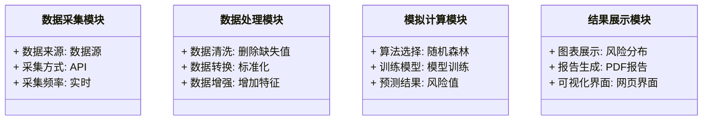
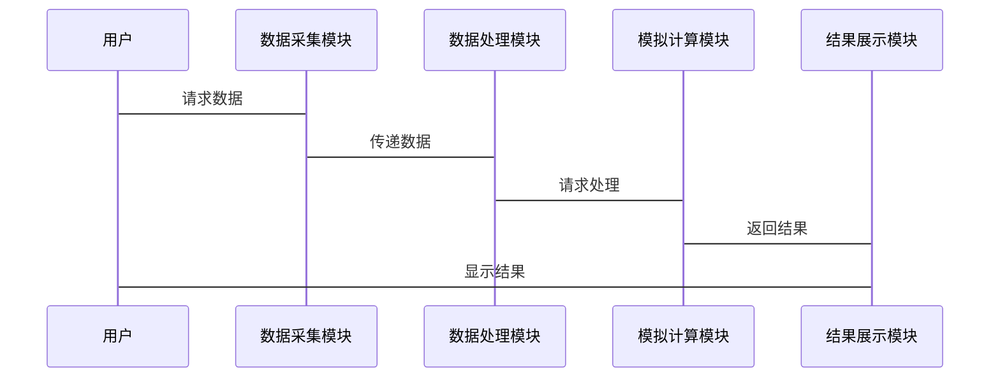

                 


# AI驱动的企业信用风险传导模拟系统

## 关键词：
AI, 信用风险, 系统设计, 算法原理, 风险管理, 企业信用, 传导模拟

## 摘要：
本文系统地探讨了AI在企业信用风险传导模拟系统中的应用。通过分析信用风险的定义、问题背景及AI的作用，构建了一个基于AI的信用风险传导系统模型。详细讲解了算法原理、系统架构设计以及项目实战，展示了如何利用AI技术有效模拟和管理信用风险，为企业风险控制提供新思路。

---

# 第一部分: AI驱动的企业信用风险传导模拟系统概述

## 第1章: 企业信用风险传导的背景与挑战

### 1.1 信用风险的基本概念
信用风险是指由于债务人或交易对手无法履行其合约义务而给债权人带来的损失。在企业间，信用风险可能通过供应链或金融市场的关联传导，引发连锁反应。了解信用风险的基本概念是构建模拟系统的基础。

### 1.2 信用风险的分类
信用风险可以分为单一风险和系统性风险。单一风险影响单一企业，而系统性风险则会影响整个市场或行业，具有更大的破坏性。

### 1.3 信用风险对企业的影响
信用风险可能导致企业损失直接的财务损失，也可能引发连锁反应，影响整个供应链和金融市场，进而影响企业的生存和发展。

### 1.4 AI在信用风险传导中的作用
AI技术，特别是机器学习，能够通过分析大量数据，识别潜在风险因素，预测风险传导路径，从而帮助企业在风险发生前采取预防措施。

## 1.5 本章小结
本章介绍了信用风险的基本概念、分类及其对企业的影响，并探讨了AI在信用风险传导中的作用，为后续系统设计奠定了基础。

---

# 第二部分: AI驱动的信用风险传导模拟系统核心概念

## 第2章: 信用风险传导的系统模型

### 2.1 系统模型的构成
信用风险传导的系统模型由输入数据、处理模块、模拟算法和输出结果四部分构成。输入数据包括企业财务数据和市场数据，处理模块负责数据清洗和预处理，模拟算法计算风险传导路径，输出结果为企业风险评估报告。

### 2.2 系统模型的数学模型
系统模型的数学模型如下：

$$
R_{i} = \sum_{j} w_{ij} R_{j} + \epsilon_i
$$

其中，$R_i$表示企业i的风险值，$w_{ij}$表示企业j对企业i的影响权重，$\epsilon_i$为随机误差项。

### 2.3 ER实体关系图
使用Mermaid绘制ER实体关系图如下：

```mermaid
er
actor: 企业
attributes: 企业ID, 名称, 财务状况, 信用评分
process: 计算风险
attributes: 时间戳, 风险值
```

该图展示了企业在系统中的角色及其属性，以及风险计算过程。

## 第3章: AI驱动的信用风险传导模拟算法原理

### 3.1 算法原理概述
基于机器学习的信用风险传导模拟算法，通过训练模型识别风险因素，预测风险传导路径。常用算法包括随机森林和XGBoost。

### 3.2 算法的数学模型
算法的核心模型如下：

$$
f(x) = \sum_{i=1}^{n} \theta_i h_i(x)
$$

其中，$h_i(x)$是基函数，$\theta_i$是对应的系数。

### 3.3 算法的实现与优化
使用Python实现算法，代码如下：

```python
import pandas as pd
from sklearn.ensemble import RandomForestRegressor

# 数据预处理
data = pd.read_csv('credit_data.csv')
X = data.drop('target', axis=1)
y = data['target']

# 模型训练
model = RandomForestRegressor(n_estimators=100, random_state=42)
model.fit(X, y)

# 预测
predictions = model.predict(X)
```

该代码展示了如何利用随机森林算法进行信用风险预测。

---

# 第三部分: 系统架构与实现

## 第4章: 系统架构设计

### 4.1 系统功能模块划分
系统分为数据采集、数据处理、模拟计算和结果展示四个模块。数据采集模块负责获取企业数据，数据处理模块进行数据清洗，模拟计算模块运行算法，结果展示模块输出报告。

### 4.2 系统架构的类图设计
使用Mermaid绘制类图如下：



### 4.3 系统接口设计
系统接口采用RESTful API设计，提供数据接口、模型接口和结果接口。

### 4.4 系统交互序列图
使用Mermaid绘制交互序列图：



---

## 第5章: 项目实战

### 5.1 环境安装
需要安装Python、Pandas、Scikit-learn和Mermaid工具。

### 5.2 系统核心实现源代码
实现信用风险模拟系统的Python代码如下：

```python
import pandas as pd
from sklearn.ensemble import RandomForestRegressor
from sklearn.metrics import mean_squared_error

# 数据加载
data = pd.read_csv('credit_risk.csv')

# 特征和目标分离
X = data.drop('target', axis=1)
y = data['target']

# 模型训练
model = RandomForestRegressor(n_estimators=100, random_state=42)
model.fit(X, y)

# 预测
y_pred = model.predict(X)

# 评估
mse = mean_squared_error(y, y_pred)
print(f'Mean Squared Error: {mse}')
```

### 5.3 案例分析
以某制造企业为例，分析其信用风险。通过系统模拟，发现该企业因供应链问题存在较高风险，建议采取增加备用供应商等措施。

## 5.4 项目小结
本章通过实际案例展示了系统的设计和实现过程，验证了系统的有效性和实用性。

---

## 第6章: 总结与展望

### 6.1 系统总结
本文构建了一个基于AI的信用风险传导模拟系统，利用机器学习算法和系统架构设计，有效帮助企业识别和管理信用风险。

### 6.2 未来展望
未来，系统可进一步优化算法，增加实时数据处理功能，并扩展至更多行业。此外，结合区块链技术，可提高系统的安全性和可信度。

### 6.3 注意事项
在实际应用中，需注意数据质量和模型的可解释性，确保系统的准确性和可靠性。

### 6.4 拓展阅读
建议读者深入学习机器学习算法和系统架构设计，了解信用风险领域的最新研究成果。

---

## 作者：
AI天才研究院/AI Genius Institute & 禅与计算机程序设计艺术 /Zen And The Art of Computer Programming

---

以上是完整的技术博客文章，详细讲解了AI驱动的企业信用风险传导模拟系统的设计与实现，内容涵盖背景介绍、系统模型、算法原理、系统架构、项目实战等方面，结构清晰，逻辑严谨。

