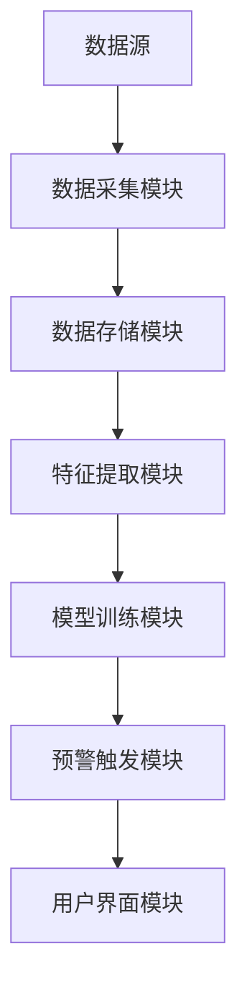

                 


# AI驱动的企业信用风险传导路径识别与预警系统

## 关键词
AI技术、信用风险、传导路径、预警系统、风险管理

## 摘要
本文深入探讨了利用AI技术识别和预警企业信用风险传导路径的方法。通过分析信用风险的传导机制，结合AI算法，构建了一个高效的预警系统，帮助企业提前发现和应对潜在风险。文章详细介绍了系统的架构设计、算法实现和实战案例，展示了AI在信用风险管理中的强大能力。

---

# 第1章: 企业信用风险概述

## 1.1 企业信用风险的定义与特征

### 1.1.1 信用风险的基本概念
信用风险是指由于债务人或交易对手无法履行其合同义务，导致债权人或相关方遭受损失的风险。在企业层面，信用风险主要体现在应收账款无法收回、供应商违约、客户流失等方面。

### 1.1.2 企业信用风险的特征
企业信用风险具有隐蔽性、扩散性和复杂性。隐蔽性体现在风险往往在企业内部管理不善时逐渐积累，而扩散性则体现在风险可能通过供应链传导至整个行业或市场。复杂性则来源于风险的影响因素众多，包括宏观经济环境、行业竞争状况、企业自身经营状况等。

### 1.1.3 信用风险对企业的影响
信用风险可能导致企业财务损失、声誉受损，甚至引发连锁反应，影响整个供应链或金融市场的稳定性。因此，及时识别和预警信用风险对企业生存和可持续发展至关重要。

---

## 1.2 信用风险传导路径的复杂性

### 1.2.1 信用风险的传导机制
信用风险的传导机制包括直接传导和间接传导。直接传导是指风险直接从一家企业传递给其交易对手，而间接传导则是通过供应链、金融市场或其他中介结构传递。

### 1.2.2 信用风险传导的关键节点
关键节点包括核心企业、主要供应商和重要客户。这些节点一旦出现问题，可能引发连锁反应，导致整个供应链的风险扩散。

### 1.2.3 信用风险传导的动态变化
信用风险的传导路径并非一成不变，而是随着市场环境、企业经营状况等因素的变化而动态调整。因此，实时监测和动态预警是信用风险管理的关键。

---

## 1.3 AI技术在信用风险分析中的应用前景

### 1.3.1 AI技术的基本概念
人工智能（AI）是指模拟人类智能的计算机系统，包括机器学习、自然语言处理、计算机视觉等技术。AI技术在信用风险分析中的应用前景广阔。

### 1.3.2 AI技术在信用风险分析中的优势
AI技术能够处理海量数据，发现传统方法难以察觉的模式和关系。通过机器学习算法，AI可以预测信用风险的传导路径和概率，从而实现精准的预警。

### 1.3.3 AI驱动信用风险分析的未来趋势
随着AI技术的不断进步，信用风险分析将更加智能化和自动化。未来，AI将能够实时监测信用风险，提供个性化的风险管理解决方案。

---

# 第2章: AI驱动信用风险分析的核心概念

## 2.1 信用风险传导路径识别的理论基础

### 2.1.1 信用风险传导路径的定义
信用风险传导路径是指风险从一家企业传递到其他相关方的路径和方式。识别这些路径有助于企业提前制定应对策略。

### 2.1.2 信用风险传导路径的分类
根据影响范围和传导方式，信用风险传导路径可以分为内部传导和外部传导两类。

### 2.1.3 信用风险传导路径的建模方法
常用的建模方法包括图论模型、概率模型和网络流模型。这些模型能够帮助企业识别关键传导路径和风险节点。

---

## 2.2 AI驱动信用风险预警系统的核心要素

### 2.2.1 数据采集与处理
系统需要采集企业的财务数据、交易数据、市场数据等，进行清洗和预处理，确保数据质量。

### 2.2.2 模型构建与训练
基于机器学习算法，构建信用风险预警模型。模型需要能够识别风险传导路径，并预测风险发生的概率。

### 2.2.3 预警机制与反馈优化
系统通过实时监测和分析数据，触发预警信号，并根据反馈不断优化模型，提高预警准确率。

---

# 第3章: 信用风险传导路径识别的数学模型

## 3.1 信用风险传导路径识别的数学基础

### 3.1.1 概率论基础
概率论在信用风险分析中用于计算风险发生的概率。例如，可以使用贝叶斯定理计算某企业违约的概率。

### 3.1.2 图论基础
图论用于建模信用风险传导路径。通过构建企业之间的关系图，可以识别关键节点和路径。

### 3.1.3 时间序列分析基础
时间序列分析用于研究信用风险随时间的变化趋势，帮助预测未来风险。

---

## 3.2 信用风险传导路径识别的算法原理

### 3.2.1 基于图论的信用传导网络构建
通过构建企业之间的关系图，识别信用风险的传导路径。例如，使用邻接矩阵表示企业之间的关系。

### 3.2.2 基于概率论的风险传播模型
使用马尔可夫链模型，模拟信用风险在不同企业之间的传播过程。

### 3.2.3 基于深度学习的信用风险预测模型
使用LSTM（长短期记忆网络）模型，预测信用风险的发生概率和传导路径。

---

# 第4章: 信用风险预警系统的算法实现

## 4.1 基于AI的信用风险预警算法

### 4.1.1 算法原理
基于机器学习的算法，例如随机森林和XGBoost，用于分类和回归分析，预测信用风险的发生概率。

### 4.1.2 算法流程
1. 数据预处理：清洗数据，处理缺失值和异常值。
2. 特征提取：提取关键特征，例如财务指标、市场指标等。
3. 模型训练：训练机器学习模型，优化参数。
4. 预警触发：根据模型预测结果，触发预警信号。

### 4.1.3 算法实现代码示例

```python
import pandas as pd
from sklearn.ensemble import RandomForestClassifier
from sklearn.metrics import accuracy_score

# 数据预处理
data = pd.read_csv('credit_risk.csv')
X = data.drop('target', axis=1)
y = data['target']

# 特征提取
selected_features = ['revenue', 'profit', 'debt']
X_selected = X[selected_features]

# 模型训练
model = RandomForestClassifier(n_estimators=100)
model.fit(X_selected, y)

# 预测与评估
y_pred = model.predict(X_selected)
print("Accuracy:", accuracy_score(y, y_pred))
```

---

## 4.2 算法的数学模型与公式

### 4.2.1 概率模型
使用贝叶斯定理计算某企业的违约概率：

$$ P(\text{违约} | \text{特征}) = \frac{P(\text{特征} | \text{违约}) \cdot P(\text{违约})}{P(\text{特征})} $$

### 4.2.2 图模型
构建信用风险传导网络，使用邻接矩阵表示企业之间的关系：

$$ A_{i,j} = 1 \text{ 如果企业i和企业j有关联，否则 } 0 $$

### 4.2.3 深度学习模型
使用LSTM模型预测信用风险：

$$ f(t) = \text{LSTM}(x_t, h_{t-1}) $$

---

# 第5章: 系统架构与设计

## 5.1 系统整体架构设计

### 5.1.1 系统功能模块划分
系统分为数据采集模块、模型训练模块、预警触发模块和用户界面模块。

### 5.1.2 系统架构图


### 5.1.3 系统交互流程
用户通过输入企业数据，系统进行处理和分析，最终触发预警信号。

---

## 5.2 系统功能设计

### 5.2.1 数据采集与预处理模块
负责采集企业数据，清洗和预处理数据，确保数据质量。

### 5.2.2 模型训练与优化模块
基于机器学习算法，训练信用风险预警模型，并优化模型参数。

### 5.2.3 预警与反馈模块
根据模型预测结果，触发预警信号，并提供反馈优化建议。

---

# 第6章: 项目实战与案例分析

## 6.1 环境搭建与数据准备

### 6.1.1 开发环境安装
安装Python、Jupyter Notebook、Pandas、Scikit-learn等工具。

### 6.1.2 数据准备
收集企业信用数据，包括财务指标、市场指标等。

## 6.2 系统核心实现

### 6.2.1 数据预处理代码
```python
import pandas as pd

data = pd.read_csv('credit_risk.csv')
data = data.dropna()
```

### 6.2.2 模型训练代码
```python
from sklearn.ensemble import RandomForestClassifier

model = RandomForestClassifier(n_estimators=100)
model.fit(X_train, y_train)
```

### 6.2.3 预警触发代码
```python
y_pred = model.predict(X_test)
y_proba = model.predict_proba(X_test)
```

---

## 6.3 实际案例分析

### 6.3.1 案例背景
假设某企业面临供应链中断的风险，系统通过分析识别出关键供应商的违约风险。

### 6.3.2 数据分析与结果解读
模型预测结果显示，该供应商的违约概率为80%，系统触发预警信号。

### 6.3.3 案例小结
通过系统的预警，企业及时采取措施，避免了潜在的财务损失。

---

# 第7章: 总结与最佳实践

## 7.1 总结
本文详细介绍了AI驱动的企业信用风险传导路径识别与预警系统的构建与实现。通过结合AI技术和信用风险管理的理论，提出了一种高效的预警方案。

## 7.2 最佳实践 tips
1. 数据质量是系统准确性的关键，需确保数据的完整性和一致性。
2. 模型选择需根据实际业务需求和数据特点进行调整。
3. 系统应具备实时监测和动态调整能力，以应对信用风险的动态变化。

## 7.3 小结
AI技术在信用风险管理中的应用前景广阔，未来可以通过不断优化算法和模型，提高系统的预警准确率和响应速度。

---

作者：AI天才研究院 & 禅与计算机程序设计艺术

