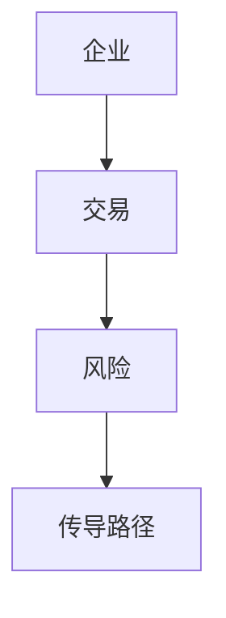
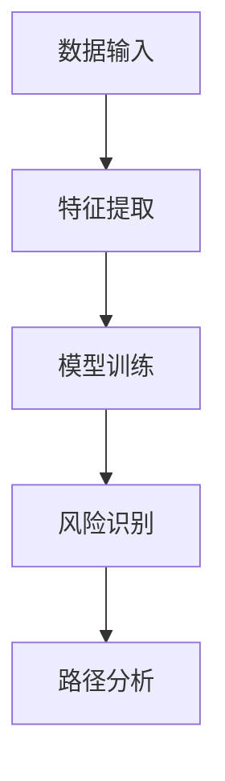
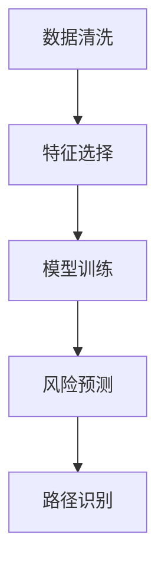
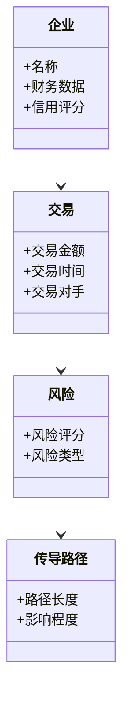
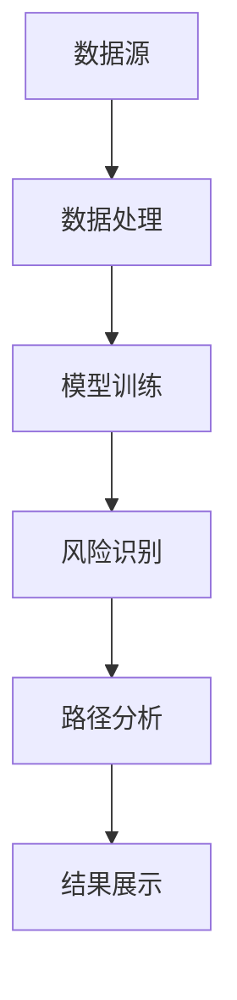
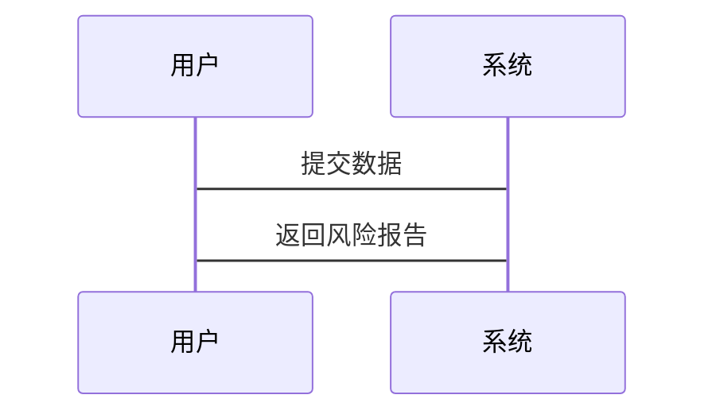

                 


# AI驱动的企业信用风险传导路径识别系统

**关键词：** AI技术，信用风险，企业风险，路径识别，系统架构

**摘要：**  
本文系统阐述了AI技术在企业信用风险传导路径识别中的应用，结合实际案例，深入分析了基于机器学习的风险识别方法，构建了完整的系统架构，并提出了创新的解决方案。通过本文，读者将了解如何利用AI技术高效识别和管理企业信用风险，掌握相关的技术原理和实践方法。

---

# 第一部分：AI驱动的企业信用风险传导路径识别系统概述

## 第1章：企业信用风险传导路径识别的背景与挑战

### 1.1 信用风险的基本概念  
- **1.1.1 信用风险的定义**  
  信用风险是指由于债务人或交易对手无法履行其合约义务而给债权人带来的损失。  
- **1.1.2 信用风险的分类**  
  - 企业信用风险：企业因经营不善或外部环境变化导致的违约风险。  
  - 金融信用风险：金融机构在金融交易中面临的信用风险。  
  - 供应链信用风险：供应链中的企业因某一方违约而引发的风险。  

### 1.2 企业信用风险传导路径的复杂性  
- **1.2.1 风险传导的基本原理**  
  风险通常通过企业之间的交易、供应链关系或金融市场传导。  
- **1.2.2 传统风险识别方法的局限性**  
  - 数据维度有限：传统方法难以捕捉复杂的风险传导路径。  
  - 计算效率低：面对海量数据时，传统方法效率不足。  
- **1.2.3 数据驱动的风险识别需求**  
  随着企业间交易的复杂化，数据驱动的方法成为必然选择。  

### 1.3 AI技术在信用风险识别中的应用潜力  
- **1.3.1 AI技术的基本概念**  
  AI技术通过模拟人类学习和推理能力，实现数据的自动分析和模式识别。  
- **1.3.2 AI在金融领域的应用现状**  
  - 信用评分：AI模型用于评估客户的信用风险。  
  - 风险预测：AI用于预测企业违约概率。  
- **1.3.3 AI驱动信用风险识别的优势**  
  - 高效性：AI能够快速处理海量数据。  
  - 准确性：AI模型能够捕捉复杂的风险模式。  

### 1.4 本章小结  
本章介绍了信用风险的基本概念，分析了传统方法的局限性，并探讨了AI技术在信用风险识别中的应用潜力。

---

## 第2章：信用风险传导路径识别的核心概念与联系

### 2.1 核心概念的定义与属性  
- **2.1.1 信用风险传导路径的定义**  
  风险从一个企业或市场传递到另一个企业或市场的路径。  
- **2.1.2 数据源的分类与特征**  
  - 数据源：企业财务数据、供应链数据、市场数据、新闻数据等。  
  - 数据特征：高维性、时序性、关联性。  

### 2.2 实体关系图与流程图  
- **2.2.1 实体关系图（ER图）**  

- **2.2.2 流程图**  


### 2.3 核心概念的对比分析  
- **2.3.1 数据源与模型的对比**  
  - 数据源的多样性影响模型的复杂性。  
  - 高维数据可能导致模型过拟合。  
- **2.3.2 不同模型的性能对比**  
  - 基于机器学习的模型（如随机森林、神经网络）通常优于传统统计模型。  

### 2.4 本章小结  
本章通过ER图和流程图展示了信用风险传导路径识别的核心概念，并分析了不同数据源和模型的优劣。

---

## 第3章：AI驱动信用风险传导路径识别的算法原理

### 3.1 算法概述  
- **3.1.1 算法选择**  
  基于机器学习的算法，如随机森林、梯度提升树（GBDT）、神经网络等。  

### 3.2 算法的数学模型与公式  
- **3.2.1 随机森林模型**  
  - 模型原理：通过构建多棵决策树并集成预测结果。  
  - 模型公式：$$\text{预测结果} = \text{多数投票}(\text{树预测结果})$$  

### 3.3 算法流程与实现  
- **3.3.1 算法流程图**  

- **3.3.2 代码实现**  
  ```python
  import pandas as pd
  from sklearn.ensemble import RandomForestClassifier

  # 数据加载与预处理
  df = pd.read_csv('credit_data.csv')
  X = df.drop('target', axis=1)
  y = df['target']

  # 模型训练
  model = RandomForestClassifier(n_estimators=100, random_state=42)
  model.fit(X, y)

  # 风险预测
  predictions = model.predict(X)
  ```

### 3.4 算法性能分析  
- **3.4.1 模型评估**  
  - 准确率：$$\text{准确率} = \frac{\text{正确预测数}}{\text{总样本数}}$$  
  - 召回率：$$\text{召回率} = \frac{\text{正确预测的正例数}}{\text{实际正例数}}$$  

### 3.5 本章小结  
本章详细介绍了AI驱动信用风险传导路径识别的算法原理，包括模型选择、实现过程和性能分析。

---

## 第4章：系统分析与架构设计

### 4.1 系统应用场景  
- **4.1.1 企业信用风险评估**  
  - 应用于企业贷款审批、供应链管理等场景。  

### 4.2 系统功能设计  
- **4.2.1 领域模型**  


### 4.3 系统架构设计  
- **4.3.1 系统架构图**  


### 4.4 系统接口设计  
- **4.4.1 数据接口**  
  - 数据输入接口：从数据库或文件读取数据。  
  - 数据输出接口：将结果输出到报告或可视化界面。  

### 4.5 系统交互设计  
- **4.5.1 交互流程图**  


### 4.6 本章小结  
本章从系统架构和功能设计的角度，详细阐述了AI驱动信用风险传导路径识别系统的实现方案。

---

## 第5章：项目实战与案例分析

### 5.1 项目实战环境安装  
- **5.1.1 环境配置**  
  - 安装Python、Pandas、Scikit-learn等库。  

### 5.2 系统核心实现  
- **5.2.1 代码实现**  
  ```python
  import pandas as pd
  from sklearn.ensemble import RandomForestClassifier

  # 数据加载与预处理
  df = pd.read_csv('credit_data.csv')
  X = df.drop('target', axis=1)
  y = df['target']

  # 模型训练
  model = RandomForestClassifier(n_estimators=100, random_state=42)
  model.fit(X, y)

  # 风险预测
  predictions = model.predict(X)
  ```

### 5.3 案例分析  
- **5.3.1 实际案例**  
  - 某企业供应链中的信用风险传导路径识别。  

### 5.4 详细讲解剖析  
- **5.4.1 数据分析**  
  - 使用特征重要性分析，找出影响信用风险的关键因素。  

### 5.5 项目小结  
本章通过实际案例展示了AI驱动信用风险传导路径识别系统的实现过程和效果。

---

## 第6章：最佳实践与总结

### 6.1 最佳实践 tips  
- **数据预处理**：确保数据的完整性和准确性。  
- **模型选择**：根据具体场景选择合适的算法。  
- **结果验证**：通过回测和交叉验证评估模型性能。  

### 6.2 小结  
本文详细探讨了AI驱动信用风险传导路径识别系统的实现方法，从理论到实践，为读者提供了全面的指导。

### 6.3 注意事项  
- 数据隐私问题：确保数据的合法性和合规性。  
- 模型解释性：选择可解释性较高的模型，便于业务理解。  

### 6.4 拓展阅读  
- 推荐阅读《机器学习实战》和《深入浅出人工智能》。

---

**作者：AI天才研究院/AI Genius Institute & 禅与计算机程序设计艺术 /Zen And The Art of Computer Programming**

---

以上是《AI驱动的企业信用风险传导路径识别系统》的完整目录大纲和内容概述。

