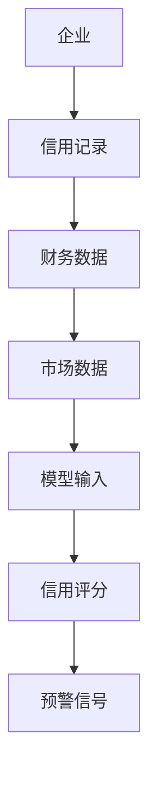
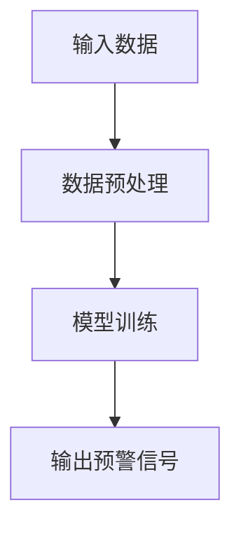
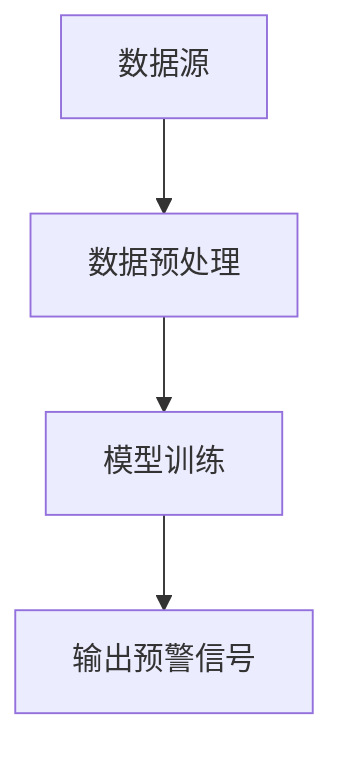
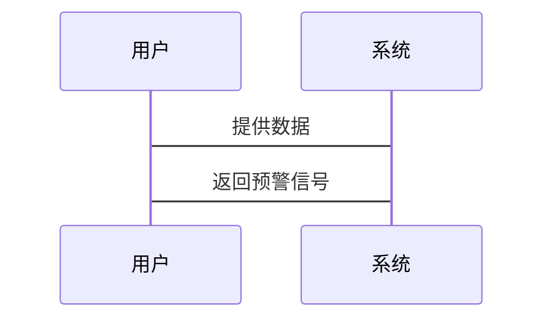
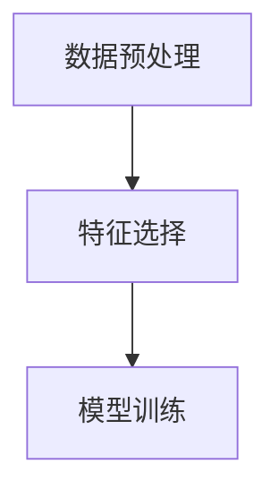
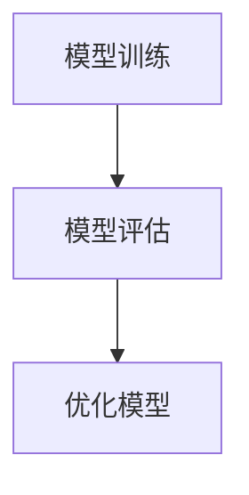

                 

# AI驱动的企业信用风险早期预警信号识别系统

> **关键词**: 人工智能, 信用风险, 早期预警, 风险评估, 系统架构

> **摘要**: 本文探讨了如何利用人工智能技术构建企业信用风险早期预警系统。通过分析信用风险的本质及其对企业的影响，详细阐述了AI驱动的预警系统的核心概念、算法原理、系统架构以及实际应用场景。文章从背景介绍、核心概念、算法实现、系统设计到项目实战，全面解析了如何利用AI技术实现企业信用风险的早期识别与预警，为企业风险管理提供了一种高效、智能的解决方案。

---

## 第1章: 企业信用风险与AI的结合

### 1.1 信用风险的基本概念

#### 1.1.1 信用风险的定义与特征

信用风险是指企业在履行合同义务时，由于企业或其交易对手方的违约行为，导致债权人或投资者遭受损失的可能性。它是金融领域中最重要且复杂的风险管理之一。信用风险的特征包括：

- **不确定性**: 企业的信用状况受多种因素影响，如经济环境、企业管理状况等。
- **动态性**: 信用风险会随着市场环境的变化而变化。
- **传染性**: 信用风险可能通过供应链或金融市场传播，导致系统性风险。

#### 1.1.2 信用风险对企业的影响

信用风险不仅影响企业的财务状况，还可能引发连锁反应，影响整个金融市场的稳定性。具体表现在：

- **直接损失**: 企业违约导致债权人或投资者的直接经济损失。
- **间接影响**: 信用风险的蔓延可能引发金融市场波动，影响整体经济。

#### 1.1.3 信用风险的分类与评估方法

信用风险可以分为系统性风险和非系统性风险。评估方法包括：

- **信用评分模型**: 如FICO评分、Z分数模型。
- **违约概率模型**: 如Merton模型。

### 1.2 AI在信用风险中的应用

#### 1.2.1 AI技术在金融领域的应用现状

AI技术在金融领域的应用广泛，包括交易自动化、 fraud detection、信用评估等。AI技术的优势在于其强大的数据处理能力和模式识别能力。

#### 1.2.2 信用风险预警的痛点与挑战

传统信用风险评估方法存在以下问题：

- 数据量大，难以处理。
- 模型复杂，难以实时预警。
- 人工干预多，效率低。

#### 1.2.3 AI驱动信用风险预警的优势

AI技术的优势在于：

- **自动化**: 可以实时处理大量数据，快速识别风险。
- **高精度**: 通过机器学习模型，可以准确预测信用风险。
- **可扩展性**: 可以同时处理多个企业的信用评估。

---

## 第2章: 企业信用风险早期预警系统的核心概念

### 2.1 核心概念与问题背景

#### 2.1.1 问题背景与目标

本文的目标是通过AI技术构建一个企业信用风险早期预警系统，实现对企业信用风险的实时监测和预警。

#### 2.1.2 问题描述与解决方法

企业信用风险的主要问题在于难以及时发现潜在风险。解决方法是通过AI技术，建立实时监测和预警机制。

#### 2.1.3 系统的边界与外延

系统的边界包括数据输入、模型训练和预警输出。外延包括数据源的多样性和预警的实时性。

### 2.2 核心概念与联系

#### 2.2.1 核心概念的原理与属性

核心概念包括数据预处理、特征选择、模型训练和预警输出。

#### 2.2.2 核心概念的对比分析（表格形式）

| 概念         | 描述                                   |
|--------------|----------------------------------------|
| 数据预处理   | 对数据进行清洗和标准化                 |
| 特征选择     | 选择对信用风险影响最大的特征           |
| 模型训练     | 训练机器学习模型以预测信用风险         |
| 预警输出     | 根据模型预测结果生成预警信号           |

#### 2.2.3 实体关系图（Mermaid流程图）

---

## 第3章: AI驱动信用风险预警的系统架构

### 3.1 系统整体架构

#### 3.1.1 系统功能模块划分

系统功能模块包括数据采集、数据预处理、模型训练和预警输出。

#### 3.1.2 系统架构设计（Mermaid架构图）

### 3.2 数据流与交互流程

#### 3.2.1 数据流分析（Mermaid流程图）

#### 3.2.2 系统交互流程（Mermaid序列图）

---

## 第4章: 关键算法与数学模型

### 4.1 算法原理

#### 4.1.1 特征工程与数据预处理（Mermaid流程图）

#### 4.1.2 模型训练与评估（Mermaid流程图）

### 4.2 数学模型与公式

#### 4.2.1 逻辑回归模型

逻辑回归的损失函数为：

$$ L(y, y') = -\sum_{i=1}^n (y_i \ln y'_i + (1-y_i) \ln (1-y'_i)) $$

其中，$y$ 是真实标签，$y'$ 是预测概率。

#### 4.2.2 随机森林模型

随机森林通过集成多个决策树模型，提高预测准确率。

#### 4.2.3 XGBoost模型

XGBoost模型的正则化项为：

$$ \Omega(f) = \gamma T + \frac{1}{\lambda} \sum |j \in f.tree| \theta_j^2 $$

---

## 第5章: 项目实战与案例分析

### 5.1 环境搭建与数据准备

#### 5.1.1 开发环境安装与配置

需要安装Python、scikit-learn、XGBoost等库。

#### 5.1.2 数据集获取与预处理

使用公开数据集，如Kaggle上的信用评分数据集，进行数据清洗和标准化。

### 5.2 系统核心实现

#### 5.2.1 特征选择与模型训练

选择重要的特征，如收入、负债、利润等，进行模型训练。

#### 5.2.2 模型评估与优化

通过交叉验证评估模型性能，调整超参数优化模型。

### 5.3 案例分析

通过实际数据训练模型，生成预警信号，评估模型的准确性和及时性。

---

## 第6章: 最佳实践、小结与展望

### 6.1 最佳实践

- 数据质量是关键，需确保数据的完整性和准确性。
- 模型的选择需根据实际业务需求。

### 6.2 小结

本文详细介绍了AI驱动的企业信用风险早期预警系统的构建过程，包括背景、核心概念、算法实现、系统设计和项目实战。

### 6.3 注意事项

- 数据隐私和安全需高度重视。
- 模型需定期更新，以适应市场变化。

### 6.4 拓展阅读

推荐阅读相关书籍和论文，深入学习信用风险评估和AI技术。

---

## 作者信息

**作者**: AI天才研究院/AI Genius Institute & 禅与计算机程序设计艺术/Zen And The Art of Computer Programming

---

通过以上结构和内容，文章详细介绍了AI驱动的企业信用风险早期预警系统的构建过程，涵盖了从背景到实现的各个方面，为企业信用风险管理提供了有价值的参考。

