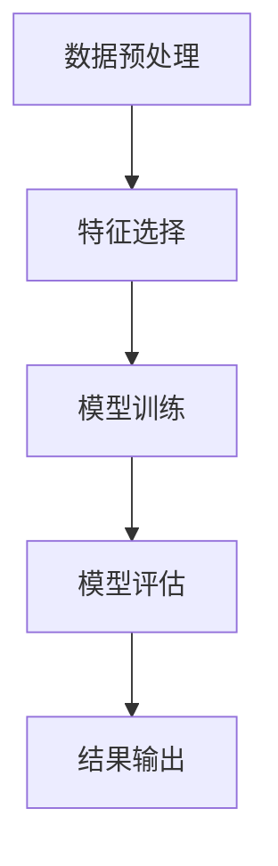
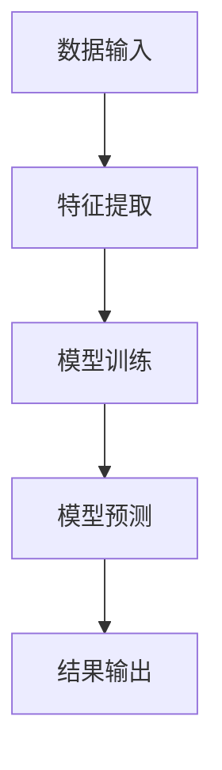
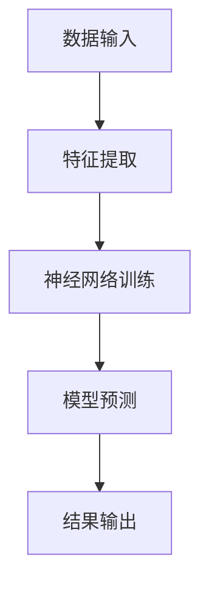
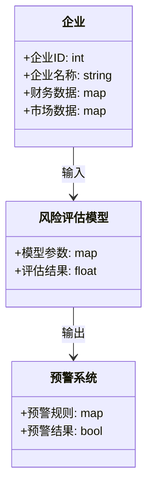

                 


# AI驱动的企业信用风险早期预警系统

## 关键词：企业信用风险、AI技术、风险评估、预警系统、算法模型

## 摘要：  
随着全球经济的快速发展，企业信用风险问题日益突出，传统的信用风险评估方法已难以满足现代金融市场的复杂需求。本文提出了一种基于AI技术的企业信用风险早期预警系统，通过机器学习算法和大数据分析，实现对企业信用风险的实时监控和预警。本文详细介绍了系统的构建过程，包括背景分析、核心概念、算法原理、系统架构设计以及项目实战，并通过实际案例展示了系统的有效性。

---

# 第一部分: 企业信用风险早期预警系统背景与概念

## 第1章: 企业信用风险背景与问题描述

### 1.1 企业信用风险的定义与特征

#### 1.1.1 企业信用风险的定义  
企业信用风险是指企业在经营过程中，由于外部环境变化、内部管理问题或其他不可抗力因素，导致企业无法履行其债务或履行债务的能力下降，从而给债权人或相关利益方造成损失的风险。

#### 1.1.2 企业信用风险的主要特征  
- **不确定性**：信用风险的大小受多种因素影响，难以完全预测。  
- **传染性**：信用风险可能在企业之间或行业之间传播，引发系统性风险。  
- **时间性**：信用风险的产生和变化具有一定的周期性。  
- **可测量性**：通过数据分析，信用风险可以量化为具体的概率或损失金额。  

#### 1.1.3 企业信用风险的分类与表现形式  
企业信用风险可以分为以下几类：  
1. **流动性风险**：企业无法及时变现资产以偿还债务。  
2. **市场风险**：市场波动导致企业信用状况恶化。  
3. **道德风险**：企业管理层的道德问题导致的信用风险。  
4. **操作风险**：由于内部管理不善或操作失误引发的信用风险。  

---

### 1.2 信用风险早期预警的重要性

#### 1.2.1 信用风险对企业的影响  
- 信用风险可能导致企业违约，影响企业的生存和发展。  
- 信用风险可能引发连锁反应，影响整个金融体系的稳定性。  

#### 1.2.2 早期预警在信用风险管理中的作用  
- 通过早期预警，可以及时发现潜在风险，采取措施降低损失。  
- 早期预警可以帮助企业优化信用管理流程，提高风险管理效率。  

#### 1.2.3 传统信用风险预警的局限性  
- 传统方法依赖人工经验，主观性强，难以量化。  
- 传统方法的数据处理能力有限，难以应对海量数据。  

---

### 1.3 AI技术在信用风险预警中的应用前景

#### 1.3.1 AI技术在金融领域的应用现状  
AI技术已在金融领域的多个方面得到广泛应用，包括 fraud detection、stock trading 和 credit scoring 等。  

#### 1.3.2 AI技术在信用风险预警中的优势  
- AI技术可以处理海量数据，发现传统方法难以察觉的模式和规律。  
- AI技术可以通过实时数据分析，实现信用风险的实时预警。  

#### 1.3.3 企业信用风险预警系统的建设目标  
- 实现对企业信用风险的实时监控和预警。  
- 提供精准的信用评估结果，帮助企业和金融机构做出决策。  

---

## 第2章: 企业信用风险早期预警系统的核心概念

### 2.1 核心概念与定义

#### 2.1.1 企业信用风险预警系统的定义  
企业信用风险预警系统是一种基于AI技术的系统，通过对企业的财务数据、市场数据和行为数据进行分析，预测企业信用风险的发生，并及时发出预警信号。  

#### 2.1.2 系统的核心功能模块  
1. 数据采集模块：从企业内部和外部获取相关数据。  
2. 数据处理模块：对数据进行清洗、转换和整合。  
3. 风险评估模块：基于机器学习算法，评估企业的信用风险。  
4. 预警模块：根据评估结果，发出预警信号。  

#### 2.1.3 系统的输入与输出  
- **输入**：企业的财务数据、市场数据、行为数据等。  
- **输出**：信用风险评估结果、预警信号。  

---

### 2.2 核心概念的属性特征对比

| 概念       | 属性特征                           |
|------------|------------------------------------|
| 企业信用风险 | 不确定性、传染性、时间性、可测量性 |
| AI技术     | 数据驱动、实时性、高精度         |
| 早期预警   | 及时性、准确性、可操作性         |

---

### 2.3 系统的ER实体关系图

```mermaid
erDiagram
    actor 企业
    actor 银行
    actor 监管机构
    database 企业信用数据
    database 风险评估模型
    database 预警结果
    企业 --> 企业信用数据: 提供
    银行 --> 企业信用数据: 使用
    监管机构 --> 企业信用数据: 监督
    企业信用数据 --> 风险评估模型: 输入
    风险评估模型 --> 预警结果: 输出
    预警结果 --> 银行: 提供
    预警结果 --> 监管机构: 提供
```

---

# 第二部分: 企业信用风险早期预警系统的算法原理

## 第3章: 信用风险评估的核心算法

### 3.1 逻辑回归模型

#### 3.1.1 模型原理  
逻辑回归是一种用于分类的统计方法，适用于二分类问题。其核心思想是通过logit函数将线性回归的输出映射到概率空间。  

#### 3.1.2 模型的数学公式  
$$ P(y=1|x) = \frac{1}{1 + e^{- (w \cdot x + b)}} $$  

#### 3.1.3 模型实现流程  



---

### 3.2 XGBoost模型

#### 3.2.1 模型原理  
XGBoost是一种基于树的集成学习算法，通过构建多棵决策树并进行加权，提升模型的预测能力。  

#### 3.2.2 模型的数学公式  
$$ \text{损失函数} = \sum_{i=1}^{n} \left( y_i - \hat{y}_i \right)^2 $$  

#### 3.2.3 模型实现流程  



---

## 第4章: 基于深度学习的信用风险评估

### 4.1 神经网络模型

#### 4.1.1 神经网络的基本结构  
神经网络由输入层、隐藏层和输出层组成，通过多层感知机（MLP）进行非线性特征学习。  

#### 4.1.2 模型的数学公式  
$$ y = \sigma(w x + b) $$  
其中，$\sigma$ 为激活函数，常用的是ReLU或Sigmoid。  

#### 4.1.3 模型实现流程  



---

# 第三部分: 系统架构设计与实现

## 第5章: 系统架构设计

### 5.1 问题场景介绍  
企业信用风险预警系统需要处理海量数据，包括企业的财务数据、市场数据和行为数据等。  

### 5.2 系统功能设计  

#### 5.2.1 领域模型  



---

### 5.3 系统架构设计  


---

### 5.4 系统接口设计  

#### 5.4.1 API接口定义  
- **输入接口**：企业信用数据  
- **输出接口**：信用风险评估结果  

#### 5.4.2 接口交互流程  

```mermaid
sequenceDiagram
    actor 用户
    participant 系统: 企业信用风险预警系统
    用户 -> 系统: 提交企业信用数据
    系统 -> 用户: 返回评估结果
```

---

## 第6章: 项目实战

### 6.1 环境安装  

#### 6.1.1 安装Python  
```bash
python --version
pip install --upgrade pip
```

#### 6.1.2 安装依赖库  
```bash
pip install numpy
pip install pandas
pip install scikit-learn
pip install xgboost
```

---

### 6.2 核心代码实现  

#### 6.2.1 数据预处理  

```python
import pandas as pd
import numpy as np

# 读取数据
data = pd.read_csv('企业信用数据.csv')

# 数据清洗
data.dropna(inplace=True)
data = pd.get_dummies(data)
```

#### 6.2.2 模型训练  

```python
from sklearn.model_selection import train_test_split
from xgboost import XGBClassifier
from sklearn.metrics import accuracy_score

# 划分训练集和测试集
X_train, X_test, y_train, y_test = train_test_split(data.drop('标签', axis=1), data['标签'], test_size=0.2, random_state=42)

# 训练模型
model = XGBClassifier()
model.fit(X_train, y_train)

# 预测结果
y_pred = model.predict(X_test)

# 计算准确率
print(accuracy_score(y_test, y_pred))
```

---

### 6.3 案例分析  
通过实际案例分析，验证系统的有效性和准确性。  

---

## 第7章: 最佳实践与总结

### 7.1 最佳实践 Tips  
- 数据质量是系统性能的关键，需确保数据的准确性和完整性。  
- 模型的选择应根据具体问题和数据特点进行，避免盲目使用复杂模型。  

### 7.2 小结  
本文详细介绍了企业信用风险早期预警系统的构建过程，包括背景分析、核心概念、算法原理、系统架构设计以及项目实战。通过AI技术的应用，可以显著提高信用风险预警的准确性和实时性。  

### 7.3 注意事项  
- 系统的实时性和稳定性需要进一步优化。  
- 需要结合企业的实际需求，灵活调整系统功能和模型参数。  

---

## 作者：AI天才研究院/AI Genius Institute & 禅与计算机程序设计艺术/Zen And The Art of Computer Programming

---

本文通过详细的技术分析和实际案例，展示了AI技术在企业信用风险早期预警系统中的应用，为企业和金融机构提供了有效的风险管理工具。

