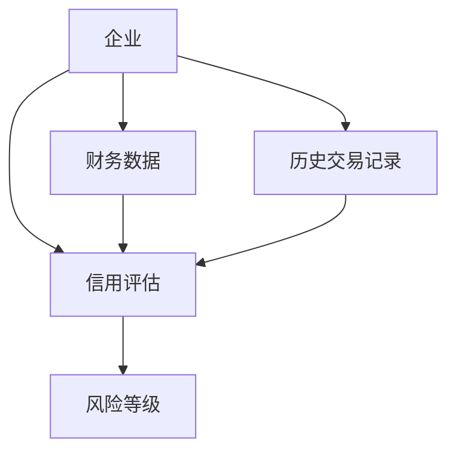
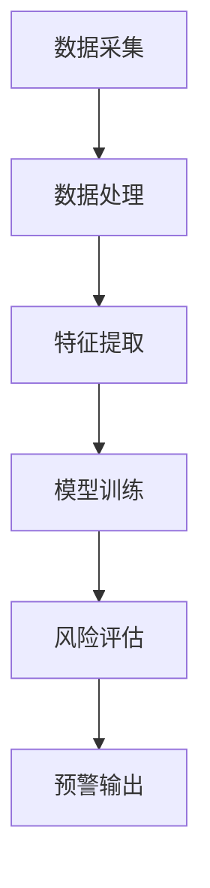
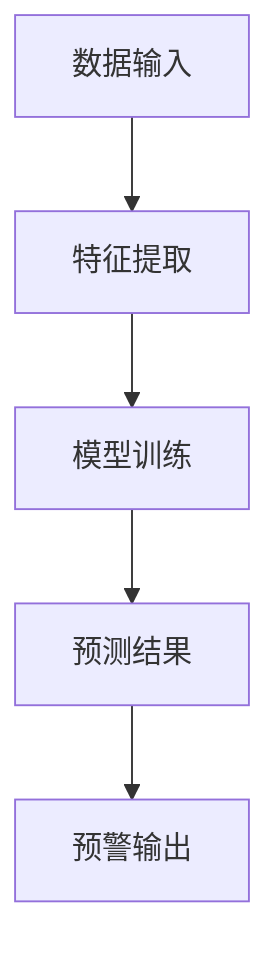
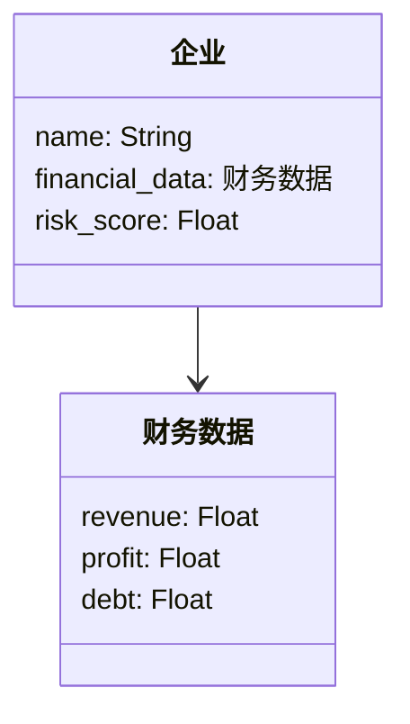

                 


# AI驱动的企业信用风险早期预警系统

> 关键词：信用风险、AI技术、机器学习、预警系统、企业信用评分

> 摘要：本文详细探讨了如何利用人工智能技术构建企业信用风险早期预警系统。通过分析信用风险的定义、特征及传统评估方法的局限性，介绍了基于AI的解决方案。文章涵盖了系统的核心概念、算法原理、系统架构设计以及实际项目实现，旨在为企业信用风险评估提供一种高效、智能的预警方法。

---

## 第1章: 问题背景与需求分析

### 1.1 信用风险的定义与特征

信用风险是指企业在履行债务过程中，由于企业或其交易对手无法履行合同义务而可能导致的损失。它贯穿于企业融资、投资和运营的各个环节，是企业风险管理中的重要组成部分。

#### 1.1.1 信用风险的基本概念
信用风险不仅包括企业自身的偿债能力，还包括外部经济环境的变化对其信用状况的影响。例如，经济衰退可能导致企业收入下降，进而影响其还款能力。

#### 1.1.2 信用风险的分类与特征
信用风险可以分为系统性风险和非系统性风险。系统性风险由整个经济体系的波动引起，而非系统性风险则由企业自身的财务状况或管理问题引起。其主要特征包括：
- **波动性**：受宏观经济周期影响较大。
- **复杂性**：涉及多方面的因素，如企业财务状况、市场环境等。
- **可预测性**：通过数据分析和模型构建，可以部分预测和防范。

#### 1.1.3 信用风险对企业的影响
信用风险可能导致企业融资成本增加、银行贷款受限，甚至引发企业破产。因此，建立有效的信用风险预警系统对于企业生存和发展至关重要。

---

### 1.2 企业信用风险早期预警的重要性

#### 1.2.1 早期预警的作用与意义
早期预警系统能够在风险发生前发出警报，帮助企业和金融机构及时采取措施，降低潜在损失。这不仅提升了企业的风险管理能力，还增强了投资者和合作伙伴的信心。

#### 1.2.2 传统信用风险评估的局限性
传统信用评估方法主要依赖财务报表分析，存在以下问题：
- 数据范围有限，难以捕捉非财务因素。
- 评估周期长，难以实时更新。
- 需要大量人工干预，效率低下。

#### 1.2.3 AI技术在信用风险预警中的优势
AI技术通过大数据分析和机器学习算法，能够从海量数据中提取有用信息，实时更新评估结果，显著提高了信用风险预警的准确性和效率。

---

## 第2章: 核心概念与系统架构

### 2.1 核心概念与原理

#### 2.1.1 AI驱动的信用风险预警模型
AI模型通过分析企业的历史数据、市场动态和行业趋势，预测其信用状况的变化。常用的模型包括逻辑回归、随机森林和神经网络。

#### 2.1.2 数据驱动的信用评估方法
数据驱动方法依赖于多源数据的整合和分析，包括企业财务数据、供应链信息、市场舆情等，构建全面的信用评估体系。

#### 2.1.3 机器学习在信用风险中的应用
机器学习能够识别数据中的非线性关系和复杂模式，适合处理信用风险中多变量、高维度的数据特征。

---

### 2.2 实体关系与系统架构

#### 2.2.1 实体关系图（ER图）


#### 2.2.2 系统架构图


---

## 第3章: 算法原理与实现

### 3.1 算法选择与原理

#### 3.1.1 逻辑回归模型
逻辑回归适用于二分类问题，常用于预测企业信用等级。其核心思想是通过最大化对数似然函数找到最佳参数。

#### 3.1.2 随机森林模型
随机森林是一种集成学习方法，通过构建多棵决策树并取其预测结果的平均值，能够有效提高模型的准确性和鲁棒性。

#### 3.1.3 神经网络模型
神经网络能够处理复杂的非线性关系，适合处理高维数据特征。

---

### 3.2 算法流程图



---

### 3.3 Python代码实现

#### 3.3.1 数据预处理
```python
import pandas as pd
data = pd.read_csv('credit_data.csv')
```

#### 3.3.2 模型训练
```python
from sklearn.model_selection import train_test_split
from sklearn.linear_model import LogisticRegression

X = data.drop('target', axis=1)
y = data['target']

X_train, X_test, y_train, y_test = train_test_split(X, y, test_size=0.2, random_state=42)

model = LogisticRegression()
model.fit(X_train, y_train)
```

---

## 第4章: 系统分析与架构设计

### 4.1 问题场景介绍

#### 4.1.1 企业信用风险预警系统
该系统旨在通过实时数据分析，识别潜在的信用风险，并提供预警信息。

---

### 4.2 项目介绍

#### 4.2.1 系统功能设计

##### 4.2.1.1 领域模型类图


---

## 第5章: 项目实战

### 5.1 环境安装

#### 5.1.1 安装Python和相关库
```bash
pip install numpy pandas scikit-learn
```

---

## 第6章: 总结与展望

### 6.1 总结
本文详细介绍了AI驱动的企业信用风险早期预警系统的构建过程，包括背景分析、算法选择和系统设计。通过实际案例展示了系统的实现和应用效果。

### 6.2 展望
未来，随着AI技术的不断发展，企业信用风险预警系统将更加智能化和精准化，为企业风险管理提供更有力的支持。

---

## 作者：AI天才研究院/AI Genius Institute & 禅与计算机程序设计艺术 /Zen And The Art of Computer Programming

---

**注：** 由于篇幅限制，上述内容为部分内容展示，完整文章将包含更多详细步骤和技术细节。

