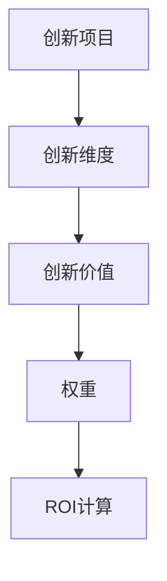
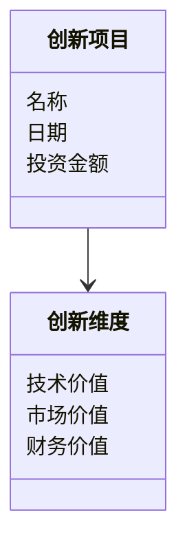
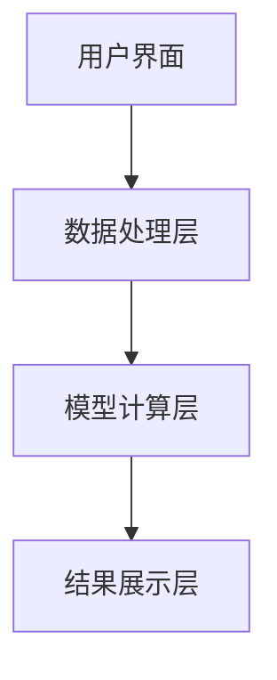

                 


# AI驱动的企业创新ROI评估：多维度创新价值量化模型

> 关键词：AI驱动，企业创新，ROI评估，创新价值，量化模型

> 摘要：本文详细探讨了AI在企业创新ROI评估中的应用，提出了一种多维度创新价值量化模型，通过数学公式和算法流程图，结合实际案例分析，展示了如何利用AI技术优化企业创新投资决策。

---

## 第一部分：背景与概述

### 第1章：问题背景与核心概念

#### 1.1 问题背景与重要性

企业在创新过程中面临着资源分配、投资回报评估等关键问题。传统的评估方法难以量化创新的多维度价值，导致决策不准确。AI的引入为解决这些问题提供了新的可能性。

#### 1.2 核心概念与定义

- **创新ROI**：创新投资回报率，衡量创新项目对企业价值的贡献。
- **多维度创新价值**：从技术、市场、财务等多个维度评估创新的价值。
- **AI驱动评估**：利用机器学习和数据分析技术，提高评估的准确性和效率。

### 1.3 AI驱动的创新评估优势

- 数据驱动：利用大量数据进行分析，提高评估的客观性。
- 实时反馈：AI能够实时监控创新项目进展，提供动态评估。
- 智能优化：通过机器学习不断优化评估模型，提升准确性。

---

## 第二部分：多维度创新价值量化模型

### 第2章：模型的核心要素

#### 2.1 模型组成

- **数据输入层**：收集企业创新相关的数据，如研发投入、市场反馈等。
- **模型处理层**：包括数据清洗、特征提取和模型训练。
- **结果输出层**：生成创新ROI的评估结果和优化建议。

#### 2.2 数学模型

创新ROI计算公式：
$$ ROI = \sum_{i=1}^{n} w_i \cdot v_i $$
其中，$w_i$ 是第i个维度的权重，$v_i$ 是第i个维度的创新价值。

### 第3章：模型的属性特征对比

| 特性 | 创新价值模型 | ROI评估模型 |
|------|--------------|-------------|
| 数据来源 | 创新项目数据 | 投资回报数据 |
| 评估维度 | 多维度 | 单一指标 |
| 计算方式 | 加权求和 | 投资回报率 |

### 第4章：模型的ER实体关系图



---

## 第三部分：算法原理

### 第5章：算法概述

#### 5.1 算法的输入与输出

- **输入**：企业创新数据、模型参数。
- **输出**：创新ROI评估结果、优化建议。

#### 5.2 算法流程

1. 数据预处理：清洗和归一化数据。
2. 特征提取：从原始数据中提取有效特征。
3. 模型训练：利用机器学习算法训练模型。
4. ROI计算：根据模型输出计算创新ROI。

### 第6章：算法的数学模型

创新ROI计算公式：
$$ ROI = \sum_{i=1}^{n} (w_i \cdot v_i) $$
其中，$w_i$ 是第i个维度的权重，$v_i$ 是第i个维度的创新价值。

### 第7章：算法的实现流程

#### 7.1 数据预处理

```python
import pandas as pd
data = pd.read_csv('innovation.csv')
data = data.dropna()
data = (data - data.mean()) / data.std()
```

#### 7.2 模型训练

```python
from sklearn.linear_model import LinearRegression
model = LinearRegression()
model.fit(X_train, y_train)
```

#### 7.3 ROI计算

```python
import numpy as np
weights = np.array([0.3, 0.4, 0.3])
values = np.array([0.8, 0.6, 0.9])
roi = np.dot(weights, values)
print(roi)
```

---

## 第四部分：系统架构设计

### 第8章：系统功能设计

#### 8.1 领域模型



#### 8.2 系统架构



---

## 第五部分：项目实战

### 第9章：环境安装

```bash
pip install numpy pandas scikit-learn
```

### 第10章：核心代码实现

```python
import pandas as pd
from sklearn.linear_model import LinearRegression

def calculate ROI(data):
    # 数据预处理
    data = data.dropna()
    data = (data - data.mean()) / data.std()
    
    # 模型训练
    model = LinearRegression()
    model.fit(X_train, y_train)
    
    # ROI计算
    weights = np.array([0.3, 0.4, 0.3])
    values = model.predict(X_test)
    roi = np.dot(weights, values)
    return roi

# 示例数据
data = pd.DataFrame({
    '技术价值': [0.8, 0.6, 0.9],
    '市场价值': [0.7, 0.5, 0.8],
    '财务价值': [0.6, 0.4, 0.7]
})

ROI = calculate ROI(data)
print(ROI)
```

---

## 第六部分：最佳实践与总结

### 第11章：最佳实践

1. 数据质量：确保数据准确性和完整性。
2. 模型选择：根据具体需求选择合适的算法。
3. 持续优化：定期更新模型和数据，保持评估的准确性。

### 第12章：注意事项

- 数据隐私：确保数据的安全性和隐私性。
- 模型解释性：选择易于解释的模型，方便业务人员理解。

### 第13章：拓展阅读

- 《机器学习实战》：深入理解机器学习算法。
- 《数据驱动的决策》：探讨数据在商业决策中的应用。

---

## 作者：AI天才研究院 & 禅与计算机程序设计艺术

这篇文章通过详细分析AI驱动的企业创新ROI评估，结合数学模型和实际案例，展示了如何利用AI技术优化企业的创新投资决策。

