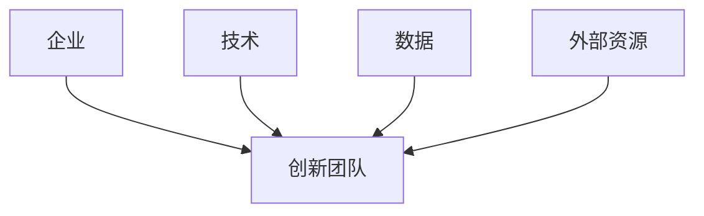
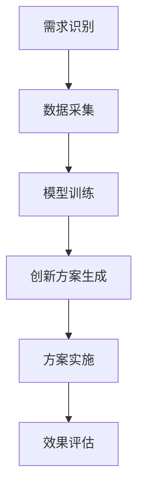
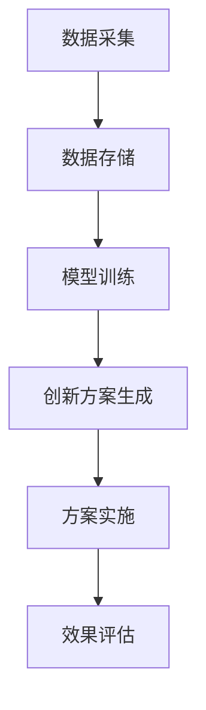
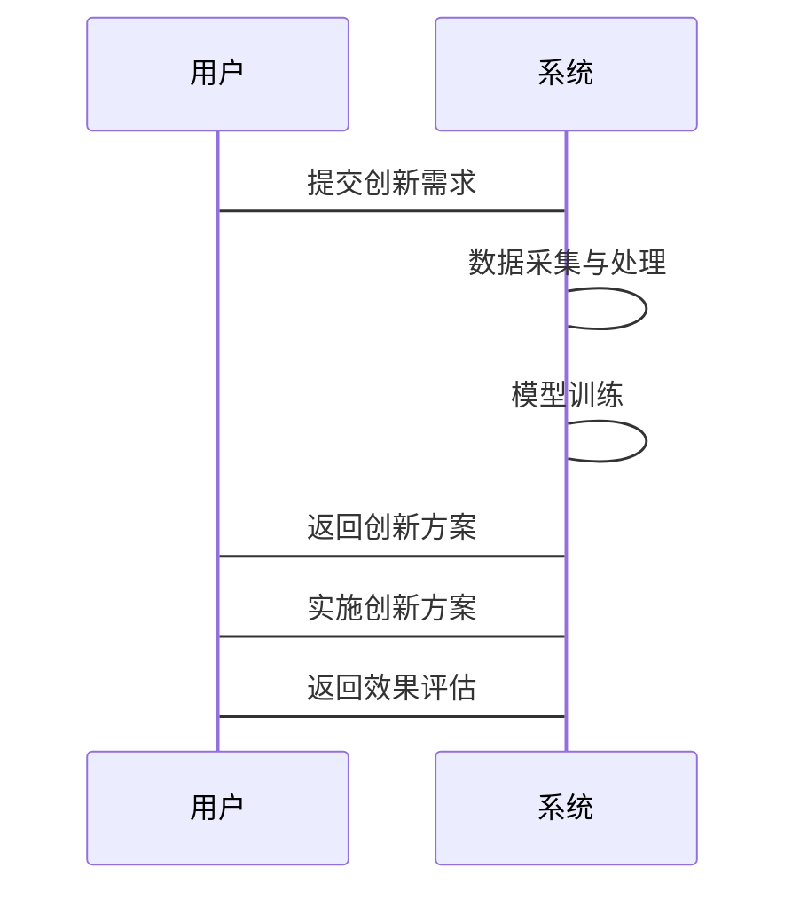

                 


# AI驱动的企业创新生态系统构建与管理

> 关键词：人工智能，企业创新，生态系统，系统架构，算法原理

> 摘要：本文深入探讨了如何利用人工智能技术构建和管理企业创新生态系统。从背景介绍到系统架构设计，从算法原理到项目实战，系统地分析了AI驱动的企业创新生态系统的核心概念、构建方法和管理策略。通过具体案例分析和代码实现，展示了如何在实际应用中落地AI驱动的创新生态系统。

---

## 第一部分: AI驱动的企业创新生态系统背景与概念

---

### 第1章: AI驱动的企业创新生态系统概述

#### 1.1 企业创新生态系统的核心概念

##### 1.1.1 问题背景与问题描述
现代企业面临的竞争日益激烈，创新是企业生存和发展的核心动力。传统的创新模式依赖于人类的创造力和经验，但在数据爆炸和复杂问题频发的今天，单纯依靠人类的能力已经难以应对。企业需要一种更高效、更系统化的创新方式，而人工智能（AI）技术的快速发展为企业创新提供了新的可能性。

问题背景在于，传统创新模式存在效率低、资源浪费、难以预测市场变化等问题。如何利用AI技术优化创新过程、提升创新效率，成为企业亟待解决的难题。

##### 1.1.2 AI在企业创新中的作用
AI技术在企业创新中的作用主要体现在以下几个方面：
1. **数据驱动的洞察**：通过AI对海量数据的分析，帮助企业发现潜在的市场机会和创新方向。
2. **自动化创新流程**：AI可以自动化处理创新过程中的重复性任务，如数据分析、模型训练等，提升效率。
3. **智能决策支持**：通过机器学习和深度学习，AI可以帮助企业在创新决策中做出更准确的预测和判断。

##### 1.1.3 企业创新生态系统的定义与外延
企业创新生态系统是指由企业内部资源、外部合作伙伴、技术工具和创新方法构成的一个动态平衡系统。它通过整合内外部资源，利用AI技术优化创新过程，实现高效、可持续的创新目标。

外延方面，企业创新生态系统不仅包括技术创新，还包括管理模式、组织结构和文化等多方面的创新。

##### 1.1.4 企业创新生态系统的关键要素
- **企业内部要素**：包括企业战略、组织结构、人力资源、技术平台等。
- **企业外部要素**：包括供应商、客户、合作伙伴、行业趋势等。
- **AI驱动的创新要素**：包括数据采集、模型训练、算法优化、智能决策支持等。

#### 1.2 企业创新生态系统构建的重要性

##### 1.2.1 提升企业创新能力
通过AI技术的引入，企业可以更高效地发现创新机会，优化创新流程，提升整体创新能力。

##### 1.2.2 优化资源配置效率
AI可以帮助企业更好地配置资源，避免资源浪费，提升创新过程的效率。

##### 1.2.3 建立可持续的创新机制
企业创新生态系统通过整合内外部资源，建立可持续的创新机制，确保企业能够持续创新，应对市场的变化。

#### 1.3 本章小结
本章从背景出发，详细介绍了AI在企业创新中的作用，明确了企业创新生态系统的定义和关键要素，强调了构建企业创新生态系统的重要性。

---

### 第2章: AI驱动企业创新生态系统的核心概念

#### 2.1 AI驱动的创新生态系统原理

##### 2.1.1 系统构成与运行机制
AI驱动的企业创新生态系统由以下几个部分构成：
1. **数据采集**：通过传感器、数据库等工具采集企业内外部数据。
2. **模型训练**：利用机器学习和深度学习算法对数据进行训练，生成创新模型。
3. **创新方案生成**：通过AI模型生成创新方案，并通过反馈机制优化模型。
4. **方案实施与效果评估**：将创新方案应用于实际业务中，并通过效果评估反馈优化模型。

##### 2.1.2 AI在系统中的角色与功能
AI在企业创新生态系统中扮演着关键角色，主要功能包括：
1. 数据分析与处理
2. 模型训练与优化
3. 创新方案生成
4. 智能决策支持

#### 2.2 核心概念对比分析

##### 2.2.1 传统企业创新与AI驱动创新的对比
| **对比维度** | **传统企业创新** | **AI驱动创新** |
|--------------|-------------------|----------------|
| **效率**      | 较低              | 高              |
| **数据利用**   | 有限              | 全面            |
| **预测能力**   | 依赖经验          | 数据驱动        |
| **灵活性**     | 较低              | 高              |

##### 2.2.2 不同AI模型的优劣势对比
| **AI模型类型** | **监督学习**       | **无监督学习**     | **强化学习**       |
|----------------|--------------------|-------------------|--------------------|
| **优势**        | 数据需求少         | 发现数据内在结构    | 自适应能力强        |
| **劣势**        | 数据标注成本高      | 结果难以解释        | 需要明确奖励机制     |

##### 2.2.3 创新生态系统与传统管理模式的对比
| **对比维度** | **传统管理模式** | **创新生态系统** |
|--------------|-------------------|-----------------|
| **目标**      | 追求效率和成本控制 | 追求持续创新     |
| **核心要素**  | 组织结构、流程     | 数据、模型、创新要素 |
| **灵活性**     | 较低              | 较高             |

#### 2.3 实体关系图与流程图

##### 2.3.1 创新生态系统的ER图


##### 2.3.2 创新流程的流程图


#### 2.4 本章小结
本章通过对比分析，明确了AI驱动创新生态系统的核心概念，以及与传统管理模式的区别与联系。

---

## 第二部分: AI驱动的企业创新生态系统的算法原理

---

### 第3章: AI驱动企业创新生态系统的算法原理

#### 3.1 机器学习在创新生态系统中的应用

##### 3.1.1 监督学习与无监督学习
- **监督学习**：用于有标签的数据，如分类和回归问题。
- **无监督学习**：用于无标签的数据，如聚类和降维。

##### 3.1.2 深度学习模型的创新应用
深度学习模型（如LSTM、Transformer）在自然语言处理和时间序列分析中的应用。

##### 3.1.3 强化学习在创新决策中的应用
强化学习用于模拟和优化创新决策过程，如选择最优的创新路径。

#### 3.2 算法原理的数学模型和公式

##### 3.2.1 机器学习模型
$$ y = f(x) $$

##### 3.2.2 深度学习模型
$$ y = \sigma(Wx + b) $$

##### 3.2.3 强化学习模型
$$ Q(s, a) = r + \gamma \max Q(s', a') $$

#### 3.3 算法实现的代码示例

##### 3.3.1 机器学习模型代码
```python
from sklearn.linear_model import LinearRegression
model = LinearRegression()
model.fit(X_train, y_train)
```

##### 3.3.2 深度学习模型代码
```python
import torch
model = torch.nn.Sequential(
    torch.nn.Linear(1, 10),
    torch.nn.ReLU(),
    torch.nn.Linear(10, 1)
)
```

---

## 第三部分: AI驱动的企业创新生态系统的系统分析与架构设计

---

### 第4章: 系统分析与架构设计方案

#### 4.1 问题场景介绍
企业需要构建一个AI驱动的创新生态系统，以优化创新过程。

#### 4.2 项目介绍
项目目标是构建一个AI驱动的企业创新生态系统，实现创新过程的自动化和智能化。

#### 4.3 系统功能设计
- 数据采集模块：采集企业内外部数据。
- 模型训练模块：训练创新模型。
- 创新方案生成模块：生成创新方案。
- 方案实施与效果评估模块：实施创新方案并评估效果。

#### 4.4 系统架构设计


#### 4.5 接口设计与交互流程


---

## 第四部分: AI驱动的企业创新生态系统的项目实战

---

### 第5章: 项目实战

#### 5.1 环境安装与配置
安装Python、TensorFlow、Scikit-learn等工具。

#### 5.2 系统核心实现源代码
```python
import numpy as np
from sklearn.linear_model import LinearRegression

# 数据采集
X = np.array([[1], [2], [3], [4], [5]])
y = np.array([2, 4, 5, 4, 5])

# 模型训练
model = LinearRegression()
model.fit(X, y)

# 创新方案生成
print("预测值:", model.predict([[6]]))
```

#### 5.3 代码应用解读与分析
通过对代码的解读，分析AI模型在创新生态系统中的应用。

#### 5.4 实际案例分析
通过具体案例，展示AI驱动创新生态系统的实际应用效果。

#### 5.5 项目小结
总结项目实施的过程、成果和经验。

---

## 第五部分: 最佳实践与总结

---

### 第6章: 最佳实践与总结

#### 6.1 最佳实践
- 数据质量是关键。
- 模型选择要根据具体问题。
- 持续优化模型。

#### 6.2 小结
总结全文，强调AI在企业创新生态系统中的重要性。

#### 6.3 未来展望
探讨AI驱动企业创新生态系统的发展方向。

---

## 附录

### 附录A: 工具安装指南

安装Python、TensorFlow、Scikit-learn等工具的步骤。

### 附录B: 数据集

提供用于模型训练的数据集。

### 附录C: 参考文献

列出本文参考的相关文献和资料。

---

## 作者信息

作者：AI天才研究院/AI Genius Institute & 禅与计算机程序设计艺术 /Zen And The Art of Computer Programming

---

通过以上详细的内容结构，我们可以系统地构建和管理AI驱动的企业创新生态系统，为企业创新提供强有力的技术支持。

