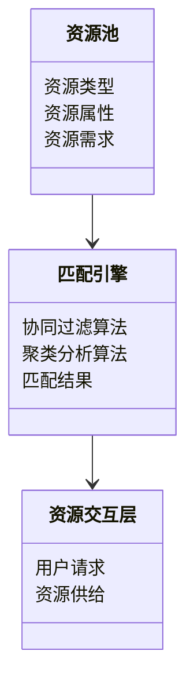

                 


# AI驱动的企业创新生态系统构建：内外部资源智能匹配

> 关键词：AI驱动、企业创新生态系统、内外部资源匹配、智能资源优化、协同创新

> 摘要：  
> 在当前快速变化的商业环境中，企业创新生态系统的核心竞争力在于高效整合和优化内外部资源。本文从AI驱动的角度，深入探讨企业创新生态系统构建的关键要素，分析内外部资源智能匹配的机制与算法，结合实际案例，为企业构建高效、智能的创新生态系统提供理论与实践指导。

---

## 第1章：背景与概念

### 1.1 企业创新生态系统概述

#### 1.1.1 什么是企业创新生态系统
企业创新生态系统是指围绕企业核心业务，通过整合内外部资源（如技术、人才、资金、合作伙伴等）所形成的动态网络系统。该系统以创新为核心驱动力，通过资源的高效流动和协同，推动企业持续创新。

#### 1.1.2 问题背景与挑战
- **资源分散**：企业内外部资源分散，难以形成合力。
- **匹配效率低**：传统资源匹配方式效率低下，难以满足快速变化的市场需求。
- **信息孤岛**：资源分布不均，信息难以共享。

#### 1.1.3 AI驱动的创新生态系统
AI技术的应用使得资源匹配更加智能化、精准化，能够实时分析资源需求与供给，优化资源配置，提升创新效率。

---

### 1.2 AI驱动的内外部资源匹配

#### 1.2.1 内部资源与外部资源的特征对比
| 特征       | 内部资源         | 外部资源         |
|------------|------------------|------------------|
| 所有权     | 归属企业         | 归属外部机构     |
| 灵活性     | 较低             | 较高             |
| 调整周期   | 较长             | 较短             |
| 资源类型   | 技术、人才       | 技术、资本、服务 |

#### 1.2.2 资源匹配的核心目标
- 提升资源利用率
- 降低资源匹配成本
- 增强创新效率

---

## 第2章：AI驱动的资源匹配机制

### 2.1 资源匹配的原理与模型

#### 2.1.1 协同过滤算法
协同过滤是一种基于用户行为或资源属性的推荐算法，广泛应用于资源匹配中。

#### 2.1.2 聚类分析
通过聚类算法将相似的资源或需求进行分组，便于精准匹配。

---

### 2.2 资源匹配的数学模型

#### 2.2.1 协同过滤的数学公式
$$ sim(i,j) = \frac{\sum_{k=1}^n r_{ik} \cdot r_{jk}}{\sqrt{\sum_{k=1}^n r_{ik}^2} \cdot \sqrt{\sum_{k=1}^n r_{jk}^2}} $$

其中，$sim(i,j)$ 表示用户 $i$ 和用户 $j$ 的相似度，$r_{ik}$ 和 $r_{jk}$ 分别表示用户 $i$ 和 $j$ 对资源 $k$ 的评分。

---

## 第3章：系统分析与架构设计

### 3.1 系统功能设计

#### 3.1.1 领域模型


---

## 第4章：项目实战

### 4.1 环境与工具安装

#### 4.1.1 Python环境安装
```bash
pip install numpy
pip install scikit-learn
```

---

## 总结与展望

企业创新生态系统构建的关键在于高效匹配内外部资源，AI技术的应用为这一目标提供了强大支持。通过协同过滤、聚类分析等算法，企业能够显著提升资源利用效率，推动创新。

---

**作者：AI天才研究院 & 禅与计算机程序设计艺术**

