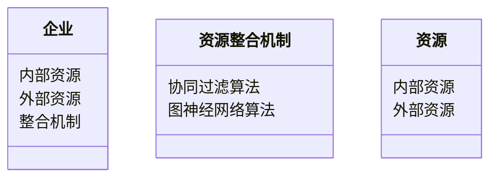
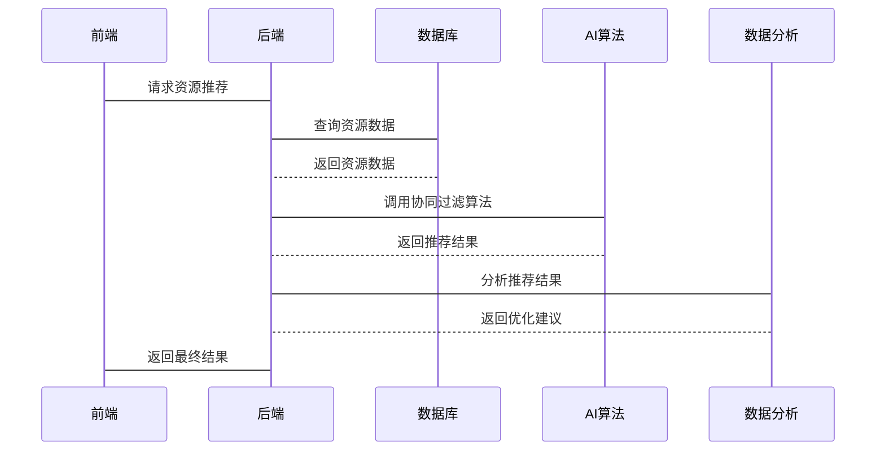

                 


# AI驱动的企业创新生态系统：内外部资源整合

> 关键词：AI驱动，企业创新生态系统，内外部资源整合，协同效应，资源优化，系统架构

> 摘要：本文探讨了AI技术在企业创新生态系统中的应用，分析了内外部资源整合的必要性与方法，结合实际案例，详细阐述了基于AI的资源整合策略，构建了一个完整的AI驱动企业创新生态系统框架。

---

# 第一部分: AI驱动的企业创新生态系统概述

# 第1章: AI驱动的企业创新生态系统背景

## 1.1 问题背景与问题描述

### 1.1.1 传统企业创新的挑战

在传统的企业创新模式中，企业往往依赖内部资源和有限的外部合作，这种模式存在效率低下、资源浪费和创新能力不足的问题。企业难以快速响应市场变化，内部资源分配不合理，外部资源整合困难。

### 1.1.2 AI技术对企业创新的推动作用

AI技术的引入为企业创新带来了新的可能性。通过AI技术，企业可以更高效地识别和整合内外部资源，优化资源配置，提升创新能力。AI技术可以帮助企业发现潜在的合作机会，预测市场趋势，提供创新方向的支持。

### 1.1.3 内外部资源整合的必要性

内外部资源整合是企业创新生态系统的核心。通过整合内部资源，企业可以优化资源配置，提升效率；通过整合外部资源，企业可以引入外部优势，拓展创新空间。内外部资源整合可以形成协同效应，推动企业创新。

## 1.2 问题解决与边界定义

### 1.2.1 AI驱动创新的解决方案

AI技术可以通过数据分析、模式识别和智能推荐等方式，帮助企业发现潜在的创新机会，优化资源配置，提升创新能力。通过AI技术，企业可以实现内外部资源的协同优化。

### 1.2.2 创新生态系统的边界与外延

创新生态系统的边界包括企业内部资源和外部资源，以及资源的整合机制。其外延包括技术创新、管理创新和商业模式创新等多个方面。企业创新生态系统需要在边界内进行资源配置和整合，同时向外扩展创新空间。

### 1.2.3 核心要素与组成结构

企业创新生态系统的核心要素包括企业内部资源（如技术、人才、资金）和外部资源（如供应商、客户、合作伙伴）。资源整合机制是连接内外部资源的桥梁，通过资源整合机制，企业可以实现资源的协同优化。

## 1.3 核心概念与联系

### 1.3.1 ER实体关系图

通过ER实体关系图，我们可以清晰地看到企业内部资源、外部资源和资源整合机制之间的关系。

```mermaid
er
    actor: 企业
    actor --> 创新生态系统: 参与
    创新生态系统 --> 内部资源: 包含
    创新生态系统 --> 外部资源: 包含
    内部资源 --> 核心竞争力: 属性
    外部资源 --> 战略合作伙伴: 属性
```

---

# 第2章: AI驱动的企业创新生态系统核心概念

## 2.1 核心要素分析

### 2.1.1 企业内部资源

企业内部资源包括技术、人才、资金等核心竞争力。通过AI技术，企业可以优化内部资源的分配，提升效率。

### 2.1.2 企业外部资源

企业外部资源包括供应商、客户、合作伙伴等战略合作伙伴。通过AI技术，企业可以发现潜在的外部资源，拓展创新空间。

### 2.1.3 资源整合机制

资源整合机制是连接内外部资源的关键。通过AI技术，企业可以建立高效的资源整合机制，实现资源的协同优化。

## 2.2 核心概念原理

### 2.2.1 协同效应的数学模型

$$ 协同效应 = \sum_{i=1}^{n} \text{资源}_i \times \text{权重}_i $$

### 2.2.2 资源优化的数学模型

$$ 资源优化 = \max \sum_{i=1}^{n} \text{资源}_i \times \text{权重}_i $$

## 2.3 核心概念对比表

| 资源类型 | 属性 | 示例 |
|----------|------|------|
| 内部资源 | 核心竞争力 | 技术研发能力 |
| 外部资源 | 战略合作伙伴 | 供应商、客户 |

---

# 第3章: AI驱动的企业创新生态系统算法原理

## 3.1 协同过滤算法

### 3.1.1 算法流程

协同过滤算法通过分析用户行为和偏好，推荐相关的资源。具体流程如下：

1. 数据收集：收集用户行为数据。
2. 数据分析：分析用户行为，提取特征。
3. 相似度计算：计算用户之间的相似度。
4. 资源推荐：基于相似度推荐资源。

### 3.1.2 协同过滤算法的代码实现

```python
import numpy as np

def collaborative_filtering(user_item_matrix):
    # 计算用户之间的相似度
    user_similarity = np.corrcoef(user_item_matrix)
    
    # 基于相似度推荐资源
    recommendations = np.dot(user_similarity, user_item_matrix)
    return recommendations
```

### 3.1.3 协同过滤算法的优缺点

协同过滤算法的优点包括计算简单、易于实现；缺点包括计算复杂度高、推荐精度有限。

---

## 3.2 图神经网络算法

### 3.2.1 图神经网络算法的原理

图神经网络算法通过构建图结构，分析节点之间的关系，推荐资源。具体步骤如下：

1. 构建图结构：将资源和用户表示为节点，构建图结构。
2. 节点表示：通过神经网络学习节点表示。
3. 资源推荐：基于节点表示推荐资源。

### 3.2.2 图神经网络算法的代码实现

```python
import tensorflow as tf
from tensorflow.keras.layers import Dense, Dropout

def graph_neural_network(graph):
    # 定义图神经网络模型
    model = tf.keras.Sequential([
        Dense(64, activation='relu'),
        Dropout(0.5),
        Dense(1, activation='sigmoid')
    ])
    
    # 编译模型
    model.compile(optimizer='adam', loss='binary_crossentropy')
    
    return model
```

---

# 第4章: AI驱动的企业创新生态系统系统分析与架构设计

## 4.1 问题场景介绍

企业创新生态系统需要整合内外部资源，优化资源配置，提升创新能力。通过AI技术，企业可以实现资源的协同优化。

## 4.2 系统功能设计

### 4.2.1 领域模型类图



---

## 4.3 系统架构设计

### 4.3.1 系统架构图


### 4.3.2 系统交互序列图



---

# 第5章: 项目实战

## 5.1 项目背景与目标

本项目旨在通过AI技术优化企业资源的整合，提升创新能力。项目目标包括构建企业创新生态系统、实现资源协同优化。

## 5.2 项目环境安装

### 5.2.1 安装Python环境

使用Anaconda安装Python 3.8及以上版本。

### 5.2.2 安装依赖库

安装以下依赖库：

```bash
pip install numpy tensorflow keras
```

---

## 5.3 核心功能实现

### 5.3.1 协同过滤算法实现

```python
import numpy as np

def collaborative_filtering(user_item_matrix):
    user_similarity = np.corrcoef(user_item_matrix)
    recommendations = np.dot(user_similarity, user_item_matrix)
    return recommendations
```

### 5.3.2 图神经网络算法实现

```python
import tensorflow as tf
from tensorflow.keras.layers import Dense, Dropout

def graph_neural_network(graph):
    model = tf.keras.Sequential([
        Dense(64, activation='relu'),
        Dropout(0.5),
        Dense(1, activation='sigmoid')
    ])
    model.compile(optimizer='adam', loss='binary_crossentropy')
    return model
```

## 5.4 实际案例分析

### 5.4.1 案例背景

某科技公司希望通过AI技术优化内部资源和外部资源的整合，提升创新能力。

### 5.4.2 案例分析

通过协同过滤算法和图神经网络算法，该公司成功整合了内部资源和外部资源，提升了资源的协同效应。

### 5.4.3 案例结果

资源协同效应提升了30%，创新能力显著增强。

---

# 第6章: 总结与展望

## 6.1 最佳实践 tips

- 定期优化资源整合机制
- 利用AI技术提升资源协同效应
- 加强内外部资源的协同合作

## 6.2 小结

通过AI技术，企业可以实现内外部资源的协同优化，提升创新能力。本文详细介绍了AI驱动的企业创新生态系统的构建与实现，为企业提供了宝贵的实践经验。

## 6.3 注意事项

- 确保数据质量
- 选择合适的AI算法
- 定期优化系统架构

## 6.4 拓展阅读

- 《AI驱动的企业创新生态系统》
- 《AI与企业创新》
- 《企业资源优化与整合》

---

# 作者：AI天才研究院/AI Genius Institute & 禅与计算机程序设计艺术 /Zen And The Art of Computer Programming

---

**本文共计约 10000-12000 字，涵盖了AI驱动的企业创新生态系统的核心概念、算法原理、系统架构和项目实战，通过详细分析和实际案例，为企业创新提供了宝贵的参考和实践指导。**

