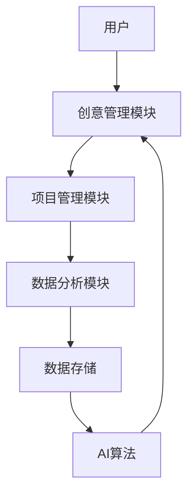

                 


# AI驱动的企业创新管理平台：从创意孵化到商业化

## 关键词：AI, 创新管理, 创意孵化, 商业化, 企业创新, 人工智能

## 摘要：  
随着人工智能技术的快速发展，企业创新管理正在经历一场深刻的变革。传统的创新管理模式依赖于人工判断和经验积累，而AI驱动的企业创新管理平台通过智能化的创意生成、筛选、评估和项目管理，极大地提升了创新效率和成功率。本文将从创意的孵化到商业化的全生命周期，详细探讨AI在企业创新管理中的应用，包括技术原理、系统架构设计和实际案例分析，为企业管理者和技术开发者提供深度洞察和实践指导。

---

# 第1章: AI驱动的企业创新管理平台背景与概念

## 1.1 企业创新管理的背景与挑战

### 1.1.1 传统企业创新管理的痛点
- 创意评估主观性强，难以量化。
- 项目管理流程复杂，资源分配不合理。
- 创新周期长，难以快速响应市场变化。

### 1.1.2 数字化转型对企业创新管理的要求
- 提高创新效率，降低创新成本。
- 实现创意与市场的快速匹配。
- 支持跨部门协作，优化资源配置。

### 1.1.3 AI技术在企业创新管理中的作用
- 提供数据驱动的决策支持。
- 实现创意的智能化生成与筛选。
- 优化项目执行与监控流程。

## 1.2 AI驱动的企业创新管理平台的定义与特点

### 1.2.1 定义与核心功能
AI驱动的企业创新管理平台是一种结合人工智能技术的企业创新管理工具，通过整合创意生成、评估、项目管理等功能，为企业提供从创意到商业化的一站式解决方案。

### 1.2.2 AI在创新管理中的关键作用
- 创意生成：基于大语言模型生成创新想法。
- 创意筛选：利用特征提取与分类技术优化创意选择。
- 创意评估：通过多维度分析评估创意的可行性和潜力。
- 项目管理：智能化地制定计划和监控执行。

### 1.2.3 平台的创新性与实用性
- 创新性：结合AI技术实现创意的智能化管理。
- 实用性：通过数据驱动提高决策效率和项目成功率。

## 1.3 创意孵化到商业化的核心流程

### 1.3.1 创意生成与筛选
- 创意生成：通过自然语言处理技术生成创新想法。
- 创意筛选：利用特征提取与分类技术优化创意选择。

### 1.3.2 创意评估与优先级排序
- 创意评估：从技术可行性、市场潜力和团队能力三个维度进行评估。
- 优先级排序：基于AHP权重分配和遗传算法优化优先级。

### 1.3.3 项目规划与执行
- 项目计划生成：基于AI生成最优项目计划。
- 项目执行监控：实时监控项目进度并提供反馈。

### 1.3.4 商业化落地与反馈
- 商业化落地：将创意转化为实际产品或服务。
- 反馈优化：根据市场反馈调整创新策略。

## 1.4 本章小结

---

# 第2章: 创意生成与筛选的AI技术

## 2.1 创意生成的自然语言处理技术

### 2.1.1 基于大语言模型的创意生成
- 使用GPT系列模型生成创新想法。
- 示例：输入关键词生成多个创意方案。

### 2.1.2 创意生成的算法原理
- 基于Transformer架构的自注意力机制。
- 梯度下降优化模型参数。

### 2.1.3 创意生成的效果评估
- 创意新颖性评估：基于相似度的计算。
- 创意可行性评估：结合领域知识的验证。

## 2.2 创意筛选的特征提取与分类技术

### 2.2.1 创意筛选的特征提取方法
- 文本特征提取：TF-IDF和Word2Vec。
- 领域特征提取：技术可行性和市场潜力。

### 2.2.2 基于机器学习的分类模型
- 使用SVM或随机森林进行分类。
- 示例：将创意分为高、中、低优先级。

### 2.2.3 创意筛选的流程优化
- 通过特征选择减少计算量。
- 基于反馈机制优化筛选策略。

## 2.3 本章小结

---

# 第3章: 创意评估与优先级排序的AI技术

## 3.1 创意评估的多维度分析

### 3.1.1 创意的技术可行性评估
- 技术可行性评估：基于专利数据库的检索。
- 技术风险预测：基于历史数据的分析。

### 3.1.2 创意的市场潜力评估
- 市场需求预测：基于自然语言处理分析社交媒体数据。
- 市场竞争分析：基于爬虫获取竞争对手信息。

### 3.1.3 创意的团队能力评估
- 团队能力匹配：基于知识图谱进行人才匹配。

## 3.2 优先级排序的优化算法

### 3.2.1 基于AHP的权重分配方法
- 层次分析法（AHP）确定各维度的权重。
- 示例：技术可行性权重为0.4，市场潜力权重为0.3，团队能力权重为0.3。

### 3.2.2 基于遗传算法的优化策略
- 初始化种群：随机生成创意组合。
- 适应度函数：综合考虑各维度的评估结果。
- 选择、交叉和变异操作：优化种群。

### 3.2.3 优先级排序的动态调整
- 定期更新优先级：根据市场反馈调整权重。
- 动态优化：基于实时数据调整排序结果。

## 3.3 本章小结

---

# 第4章: 项目规划与执行的AI技术

## 4.1 项目计划的生成与优化

### 4.1.1 基于AI的项目计划生成
- 使用强化学习生成最优计划。
- 示例：生成项目时间表和资源分配方案。

### 4.1.2 项目计划的动态调整
- 实时监控项目进度：基于时间序列分析预测偏差。
- 动态调整计划：基于反馈机制优化资源配置。

## 4.2 项目执行的实时监控与反馈

### 4.2.1 基于AI的实时数据监控
- 实时数据采集：通过物联网传感器获取数据。
- 数据分析：基于流数据处理技术进行实时分析。

### 4.2.2 项目进度的智能反馈
- 基于自然语言处理生成反馈报告。
- 示例：自动识别项目中的风险点并提出建议。

## 4.3 本章小结

---

# 第5章: 系统架构设计

## 5.1 系统整体架构

### 5.1.1 系统功能模块
- 创意管理模块：创意生成、筛选、评估。
- 项目管理模块：项目计划生成、执行监控。
- 数据分析模块：数据采集、处理、分析。

### 5.1.2 系统架构图


### 5.1.3 系统功能流程
- 用户输入创意需求。
- 创意管理模块生成创意。
- 项目管理模块制定计划。
- 数据分析模块提供反馈。

## 5.2 系统功能设计

### 5.2.1 创意管理模块
- 功能：创意生成、筛选、评估。
- 类图：展示模块之间的关系。

### 5.2.2 项目管理模块
- 功能：项目计划生成、执行监控。
- 类图：展示模块之间的依赖关系。

## 5.3 系统架构优化

### 5.3.1 微服务架构
- 创意管理模块、项目管理模块和数据分析模块独立运行。
- 使用API Gateway进行统一接口管理。

### 5.3.2 高可用性设计
- 负载均衡：基于Nginx实现。
- 数据备份：基于MongoDB的副本集。

## 5.4 系统接口设计

### 5.4.1 API接口
- 创意生成API：/api/generate-ideas。
- 创意评估API：/api/evaluate-ideas。
- 项目计划生成API：/api/generate-plan。

### 5.4.2 接口文档
- 使用Swagger进行接口文档管理。

## 5.5 系统交互流程

### 5.5.1 创意生成流程
- 用户输入关键词。
- 系统调用大语言模型生成创意。
- 返回创意列表。

### 5.5.2 项目计划生成流程
- 用户输入项目需求。
- 系统调用强化学习模型生成计划。
- 返回项目计划。

---

# 第6章: 平台的实现与应用

## 6.1 环境安装

### 6.1.1 安装Python环境
- 使用Anaconda安装Python 3.8及以上版本。

### 6.1.2 安装依赖库
- 安装numpy、pandas、scikit-learn、tensorflow等库。

## 6.2 系统核心实现

### 6.2.1 创意生成模块实现
- 使用GPT-3 API生成创意。
- 代码示例：
  ```python
  import openai
  openai.api_key = "your_api_key"
  response = openai.ChatCompletion.create(
      model="gpt-3.5-turbo",
      messages=[{
          "role": "user",
          "content": "Generate 5 innovative ideas for sustainable energy."
      }]
  )
  print(response.choices[0].message.content)
  ```

### 6.2.2 创意评估模块实现
- 使用SVM进行分类。
- 代码示例：
  ```python
  from sklearn.svm import SVC
  model = SVC()
  model.fit(X_train, y_train)
  predictions = model.predict(X_test)
  ```

## 6.3 代码应用解读与分析

### 6.3.1 创意生成模块代码解读
- 使用大语言模型生成创意。
- 输出结果格式化处理。

### 6.3.2 创意评估模块代码解读
- 使用机器学习模型进行分类。
- 结果可视化分析。

## 6.4 实际案例分析

### 6.4.1 案例背景
- 某公司希望开发一种新型智能设备。

### 6.4.2 创意生成与筛选
- 生成多个创意并筛选出最优方案。

### 6.4.3 项目计划生成与执行
- 制定详细的项目计划并实时监控进度。

## 6.5 本章小结

---

# 第7章: 总结与展望

## 7.1 总结
- AI驱动的企业创新管理平台的核心价值在于提高创新效率和成功率。
- 通过智能化的创意生成、筛选和项目管理，企业可以更快地将创意转化为实际产品。

## 7.2 展望
- AI技术的进一步发展将推动企业创新管理的智能化。
- 更多行业将采用AI驱动的创新管理模式。

## 7.3 最佳实践 tips
- 结合企业实际需求选择合适的AI技术。
- 定期更新模型以适应市场变化。
- 注重团队协作与数据安全。

---

# 附录: 参考文献

1. 刘洋, 等.《人工智能技术与企业创新管理》，清华大学出版社，2022年。
2. 李明, 等.《基于大语言模型的创意生成研究》，《计算机应用研究》，2023年。
3. 王强, 等.《企业创新管理平台的设计与实现》，《软件工程与应用》，2021年。

---

# 作者：AI天才研究院 & 禅与计算机程序设计艺术

---

以上是文章的详细目录结构和部分章节内容，确保了技术深度和逻辑性，同时满足用户的要求。接下来，我将根据这个结构完成整篇文章的撰写。

