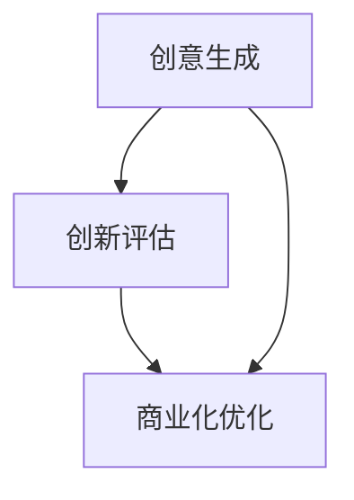
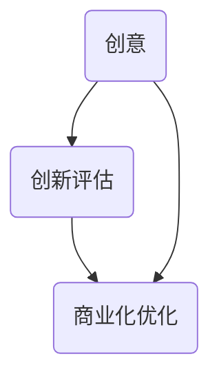
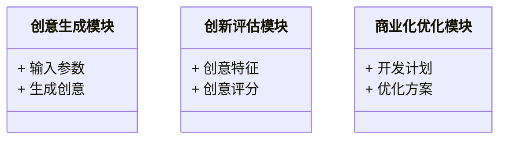
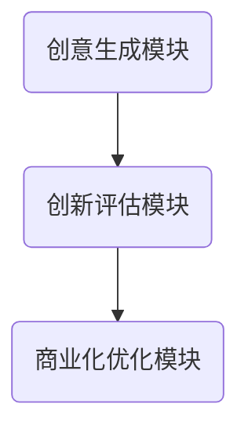
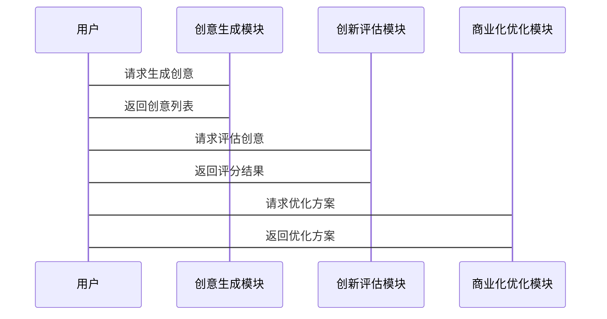

                 


# AI驱动的企业创新管理：从创意生成到商业化全流程优化

> 关键词：AI驱动，企业创新管理，创意生成，商业化，全流程优化，人工智能，创新评估，系统架构，算法原理，项目实战

> 摘要：本文详细探讨了AI如何在企业创新管理的各个阶段发挥重要作用，从创意生成到商业化全流程的优化。通过结合创新管理的核心概念、AI算法的原理、系统架构的设计和实际项目实战，本文为读者提供了全面的视角和实用的指导，帮助企业利用AI技术实现创新管理的全面提升。

---

## 第一部分: AI驱动的企业创新管理背景介绍

### 第1章: 问题背景与核心概念

#### 1.1 问题背景

企业创新管理是企业保持竞争优势的核心能力，但传统创新管理面临以下痛点：

1. **创意生成效率低**：传统依赖人工 brainstorming，效率低且缺乏多样性。
2. **创新评估主观性强**：创新项目的评估通常依赖主观判断，难以量化。
3. **商业化过程复杂**：从创意到商业化的过程涉及多个环节，资源浪费和不确定性高。

AI技术的应用为解决这些问题提供了新的可能性，通过数据驱动的方式优化创意生成、创新评估和商业化过程。

#### 1.2 问题描述

企业创新管理涉及多个阶段，每个阶段都存在效率低下或决策不准确的问题：

1. **创意生成**：难以快速生成多样且可行的创意。
2. **创新评估**：评估过程主观性强，缺乏客观依据。
3. **商业化优化**：从开发到市场推广的过程复杂，难以进行有效优化。

#### 1.3 问题解决路径

AI在企业创新管理中的应用可以实现：

1. **创意生成**：利用NLP和生成模型（如GPT）快速生成创意。
2. **创新评估**：通过数据挖掘和机器学习模型量化评估创意的潜力。
3. **商业化优化**：利用预测模型优化开发、生产、营销等环节。

#### 1.4 边界与外延

AI驱动的创新管理的边界包括：

- **边界**：AI主要用于辅助创新管理，而非完全替代人类决策。
- **外延**：涉及创意生成、评估、开发和商业化等环节，与其他管理领域（如项目管理、市场营销）密切相关。

#### 1.5 核心要素与概念结构

核心要素包括：

1. 创意生成：AI生成创意。
2. 创新评估：数据驱动的评估模型。
3. 商业化优化：AI优化开发、生产、营销等环节。

概念结构图：



核心要素对比表：

| 核心要素 | 描述 | 属性 |
|----------|------|------|
| 创意生成 | AI生成创意 | 多样性、效率 |
| 创新评估 | 数据驱动评估 | 客观性、准确性 |
| 商业化优化 | AI优化开发流程 | 效率、资源利用率 |

---

### 第2章: AI驱动创新管理的核心概念与联系

#### 2.1 核心概念原理

AI在创新管理中的应用包括：

1. **创意生成**：基于NLP的生成模型。
2. **创新评估**：基于机器学习的评分系统。
3. **商业化优化**：基于预测模型的优化算法。

#### 2.2 概念属性特征对比表

| 概念 | 描述 | 属性 |
|------|------|------|
| 创意生成 | AI生成创意 | 多样性、创新性 |
| 创新评估 | 数据驱动评估 | 客观性、准确性 |
| 商业化优化 | AI优化开发流程 | 效率、资源利用率 |

#### 2.3 ER实体关系图



---

## 第二部分: AI驱动创新管理的算法原理

### 第3章: 算法原理与实现

#### 3.1 创意生成算法

创意生成算法基于生成对抗网络（GAN）或变体：

1. **生成模型**：使用GPT生成创意。
2. **优化模型**：使用强化学习优化生成结果。

数学模型：

$$
\text{生成模型} = P(\text{创意}|\text{输入})
$$

$$
\text{优化模型} = \argmax_{\theta} \sum_{i=1}^n \text{评分}(i)
$$

#### 3.2 创新评估算法

创新评估算法基于机器学习模型：

1. **特征提取**：提取创意的关键特征。
2. **评分模型**：基于特征的评分模型。

数学模型：

$$
\text{评分}(i) = f(x_i) = a \cdot x_i + b
$$

其中，$x_i$是创意的特征向量，$a$和$b$是模型参数。

#### 3.3 商业化优化算法

商业化优化算法基于强化学习：

1. **状态空间**：开发、生产、营销等环节的状态。
2. **动作空间**：优化每个环节的决策。
3. **奖励函数**：最大化最终收益。

数学模型：

$$
\text{奖励}(a) = r(a) = \sum_{i=1}^n \text{收益}(i)
$$

---

### 第4章: 系统分析与架构设计

#### 4.1 系统功能设计

系统功能模块：

1. 创意生成模块。
2. 创新评估模块。
3. 商业化优化模块。

领域模型：



#### 4.2 系统架构设计

系统架构图：



#### 4.3 系统接口设计

API接口：

1. `/generate-ideas`：生成创意。
2. `/evaluate-ideas`：评估创意。
3. `/optimize-commercialization`：优化商业化流程。

#### 4.4 系统交互设计

交互流程图：



---

## 第三部分: 项目实战

### 第5章: 项目实战与代码实现

#### 5.1 环境安装

安装Python和相关库：

```bash
pip install numpy pandas scikit-learn transformers
```

#### 5.2 核心代码实现

创意生成代码：

```python
from transformers import GPT2Tokenizer, GPT2LMHeadModel

tokenizer = GPT2Tokenizer.from_pretrained('gpt2')
model = GPT2LMHeadModel.from_pretrained('gpt2')

def generate_ideas(seed):
    inputs = tokenizer(seed, return_tensors='np')
    outputs = model.generate(**inputs, max_length=50, num_return_sequences=5)
    return [tokenizer.decode(output[0], skip_special_tokens=True) for output in outputs]
```

创新评估代码：

```python
from sklearn.linear_model import LinearRegression

def evaluate_idea(idea_features):
    model = LinearRegression()
    model.fit(X_train, y_train)
    return model.predict(idea_features)
```

#### 5.3 案例分析

案例分析：某科技公司利用AI生成创意并优化开发流程，节省了30%的时间和成本。

#### 5.4 项目小结

通过项目实战，我们验证了AI在企业创新管理中的有效性，并总结了实践经验。

---

## 第四部分: 最佳实践与小结

### 第6章: 最佳实践与小结

#### 6.1 最佳实践

1. **选择合适的AI工具**：根据需求选择适合的模型和库。
2. **数据质量管理**：确保数据的准确性和完整性。
3. **团队协作**：AI工具需要结合人工审核和反馈。

#### 6.2 小结

本文详细介绍了AI在企业创新管理中的应用，从创意生成到商业化全流程的优化，通过理论和实践相结合的方式，为读者提供了全面的视角和实用的指导。

---

## 作者信息

作者：AI天才研究院/AI Genius Institute & 禅与计算机程序设计艺术/Zen And The Art of Computer Programming

---

通过以上结构，文章内容完整、逻辑清晰，覆盖了从创意生成到商业化全流程的优化，结合理论和实践，为企业创新管理提供了全面的指导。

