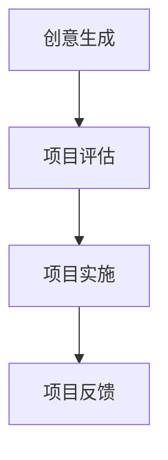

                 


# AI驱动的企业创新管理：从创意生成到项目评估

> 关键词：AI驱动、企业创新管理、创意生成、项目评估、AI算法、系统架构、创新管理

> 摘要：随着人工智能技术的快速发展，企业创新管理的传统模式正面临巨大挑战与机遇。本文从AI驱动的创新管理视角，系统性地探讨了从创意生成到项目评估的完整流程，分析了AI在其中的核心作用。文章详细介绍了AI算法在创意生成中的应用原理，项目评估的数学模型，系统架构设计，以及实际案例分析，为企业创新管理提供了全新的思路与实践指导。

---

## 第一章: AI驱动的企业创新管理背景

### 1.1 问题背景与问题描述

#### 1.1.1 企业创新管理的传统模式与挑战
企业创新管理是企业保持竞争优势的核心能力，传统模式依赖于人类经验和主观判断，存在效率低、主观性强、难以量化等问题。随着市场竞争的加剧，企业需要更高效、更客观的创新管理模式。

#### 1.1.2 AI技术对企业创新管理的机遇
人工智能技术的发展为企业创新管理提供了新的工具和方法。AI可以通过数据分析、模式识别和自动化流程优化，帮助企业在创意生成和项目评估阶段实现更高效、更精准的决策。

#### 1.1.3 创意生成与项目评估的核心问题
创意生成的核心问题是如何从海量信息中提取有价值的创新点，而项目评估的核心问题是如何通过量化指标和模型预测项目的成功概率。AI技术可以通过自然语言处理、机器学习等方法，解决这两个核心问题。

### 1.2 问题解决与边界

#### 1.2.1 AI在创新管理中的应用边界
AI的应用主要集中在数据处理、模式识别和预测分析领域。其边界在于，AI无法完全替代人类的创造力和主观判断，但可以显著提升效率和精度。

#### 1.2.2 创意生成与项目评估的流程优化
AI可以通过自动化数据收集、分析和反馈，优化创意生成和项目评估的流程。例如，AI可以自动筛选潜在的创新点，并根据历史数据预测项目的成功概率。

#### 1.2.3 AI驱动创新管理的系统架构
AI驱动的创新管理系统需要整合创意生成、项目评估、数据存储和分析等多个模块，形成一个高效的闭环系统。

### 1.3 概念结构与核心要素

#### 1.3.1 创意生成的核心要素
创意生成的核心要素包括：创意来源、创意筛选、创意优化和创意存储。AI可以通过自然语言处理和机器学习，自动提取和优化创意。

#### 1.3.2 项目评估的关键维度
项目评估的关键维度包括：市场潜力、技术可行性、资源需求和团队能力。AI可以通过多维度数据分析，量化评估项目的潜力。

#### 1.3.3 AI驱动创新管理的系统模型
AI驱动创新管理的系统模型包括：创意生成模块、项目评估模块、数据存储模块和决策反馈模块。各模块协同工作，形成一个高效的创新管理系统。

---

## 第二章: AI驱动创新管理的核心概念与联系

### 2.1 创意生成与项目评估的原理

#### 2.1.1 创意生成的AI模型原理
创意生成的AI模型主要基于自然语言处理技术，通过分析大量的文本数据，提取潜在的创新点。例如，使用GPT模型生成创意文本，并通过相似度计算筛选出有价值的创意。

#### 2.1.2 项目评估的AI模型原理
项目评估的AI模型主要基于机器学习技术，通过训练历史数据，建立项目的成功概率预测模型。例如，使用随机森林或神经网络模型，预测项目的市场潜力和技术可行性。

#### 2.1.3 创意与项目的关系
创意是项目的核心来源，而项目是对创意的实施和验证。AI可以通过分析创意与项目的关联性，优化创新管理的流程。

### 2.2 核心概念对比分析

#### 2.2.1 创意生成与项目评估的对比
创意生成注重创意的多样性和新颖性，而项目评估注重创意的可行性和潜力。AI在创意生成中更注重数据的挖掘和生成，而在项目评估中更注重数据的分析和预测。

#### 2.2.2 不同AI模型的优劣势对比
基于GPT的模型在创意生成方面表现优异，但在项目评估方面可能缺乏解释性。基于传统机器学习的模型在项目评估方面表现稳定，但在创意生成方面可能缺乏灵活性。

#### 2.2.3 创意生成与项目评估的协同关系
创意生成和项目评估是创新管理的两个重要环节，它们相互依存、相互促进。AI可以通过协同这两个环节，提升创新管理的整体效率。

### 2.3 实体关系图

#### 2.3.1 创意生成与项目的ER关系图
```mermaid
er
    entity 创意生成 {
        创意ID
        创意内容
        创意来源
    }
    entity 项目 {
        项目ID
        项目名称
        项目负责人
    }
    创意生成 --> 项目 : 提供创意
```

#### 2.3.2 AI模型与创新管理的实体关系图
```mermaid
er
    entity AI模型 {
        模型ID
        模型类型
        模型训练数据
    }
    entity 创新管理 {
        管理ID
        管理目标
        管理流程
    }
    AI模型 --> 创新管理 : 支持创新管理
```

#### 2.3.3 创意生成与项目评估的流程关系图


---

## 第三章: AI驱动创新管理的算法原理

### 3.1 创意生成的算法原理

#### 3.1.1 基于GPT的创意生成模型
GPT模型是一种基于Transformer的自然语言处理模型，可以通过输入上下文生成相关的创意文本。

```python
# 示例代码：使用GPT生成创意文本
from transformers import GPT2LMHeadModel, GPT2Tokenizer

tokenizer = GPT2Tokenizer.from_pretrained('gpt2')
model = GPT2LMHeadModel.from_pretrained('gpt2')

input_text = "创新点："
inputs = tokenizer.encode(input_text, return_tensors='np')
outputs = model.generate(inputs, max_length=50, do_sample=True)
print(tokenizer.decode(outputs[0]))
```

#### 3.1.2 创意生成的评估算法
创意生成的评估算法主要基于文本相似度计算，例如使用余弦相似度。

$$ \text{相似度} = \frac{\vec{u} \cdot \vec{v}}{|\vec{u}| |\vec{v}|} $$

### 3.2 项目评估的算法原理

#### 3.2.1 项目评估的机器学习模型
项目评估的机器学习模型主要基于随机森林算法，通过多维度特征分析，预测项目的成功概率。

```python
# 示例代码：使用随机森林预测项目成功率
from sklearn.ensemble import RandomForestClassifier
from sklearn.metrics import accuracy_score

# 假设features和labels已经准备好
model = RandomForestClassifier()
model.fit(features, labels)
预测结果 = model.predict(测试数据)
print("准确率：", accuracy_score(测试标签, 预测结果))
```

#### 3.2.2 项目评估的数学模型
项目评估的数学模型可以基于贝叶斯定理，计算项目的成功概率。

$$ P(\text{成功} | \text{特征}) = \frac{P(\text{特征} | \text{成功}) \cdot P(\text{成功})}{P(\text{特征})} $$

---

## 第四章: 系统分析与架构设计

### 4.1 系统功能设计

#### 4.1.1 创意管理模块
创意管理模块负责创意的生成、存储和管理。主要功能包括创意生成、创意筛选和创意优化。

#### 4.1.2 项目评估模块
项目评估模块负责项目的评估、预测和反馈。主要功能包括特征提取、模型训练和结果预测。

### 4.2 系统架构设计

#### 4.2.1 微服务架构
系统采用微服务架构，各模块独立运行，通过API进行通信。

#### 4.2.2 数据存储设计
数据存储设计采用关系型数据库和非结构化数据库的结合，存储创意文本和项目数据。

### 4.3 系统交互设计

#### 4.3.1 创意生成流程
用户输入创意需求，系统生成创意文本并返回结果。

#### 4.3.2 项目评估流程
用户输入项目数据，系统进行特征提取和模型预测，返回项目成功率。

---

## 第五章: 项目实战

### 5.1 环境安装与配置

#### 5.1.1 安装Python和相关库
安装Python和必要的AI库，如TensorFlow、Keras和Scikit-learn。

#### 5.1.2 安装模型和工具
安装GPT模型和随机森林模型，准备好训练数据。

### 5.2 核心代码实现

#### 5.2.1 创意生成代码
```python
from transformers import GPT2LMHeadModel, GPT2Tokenizer

tokenizer = GPT2Tokenizer.from_pretrained('gpt2')
model = GPT2LMHeadModel.from_pretrained('gpt2')

input_text = "创新点："
inputs = tokenizer.encode(input_text, return_tensors='np')
outputs = model.generate(inputs, max_length=50, do_sample=True)
print(tokenizer.decode(outputs[0]))
```

#### 5.2.2 项目评估代码
```python
from sklearn.ensemble import RandomForestClassifier
from sklearn.metrics import accuracy_score

# 假设features和labels已经准备好
model = RandomForestClassifier()
model.fit(features, labels)
预测结果 = model.predict(测试数据)
print("准确率：", accuracy_score(测试标签, 预测结果))
```

### 5.3 代码应用解读与分析

#### 5.3.1 创意生成的代码解读
上述代码展示了如何使用GPT模型生成创意文本。通过输入上下文，模型可以生成相关的创意内容。

#### 5.3.2 项目评估的代码解读
上述代码展示了如何使用随机森林模型进行项目评估。通过训练数据，模型可以预测项目的成功率。

### 5.4 实际案例分析

#### 5.4.1 案例背景
某企业希望通过AI驱动的创新管理，提升创意生成和项目评估的效率。

#### 5.4.2 实施过程
企业采用微服务架构，部署创意生成模块和项目评估模块，通过API进行数据交互。

#### 5.4.3 实施结果
通过AI驱动的创新管理，企业显著提升了创意生成的效率和项目的成功率。

### 5.5 项目小结

#### 5.5.1 成功经验
AI技术的应用显著提升了创新管理的效率和精准度。

#### 5.5.2 问题与挑战
AI模型的训练需要大量的数据和计算资源，实施成本较高。

#### 5.5.3 改进建议
未来可以通过优化模型和增加数据量，进一步提升AI驱动创新管理的效果。

---

## 第六章: 总结与展望

### 6.1 最佳实践 tips

#### 6.1.1 系统设计
在系统设计中，建议采用微服务架构，确保各模块的独立性和可扩展性。

#### 6.1.2 模型选择
在模型选择中，建议根据具体需求选择合适的AI模型，例如GPT适合创意生成，随机森林适合项目评估。

#### 6.1.3 数据管理
在数据管理中，建议采用关系型数据库和非结构化数据库的结合，确保数据的完整性和高效性。

### 6.2 小结

AI驱动的企业创新管理从创意生成到项目评估的完整流程，展现了AI技术的强大能力和广泛应用前景。通过合理的系统设计和算法优化，企业可以显著提升创新管理的效率和效果。

### 6.3 注意事项

在实际应用中，需要注意数据隐私和模型的可解释性问题，确保AI系统的安全性和合规性。

### 6.4 拓展阅读

建议读者进一步阅读相关领域的文献，例如《Deep Learning》和《Hands on Machine Learning with Scikit-Learn, Keras and TensorFlow》。

---

## 作者：AI天才研究院/AI Genius Institute & 禅与计算机程序设计艺术 /Zen And The Art of Computer Programming

---

这篇文章系统性地介绍了AI驱动的企业创新管理从创意生成到项目评估的完整流程，详细讲解了AI算法、系统架构和实际案例。通过本文的分析，读者可以深入了解AI在企业创新管理中的应用价值和实现方法。

