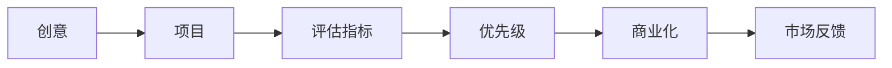
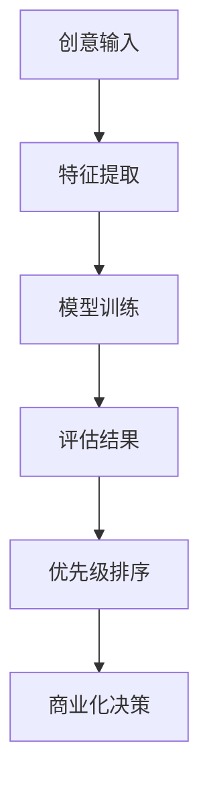
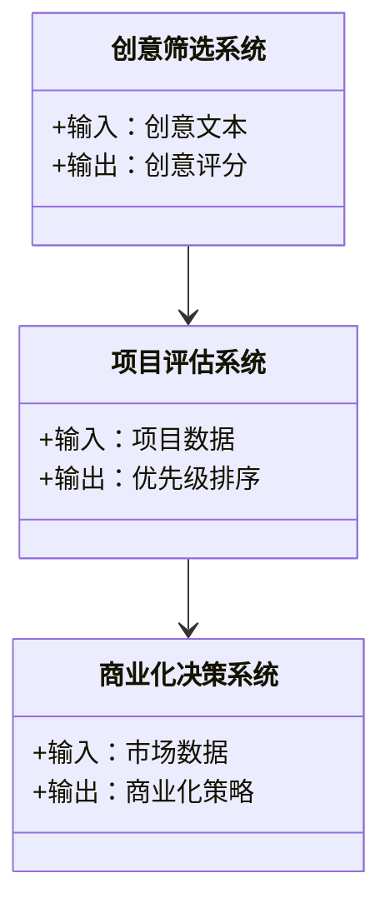
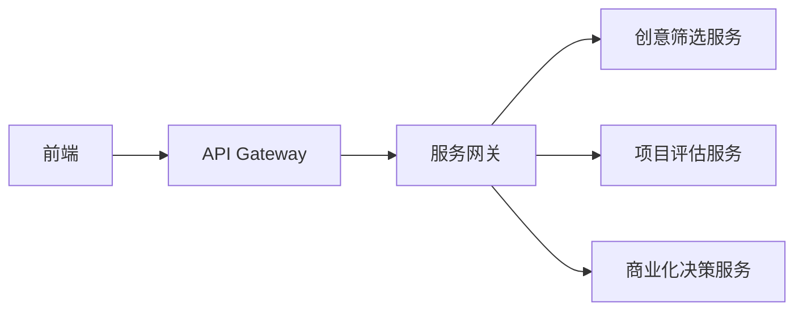

                 


# AI驱动的企业创新管理：从创意筛选到商业化全流程智能化

## 关键词：企业创新管理，AI驱动，创意筛选，项目评估，商业化，智能化流程

## 摘要：  
本文系统探讨了人工智能（AI）如何驱动企业创新管理的全流程智能化，从创意筛选到商业化落地的每一个环节。通过分析创意筛选、项目评估和商业化过程中的关键问题，结合AI技术的特点，提出了智能化解决方案，并详细阐述了算法原理、系统架构和实际案例。本文旨在为企业管理者和技术开发者提供理论依据和实践指导，助力企业通过AI技术实现创新管理的降本增效和价值提升。

---

## 第1章: AI驱动的企业创新管理背景

### 1.1 企业创新管理的背景与挑战  
企业在当今快速变化的商业环境中，面临着日益复杂的创新管理挑战。传统的企业创新管理方式依赖于人工经验判断和试错模式，存在效率低下、成本高昂、主观性强等问题。随着AI技术的快速发展，企业创新管理的智能化转型成为可能。  

#### 1.1.1 传统企业创新管理的痛点  
- 创意筛选效率低：海量创意难以快速筛选，人工评估主观性强。  
- 项目评估耗时长：从创意到项目的评估过程复杂，缺乏数据支持。  
- 商业化不确定性高：从实验室到市场的转化过程风险大，难以预测。  

#### 1.1.2 数字化与智能化对企业创新管理的影响  
AI技术的应用为企业创新管理带来了新的可能性，包括：  
- 利用自然语言处理（NLP）技术快速分析创意文本。  
- 基于机器学习模型预测项目成功概率。  
- 利用大数据分析优化商业化路径。  

#### 1.1.3 AI在企业创新管理中的作用  
AI技术可以实现创意筛选的自动化、项目评估的精准化和商业化过程的智能化，从而提高企业创新效率，降低创新成本。

---

### 1.2 AI驱动的企业创新管理的核心概念  

#### 1.2.1 创意筛选的智能化  
创意筛选是企业创新管理的第一步，AI可以通过以下方式实现：  
- 利用NLP技术分析创意文本的主题、情感和关键词。  
- 基于相似度计算，快速识别潜在的热门创意。  
- 使用深度学习模型预测创意的市场潜力。  

#### 1.2.2 项目评估与优先级排序的AI化  
项目评估的核心是通过数据驱动的方法确定项目的可行性和优先级。AI可以通过以下方式实现：  
- 建立多维度评估指标，包括技术可行性、市场潜力和资源需求。  
- 使用机器学习模型对项目进行分类和评分。  
- 自动生成优先级排序，帮助管理者快速决策。  

#### 1.2.3 商业化过程的全流程智能化  
商业化过程是企业创新管理的关键环节，AI可以通过以下方式实现：  
- 利用预测模型估算项目的市场表现和盈利能力。  
- 自动生成商业计划书，包括市场分析、竞争分析和推广策略。  
- 监测市场反馈，动态调整商业化策略。  

---

## 第2章: AI驱动的企业创新管理核心概念与联系  

### 2.1 核心概念原理  

#### 2.1.1 创意筛选的AI化原理  
创意筛选的过程可以分为以下几个步骤：  
1. **数据收集**：收集创意文本和相关背景信息。  
2. **特征提取**：提取文本中的关键词、主题和情感特征。  
3. **模型训练**：基于历史数据训练分类模型。  
4. **创意评分**：对新创意进行评分，筛选出高潜力创意。  

#### 2.1.2 项目评估的AI化原理  
项目评估的核心是构建一个多维度评估模型：  
1. **数据收集**：收集项目的市场数据、技术数据和团队数据。  
2. **模型构建**：使用机器学习算法（如随机森林、支持向量机）进行分类。  
3. **优先级排序**：根据评估结果生成项目的优先级排序。  

#### 2.1.3 商业化过程的AI化原理  
商业化过程可以通过以下步骤实现：  
1. **市场预测**：利用时间序列模型预测市场需求。  
2. **竞争分析**：通过NLP技术分析竞争对手的产品和营销策略。  
3. **策略优化**：基于预测结果优化推广策略和定价策略。  

---

### 2.2 核心概念属性特征对比表  

| **核心概念** | **属性**       | **特征**                                                                 |
|--------------|----------------|---------------------------------------------------------------------------|
| 创意筛选     | 数据来源       | 创意文本、市场数据、团队反馈                                             |
|              | 关键技术       | NLP、特征提取、机器学习模型                                             |
|              | 输出结果       | 创意评分、潜力预测                                                       |
| 项目评估     | 数据维度       | 技术可行性、市场潜力、资源需求                                         |
|              | 关键技术       | 多维度评估模型、机器学习分类                                            |
|              | 输出结果       | 项目评分、优先级排序                                                   |
| 商业化过程   | 数据类型       | 市场数据、竞争数据、用户反馈                                           |
|              | 关键技术       | 时间序列预测、NLP、动态优化模型                                        |
|              | 输出结果       | 商业化策略、市场预测、风险评估                                         |

---

### 2.3 ER实体关系图  



---

### 2.4 算法流程图  



---

## 第3章: 创意筛选的AI化实现  

### 3.1 创意筛选的算法原理  

#### 3.1.1 基于NLP的创意文本分析  
NLP技术可以提取创意文本中的关键词、主题和情感特征，帮助识别潜在的高价值创意。例如，使用TF-IDF算法提取关键词：  
$$ \text{TF-IDF}(i, j) = \frac{\text{TF}(i, j) \times \text{IDF}(j)}{\sum_{k=1}^{n} \text{TF}(i, k)} $$  
其中，$\text{TF}(i, j)$ 表示词 $j$ 在文档 $i$ 中的词频，$\text{IDF}(j)$ 表示词 $j$ 的逆文档频率。  

#### 3.1.2 基于机器学习的创意评分模型  
创意评分模型可以通过 supervised learning 方法训练分类器，对创意进行分类（如“高潜力”、“中潜力”、“低潜力”）。例如，使用逻辑回归模型：  
$$ P(y=1|x) = \frac{1}{1 + e^{-\beta x}} $$  
其中，$\beta$ 是模型参数，$x$ 是输入特征向量。  

#### 3.1.3 基于深度学习的创意潜力预测  
深度学习模型（如LSTM、BERT）可以用于预测创意的市场潜力。例如，使用BERT模型对创意文本进行编码，然后通过全连接层预测潜力分数：  
$$ \text{score}(x) = \text{Dense}(\text{BERT}(x)) $$  

---

### 3.2 数学模型与公式  

#### 3.2.1 文本相似度计算公式  
文本相似度可以通过余弦相似度计算：  
$$ \text{similarity}(x, y) = \frac{\sum_{i=1}^{n} x_i y_i}{\sqrt{\sum_{i=1}^{n} x_i^2} \sqrt{\sum_{i=1}^{n} y_i^2}} $$  

#### 3.2.2 创意评分模型公式  
创意评分模型可以通过加权平均的方式计算：  
$$ \text{score}(x) = \alpha \cdot f(x) + \beta \cdot g(x) $$  
其中，$\alpha$ 和 $\beta$ 是权重系数，$f(x)$ 是特征函数，$g(x)$ 是模型输出。

---

## 第4章: 系统分析与架构设计方案  

### 4.1 问题场景介绍  
企业创新管理系统的应用场景包括创意筛选、项目评估和商业化决策。系统需要处理海量数据，支持多维度分析和动态优化。

### 4.2 系统功能设计  

#### 4.2.1 领域模型Mermaid类图  



### 4.3 系统架构设计  

#### 4.3.1 系统架构Mermaid架构图  



---

## 第5章: 项目实战  

### 5.1 环境安装  
- 安装Python和相关库（如scikit-learn、BERT、PyTorch）。  
- 配置开发环境（如Jupyter Notebook、VS Code）。  

### 5.2 核心代码实现  

#### 5.2.1 创意筛选代码示例  

```python
import sklearn
from sklearn.feature_extraction.text import TfidfVectorizer
from sklearn.svm import SVC

# 数据准备
X = ["创意文本1", "创意文本2", ...]
y = ["高潜力", "中潜力", "低潜力"]

# 特征提取
vectorizer = TfidfVectorizer()
X_vec = vectorizer.fit_transform(X)

# 模型训练
model = SVC()
model.fit(X_vec, y)

# 预测
new_creative = ["新的创意文本"]
new_vec = vectorizer.transform([new_creative])
print(model.predict(new_vec))
```

---

### 5.3 案例分析  
以某科技公司为例，分析其如何通过AI技术实现创意筛选和项目评估的智能化。

---

## 第6章: 最佳实践与总结  

### 6.1 最佳实践tips  
- 数据是AI模型的核心，确保数据的高质量和多样性。  
- 结合业务场景，选择合适的AI技术（如NLP、机器学习）。  
- 定期更新模型，适应市场变化和用户需求。  

### 6.2 小结  
AI技术为企业创新管理的全流程智能化提供了强大支持，从创意筛选到商业化落地，AI可以帮助企业提高效率、降低成本并优化决策。

---

## 作者：AI天才研究院/AI Genius Institute & 禅与计算机程序设计艺术/Zen And The Art of Computer Programming

