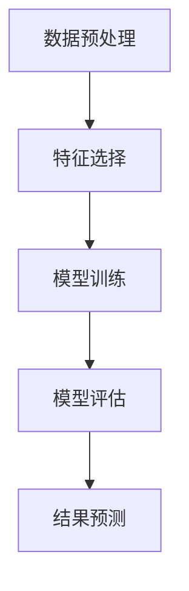
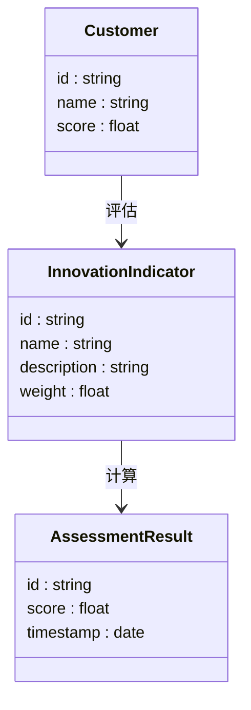
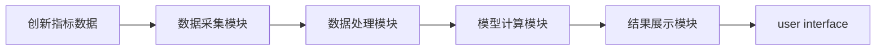

                 


# 《AI驱动的企业创新绩效评估：多维度创新指标量化与分析》

## 关键词：企业创新绩效评估，人工智能，多维度创新指标，量化分析，创新KPI

## 摘要：  
在当今快速变化的商业环境中，企业创新绩效评估已成为衡量企业竞争力和增长潜力的关键指标。然而，传统的评估方法往往依赖主观判断，难以量化和分析多维度的创新因素。通过人工智能（AI）技术，我们可以从海量数据中提取关键指标，构建多维度的创新评估体系，并通过量化分析提供科学的决策支持。本文将深入探讨AI驱动的企业创新绩效评估的核心概念、算法原理、系统设计与实现，并通过实际案例展示其应用价值。

---

## 第一部分：企业创新绩效评估的背景与核心概念

### 第1章：问题背景与核心概念

#### 1.1 问题背景  
- **企业创新的重要性**：创新是企业保持竞争优势的核心驱动力。无论是技术创新、产品创新还是管理创新，都是企业持续发展的关键。  
- **传统评估方法的局限性**：传统的创新评估方法通常依赖主观判断，难以量化多维度的创新指标，且缺乏实时性和动态性。  
- **AI技术的引入**：AI技术能够从结构化和非结构化数据中提取有价值的信息，为创新绩效评估提供科学依据。

#### 1.2 核心概念与定义  
- **创新绩效评估**：通过量化指标对企业创新能力进行评估的过程。  
- **多维度创新指标**：包括技术、市场、管理、财务等多个维度的创新相关指标。  
- **AI驱动的评估**：利用机器学习、自然语言处理等AI技术，对创新指标进行自动化分析和预测。

#### 1.3 核心概念的属性特征对比  

| 指标类型      | 技术创新 | 市场创新 | 管理创新 | 财务创新 |
|---------------|----------|----------|----------|----------|
| 数据来源      | 专利、技术文档 | 市场份额、客户反馈 | 组织结构、流程优化 | 投资回报率、利润 |
| 评估维度      | 技术复杂性 | 市场响应速度 | 管理效率 | 财务表现 |
| 评估周期      | 长期 | 短期 | 中长期 | 短期 |
| 数据类型      | 结构化与非结构化 | 结构化 | 结构化 | 结构化 |

#### 1.4 实体关系图（ER图）  

```mermaid
erDiagram
    customer[CUSTOMER] {
        string id
        string name
        integer score
    }
    innovation_indicator[INNOVATION_INDICATOR] {
        string id
        string name
        string description
        float weight
    }
    assessment_result[ASSESSMENT_RESULT] {
        string id
        float score
        date timestamp
    }
    CUSTOMER --> INNOVATION_INDICATOR : 评估
    INNOVATION_INDICATOR --> ASSESSMENT_RESULT : 计算
```

---

## 第二部分：算法原理与实现

### 第2章：AI驱动的创新绩效评估算法

#### 2.1 算法选择与原理  
- **回归分析**：用于预测创新绩效与各维度指标之间的关系。  
- **聚类分析**：用于识别创新绩效的相似企业或趋势。  
- **自然语言处理（NLP）**：用于分析非结构化数据，如专利文档和市场反馈。

#### 2.2 回归分析的数学模型  

$$ \text{创新绩效} = \beta_0 + \beta_1x_1 + \beta_2x_2 + \dots + \beta_nx_n + \epsilon $$  
其中，$x_i$ 表示各创新指标，$\beta_i$ 表示回归系数，$\epsilon$ 是误差项。

#### 2.3 回归分析的实现流程  



#### 2.4 Python实现代码  

```python
import pandas as pd
from sklearn.linear_model import LinearRegression
from sklearn.metrics import mean_squared_error

# 数据预处理
data = pd.read_csv('innovation_data.csv')
X = data[['tech_innovation', 'market_innovation', 'management_innovation', 'financial_innovation']]
y = data['performance_score']

# 模型训练
model = LinearRegression()
model.fit(X, y)

# 模型评估
y_pred = model.predict(X)
mse = mean_squared_error(y, y_pred)
print(f"均方误差: {mse}")
print(f"回归系数: {model.coef_}")
print(f"截距: {model.intercept_}")
```

---

## 第三部分：系统分析与设计

### 第3章：系统分析与架构设计

#### 3.1 问题场景  
- **数据来源**：整合企业内部数据（如专利申请、研发投入）和外部数据（如市场份额、客户反馈）。  
- **系统功能**：提供创新指标量化、评估结果可视化、趋势预测等功能。  

#### 3.2 系统功能设计  



#### 3.3 系统架构设计  



---

## 第四部分：项目实战与案例分析

### 第4章：项目实战

#### 4.1 环境安装与数据准备  
```bash
pip install numpy pandas scikit-learn
```

#### 4.2 核心代码实现  

```python
from sklearn.model_selection import train_test_split

# 数据分割
X_train, X_test, y_train, y_test = train_test_split(X, y, test_size=0.2, random_state=42)

# 模型训练
model.fit(X_train, y_train)

# 模型预测
y_pred = model.predict(X_test)
print(f"测试集均方误差: {mean_squared_error(y_test, y_pred)}")
```

#### 4.3 案例分析  
以某科技公司为例，分析其技术创新、市场创新等指标的权重和对绩效的影响。通过模型预测，提供优化建议。

---

## 第五部分：总结与展望

### 第5章：总结与展望

#### 5.1 最佳实践  
- 数据质量是关键，需确保数据的完整性和准确性。  
- 定期更新模型，以适应市场变化和企业需求。  

#### 5.2 小结  
AI技术为多维度创新绩效评估提供了新的可能性，通过量化分析和实时反馈，企业可以更科学地制定创新策略。

#### 5.3 注意事项  
- 数据隐私和安全需严格保护。  
- 模型需结合企业实际业务，避免过度复杂化。  

#### 5.4 拓展阅读  
- 《机器学习实战》  
- 《创新管理：理论与实践》  

---

## 作者：AI天才研究院 & 禅与计算机程序设计艺术

