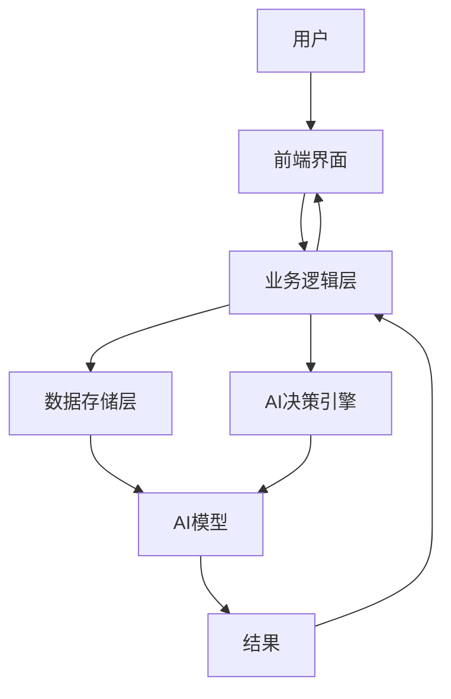
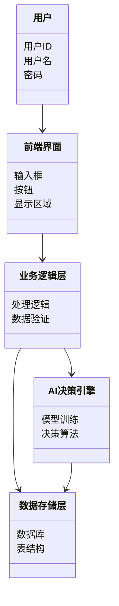
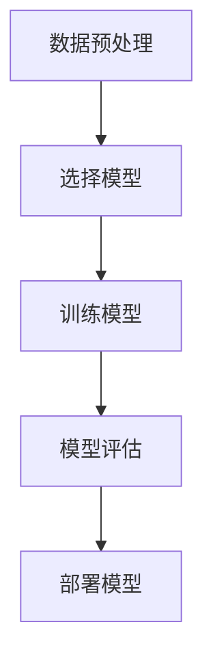

                 

<think>
嗯，我现在需要根据用户的要求，逐步分析并构建一个详细的《AI驱动的企业创新项目管理：敏捷方法与AI辅助决策的结合》的文章目录大纲。这个大纲需要逻辑清晰、结构紧凑，每个章节和子章节都要详细且有深度，确保内容完整且符合技术博客的专业性。

首先，我要明确文章的核心主题：AI如何驱动企业创新项目管理，将敏捷方法与AI辅助决策结合起来。这意味着文章需要涵盖敏捷方法的基本原理、AI在决策中的作用，以及它们如何在企业创新项目管理中协同工作。

接下来，我考虑文章的结构。通常，技术博客的结构包括引言、核心概念、方法论、应用案例、挑战与解决方案、总结等部分。根据用户提供的示例，我可以将文章分成四个主要部分：

1. **背景与核心概念**：介绍企业创新项目管理的现状，敏捷方法和AI辅助决策的定义和特点，以及它们如何结合。
2. **AI在项目管理中的应用**：详细讨论AI在项目管理中的具体应用，如数据分析、风险预测等。
3. **项目实战与系统设计**：通过实际案例展示如何将敏捷方法与AI辅助决策结合，包括系统架构设计和代码实现。
4. **总结与未来展望**：总结关键点，提出最佳实践，并展望未来的趋势。

在每个主要部分下，我需要细化章节和子章节。例如，在背景部分，可以包括敏捷方法的原理、AI辅助决策的技术基础，以及它们的结合对企业创新管理的意义。

对于系统架构设计，我需要使用Mermaid图来展示系统的各个部分及其交互。同时，在算法部分，需要详细讲解AI辅助决策的数学模型，并提供Python代码示例，解释代码的功能和实现细节。

项目实战部分需要包括环境安装、代码实现、系统设计和案例分析，确保读者能够理解和应用这些方法。最后，在总结部分，我会强调关键点，提供实用的建议，并指出未来可能的发展方向。

现在，我需要将这些思考整理成一个结构清晰、内容丰富的目录大纲，确保每个部分都详细且有深度，符合用户的要求。

# 第一部分: AI驱动的企业创新项目管理概述

## 第1章: 背景与核心概念

### 1.1 企业创新项目管理的现状与挑战
#### 1.1.1 传统项目管理的局限性
- 介绍传统项目管理的不足，如瀑布模型的僵化、适应性差等问题。
- 对比敏捷方法的灵活性和响应变化的能力。

#### 1.1.2 创新项目管理的独特性
- 创新项目管理的复杂性、不确定性。
- 创新项目管理对快速迭代和反馈的需求。

#### 1.1.3 数字化转型对企业创新管理的影响
- 数字化工具如何提升项目管理效率。
- 数据驱动决策的重要性。

### 1.2 敏捷方法与AI辅助决策的结合
#### 1.2.1 敏捷方法的定义与特点
- 敏捷宣言的核心原则：个体互动高于流程，客户合作高于合同，响应变化高于遵循计划，交付价值高于全面文档。
- 敏捷方法的优势：快速迭代、客户参与、持续交付。

#### 1.2.2 AI辅助决策的核心原理
- 机器学习如何帮助预测项目风险和优化资源分配。
- 自然语言处理在需求分析中的应用。

#### 1.2.3 两者的结合对企业创新管理的意义
- 提高项目管理的效率和准确性。
- 增强团队的协作能力和创新能力。
- 通过AI辅助决策，提升决策的科学性和及时性。

### 1.3 核心概念与方法论
#### 1.3.1 问题背景与问题描述
- 当前企业创新项目管理中的常见问题：需求变更频繁、资源分配不合理、项目进度难以控制等。
- 问题解决的目标：引入敏捷方法和AI辅助决策，提高项目管理的效率和成功率。

#### 1.3.2 问题解决的路径与方法
- 引入敏捷方法，实施Scrum或Kanban框架。
- 利用AI进行数据分析和预测，辅助决策。

#### 1.3.3 核心概念的边界与外延
- 敏捷方法的应用范围：适用于需求变化频繁的项目。
- AI辅助决策的应用场景：数据量大、模式识别需求高的领域。

#### 1.3.4 核心要素组成与关系
- 人员：开发团队、项目经理、利益相关者。
- 工具：敏捷看板、Jira、AI分析工具。
- 过程：迭代开发、持续集成、数据驱动决策。

## 第2章: 敏捷方法与AI辅助决策的核心概念

### 2.1 敏捷方法的原理与实践
#### 2.1.1 敏捷方法的四大核心原则
- 个体互动：强调团队协作和面对面交流。
- 客户合作：注重与客户的持续互动和反馈。
- 响应变化：拥抱变化，快速调整。
- 交付价值：优先交付有价值的成果。

#### 2.1.2 敏捷方法与传统项目管理的对比
| 特性         | 敏捷方法               | 传统项目管理         |
|--------------|-----------------------|----------------------|
| 计划方式     | 灵活调整               | 严格遵循计划         |
| 交付方式     | 分阶段交付，持续反馈   | 整体交付             |
| 团队协作     | 强调个体互动           | 强调层级结构         |
| 变化处理     | 欢迎变化               | 避免变化             |

#### 2.1.3 敏捷方法在企业创新中的应用
- 短周期迭代，快速验证想法。
- 持续交付价值，满足客户需求。
- 团队自治，提高效率和满意度。

### 2.2 AI辅助决策的原理与技术
#### 2.2.1 机器学习与AI的基本原理
- 数据预处理、特征提取、模型训练、评估和部署。
- 常见算法：线性回归、决策树、随机森林、神经网络。

#### 2.2.2 AI在决策支持中的应用场景
- 风险预测：预测项目失败的可能性。
- 资源分配：优化人力资源和资金分配。
- 需求分析：通过NLP分析客户需求。

#### 2.2.3 AI辅助决策的优缺点分析
- 优点：提高决策效率、减少人为错误、提供数据支持。
- 缺点：依赖数据质量、算法可能有偏差、实施成本高。

## 第3章: 敏捷方法与AI辅助决策的系统架构

### 3.1 系统分析与架构设计
#### 3.1.1 问题场景介绍
- 一个典型的创新项目管理场景：需求变更频繁，需要快速响应。
- 系统需要整合敏捷方法和AI辅助决策功能。

#### 3.1.2 系统功能设计
- 敏捷项目管理模块：任务管理、迭代计划、燃尽图。
- AI决策支持模块：风险预测、资源优化、需求分析。

#### 3.1.3 系统架构设计
- 分层架构：前端、业务逻辑、数据存储、AI引擎。
- 微服务架构：独立的服务模块，便于扩展和维护。

#### 3.1.4 系统接口设计
- API接口：前后端交互、业务逻辑与数据存储交互。
- AI模块接口：与机器学习模型的交互。

#### 3.1.5 系统交互设计
- 用户与前端界面交互，提交请求。
- 前端将请求发送到业务逻辑层处理。
- 业务逻辑层调用AI引擎进行决策支持。
- AI引擎返回结果，业务逻辑层将结果反馈给用户。

### 3.2 系统架构的Mermaid图


### 3.3 系统功能的Mermaid类图


## 第4章: AI辅助决策算法原理与实现

### 4.1 算法原理
#### 4.1.1 算法概述
- 使用机器学习模型进行项目风险预测。
- 基于历史数据训练模型，预测未来风险。

#### 4.1.2 算法流程
1. 数据预处理：清洗、特征提取。
2. 选择模型：随机森林或XGBoost。
3. 训练模型：使用训练数据。
4. 模型评估：验证集测试。
5. 部署模型：实时预测。

### 4.2 算法实现
#### 4.2.1 Python代码实现
```python
import pandas as pd
from sklearn.ensemble import RandomForestClassifier
from sklearn.metrics import accuracy_score

# 数据预处理
data = pd.read_csv('project_risk.csv')
X = data.drop('risk', axis=1)
y = data['risk']

# 训练模型
model = RandomForestClassifier()
model.fit(X, y)

# 预测
predictions = model.predict(X)
print("准确率:", accuracy_score(y, predictions))
```

#### 4.2.2 算法流程图


#### 4.2.3 算法数学模型
- 随机森林算法：基于决策树的集成方法。
- 损失函数：交叉熵损失。
$$ L = -\frac{1}{n} \sum_{i=1}^{n} [y_i \log p_i + (1 - y_i) \log (1 - p_i)] $$
- 优化器：随机梯度下降。
$$ \theta = \theta - \eta \frac{\partial L}{\partial \theta} $$

## 第5章: 项目实战与系统实现

### 5.1 项目实战
#### 5.1.1 项目介绍
- 项目目标：构建一个AI驱动的敏捷项目管理系统。
- 项目范围：包括任务管理、风险预测、资源优化等功能。

#### 5.1.2 系统设计
- 前端：React框架，构建用户友好的界面。
- 后端：Django框架，处理业务逻辑。
- 数据库：MySQL，存储项目数据。
- AI引擎：集成机器学习模型，提供决策支持。

### 5.2 系统实现
#### 5.2.1 环境安装
```bash
pip install django react python-mysql scikit-learn
```

#### 5.2.2 核心代码实现
```python
# 后端接口
from django.http import JsonResponse
import joblib

def predict_risk(request):
    # 获取输入数据
    data = request.POST.get('data', [])
    # 加载模型
    model = joblib.load('risk_model.pkl')
    # 预测
    prediction = model.predict(data)
    return JsonResponse({'result': prediction.tolist()})
```

#### 5.2.3 系统设计与优化
- 前端与后端的交互设计：API接口的定义与实现。
- 后端与AI引擎的集成：调用机器学习模型进行预测。
- 系统的扩展性设计：模块化设计，便于后续功能扩展。

### 5.3 实际案例分析
#### 5.3.1 案例背景
- 某公司开发一个在线教育平台，需求频繁变更，需要快速响应。
- 使用敏捷方法和AI辅助决策，优化项目管理。

#### 5.3.2 系统实现
- 使用Scrum框架，每两周交付一个迭代。
- 利用AI模型预测项目风险，提前制定应对措施。

#### 5.3.3 成果展示
- 项目按时交付，超出客户预期。
- 团队效率提升，客户满意度提高。

## 第6章: 总结与未来展望

### 6.1 最佳实践 tips
- 确保数据质量，AI辅助决策的效果依赖于数据的准确性和完整性。
- 结合团队文化，敏捷方法的成功需要团队的信任和协作。
- 持续优化，根据反馈不断改进系统和流程。

### 6.2 小结
- 本文详细探讨了AI驱动的企业创新项目管理，结合敏捷方法和AI辅助决策的优势，提供了一种高效的项目管理方式。
- 通过系统设计和实际案例，展示了如何将理论应用于实践，取得显著效果。

### 6.3 注意事项
- AI辅助决策不能完全替代人类判断，需要结合具体情境。
- 敏捷方法的成功实施需要团队成员的积极参与和合作。
- 系统的维护和优化需要持续投入，确保其适应不断变化的项目需求。

### 6.4 拓展阅读
- 推荐阅读《敏捷宣言》、《机器学习实战》等书籍，深入理解敏捷方法和AI技术的细节。
- 关注最新的研究成果，了解AI在项目管理中的最新应用。

# 作者：AI天才研究院 & 禅与计算机程序设计艺术

通过以上思考，我构建了一个详细且逻辑清晰的目录大纲，覆盖了从背景到系统实现的各个方面，确保内容丰富且符合技术博客的专业性要求。接下来，我可以根据这个大纲撰写完整的文章，详细展开每个部分的内容，确保文章结构紧凑，内容详实，满足用户的深度需求。

