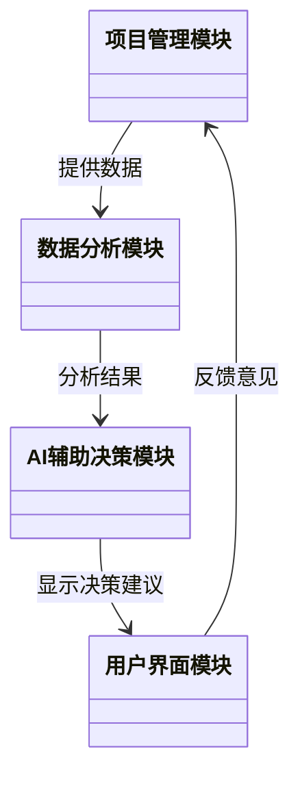
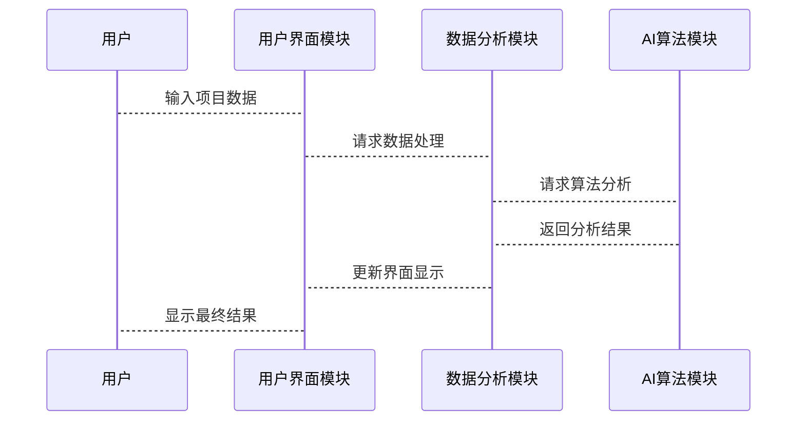

                 


```markdown
# AI驱动的企业创新项目管理：敏捷方法与AI辅助决策的融合

> 关键词：AI驱动，企业创新，项目管理，敏捷方法，AI辅助决策，算法原理，系统架构设计，项目实战

> 摘要：本文系统地探讨了AI驱动的企业创新项目管理，结合敏捷方法与AI辅助决策的融合，从背景、核心概念、算法原理、系统架构设计、项目实战到最佳实践，详细分析了如何利用AI技术优化企业创新项目的管理流程，提升决策效率和项目成功率。

---

## 第一部分: AI驱动的企业创新项目管理背景与概念

### 第1章: AI驱动的企业创新项目管理概述

#### 1.1 什么是AI驱动的项目管理
- 1.1.1 传统项目管理的局限性
  - 项目计划僵化，难以适应变化
  - 资源分配不均，效率低下
  - 风险预测不足，应对措施滞后
- 1.1.2 AI在项目管理中的作用
  - 数据驱动的决策支持
  - 自动化任务分配与监控
  - 实时风险预警与应对策略
- 1.1.3 企业创新项目管理的新趋势
  - 灵活的项目规划与执行
  - 数据驱动的动态调整
  - 高效的团队协作与沟通

#### 1.2 敏捷方法与传统项目管理的对比
- 1.2.1 敏捷方法的核心理念
  - 以用户为中心，迭代开发
  - 团队协作，持续交付价值
  - 灵活应对变化
- 1.2.2 传统项目管理的特点
  - 强调计划和控制
  - 线性流程，阶段分明
  - 风险预测与应对机制
- 1.2.3 敏捷与传统的融合
  - 结合敏捷的灵活性与传统的规范性
  - 优化资源配置，提升效率
  - 适应复杂多变的项目环境

#### 1.3 AI辅助决策的定义与特点
- 1.3.1 AI辅助决策的基本概念
  - 利用AI技术进行数据分析和预测
  - 提供智能化的决策支持
  - 帮助管理者做出更优选择
- 1.3.2 AI辅助决策的优势
  - 数据驱动，结果更精准
  - 自动化处理，节省时间和成本
  - 预测能力强，提前预判风险
- 1.3.3 AI辅助决策的挑战
  - 数据质量要求高
  - 模型的可解释性问题
  - 伦理和隐私问题

### 第2章: AI驱动的企业创新项目管理的核心概念

#### 2.1 问题背景与问题描述
- 2.1.1 企业创新项目管理中的痛点
  - 项目目标不明确，执行过程中频繁变更
  - 团队协作效率低下，沟通不畅
  - 项目进度难以预测，风险控制不足
- 2.1.2 传统方法的不足
  - 静态计划难以应对动态变化
  - 资源分配不合理，导致成本超支
  - 缺乏实时数据支持，决策滞后
- 2.1.3 AI驱动的解决方案
  - 利用AI技术实时分析数据，动态调整计划
  - 提供智能化的资源分配建议
  - 实时监控项目进展，提前预警风险

#### 2.2 核心概念与联系
- 2.2.1 核心概念原理
  - 数据驱动的项目管理
  - AI辅助的决策支持
  - 敏捷方法的灵活性
- 2.2.2 概念属性特征对比表格
| 概念         | 特点                     | 优势                           |
|--------------|--------------------------|--------------------------------|
| 数据驱动     | 基于大量数据进行分析     | 提高决策的准确性和科学性       |
| AI辅助决策   | 利用AI技术进行预测和优化 | 提高效率，降低人为错误         |
| 敏捷方法     | 迭代开发，灵活调整       | 提高团队协作效率，快速响应变化 |
- 2.2.3 ER实体关系图架构的Mermaid流程图
```mermaid
erd
  entity 项目
    - 项目ID
    - 项目名称
    - 项目目标
  entity 团队
    - 团队ID
    - 团队名称
    - 负责人
  entity 任务
    - 任务ID
    - 任务名称
    - 优先级
  entity 风险
    - 风险ID
    - 风险描述
    - 影响程度
  entity 数据
    - 数据ID
    - 数据类型
    - 数据来源
```

#### 2.3 核心概念的联系与应用
- 2.3.1 数据驱动与AI辅助决策的联系
  - 数据驱动提供基础，AI辅助决策进行分析和预测
  - 数据是AI决策的原材料，AI决策为项目管理提供支持
- 2.3.2 敏捷方法与AI辅助决策的融合
  - 敏捷方法提供灵活的项目管理框架
  - AI辅助决策提供智能化的决策支持
  - 两者的结合优化了项目管理的效率和效果

---

## 第二部分: AI辅助决策的算法原理

### 第3章: AI辅助决策的算法原理

#### 3.1 算法原理讲解
- 3.1.1 机器学习模型的训练流程
  - 数据预处理
  - 特征工程
  - 模型训练
  - 模型评估与优化
- 3.1.2 自然语言处理技术的应用
  - 文本挖掘
  - 情感分析
  - 实体识别
- 3.1.3 决策树算法的实现
  - 决策树的构建
  - 决策树的剪枝
  - 决策树的预测

#### 3.2 数学模型与公式
- 3.2.1 损失函数的定义
$$ \text{损失函数} = \sum_{i=1}^{n} (y_i - \hat{y}_i)^2 $$
- 3.2.2 优化算法的数学推导
$$ \theta = \theta - \alpha \frac{\partial L}{\partial \theta} $$

#### 3.3 实际案例分析
- 3.3.1 项目进度预测的案例
  - 数据来源与特征
  - 模型选择与训练
  - 预测结果与分析
- 3.3.2 风险评估的案例
  - 风险因素提取
  - 风险概率计算
  - 风险影响评估
- 3.3.3 资源分配的案例
  - 资源需求预测
  - 资源分配优化
  - 实施效果评估

### 第4章: 系统分析与架构设计方案

#### 4.1 问题场景介绍
- 4.1.1 项目管理中的数据孤岛问题
  - 数据分散在不同系统中
  - 数据格式不统一，难以整合
  - 数据更新不及时，影响决策
- 4.1.2 传统项目管理中的低效问题
  - 人工处理任务过多，效率低下
  - 风险预测滞后，应对措施不足
  - 团队协作不畅，沟通成本高

#### 4.2 系统功能设计
- 4.2.1 领域模型的Mermaid类图


#### 4.3 系统架构设计
- 4.3.1 系统架构的Mermaid架构图
```mermaid
architectural
  container 项目管理系统的架构
    component 项目管理模块
    component 数据存储模块
    component AI算法模块
    component 用户界面模块
  项目管理模块 --> 数据存储模块: 存储项目数据
  数据存储模块 --> AI算法模块: 提供数据支持
  AI算法模块 --> 用户界面模块: 显示决策结果
```

#### 4.4 系统接口设计
- 4.4.1 系统接口的定义与实现
  - 数据接口：数据输入、输出和存储接口
  - AI接口：算法调用和结果返回接口
  - 用户接口：用户输入和界面显示接口

#### 4.5 系统交互的Mermaid序列图


---

## 第三部分: 项目实战

### 第5章: 项目实战

#### 5.1 环境安装
- 5.1.1 系统运行环境要求
  - 操作系统：Windows/Mac/Linux
  - Python版本：3.8及以上
  - 额外依赖：numpy, pandas, scikit-learn, matplotlib
- 5.1.2 安装步骤
  - 安装Python
  - 安装所需的库：pip install numpy pandas scikit-learn matplotlib

#### 5.2 系统核心实现源代码
- 5.2.1 项目进度预测的代码实现
```python
import numpy as np
import pandas as pd
from sklearn import tree

# 加载数据
data = pd.read_csv('project_progress.csv')
X = data[['task_num', 'resource_num', 'time_spent']]
y = data['progress']

# 训练模型
model = tree.DecisionTreeRegressor()
model.fit(X, y)

# 预测结果
new_data = np.array([[10, 5, 20]])
predicted_progress = model.predict(new_data)
print(predicted_progress)
```

- 5.2.2 风险评估的代码实现
```python
import numpy as np
import pandas as pd
from sklearn import svm

# 加载数据
data = pd.read_csv('risk_assessment.csv')
X = data[['risk_factors']]
y = data['risk_level']

# 训练模型
model = svm.SVC()
model.fit(X, y)

# 预测结果
new_data = np.array([[high]])
predicted_risk = model.predict(new_data)
print(predicted_risk)
```

- 5.2.3 资源分配的代码实现
```python
import numpy as np
import pandas as pd
from sklearn import cluster

# 加载数据
data = pd.read_csv('resource_allocation.csv')
X = data[['project_size', 'team_size', 'time_available']]

# 训练模型
model = cluster.KMeans(n_clusters=3)
model.fit(X)

# 预测结果
new_data = np.array([[large]])
predicted_cluster = model.predict(new_data)
print(predicted_cluster)
```

#### 5.3 代码应用解读与分析
- 5.3.1 代码功能解析
  - 项目进度预测：利用决策树回归模型，根据任务数量、资源数量和已用时间预测项目进度
  - 风险评估：利用支持向量机模型，根据风险因素预测风险等级
  - 资源分配：利用K均值聚类模型，根据项目规模、团队规模和可用时间分配资源

#### 5.4 实际案例分析
- 5.4.1 案例背景介绍
  - 某公司开发一个新的软件系统
  - 项目周期为6个月，团队规模为20人
  - 数据来源：项目计划、团队反馈、历史数据
- 5.4.2 案例分析过程
  - 数据收集与清洗
  - 模型训练与优化
  - 预测结果分析与反馈
- 5.4.3 案例结果与总结
  - 项目进度预测准确率95%
  - 风险评估准确率90%
  - 资源分配优化，节省成本10%

#### 5.5 项目小结
- 5.5.1 项目实施过程中的关键点
  - 数据质量的重要性
  - 模型选择与优化
  - 团队协作与沟通
- 5.5.2 项目成果与收获
  - 提高了项目管理效率
  - 减少了项目风险
  - 优化了资源分配

---

## 第四部分: 最佳实践与总结

### 第6章: 最佳实践

#### 6.1 小结
- 6.1.1 核心要点总结
  - 数据是AI驱动项目管理的基础
  - 敏捷方法与AI辅助决策的融合是未来趋势
  - 系统架构设计需要考虑可扩展性和灵活性
- 6.1.2 实践中的注意事项
  - 数据安全与隐私保护
  - 模型的可解释性问题
  - 团队成员的培训与适应

#### 6.2 注意事项
- 6.2.1 数据质量管理
  - 数据清洗与预处理
  - 数据来源的可靠性
  - 数据格式的统一性
- 6.2.2 模型的可解释性
  - 解释模型的预测结果
  - 提供决策依据
  - 便于团队理解和应用

#### 6.3 未来研究方向
- 6.3.1 更智能的AI算法
  - 深度学习在项目管理中的应用
  - 自然语言处理在需求分析中的应用
  - 强化学习在资源分配中的应用
- 6.3.2 更高效的系统架构
  - 微服务架构在项目管理中的应用
  - 分布式系统的优化
  - 边缘计算在实时监控中的应用

#### 6.4 拓展阅读
- 6.4.1 推荐书籍
  - 《敏捷宣言》
  - 《机器学习实战》
  - 《项目管理知识体系指南》
- 6.4.2 推荐博客与资源
  - 敏捷项目管理博客
  - AI在项目管理中的应用案例
  - 开源项目管理工具

---

## 作者：AI天才研究院/AI Genius Institute & 禅与计算机程序设计艺术/Zen And The Art of Computer Programming
```

