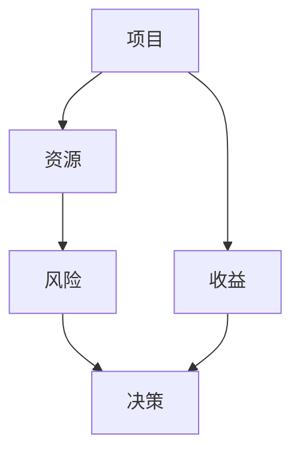
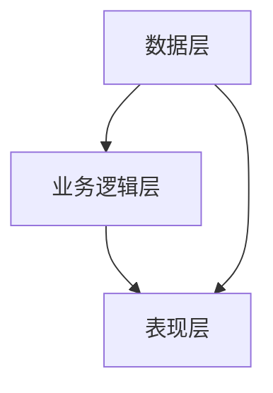
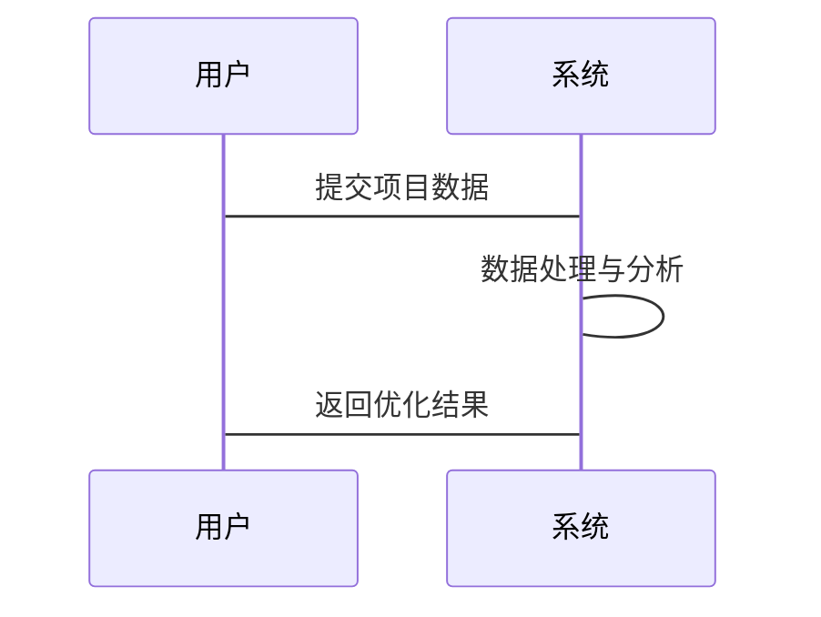

                 


# AI驱动的企业创新项目组合管理：资源优化与风险平衡

> 关键词：AI驱动、企业创新、项目组合管理、资源优化、风险平衡

> 摘要：本文深入探讨了AI技术在企业创新项目组合管理中的应用，重点分析了资源优化与风险平衡的核心问题，结合数学模型、机器学习算法和系统架构设计，详细阐述了如何通过AI技术提升企业创新项目的决策效率和成功率。

---

## 第1章: 企业创新项目组合管理的背景与挑战

### 1.1 项目组合管理的定义与特点

项目组合管理是指企业在一定资源约束下，对多个项目进行优先级排序、资源分配和风险评估的过程，以实现企业战略目标的最大化。其特点是多目标性、动态性和复杂性。

### 1.2 传统项目组合管理的局限性

- **资源分配效率低**：传统方法依赖人工经验，难以实现最优分配。
- **风险评估主观性强**：缺乏数据支持，难以量化风险。
- **决策周期长**：手工计算和评估耗时耗力，难以快速响应变化。

### 1.3 AI技术在项目组合管理中的应用潜力

- **数据驱动决策**：通过AI技术分析历史数据，优化资源分配。
- **智能化风险预测**：利用机器学习模型预测项目风险，提高决策的准确性。
- **提高资源利用效率**：通过智能算法实现资源的最优配置。

---

## 第2章: AI驱动的项目组合管理核心概念

### 2.1 项目组合管理的数学模型

#### 2.1.1 资源分配的线性规划模型
最大化收益：$$ \text{最大化} \sum_{i} r_i x_i $$
约束条件：$$ \sum_{i} x_i \leq R $$

其中，\( r_i \) 表示项目的收益，\( x_i \) 表示分配的资源量，\( R \) 是总资源。

#### 2.1.2 项目风险的贝叶斯网络模型

贝叶斯网络通过概率推理量化项目风险，构建因果关系网络，评估不同风险因素对项目的影响。

#### 2.1.3 项目收益与风险的平衡方程

$$ \text{收益平衡} = \alpha \cdot \text{收益} + (1 - \alpha) \cdot \text{风险} $$

其中，\( \alpha \) 是收益和风险的权衡系数。

### 2.2 AI在项目组合管理中的应用原理

#### 2.2.1 数据预处理与特征提取

- 数据清洗：去除噪声数据，处理缺失值。
- 特征提取：通过主成分分析（PCA）提取关键特征。

#### 2.2.2 机器学习算法的选择与应用

- **监督学习**：使用回归模型预测项目收益。
- **无监督学习**：聚类分析识别风险类型。
- **集成学习**：结合多种算法提高预测准确性。

#### 2.2.3 模型训练与优化

通过交叉验证优化模型参数，使用梯度下降法训练深度学习模型。

### 2.3 项目组合管理的ER实体关系图



### 2.4 本章小结

本章介绍了AI驱动的项目组合管理的核心概念，包括数学模型、算法原理和实体关系图，为后续的分析奠定了基础。

---

## 第3章: 基于AI的项目组合管理算法原理

### 3.1 资源优化的数学模型

#### 3.1.1 资源分配的线性规划模型

最大化收益：$$ \text{最大化} \sum_{i} r_i x_i $$
约束条件：$$ \sum_{i} x_i \leq R $$

#### 3.1.2 项目风险的贝叶斯网络模型

构建贝叶斯网络，通过概率推理量化风险。

### 3.2 风险平衡的算法流程

#### 3.2.1 风险评估的贝叶斯网络

通过贝叶斯网络计算项目风险概率。

#### 3.2.2 风险平衡的优化算法

使用遗传算法优化风险平衡。

### 3.3 算法实现的Python代码示例

```python
import numpy as np
from sklearn.linear_model import LinearRegression

# 示例数据
X = np.array([[1], [2], [3], [4]])
y = np.array([2, 4, 6, 8])

# 训练线性回归模型
model = LinearRegression()
model.fit(X, y)

# 预测
print(model.predict(np.array([[5]])))
```

### 3.4 本章小结

本章详细讲解了AI驱动的项目组合管理算法原理，包括资源优化和风险平衡的具体实现方法。

---

## 第4章: 系统分析与架构设计

### 4.1 问题场景介绍

企业创新项目组合管理的系统需要实现项目筛选、资源分配、风险评估等功能。

### 4.2 系统功能设计

- **领域模型**：展示系统的核心功能模块。
- **系统架构设计**：使用分层架构，包括数据层、业务逻辑层和表现层。

### 4.3 系统架构设计



### 4.4 系统接口设计

- API接口：提供RESTful API，实现数据交互。

### 4.5 系统交互流程



### 4.6 本章小结

本章详细分析了系统的架构设计和交互流程，为后续的项目实现奠定了基础。

---

## 第5章: 项目实战

### 5.1 环境安装

- 安装Python和相关库：numpy、pandas、scikit-learn。

### 5.2 系统核心实现源代码

```python
import numpy as np
from sklearn.cluster import KMeans

# 示例数据
X = np.array([[1, 2], [3, 4], [5, 6], [7, 8]])

# 聚类分析
model = KMeans(n_clusters=2)
model.fit(X)

print(model.labels_)
```

### 5.3 代码应用解读与分析

- 代码实现项目聚类分析，识别不同类型项目。

### 5.4 实际案例分析

- 某公司创新项目组合管理的案例分析，展示AI技术的应用效果。

### 5.5 项目小结

本章通过实际案例展示了AI技术在企业创新项目组合管理中的应用，验证了理论的可行性。

---

## 第6章: 总结与展望

### 6.1 核心内容总结

AI技术在企业创新项目组合管理中的应用，显著提高了资源利用效率和决策准确性。

### 6.2 未来研究方向

- 更复杂的风险模型。
- 多目标优化算法的改进。

### 6.3 应用前景

AI技术将在企业创新管理中发挥越来越重要的作用，推动企业创新效率的提升。

---

## 作者：AI天才研究院 & 禅与计算机程序设计艺术

