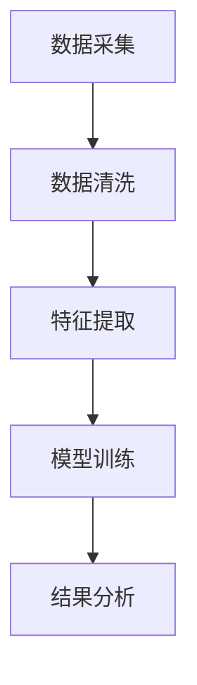
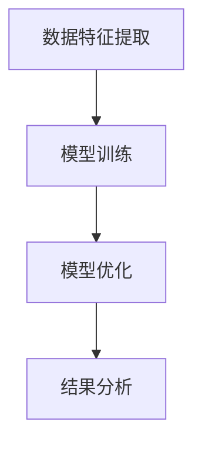

                 


# AI驱动的企业品牌价值动态量化系统

> 关键词：品牌价值，AI驱动，动态量化，系统架构，算法模型

> 摘要：本文探讨了如何利用人工智能技术构建企业品牌价值动态量化系统。通过分析品牌价值的核心构成要素，结合AI算法，提出了一种基于数据驱动的品牌价值预测模型，并设计了完整的系统架构。文章详细阐述了系统实现的关键步骤，包括数据特征提取、模型训练与优化，以及系统的实际应用场景。最后，通过案例分析验证了系统的有效性和实用性。

---

## 第1章: 引言

### 1.1 问题背景与意义

在当前激烈的商业竞争环境中，品牌价值是企业核心竞争力的重要体现。传统的品牌价值评估方法通常依赖于主观判断和静态分析，难以捕捉品牌价值的动态变化。随着人工智能技术的快速发展，基于数据驱动的动态量化方法逐渐成为品牌价值评估的主流趋势。

#### 1.1.1 传统品牌价值评估的局限性
传统品牌价值评估方法通常依赖于财务数据和专家主观判断，存在以下问题：
- 数据维度有限，难以全面反映品牌价值的变化。
- 评估周期较长，无法实时捕捉市场动态。
- 方法单一，难以适应不同行业和场景的需求。

#### 1.1.2 AI技术在品牌价值评估中的优势
人工智能技术具有以下优势，能够有效解决传统方法的局限性：
- 数据处理能力强，能够整合多源异构数据。
- 算法灵活，支持动态预测和实时更新。
- 可扩展性强，适用于不同行业和场景。

#### 1.1.3 企业品牌价值动态量化的重要性
品牌价值的动态量化能够帮助企业：
- 实时监控品牌健康状况，及时调整品牌策略。
- 量化品牌资产，支持企业决策。
- 提供数据支持，优化市场营销投入。

### 1.2 本书的目的与目标
本书旨在通过AI技术构建一个动态量化企业品牌价值的系统，并解决以下问题：
- 如何高效提取品牌价值相关的数据特征。
- 如何构建动态预测模型，并实现实时更新。
- 如何设计一个可扩展的系统架构，支持企业级应用。

### 1.3 本书的结构安排
本书共分为四个部分：
1. 引言：介绍问题背景和研究意义。
2. 品牌价值与AI驱动的核心概念：分析品牌价值的构成要素和AI驱动的核心概念。
3. 品牌价值量化系统的算法原理：详细讲解算法实现和系统架构设计。
4. 项目实战：通过具体案例展示系统的实现过程和应用效果。

---

## 第2章: 品牌价值的定义与构成要素

### 2.1 品牌价值的定义
品牌价值是指品牌为企业带来的超额收益，是品牌在市场中所占据的位置和消费者认知的价值总和。

#### 2.1.1 品牌价值的多维度解析
品牌价值可以从以下几个维度进行解析：
- 品牌知名度：品牌在市场中的认知度。
- 品牌忠诚度：消费者对品牌的忠诚程度。
- 品牌声誉：品牌在市场中的声誉和形象。

#### 2.1.2 品牌价值与企业绩效的关系
品牌价值与企业绩效密切相关。高品牌价值通常意味着更高的市场占有率和更强的盈利能力。

### 2.2 品牌价值的构成要素

品牌价值的构成要素包括以下几个方面：

#### 2.2.1 品牌认知度
品牌认知度是消费者对品牌的记忆和识别能力。高品牌认知度意味着品牌更容易被消费者记住和选择。

#### 2.2.2 品牌忠诚度
品牌忠诚度是指消费者对品牌的偏好程度。高品牌忠诚度意味着消费者更倾向于选择该品牌的产品或服务。

#### 2.2.3 品牌联想度
品牌联想度是指消费者对品牌的情感和象征意义的联想。积极的品牌联想度有助于提升品牌价值。

#### 2.2.4 品牌声誉
品牌声誉是指品牌在市场中的整体形象和信誉。良好的品牌声誉能够增强消费者的信任感和购买意愿。

### 2.3 品牌价值的动态特性

品牌价值是一个动态变化的过程，受多种因素的影响，包括市场环境、消费者行为、竞争对手策略等。

#### 2.3.1 动态变化的驱动因素
- 市场环境变化：如经济波动、政策调整等。
- 消费者行为变化：如消费习惯、偏好变化等。
- 竞争对手策略调整：如新产品发布、价格战等。

#### 2.3.2 时间维度对品牌价值的影响
品牌价值会随着时间的推移而变化。例如，新品牌在市场中逐渐积累知名度和美誉度，而老品牌可能因市场环境变化而面临价值下降的风险。

#### 2.3.3 空间维度对品牌价值的影响
品牌价值在不同地区和市场中可能有所不同。例如，同一品牌在发达国家市场和新兴市场中的价值表现可能差异显著。

### 2.4 本章小结

本章详细分析了品牌价值的定义、构成要素以及动态特性。品牌价值是一个多维度的复杂概念，受多种因素的影响，需要通过动态量化的方法进行实时监控和评估。

---

## 第3章: AI驱动的品牌价值量化的核心概念

### 3.1 AI在品牌价值量化中的作用

#### 3.1.1 数据驱动的品牌价值评估
通过收集和分析海量数据，AI技术能够从多个维度全面评估品牌价值，克服传统方法的局限性。

#### 3.1.2 AI算法在品牌价值预测中的应用
利用机器学习算法，AI能够基于历史数据和实时数据，预测品牌价值的变化趋势。

### 3.2 核心概念与联系

#### 3.2.1 品牌价值量化模型的构建
品牌价值量化模型需要整合品牌知名度、忠诚度、联想度和声誉等多个维度的数据。

#### 3.2.2 数据特征与品牌价值的关系
数据特征是品牌价值量化的核心，不同特征对品牌价值的影响程度不同。

#### 3.2.3 模型评估与优化
通过模型评估和优化，可以提高品牌价值预测的准确性和实时性。

### 3.3 品牌价值量化系统的整体架构

#### 3.3.1 系统输入与输出
- 输入：品牌相关数据，包括销售数据、消费者反馈、市场调研数据等。
- 输出：品牌价值的动态评估结果。

#### 3.3.2 系统功能模块划分
- 数据采集模块：负责收集品牌相关数据。
- 特征提取模块：对数据进行清洗和特征提取。
- 模型训练模块：基于特征数据训练品牌价值预测模型。
- 结果分析模块：对模型输出结果进行分析和可视化。

#### 3.3.3 系统流程图（Mermaid）



### 3.4 本章小结

本章重点介绍了AI驱动的品牌价值量化的核心概念和系统架构。通过构建品牌价值量化模型，可以实现品牌价值的动态评估和实时监控。

---

## 第4章: 基于AI的品牌价值量化算法

### 4.1 数据特征提取与处理

#### 4.1.1 数据清洗与预处理
数据清洗是数据处理的第一步，包括去除缺失值、异常值和重复数据。

#### 4.1.2 特征工程与选择
特征工程是数据处理的关键步骤，通过选择和构造特征，提高模型的预测能力。

### 4.2 品牌价值预测模型构建

#### 4.2.1 线性回归模型
线性回归模型是一种简单但有效的回归模型，适用于品牌价值的线性预测。

$$ y = \beta_0 + \beta_1x_1 + \beta_2x_2 + ... + \beta_nx_n $$

其中，$y$ 是品牌价值，$x_i$ 是特征变量，$\beta_i$ 是回归系数。

#### 4.2.2 支持向量回归模型
支持向量回归模型是一种基于支持向量机的回归模型，适用于非线性关系的预测。

#### 4.2.3 神经网络模型
神经网络模型是一种强大的深度学习模型，适用于复杂的非线性关系。

### 4.3 模型训练与优化

#### 4.3.1 超参数调优
通过网格搜索等方法，找到最佳的超参数组合，提高模型性能。

#### 4.3.2 模型评估与验证
通过交叉验证等方法，评估模型的泛化能力。

#### 4.3.3 模型部署与应用
将模型部署到实际应用场景中，实现品牌价值的实时预测和动态评估。

### 4.4 算法流程图（Mermaid）



### 4.5 本章小结

本章详细介绍了品牌价值量化算法的实现过程，包括数据特征提取、模型训练与优化等关键步骤。通过合理的算法选择和优化，可以提高品牌价值预测的准确性和实时性。

---

## 第5章: 项目实战

### 5.1 环境搭建

#### 5.1.1 安装必要的库
需要安装以下Python库：
- pandas
- numpy
- scikit-learn
- matplotlib

### 5.2 系统核心实现源代码

```python
import pandas as pd
import numpy as np
from sklearn.model_selection import train_test_split
from sklearn.linear_model import LinearRegression
from sklearn.metrics import mean_squared_error

# 数据加载
data = pd.read_csv('brand_value.csv')

# 数据预处理
X = data.drop('value', axis=1)
y = data['value']

# 数据分割
X_train, X_test, y_train, y_test = train_test_split(X, y, test_size=0.2, random_state=42)

# 模型训练
model = LinearRegression()
model.fit(X_train, y_train)

# 模型预测
y_pred = model.predict(X_test)

# 模型评估
 mse = mean_squared_error(y_test, y_pred)
 print(f"均方误差：{mse}")
```

### 5.3 代码应用解读与分析

通过上述代码，我们可以实现品牌价值的动态预测。数据加载和预处理是数据驱动模型的基础，模型训练和预测是实现品牌价值量化的核心步骤，模型评估是验证模型性能的关键环节。

### 5.4 实际案例分析

通过具体案例分析，验证系统的实际应用效果。例如，假设我们有一个品牌的数据集，可以通过上述代码实现品牌价值的动态预测和评估。

### 5.5 项目小结

本章通过具体案例展示了系统的实现过程和应用效果。通过环境搭建、代码实现和案例分析，可以帮助读者更好地理解和应用AI驱动的品牌价值动态量化系统。

---

## 第6章: 总结与展望

### 6.1 总结
本文详细探讨了AI驱动的企业品牌价值动态量化系统的构建与应用。通过分析品牌价值的核心构成要素，结合AI算法，提出了基于数据驱动的品牌价值预测模型，并设计了完整的系统架构。通过具体案例分析，验证了系统的有效性和实用性。

### 6.2 未来展望
未来的研究方向包括：
- 更加复杂的深度学习模型的应用。
- 多模态数据的融合与分析。
- 实时数据流的处理与动态预测。

### 6.3 注意事项与最佳实践

在实际应用中，需要注意以下几点：
- 数据质量是模型性能的关键，需确保数据的完整性和准确性。
- 模型的实时性和可解释性是实际应用的重要考量。
- 系统的可扩展性和灵活性是应对复杂场景的关键。

### 6.4 拓展阅读
推荐以下拓展阅读内容：
- 《机器学习实战》
- 《深度学习》
- 《数据科学入门》

---

## 作者：AI天才研究院/AI Genius Institute & 禅与计算机程序设计艺术 /Zen And The Art of Computer Programming

---

本文通过系统化的分析和实践，全面探讨了AI驱动的企业品牌价值动态量化系统的构建与应用。希望本文能够为读者提供有价值的技术参考和实践指导。

