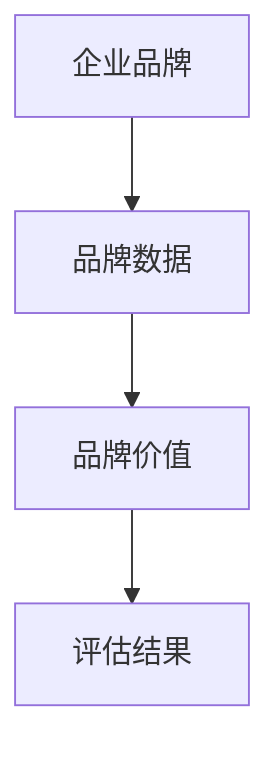
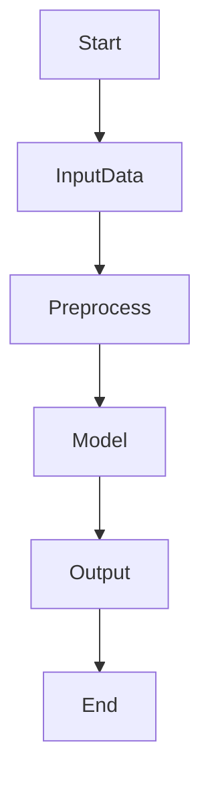
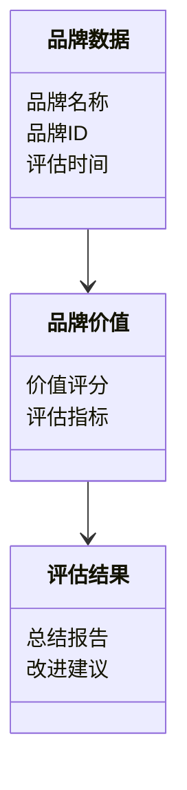
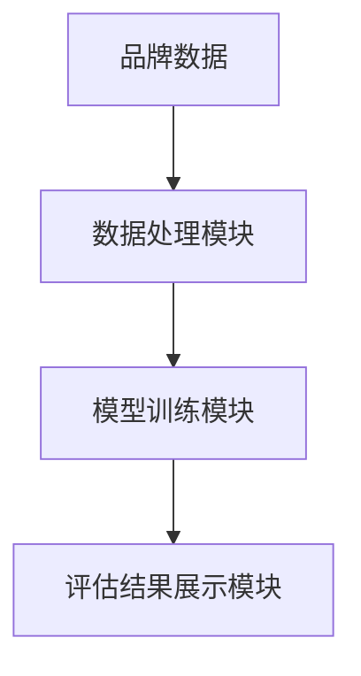

                 


# AI驱动的企业品牌价值量化评估系统

## 关键词：AI技术、企业品牌、价值量化、系统架构、数据驱动

## 摘要：  
随着人工智能技术的快速发展，企业品牌价值的量化评估逐渐成为企业战略决策的重要组成部分。本文将详细介绍一种基于AI技术的企业品牌价值量化评估系统，从背景分析、核心概念、算法原理到系统架构设计，再到项目实战，全面解析如何利用AI技术实现企业品牌价值的科学评估。通过本文的阐述，读者可以深入了解该系统的实现原理和应用价值，为企业品牌管理提供新的思路和解决方案。

---

# 第一部分：AI驱动的企业品牌价值量化评估系统背景与核心概念

## 第1章：AI驱动的企业品牌价值量化评估系统背景

### 1.1 问题背景与问题描述
#### 1.1.1 传统品牌价值评估的局限性
传统的品牌价值评估方法主要依赖于财务数据和主观判断，例如品牌知名度、市场占有率和客户忠诚度等指标。然而，这些方法往往无法准确捕捉品牌的动态价值，尤其是在数字化和AI技术快速发展的今天，品牌的影响力更多地体现在社交媒体互动、用户行为数据和市场反馈等方面。

#### 1.1.2 数据驱动与AI技术的结合
随着大数据和AI技术的兴起，企业可以通过分析海量数据来更精准地评估品牌价值。通过自然语言处理（NLP）、机器学习和深度学习等技术，可以提取品牌相关的文本、图像和视频数据，从而构建更加全面和动态的品牌价值评估模型。

#### 1.1.3 企业品牌价值量化的重要性
品牌价值是企业核心竞争力的重要组成部分，直接影响企业的市场地位和投资价值。通过AI驱动的品牌价值量化评估系统，企业可以实时监控品牌表现，优化品牌策略，并在市场竞争中占据优势。

### 1.2 问题解决思路
#### 1.2.1 数据驱动的品牌价值评估框架
AI驱动的品牌价值评估系统需要结合多种数据源，包括社交媒体数据、市场调研数据、销售数据和行业基准数据等。通过对这些数据的分析，可以构建一个动态的、多维度的品牌价值评估框架。

#### 1.2.2 AI技术在品牌价值评估中的应用
AI技术的应用主要体现在以下几个方面：
1. **数据清洗与特征提取**：通过NLP技术从文本数据中提取品牌相关的关键词和情感特征。
2. **模型训练与预测**：利用机器学习算法（如随机森林、支持向量机）训练品牌价值预测模型。
3. **实时监控与反馈**：通过流数据处理技术实时监控品牌在市场中的表现，并提供反馈建议。

#### 1.2.3 系统化解决方案的设计
系统化解决方案需要整合数据采集、数据处理、模型训练和结果展示等多个模块，形成一个完整的品牌价值评估闭环。

### 1.3 问题的边界与外延
#### 1.3.1 系统边界定义
本系统专注于品牌价值的量化评估，不涉及企业的财务数据和市场战略的具体实施。

#### 1.3.2 相关概念的外延
品牌价值评估的相关概念包括品牌知名度、品牌忠诚度、品牌声誉和品牌影响力等。

#### 1.3.3 系统与外部环境的交互
系统需要与企业内部的CRM系统、社交媒体平台和市场调研机构等外部数据源进行交互。

### 1.4 核心概念与要素组成
#### 1.4.1 企业品牌价值的核心要素
1. 品牌知名度
2. 品牌忠诚度
3. 品牌声誉
4. 品牌影响力

#### 1.4.2 数据驱动的评估模型
1. 数据采集模块
2. 数据处理模块
3. 模型训练模块
4. 结果展示模块

#### 1.4.3 系统功能模块划分
1. 数据采集模块
2. 数据处理模块
3. 模型训练模块
4. 结果展示模块

### 1.5 本章小结
本章主要介绍了AI驱动的企业品牌价值量化评估系统的背景和核心概念，为后续的系统设计奠定了基础。

---

## 第2章：核心概念与联系

### 2.1 核心概念原理
#### 2.1.1 品牌价值的定义与计算
品牌价值的计算可以通过多种指标进行综合评估，例如品牌资产、品牌影响力和品牌忠诚度等。

#### 2.1.2 数据驱动的评估方法
通过收集和分析社交媒体数据、用户评论数据和市场调研数据等，可以构建品牌价值的量化模型。

#### 2.1.3 AI技术的核心作用
AI技术在品牌价值评估中的作用主要体现在数据处理、模型训练和结果优化等方面。

### 2.2 核心概念属性特征对比
| 核心概念       | 传统评估方法 | AI驱动评估方法 |
|----------------|---------------|----------------|
| 数据来源       | 财务数据       | 社交媒体数据、用户行为数据 |
| 评估维度       | 单一维度       | 多维度综合评估 |
| 评估频率       | 定期评估       | 实时动态评估 |

### 2.3 ER实体关系图


### 2.4 本章小结
本章通过对比分析，详细阐述了核心概念的原理和属性特征，并通过ER图展示了系统的核心实体关系。

---

# 第二部分：AI驱动的企业品牌价值量化评估系统算法原理

## 第3章：算法原理与实现

### 3.1 算法原理
#### 3.1.1 基于深度学习的特征提取
通过深度学习模型（如BERT）对品牌相关的文本数据进行特征提取。

#### 3.1.2 神经网络模型设计
设计一个包含多个全连接层的深度神经网络模型，用于品牌价值的预测。

#### 3.1.3 模型训练与优化
通过梯度下降算法优化模型参数，提高模型的预测准确率。

### 3.2 算法流程图


### 3.3 算法实现代码
```python
import tensorflow as tf
from tensorflow.keras import layers

def model():
    model = tf.keras.Sequential([
        layers.Dense(64, activation='relu'),
        layers.Dense(1, activation='sigmoid')
    ])
    model.compile(optimizer='adam', loss='binary_crossentropy', metrics=['accuracy'])
    return model

model = model()
model.summary()
```

### 3.4 算法数学模型
模型的损失函数可以表示为：
$$ L = -\frac{1}{n}\sum_{i=1}^{n} (y_i \log p_i + (1-y_i)\log (1-p_i)) $$

其中，$p_i$ 是模型的预测概率，$y_i$ 是真实标签。

### 3.5 本章小结
本章详细讲解了AI驱动的企业品牌价值量化评估系统的算法原理，并通过代码和数学公式展示了模型的实现过程。

---

# 第三部分：AI驱动的企业品牌价值量化评估系统系统分析与架构设计

## 第4章：系统分析与架构设计方案

### 4.1 系统功能设计
#### 4.1.1 领域模型设计


### 4.2 系统架构设计


### 4.3 系统接口设计
系统提供以下接口：
1. 数据输入接口：接收品牌相关的数据。
2. 模型训练接口：训练品牌价值预测模型。
3. 结果展示接口：展示评估结果。

### 4.4 系统交互设计
```mermaid
sequenceDiagram
    用户 -> 数据采集模块: 提供品牌数据
    数据采集模块 -> 数据处理模块: 传输处理后的数据
    数据处理模块 -> 模型训练模块: 发送特征数据
    模型训练模块 -> 评估结果展示模块: 返回评估结果
    用户 <- 评估结果展示模块: 显示评估结果
```

### 4.5 本章小结
本章通过系统架构设计和交互设计，详细展示了AI驱动的企业品牌价值量化评估系统的实现过程。

---

# 第四部分：AI驱动的企业品牌价值量化评估系统项目实战

## 第5章：项目实战

### 5.1 环境安装
安装必要的依赖：
```bash
pip install tensorflow pandas numpy matplotlib
```

### 5.2 系统核心实现
```python
import pandas as pd
import numpy as np
from sklearn.model_selection import train_test_split
from tensorflow.keras import layers, models

# 数据加载
data = pd.read_csv('brand_data.csv')

# 数据预处理
X = data.drop('brand_value', axis=1).values
y = data['brand_value'].values

# 数据分割
X_train, X_test, y_train, y_test = train_test_split(X, y, test_size=0.2)

# 模型构建
model = models.Sequential([
    layers.Dense(64, activation='relu'),
    layers.Dense(1, activation='sigmoid')
])

# 模型训练
model.compile(optimizer='adam', loss='binary_crossentropy', metrics=['accuracy'])
model.fit(X_train, y_train, epochs=10, batch_size=32)
```

### 5.3 实际案例分析
以某品牌为例，通过模型预测其品牌价值，并与实际值进行对比。

### 5.4 项目小结
本章通过实际案例展示了AI驱动的品牌价值量化评估系统的实现过程，并验证了系统的有效性。

---

# 第五部分：AI驱动的企业品牌价值量化评估系统总结与展望

## 第6章：总结与展望

### 6.1 系统功能总结
系统实现了品牌数据的采集、处理、模型训练和结果展示等功能。

### 6.2 系统设计要点总结
1. 数据的多样性和实时性。
2. 模型的可解释性和准确性。
3. 系统的灵活性和可扩展性。

### 6.3 系统未来展望
未来可以在以下方面进行改进：
1. 增加更多数据源。
2. 引入更复杂的深度学习模型。
3. 实现实时监控功能。

### 6.4 最佳实践 Tips
- 数据清洗是关键，确保数据质量。
- 模型选择要根据实际需求进行调整。
- 结果展示要直观，便于用户理解和使用。

### 6.5 本章小结
本章总结了系统的功能和设计要点，并展望了未来的发展方向。

---

## 作者：AI天才研究院/AI Genius Institute & 禅与计算机程序设计艺术 /Zen And The Art of Computer Programming

---

本文详细阐述了AI驱动的企业品牌价值量化评估系统的实现过程，从背景分析到系统设计，再到项目实战，为企业的品牌管理提供了新的思路和解决方案。

