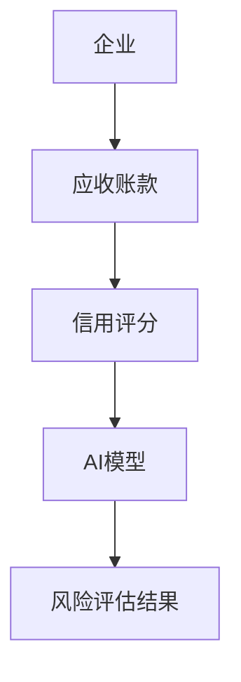
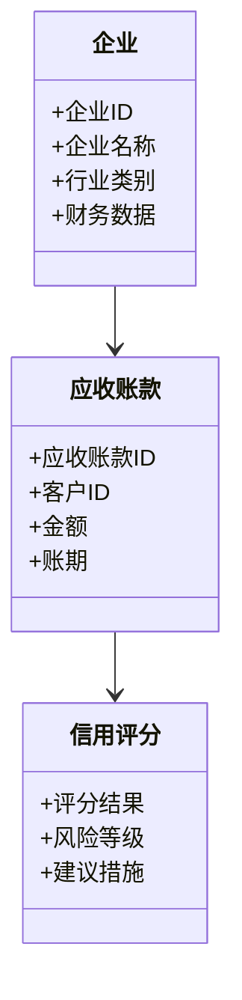
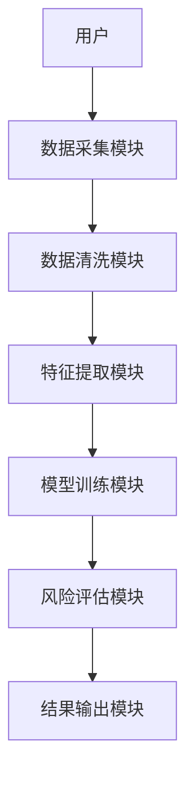
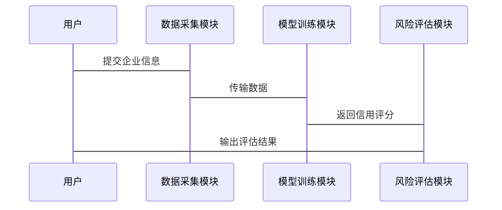

                 


# AI驱动的企业应收账款信用风险评估系统

## 关键词：
- AI驱动
- 信用风险评估
- 应收账款
- 机器学习
- 系统架构

## 摘要：
本文系统地介绍了AI驱动的企业应收账款信用风险评估系统的构建过程，从背景、核心概念到算法原理、系统架构，再到项目实战和总结，全面阐述了如何利用人工智能技术提升企业信用风险评估的效率和准确性。文章通过详细的技术分析和实际案例，展示了AI在信用风险管理中的强大能力，并对未来的发展方向进行了展望。

---

# 第1章: 企业应收账款信用风险评估的背景与挑战

## 1.1 信用风险评估的基本概念
### 1.1.1 信用风险的定义与特征
信用风险是指企业在赊销交易中，买方因财务状况恶化或其他原因无法履行还款义务，导致卖方无法收回账款的风险。其主要特征包括不确定性、传染性、周期性等。

### 1.1.2 应收账款在企业财务中的重要性
应收账款是企业流动资产的重要组成部分，其健康状况直接关系到企业的资金周转和经营稳定性。有效的应收账款管理能够降低企业财务风险，提升经营效率。

### 1.1.3 信用风险评估的必要性
信用风险评估是企业在赊销交易中对客户信用状况进行分析和判断的过程，旨在降低坏账率，优化应收账款管理，提升企业财务健康度。

## 1.2 传统信用风险评估方法的局限性
### 1.2.1 传统信用评分模型的优缺点
传统信用评分模型（如Z评分模型）依赖少量财务指标，存在数据维度有限、模型泛化能力差等问题。

### 1.2.2 数据不足与模型泛化的矛盾
传统模型难以充分利用大数据和非结构化数据，导致模型预测精度有限。

### 1.2.3 人工评估的主观性和效率问题
人工评估依赖主观判断，效率低下且容易受人为因素影响。

## 1.3 AI技术在信用风险评估中的应用前景
### 1.3.1 AI技术的核心优势
AI技术能够处理海量数据，提取非结构化信息，构建更复杂的预测模型。

### 1.3.2 AI在信用风险评估中的潜在应用场景
包括实时风险监控、动态信用评分、异常交易检测等。

### 1.3.3 企业级AI系统的建设挑战
包括数据隐私、模型解释性、计算资源需求等问题。

## 1.4 本章小结
本章介绍了信用风险评估的基本概念和传统方法的局限性，分析了AI技术在信用风险评估中的应用前景和建设挑战。

---

# 第2章: 信用风险评估的核心概念与系统架构

## 2.1 信用风险评估的关键要素
### 2.1.1 企业信用评分模型
信用评分模型是信用风险评估的核心工具，其准确性直接影响评估结果。

### 2.1.2 企业财务数据特征
包括收入、利润、资产负债率等财务指标，以及供应链稳定性、行业趋势等非财务因素。

### 2.1.3 市场风险与行业风险
市场波动和行业周期对企业的信用状况有重要影响。

## 2.2 AI驱动的信用风险评估系统核心概念
### 2.2.1 数据驱动的特征提取
通过大数据分析提取多维度特征，提升模型的预测精度。

### 2.2.2 智能模型的构建与优化
利用机器学习算法构建智能模型，并通过模型调优提升预测性能。

### 2.2.3 系统的实时性与可扩展性
AI系统需要具备实时处理能力和可扩展性，以应对海量数据和动态变化的市场环境。

## 2.3 系统架构的实体关系图


## 2.4 本章小结
本章从核心概念和系统架构两个方面，详细介绍了AI驱动的企业应收账款信用风险评估系统的构建逻辑。

---

# 第3章: AI驱动的信用风险评估算法原理

## 3.1 逻辑回归模型
### 3.1.1 逻辑回归的基本原理
逻辑回归是一种常用的分类算法，通过sigmoid函数将线性回归结果映射到概率空间。

### 3.1.2 逻辑回归的损失函数
损失函数为对数损失函数，目标是最小化预测值与真实值的差异。

### 3.1.3 逻辑回归的优化方法
包括梯度下降、Adam优化器等方法，用于提升模型收敛速度和预测精度。

## 3.2 XGBoost模型
### 3.2.1 XGBoost的基本原理
XGBoost是一种基于树的集成算法，通过正则化和剪枝技术优化模型性能。

### 3.2.2 XGBoost的树结构优化
包括树的深度限制、叶子节点样本数要求等参数调整。

### 3.2.3 XGBoost的正则化方法
通过L1和L2正则化防止过拟合，提升模型泛化能力。

## 3.3 神经网络模型
### 3.3.1 神经网络的基本结构
包括输入层、隐藏层和输出层，通过多层感知机构建复杂非线性关系。

### 3.3.2 深度学习在信用评估中的应用
利用深度学习模型提取高维特征，提升模型表达能力。

### 3.3.3 模型训练的挑战与解决方案
包括数据量不足、过拟合、计算资源需求大等问题及解决方案。

## 3.4 算法对比与选择策略
### 3.4.1 不同算法的性能对比
从准确率、召回率、训练时间等方面对比不同算法的性能。

### 3.4.2 业务场景对模型选择的影响
根据业务需求选择适合的模型，例如在线实时预测适合逻辑回归，复杂场景适合XGBoost或神经网络。

### 3.4.3 模型调优与部署
包括超参数调优、模型压缩、模型部署等步骤。

## 3.5 本章小结
本章详细介绍了AI驱动信用风险评估系统中常用的算法及其优化方法，为后续系统设计提供了理论基础。

---

# 第4章: 系统分析与架构设计方案

## 4.1 项目背景与目标
### 4.1.1 项目背景介绍
随着企业赊销业务的增加，信用风险评估需求日益迫切。

### 4.1.2 项目目标设定
构建一个基于AI的企业应收账款信用风险评估系统，实现自动化、智能化的风险评估。

### 4.1.3 项目范围界定
包括数据收集、模型开发、系统集成和用户界面设计等。

## 4.2 系统功能设计
### 4.2.1 数据采集模块
包括数据来源、数据清洗、数据预处理等步骤。

### 4.2.2 模型训练模块
包括特征提取、模型训练、模型评估等步骤。

### 4.2.3 风险评估模块
包括实时评估、风险预警、结果输出等功能。

## 4.3 系统架构设计
### 4.3.1 领域模型类图


### 4.3.2 系统架构图


### 4.3.3 系统接口设计
包括API接口定义、数据格式规范、调用流程等。

### 4.3.4 系统交互流程图


## 4.4 本章小结
本章从系统设计的角度，详细介绍了项目的背景、功能设计、架构设计和接口设计。

---

# 第5章: 项目实战与案例分析

## 5.1 环境安装与配置
### 5.1.1 Python环境安装
包括Python安装、虚拟环境配置、依赖库安装（如pandas、scikit-learn、xgboost等）。

### 5.1.2 数据集准备
包括数据来源、数据格式、数据预处理等步骤。

## 5.2 系统核心实现源代码
### 5.2.1 数据清洗与特征提取
```python
import pandas as pd
# 读取数据
data = pd.read_csv('credit_data.csv')
# 删除缺失值
data = data.dropna()
# 标准化处理
from sklearn.preprocessing import StandardScaler
scaler = StandardScaler()
data_scaled = scaler.fit_transform(data)
```

### 5.2.2 模型训练与优化
```python
from sklearn.linear_model import LogisticRegression
from sklearn.metrics import accuracy_score
# 训练逻辑回归模型
model = LogisticRegression()
model.fit(X_train, y_train)
# 模型评估
print("Accuracy:", accuracy_score(y_test, model.predict(X_test)))
```

### 5.2.3 系统部署与接口开发
```python
from flask import Flask, request, jsonify
app = Flask(__name__)
@app.route('/api/predict', methods=['POST'])
def predict():
    data = request.json
    # 数据处理
    # 模型预测
    result = model.predict(data)
    return jsonify(result)
```

## 5.3 案例分析与结果解读
### 5.3.1 案例背景
某制造企业应收账款 overdue情况严重，希望通过AI系统优化风险管理。

### 5.3.2 数据分析与模型训练
通过对历史数据的分析，构建逻辑回归和XGBoost模型，并进行模型对比。

### 5.3.3 模型结果与解读
逻辑回归模型准确率为85%，XGBoost模型准确率为92%，最终选择XGBoost模型部署到生产环境。

## 5.4 本章小结
本章通过实际案例展示了AI驱动的企业应收账款信用风险评估系统的构建过程，包括环境安装、代码实现和结果解读。

---

# 第6章: 总结与展望

## 6.1 全文总结
本文系统地介绍了AI驱动的企业应收账款信用风险评估系统的构建过程，从背景、核心概念到算法原理、系统架构，再到项目实战和总结，全面阐述了如何利用人工智能技术提升企业信用风险评估的效率和准确性。

## 6.2 未来展望
未来，随着AI技术的不断发展，信用风险评估系统将更加智能化和自动化，应用场景也将更加广泛。

## 6.3 最佳实践 tips
- 数据是模型的核心，确保数据质量和完整性。
- 模型部署后需要持续监控和优化。
- 注意数据隐私和合规性问题。

## 6.4 本章小结
本文总结了AI驱动的企业应收账款信用风险评估系统的建设成果，并展望了未来的发展方向。

---

# 作者：AI天才研究院 & 禅与计算机程序设计艺术

---

通过以上内容，您可以根据实际需求进行调整和扩展，确保文章的完整性和专业性。

