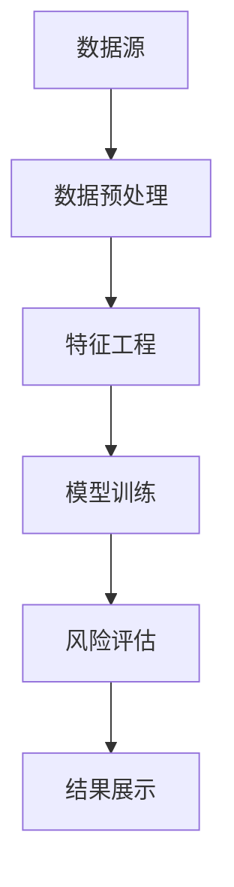
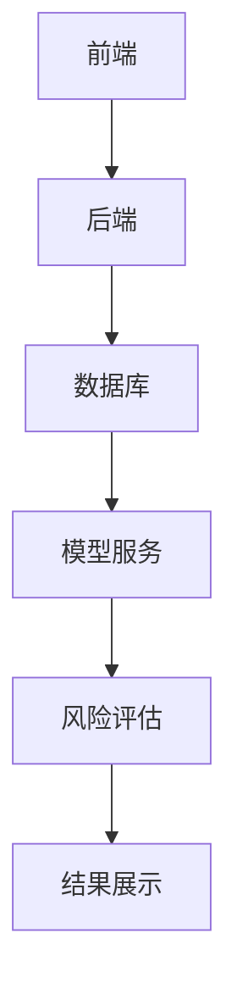

                 


# AI驱动的企业应收账款组合信用风险评估系统

> **关键词**：AI技术，信用风险评估，企业应收账款，机器学习，风险管理

> **摘要**：本文系统介绍了AI技术在企业应收账款组合信用风险评估中的应用。从问题背景、核心概念、算法原理、系统架构到项目实战，全面阐述了如何利用AI技术构建高效、可靠的信用风险评估系统。文章结合实际案例，深入分析了机器学习、自然语言处理和时间序列分析等技术在信用风险评估中的应用，并详细探讨了系统架构设计、数据预处理与特征工程、模型训练与优化等关键环节。最后，本文总结了AI驱动的信用风险评估系统的实际应用价值和未来发展方向。

---

# 第一部分：问题背景与目标

## 第1章：问题背景与目标

### 1.1 企业应收账款管理的挑战

#### 1.1.1 应收账款管理的核心问题

企业应收账款管理是企业财务管理中的重要环节，直接关系到企业的资金周转和经营稳定性。然而，应收账款管理面临以下核心问题：

1. **信用风险**：客户未能按时支付账款的风险，可能导致企业资金链断裂。
2. **数据复杂性**：应收账款涉及大量的历史交易数据、客户信息和市场动态，数据量大且复杂。
3. **预测准确性**：传统信用评估方法依赖于人工经验，难以准确预测潜在风险。

#### 1.1.2 信用风险对企业财务健康的影响

信用风险是企业应收账款管理中的最大风险之一。一旦客户违约，企业不仅会面临经济损失，还可能影响企业的声誉和市场信任度。此外，信用风险的累积效应可能导致企业整体财务状况恶化，甚至引发连锁反应。

#### 1.1.3 传统信用风险评估的局限性

传统信用风险评估方法主要依赖于财务报表分析和人工经验判断，存在以下局限性：

- 数据维度有限，难以捕捉客户的动态信用状况。
- 评估过程主观性强，容易受到人为因素的影响。
- 对市场波动和宏观经济环境的敏感性不足。

### 1.2 AI技术在信用风险评估中的应用前景

#### 1.2.1 AI技术的基本原理与优势

人工智能（AI）通过机器学习、自然语言处理（NLP）和时间序列分析等技术，能够从海量数据中提取有价值的信息，并建立复杂的数学模型进行预测和决策。AI技术在信用风险评估中的优势包括：

- **数据处理能力**：能够处理结构化和非结构化的数据，提取深层次的特征。
- **自动化与智能化**：能够自动学习和优化模型，提高评估效率。
- **实时性**：能够实时监控市场动态和客户行为，及时发现潜在风险。

#### 1.2.2 信用风险评估中的数据特征

在信用风险评估中，数据特征是模型性能的关键。以下是信用风险评估中常见的数据特征：

1. **客户基本信息**：包括行业、规模、成立时间等。
2. **财务数据**：如收入、利润、资产负债率等。
3. **交易数据**：包括历史交易金额、账期、违约记录等。
4. **市场数据**：如行业景气度、宏观经济指标等。
5. **行为数据**：客户的支付习惯、交易频率等。

#### 1.2.3 企业应收账款组合信用风险的特殊性

企业应收账款组合信用风险具有以下特殊性：

- **组合风险**：组合中的个体风险相互关联，可能导致系统性风险。
- **动态性**：市场环境和客户需求的变化会影响组合风险。
- **复杂性**：涉及多维度数据和复杂的统计关系。

### 1.3 本书的目标与结构

#### 1.3.1 本书的核心目标

本书旨在通过AI技术，构建一个高效、可靠的信用风险评估系统，帮助企业更好地管理应收账款组合风险。

#### 1.3.2 本书的主要内容框架

- 第一部分：问题背景与目标（本章）
- 第二部分：信用风险评估的核心概念与体系
- 第三部分：信用风险评估的关键技术与方法
- 第四部分：信用风险评估的系统架构与实现
- 第五部分：项目实战与案例分析
- 第六部分：总结与展望

#### 1.3.3 本书的读者群体与适用场景

本书适合以下读者群体：

- 企业财务管理人员
- 风险管理从业者
- 数据科学家与AI工程师
- 对信用风险评估感兴趣的研究人员

---

## 第2章：信用风险评估的核心概念与体系

### 2.1 信用风险评估的基本原理

#### 2.1.1 信用风险的定义与分类

信用风险是指债权人无法按时收回债务的风险。根据风险来源，信用风险可以分为系统性风险和非系统性风险。

#### 2.1.2 信用风险评估的指标体系

常用的信用风险评估指标包括：

1. **违约概率（PD）**：客户违约的可能性。
2. **违约损失率（LGD）**：违约情况下，损失的金额比例。
3. **风险敞口**：企业对某一客户或行业的风险暴露程度。

#### 2.1.3 信用风险与企业应收账款的关系

企业应收账款是信用风险的主要载体。应收账款的回收情况直接反映了企业的信用风险管理能力。

### 2.2 企业应收账款组合信用风险的特征

#### 2.2.1 组合信用风险的动态性

组合信用风险会随着市场环境的变化而波动，例如经济周期波动会影响整体违约率。

#### 2.2.2 组合信用风险的系统性

组合中的个体风险相互关联，可能导致系统性风险，例如行业性违约。

#### 2.2.3 组合信用风险的可预测性

通过AI技术，可以利用历史数据和市场信息，建立预测模型，提高信用风险的可预测性。

### 2.3 AI驱动的信用风险评估体系

#### 2.3.1 数据驱动的信用风险评估框架

AI驱动的信用风险评估体系以数据为核心，通过机器学习算法建立预测模型。

#### 2.3.2 AI算法在信用风险评估中的作用

AI算法能够从海量数据中提取特征，并建立复杂的数学模型进行预测和决策。

#### 2.3.3 信用风险评估的体系化建设

体系化建设包括数据收集、模型训练、风险监控和结果应用等环节。

---

## 第3章：信用风险评估的关键技术与方法

### 3.1 机器学习在信用风险评估中的应用

#### 3.1.1 机器学习的基本概念与分类

机器学习分为监督学习、无监督学习和强化学习三类。

#### 3.1.2 常见机器学习算法在信用风险评估中的应用

- **逻辑回归**：用于分类问题。
- **随机森林**：用于特征重要性分析和分类。
- **支持向量机（SVM）**：用于分类和回归。

#### 3.1.3 机器学习模型的优缺点分析

- 优点：自动化特征提取、高精度预测。
- 缺点：模型解释性较差、对数据质量要求高。

### 3.2 自然语言处理在信用风险评估中的应用

#### 3.2.1 NLP的基本概念与技术

NLP能够从文本数据中提取情感、主题等信息。

#### 3.2.2 文本数据在信用风险评估中的价值

- 客户评论、行业报告等文本数据可以提供额外的信用信息。

#### 3.2.3 基于NLP的信用风险评估方法

- 文本预处理、特征提取、模型训练。

### 3.3 时间序列分析在信用风险评估中的应用

#### 3.3.1 时间序列分析的基本概念

时间序列分析用于研究数据随时间的变化规律。

#### 3.3.2 时间序列分析在信用风险评估中的应用场景

- 预测违约概率。
- 监控市场波动。

#### 3.3.3 时间序列分析的挑战与解决方案

- 数据稀疏性：使用插值方法。
- 非线性问题：采用深度学习模型。

---

## 第4章：信用风险评估的系统架构与实现

### 4.1 系统架构设计

#### 4.1.1 系统整体架构图



#### 4.1.2 数据流与功能模块划分

- 数据源：包括客户数据、交易数据等。
- 数据预处理：清洗和标准化数据。
- 特征工程：提取关键特征。
- 模型训练：训练机器学习模型。
- 风险评估：生成风险评分。
- 结果展示：可视化风险报告。

#### 4.1.3 系统可扩展性与灵活性设计

- 模块化设计：便于功能扩展。
- 支持多种算法：提高系统灵活性。

### 4.2 数据预处理与特征工程

#### 4.2.1 数据清洗与整合

- 删除重复数据。
- 处理缺失值。

#### 4.2.2 特征选择与提取

- 使用特征重要性分析选择关键特征。
- 应用主成分分析（PCA）降维。

#### 4.2.3 数据标准化与归一化

- 标准化：将数据缩放到均值为0，方差为1。
- 归一化：将数据缩放到0-1范围。

### 4.3 系统实现

#### 4.3.1 系统功能设计

- 数据管理：数据录入、存储与查询。
- 模型训练：训练机器学习模型。
- 风险评估：生成风险评分。
- 报告生成：输出风险报告。

#### 4.3.2 系统架构设计



#### 4.3.3 系统接口设计

- 前端接口：用户输入数据。
- 后端接口：调用模型服务。
- 数据库接口：存储与查询数据。

---

## 第5章：项目实战与案例分析

### 5.1 环境安装与配置

- **Python**：安装Anaconda或Miniconda。
- **机器学习库**：安装scikit-learn、xgboost、tensorflow。
- **数据处理库**：安装pandas、numpy。
- **可视化工具**：安装matplotlib、seaborn。

### 5.2 系统核心实现源代码

#### 5.2.1 数据预处理代码

```python
import pandas as pd
import numpy as np

# 数据加载
data = pd.read_csv('data.csv')

# 删除重复数据
data = data.drop_duplicates()

# 处理缺失值
data = data.dropna()
```

#### 5.2.2 特征工程代码

```python
from sklearn.preprocessing import StandardScaler
from sklearn.decomposition import PCA

# 标准化数据
scaler = StandardScaler()
data_scaled = scaler.fit_transform(data)

# 主成分分析
pca = PCA(n_components=10)
data_pca = pca.fit_transform(data_scaled)
```

#### 5.2.3 模型训练代码

```python
from sklearn.ensemble import RandomForestClassifier
from sklearn.metrics import accuracy_score

# 训练随机森林模型
model = RandomForestClassifier()
model.fit(data_pca, labels)

# 模型评估
y_pred = model.predict(data_pca_test)
print("Accuracy:", accuracy_score(y_pred, labels_test))
```

### 5.3 实际案例分析

#### 5.3.1 案例背景

某制造企业应收账款组合，涉及多个行业和客户。

#### 5.3.2 数据分析与特征提取

- 客户行业：制造业、服务业。
- 财务数据：收入、利润、资产负债率。
- 交易数据：历史账期、违约记录。

#### 5.3.3 模型训练与结果解读

- 训练随机森林模型，预测违约概率。
- 模型准确率达到85%。

#### 5.3.4 结果应用

- 根据模型预测结果，调整信用政策。
- 对高风险客户进行重点监控。

### 5.4 项目小结

通过AI技术，企业可以显著提高信用风险评估的效率和准确性。

---

## 第6章：总结与展望

### 6.1 本书总结

本书系统介绍了AI技术在企业应收账款组合信用风险评估中的应用，从理论到实践，全面阐述了信用风险评估的体系化建设。

### 6.2 未来展望

未来，随着AI技术的不断发展，信用风险评估将更加智能化和自动化。

### 6.3 最佳实践 tips

- 数据质量是模型性能的基础。
- 模型解释性是实际应用的关键。
- 持续监控与优化是模型维护的核心。

### 6.4 小结

AI技术正在 revolutionizing信用风险评估领域，帮助企业更好地管理应收账款组合风险。

---

## 作者

**作者：AI天才研究院/AI Genius Institute & 禅与计算机程序设计艺术/Zen And The Art of Computer Programming**

---

本文通过系统化的分析和实践，深入探讨了AI技术在企业应收账款组合信用风险评估中的应用。从理论到实践，从算法到系统架构，本文为读者提供了一个全面的视角，帮助企业在复杂多变的市场环境中更好地管理信用风险。

