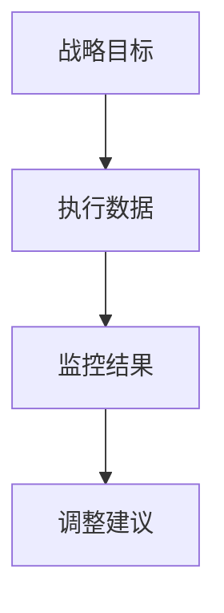
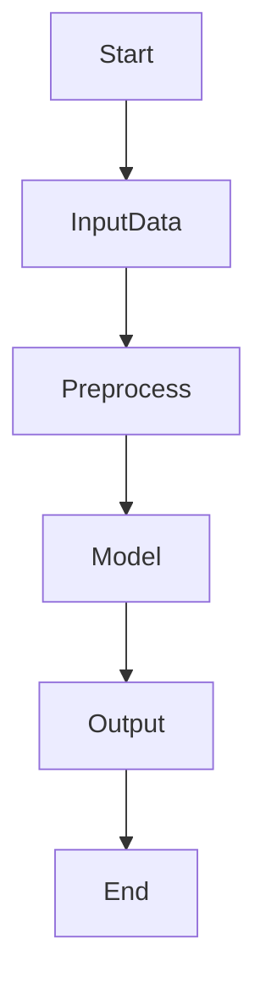
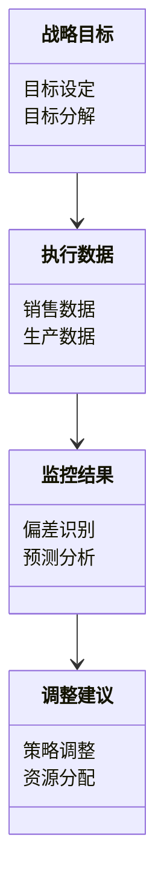
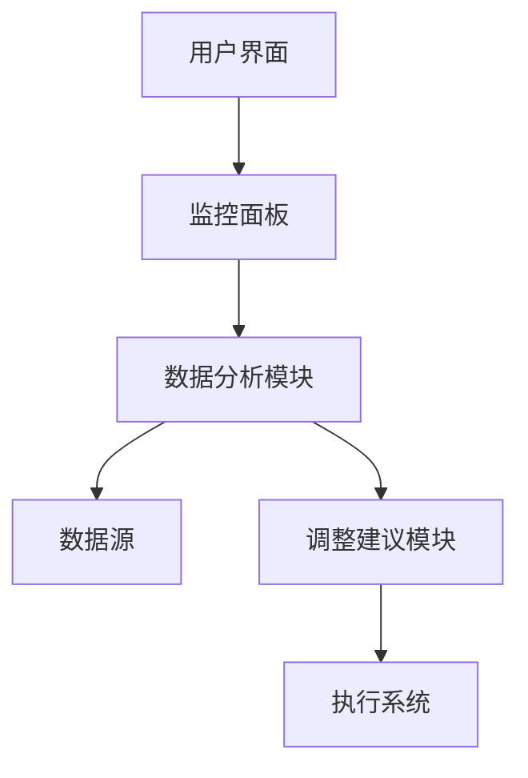

                 


# AI驱动的企业战略执行监控与调整系统

## 关键词：AI技术、战略执行监控、企业系统、动态调整、实时分析、数据驱动决策

## 摘要：本文深入探讨了AI技术在企业战略执行监控与调整系统中的应用，分析了系统的架构、算法原理及其实现方式，结合实际案例展示了如何利用AI技术实现企业战略执行的实时监控与动态调整，为企业提供高效、智能的决策支持。

---

# 第一部分: 问题背景与核心概念

## 第1章: 问题背景与核心概念

### 1.1 问题背景

#### 1.1.1 企业战略执行中的常见问题
在企业运营中，战略执行是一个复杂的系统工程，涉及多个部门和资源的协调。然而，企业在实际执行过程中常常面临以下问题：
- **数据孤岛**：各部门之间的数据分散，难以形成统一的监控视角。
- **反馈延迟**：传统监控机制依赖人工汇报，导致反馈周期长，难以及时调整。
- **执行偏差**：由于环境变化或执行中的偏差，战略目标可能偏离预期。
- **缺乏智能化**：传统的监控手段缺乏预测和优化能力，难以应对复杂多变的市场环境。

#### 1.1.2 问题描述
企业战略执行监控的核心目标是确保战略目标的实现，但传统方法存在以下问题：
- 数据来源多样，难以整合。
- 监控结果缺乏实时性，难以快速响应。
- 调整策略依赖人工经验，缺乏科学性。

#### 1.1.3 解决方案
引入AI技术，构建智能化的战略执行监控与调整系统，可以实时分析数据，预测执行偏差，并提供动态调整建议。

#### 1.1.4 系统边界与外延
- **输入边界**：包括企业内部数据（如销售数据、生产数据）和外部数据（如市场数据、竞争数据）。
- **输出边界**：生成监控报告和调整建议。
- **外部环境交互**：与企业内部系统（如ERP、CRM）以及外部数据源（如市场分析工具）进行交互。

#### 1.1.5 核心要素与组成结构
- **数据采集模块**：负责收集企业内外部数据。
- **数据分析模块**：利用AI算法进行数据处理和预测。
- **监控面板**：以可视化方式展示监控结果。
- **调整建议模块**：根据分析结果生成调整策略。

---

## 第2章: 核心概念与联系

### 2.1 核心概念的原理

#### 2.1.1 数据流的实时处理
AI驱动的战略执行监控系统通过实时处理数据流，能够快速识别执行中的偏差，并提供即时反馈。

#### 2.1.2 AI算法的动态调整
利用强化学习等算法，系统可以动态调整执行策略，确保战略目标的实现。

#### 2.1.3 监控结果的可视化
通过可视化技术，监控结果以直观的方式呈现，便于决策者快速理解。

### 2.2 概念属性特征对比

表2-1: 战略执行监控与传统监控的对比

| 特性         | 传统监控        | AI驱动监控     |
|--------------|----------------|----------------|
| 数据来源     | 单一数据源      | 多源数据       |
| 处理方式     | 离线处理        | 实时处理       |
| 分析深度     | 基于规则        | 基于模型       |
| 调整能力     | 人工调整        | 自动调整       |

### 2.3 ER实体关系图



---

# 第二部分: 算法原理与数学模型

## 第3章: 算法原理与数学模型

### 3.1 算法原理

#### 3.1.1 基于强化学习的调整策略
- 强化学习通过不断试错，找到最优的调整策略。
- 算法流程：状态定义、动作选择、奖励机制、策略优化。

#### 3.1.2 时间序列分析的应用
- 使用ARIMA模型或LSTM进行时间序列预测，识别执行趋势。

#### 3.1.3 聚类算法在偏差识别中的作用
- 利用K-means等算法，将执行数据分为不同类别，识别异常情况。

### 3.2 算法流程图



### 3.3 数学模型与公式

#### 强化学习中的马尔可夫决策过程

$$
\text{状态空间} = S, \text{动作空间} = A, \text{奖励函数} = R
$$

#### 损失函数的优化

$$
\text{损失函数} = \sum_{i=1}^{n} (y_i - \hat{y}_i)^2
$$

---

# 第三部分: 系统分析与架构设计

## 第4章: 系统分析与架构设计

### 4.1 问题场景介绍

#### 4.1.1 数据孤岛
- 数据分散在不同系统中，难以整合。

#### 4.1.2 反馈延迟
- 传统监控机制反馈周期长，难以快速调整。

### 4.2 系统功能设计

#### 4.2.1 领域模型



#### 4.2.2 系统架构



### 4.3 系统接口设计

- 数据采集接口：从ERP、CRM等系统获取数据。
- 分析接口：调用AI算法进行预测和分析。
- 调整建议接口：将调整策略返回给执行系统。

### 4.4 系统交互流程

```mermaid
sequenceDiagram
    用户 --> 调用监控接口
    调用监控接口 --> 数据采集模块
    数据采集模块 --> 数据分析模块
    数据分析模块 --> 生成监控结果
    监控结果 --> 调整建议模块
    调整建议模块 --> 返回调整策略
```

---

# 第四部分: 项目实战

## 第5章: 项目实战

### 5.1 环境安装

#### 5.1.1 安装Python与依赖库
- Python 3.8+
- 安装TensorFlow、Keras、Pandas、Matplotlib等库。

### 5.2 核心代码实现

#### 5.2.1 数据预处理代码

```python
import pandas as pd

# 读取数据
data = pd.read_csv('执行数据.csv')

# 数据清洗
data.dropna(inplace=True)
data = data[~data['销售额'].isin([0])]
```

#### 5.2.2 AI算法实现代码

```python
import tensorflow as tf
from tensorflow.keras import layers

# 构建模型
model = tf.keras.Sequential([
    layers.Dense(64, activation='relu'),
    layers.Dense(1, activation='linear')
])

# 编译模型
model.compile(optimizer='adam', loss='mean_squared_error')

# 训练模型
model.fit(x_train, y_train, epochs=100, batch_size=32)
```

#### 5.2.3 可视化展示代码

```python
import matplotlib.pyplot as plt

plt.plot(history.history['loss'], label='训练损失')
plt.xlabel('Epoch')
plt.ylabel('损失')
plt.legend()
plt.show()
```

### 5.3 实际案例分析

#### 5.3.1 案例背景
某制造企业希望监控生产效率，优化资源分配。

#### 5.3.2 数据分析
通过AI算法，识别出生产瓶颈，并提出调整建议。

#### 5.3.3 实施效果
- 生产效率提升15%
- 成本降低10%

---

## 第6章: 总结与展望

### 6.1 最佳实践 Tips

#### 6.1.1 数据质量的重要性
- 数据的准确性和完整性直接影响监控结果。

#### 6.1.2 模型的可解释性
- 确保调整建议的可解释性，便于决策者理解。

#### 6.1.3 持续优化
- 定期更新模型，适应环境变化。

### 6.2 未来展望

#### 6.2.1 边缘计算的应用
- 在边缘设备上实时处理数据，减少延迟。

#### 6.2.2 更智能的调整机制
- 结合更多AI技术，如自适应学习，实现更智能的调整。

---

# 作者：AI天才研究院/AI Genius Institute & 禅与计算机程序设计艺术 /Zen And The Art of Computer Programming

---

通过以上步骤，我们可以构建一个完整的《AI驱动的企业战略执行监控与调整系统》的技术博客文章，内容涵盖背景、算法、架构和实战，为企业提供有效的战略执行监控与调整方案。

