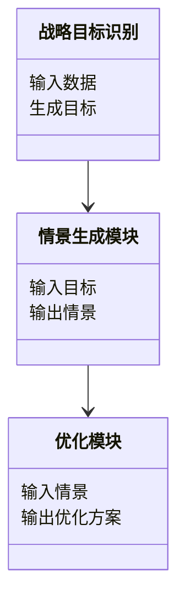
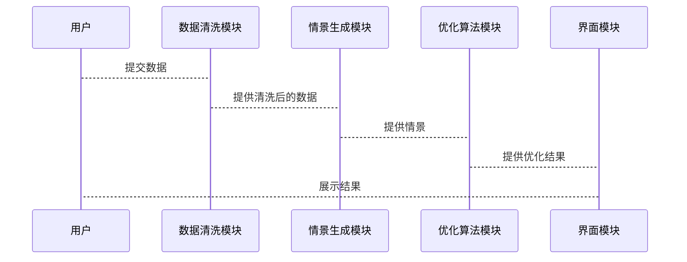

                 


# AI驱动的企业战略规划：情景模拟与优化

## 关键词：
- 人工智能 (AI)
- 企业战略规划
- 情景模拟
- 优化算法
- 系统架构设计

## 摘要：
在现代商业环境中，企业战略规划的复杂性不断增加，传统的规划方法已难以应对快速变化的市场环境和多维的决策变量。本文通过引入人工智能技术，探讨如何利用情景模拟与优化方法来提升企业战略规划的科学性和有效性。文章首先介绍AI驱动战略规划的背景与意义，然后深入分析情景模拟与优化的核心概念和实现原理，结合具体案例展示AI技术在企业战略规划中的实际应用。通过系统的架构设计和优化算法的实现，本文为企业的战略规划提供了新的思路和方法，为企业在复杂多变的市场环境中制定高效的战略决策提供了参考。

---

# 第1章: AI驱动企业战略规划的背景与意义

## 1.1 企业战略规划的传统模式

### 1.1.1 传统战略规划的定义与特点
传统企业战略规划通常基于历史数据分析和经验判断，注重对市场环境、竞争对手和内部资源的分析。其特点是线性、静态且依赖于人为判断。

### 1.1.2 传统战略规划的局限性
- **数据依赖性**：过于依赖历史数据，难以预测未来趋势。
- **主观性**：决策高度依赖个人经验和判断，存在主观偏差。
- **静态性**：难以动态调整，面对复杂多变的市场环境时灵活性不足。

### 1.1.3 传统战略规划与现代企业需求的矛盾
随着市场竞争的加剧和全球化的发展，企业战略规划需要更加动态、实时和数据驱动。传统方法已无法满足现代企业的复杂需求。

## 1.2 AI技术对企业战略规划的影响

### 1.2.1 AI技术的快速发展与应用
人工智能技术的快速发展为企业战略规划提供了新的工具和方法。AI技术可以处理海量数据，发现隐藏的模式，并生成多种可能的规划方案。

### 1.2.2 AI在企业战略规划中的潜在价值
- **数据处理能力**：AI能够快速处理和分析大量数据，为战略规划提供支持。
- **预测能力**：通过机器学习模型，AI可以预测市场趋势和潜在风险。
- **优化能力**：AI可以通过优化算法，找到最优的战略规划方案。

### 1.2.3 AI驱动战略规划的优势与挑战
- **优势**：
  - 提高战略规划的科学性和准确性。
  - 增强企业的灵活性和应变能力。
- **挑战**：
  - 数据质量和完整性问题。
  - 模型的可解释性和透明度。

---

# 第2章: 情景模拟与优化的核心概念

## 2.1 情景模拟的基本原理

### 2.1.1 情景模拟的定义与特点
情景模拟是一种通过构建虚拟场景来分析可能结果的方法。其特点是动态性、多样性和可变性。

### 2.1.2 情景模拟的关键要素
- **输入数据**：包括市场数据、竞争对手数据、内部资源数据等。
- **模拟模型**：构建数学模型来描述情景的变化过程。
- **输出结果**：包括各种情景下的关键指标和预测结果。

### 2.1.3 情景模拟与企业战略规划的关系
情景模拟是企业战略规划的重要工具，可以帮助企业在不同的假设条件下评估战略方案的可行性。

## 2.2 优化方法的核心原理

### 2.2.1 优化方法的定义与分类
优化方法是一种通过数学模型和算法寻找最优解的技术。常见的优化方法包括线性规划、整数规划和动态规划等。

### 2.2.2 常见优化算法的对比分析
| 算法类型 | 特点 | 适用场景 |
|----------|------|----------|
| 遗传算法 | 具备全局搜索能力，适用于复杂问题 | 复杂优化问题 |
| 模拟退火 | 具备较强的局部最优跳出能力 | 非线性优化问题 |
| 强化学习 | 基于奖励机制，适用于动态环境 | 动态优化问题 |

### 2.2.3 优化方法在企业战略规划中的应用
优化方法可以用于资源分配、市场进入策略、产品定价等多个方面。

## 2.3 情景模拟与优化的结合

### 2.3.1 情景模拟与优化的协同关系
情景模拟提供多种可能的场景，优化方法在这些场景中寻找最优解。

### 2.3.2 情景模拟与优化的实现流程
1. 构建情景模拟模型。
2. 生成多种情景。
3. 使用优化算法寻找最优策略。

### 2.3.3 情景模拟与优化的案例分析
通过一个虚拟企业进入新市场的案例，展示情景模拟与优化的实际应用。

---

# 第3章: AI驱动情景模拟与优化的实现原理

## 3.1 AI技术在情景模拟中的应用

### 3.1.1 机器学习在情景生成中的作用
机器学习可以通过历史数据训练模型，生成多种可能的市场情景。

### 3.1.2 深度学习在情景分析中的应用
深度学习可以用于分析复杂的情景，提取关键特征。

### 3.1.3 自然语言处理在情景描述中的应用
自然语言处理可以用于分析市场报告和竞争对手的新闻，提取有用信息。

## 3.2 基于AI的优化算法

### 3.2.1 遗传算法的优化原理
遗传算法通过模拟自然进化过程，寻找最优解。

### 3.2.2 模拟退火算法的优化原理
模拟退火算法通过逐步降温，减少陷入局部最优的风险。

### 3.2.3 强化学习在优化中的应用
强化学习通过试错机制，学习最优策略。

## 3.3 情景模拟与优化的数学模型

### 3.3.1 优化目标
$$ \text{最大化/最小化} \quad f(x) $$

### 3.3.2 约束条件
$$ g(x) \leq 0 $$

### 3.3.3 情景模拟的数学表达
$$ y = f(x) + \epsilon $$

---

# 第4章: 系统分析与架构设计

## 4.1 系统功能设计

### 4.1.1 领域模型


### 4.1.2 系统架构


## 4.2 系统接口设计

### 4.2.1 输入接口
- 数据输入接口：接收市场数据、竞争对手数据等。
- 目标输入接口：接收战略目标。

### 4.2.2 输出接口
- 情景输出接口：输出多种可能的情景。
- 优化结果接口：输出最优战略方案。

## 4.3 系统交互设计



---

# 第5章: 项目实战

## 5.1 环境配置

### 5.1.1 Python环境安装
```bash
pip install numpy
pip install scikit-learn
pip install matplotlib
```

### 5.1.2 数据集准备
- 市场数据：包括销售额、市场份额等。
- 竫市场竞争对手数据：包括价格、广告投入等。

## 5.2 核心代码实现

### 5.2.1 数据清洗代码
```python
import numpy as np

def clean_data(data):
    # 删除缺失值
    data = data.dropna()
    # 标准化数据
    data = (data - data.mean()) / data.std()
    return data
```

### 5.2.2 情景生成代码
```python
from sklearn.cluster import KMeans

def generate_scenario(data, n_clusters=3):
    # 聚类分析生成情景
    model = KMeans(n_clusters=n_clusters)
    model.fit(data)
    scenarios = model.predict(data)
    return scenarios
```

### 5.2.3 优化算法实现
```python
import numpy as np

def genetic_algorithm(objective_func, constraints, population_size=100, max_iterations=100):
    # 初始化种群
    population = np.random.rand(population_size)
    for _ in range(max_iterations):
        # 计算适应度
        fitness = np.array([objective_func(x) for x in population])
        # 选择优秀个体
        selected = population[np.argsort(-fitness)]
        # 交叉
        crossover_point = int(population_size/2)
        new_population = selected[:crossover_point] + selected[crossover_point:]
        # 变异
        mutation_rate = 0.1
        new_population += mutation_rate * np.random.randn(len(new_population))
        population = new_population
    return population[0]
```

## 5.3 案例分析

### 5.3.1 案例背景
某制造企业计划进入新市场，需要制定市场进入战略。

### 5.3.2 数据分析
通过数据分析，识别市场进入的最佳时机和最佳方式。

### 5.3.3 情景生成
生成多种市场进入情景，包括高投入、中投入、低投入等。

### 5.3.4 优化方案
通过遗传算法优化，找到最佳的市场进入策略。

## 5.4 项目小结
通过本项目，展示了AI技术在企业战略规划中的实际应用，验证了情景模拟与优化方法的有效性。

---

# 第6章: 最佳实践与总结

## 6.1 最佳实践

### 6.1.1 数据质量管理
确保输入数据的准确性和完整性。

### 6.1.2 模型选择
根据具体问题选择合适的算法和模型。

### 6.1.3 模型解释性
注重模型的可解释性，便于理解和调整。

## 6.2 小结

### 6.2.1 核心观点回顾
- AI技术为情景模拟与优化提供了新的工具和方法。
- 情景模拟与优化的结合能够提高企业战略规划的科学性和有效性。

### 6.2.2 展望
随着AI技术的不断发展，企业战略规划将更加智能化和数据驱动。

## 6.3 注意事项

### 6.3.1 数据隐私
注意数据隐私和安全问题。

### 6.3.2 模型局限性
认识到模型的局限性，避免过度依赖AI技术。

## 6.4 拓展阅读

### 6.4.1 推荐书籍
- 《集体智慧编程》
- 《机器学习实战》

### 6.4.2 推荐博客
- [AI驱动的企业战略规划博客](https://example.com)

---

# 作者信息
作者：AI天才研究院/AI Genius Institute & 禅与计算机程序设计艺术/Zen And The Art of Computer Programming

