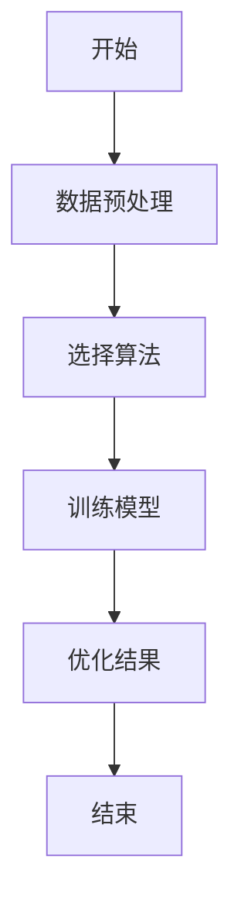
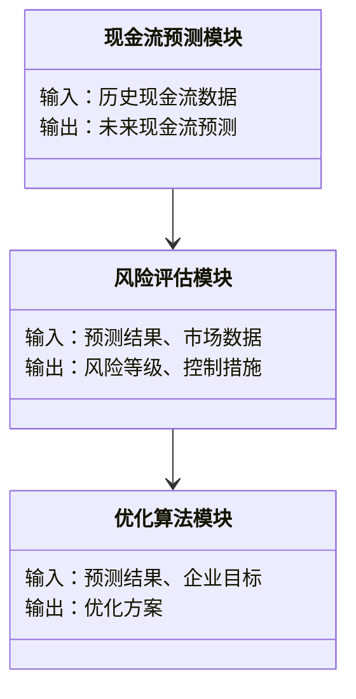

                 


# AI驱动的企业现金流优化系统设计

> 关键词：企业现金流优化，人工智能，机器学习，时间序列分析，系统架构设计

> 摘要：本文详细探讨了AI驱动的企业现金流优化系统的设计与实现。从现金流优化的核心概念到AI算法的原理，再到系统的架构设计和项目实战，全面解析如何利用AI技术提升企业现金流管理的效率和准确性。通过理论与实践相结合的方式，本文为读者提供了从问题分析到解决方案的完整思路。

---

# 第一部分: AI驱动的企业现金流优化系统背景与基础

# 第1章: 企业现金流优化的核心概念与挑战

## 1.1 企业现金流优化的背景与重要性

### 1.1.1 现金流在企业运营中的核心地位

现金流是企业的生命线，直接关系到企业的生存与发展。企业的日常运营、投资扩展、偿还债务等都需要充足的现金流支持。传统的现金流管理依赖人工计算和经验判断，存在效率低、准确性差的问题。在数字化转型的背景下，AI技术的应用为现金流优化带来了新的可能性。

### 1.1.2 数字化转型对企业现金流管理的影响

随着大数据、云计算和AI技术的普及，企业开始利用先进的技术手段优化现金流管理。通过实时数据分析和智能预测，企业能够更精准地预测未来的现金流情况，从而做出更科学的财务决策。数字化转型不仅提高了管理效率，还为企业创造了更大的价值。

### 1.1.3 AI技术在现金流优化中的潜力

AI技术在现金流优化中的应用潜力巨大。通过机器学习算法，企业可以建立高精度的现金流预测模型，识别影响现金流的关键因素，并制定最优的现金流管理策略。AI还可以帮助企业在复杂多变的市场环境中快速响应，降低风险，提高资金利用效率。

## 1.2 现金流优化的常见挑战

### 1.2.1 现金流预测的不确定性

现金流预测受到市场波动、政策变化等多种因素的影响，具有高度不确定性。传统的预测方法往往依赖历史数据，难以捕捉未来的潜在变化，导致预测结果不够准确。

### 1.2.2 数据质量与完整性问题

现金流预测依赖高质量的数据输入。然而，企业在实际运营中可能面临数据缺失、噪声干扰等问题，这会影响预测模型的准确性。此外，不同部门的数据孤岛问题也可能导致数据整合困难。

### 1.2.3 传统现金流管理的局限性

传统的现金流管理方法主要依赖人工计算和经验判断，存在效率低、主观性强、难以实时更新等问题。尤其是在面对复杂多变的市场环境时，传统方法难以满足企业对高效、精准管理的需求。

## 1.3 AI驱动现金流优化的核心价值

### 1.3.1 提高预测准确性

AI技术可以通过机器学习算法分析海量数据，发现数据中的隐藏规律，从而提高现金流预测的准确性。与传统方法相比，AI预测模型能够更好地捕捉市场变化，提供更精准的预测结果。

### 1.3.2 实现动态优化

AI驱动的现金流优化系统可以实时更新预测模型，根据最新的市场信息调整优化策略。这种动态优化能力使得企业能够更快地响应市场变化，抓住潜在机会，降低风险。

### 1.3.3 降低人为错误风险

AI系统通过自动化处理数据和计算，减少了人为操作带来的错误风险。特别是在处理复杂计算和大量数据时，AI系统能够保持高度的准确性和一致性。

## 1.4 本章小结

本章从现金流优化的重要性和挑战入手，分析了AI技术在其中的应用潜力。通过对比传统方法和AI驱动方法的优劣，提出了AI驱动现金流优化的核心价值，为后续章节的深入分析奠定了基础。

---

# 第2章: AI驱动现金流优化系统的核心概念与联系

## 2.1 核心概念原理

### 2.1.1 现金流预测模型

现金流预测模型是AI驱动系统的核心模块之一。通过收集和分析历史数据，模型可以预测未来的现金流情况。常用的预测模型包括ARIMA、LSTM和Prophet等。

### 2.1.2 风险评估与控制

现金流预测模型不仅要预测未来现金流，还需要评估预测结果的风险。通过分析预测的置信区间和可能的偏差，企业可以制定相应的风险控制策略。

### 2.1.3 优化算法

优化算法是现金流优化的另一个关键模块。基于预测结果和企业目标，优化算法可以生成最优的资金分配方案，帮助企业在有限的资金条件下实现最大化收益。

## 2.2 核心概念属性对比表格

以下表格对比了现金流预测模型、风险评估和优化算法的核心属性：

| 概念       | 数据来源         | 输出结果         | 输入变量         |
|------------|------------------|------------------|------------------|
| 预测模型     | 历史现金流数据   | 未来现金流预测   | 时间序列         |
| 风险评估     | 预测结果、市场数据 | 风险等级、控制措施 | 市场波动、政策变化 |
| 优化算法     | 预测结果、企业目标 | 优化方案         | 资金分配、收益最大化 |

## 2.3 ER实体关系图

以下是一个简单的ER图，展示了现金流优化系统的主要实体及其关系：

```mermaid
erd
    客户     (客户ID, 名称, 联系方式)
    账户       (账户ID, 账户名称, 资金余额)
    交易记录   (交易ID, 交易日期, 交易金额)
    预测模型   (模型ID, 模型名称, 模型参数)
    优化方案   (方案ID, 方案名称, 方案描述)
    风险评估   (风险ID, 风险等级, 评估日期)
```

## 2.4 本章小结

本章详细阐述了AI驱动现金流优化系统的核心概念，包括预测模型、风险评估和优化算法，并通过对比表格和ER图展示了这些概念之间的关系。这些内容为后续章节的系统设计奠定了基础。

---

# 第3章: AI驱动现金流优化系统的算法原理

## 3.1 时间序列分析

### 3.1.1 ARIMA模型

ARIMA（AutoRegressive Integrated Moving Average）模型是一种常用的时间序列预测方法。它通过自回归和移动平均的组合，捕捉数据中的趋势和周期性。

$$ ARIMA(p, d, q) $$
- \( p \): 自回归阶数
- \( d \): 差分阶数
- \( q \): 移动平均阶数

### 3.1.2 LSTM网络

LSTM（Long Short-Term Memory）是一种深度学习模型，特别适合处理时间序列数据。LSTM通过记忆单元和控制门来捕捉长期依赖关系，能够更好地处理非线性变化。

### 3.1.3 Prophet模型

Prophet是由Facebook开源的时间序列预测模型，适用于具有明确时间依赖性的数据。它结合了回归模型和时间序列模型的优势，预测结果具有较高的准确性和可解释性。

## 3.2 机器学习模型

### 3.2.1 线性回归

线性回归是一种简单的预测模型，适用于线性关系的数据。虽然其预测能力有限，但在某些情况下仍能提供有用的参考。

### 3.2.2 支持向量回归

支持向量回归（Support Vector Regression, SVR）通过构建最大-margin超平面进行预测，能够处理非线性关系。其优势在于能够捕捉复杂的数据模式，但对参数选择较为敏感。

### 3.2.3 随机森林

随机森林是一种基于决策树的集成学习方法，具有较高的鲁棒性和抗过拟合能力。它通过投票或平均的方式生成最终预测结果，适用于多变量数据的预测。

## 3.3 优化算法

### 3.3.1 线性规划

线性规划（Linear Programming）是一种优化方法，适用于目标函数和约束条件均为线性的情况。其核心在于找到最优解，通常需要借助求解器完成。

### 3.3.2 遗传算法

遗传算法（Genetic Algorithm）是一种模拟生物进化的过程的优化方法。它通过选择、交叉和变异操作生成新的解，适用于复杂的非线性优化问题。

### 3.3.3 贪心算法

贪心算法（Greedy Algorithm）是一种简单有效的优化方法，适用于具有最优子结构性质的问题。它通过每一步选择局部最优解，最终得到全局最优解。

## 3.4 算法流程图

以下是一个AI驱动现金流优化系统的算法流程图：



## 3.5 数学模型与公式

### 3.5.1 ARIMA模型公式

$$ ARIMA(p, d, q) $$
- 输入：历史现金流数据
- 输出：未来现金流预测

### 3.5.2 LSTM网络结构

LSTM的基本结构包括输入门、遗忘门和输出门：

$$
\begin{cases}
f_t = \sigma(w_f \cdot [h_{t-1}, x_t] + b_f) \\
i_t = \sigma(w_i \cdot [h_{t-1}, x_t] + b_i) \\
o_t = \sigma(w_o \cdot [h_{t-1}, x_t] + b_o) \\
g_t = \tanh(w_g \cdot [h_{t-1}, x_t] + b_g) \\
h_t = f_t \cdot h_{t-1} + i_t \cdot g_t
\end{cases}
$$

## 3.6 本章小结

本章详细介绍了AI驱动现金流优化系统中常用的算法原理，包括时间序列分析、机器学习模型和优化算法。通过对这些算法的分析，为后续章节的系统设计提供了理论基础。

---

# 第4章: 系统架构设计与实现

## 4.1 问题场景介绍

企业在日常运营中面临现金流预测不准、管理效率低下等问题。这些问题不仅影响企业的资金使用效率，还可能引发财务风险。通过AI技术，企业可以建立一个智能的现金流优化系统，实时监控和管理现金流。

## 4.2 系统功能设计

以下是系统的功能模块设计：



## 4.3 系统架构设计

以下是系统的整体架构设计：


## 4.4 项目实战

### 4.4.1 环境安装

需要安装以下工具和库：

- Python 3.8+
- Jupyter Notebook
- Pandas、NumPy、Scikit-learn、Keras、TensorFlow

### 4.4.2 核心代码实现

以下是现金流预测模型的实现代码：

```python
import pandas as pd
import numpy as np
from sklearn.metrics import mean_absolute_error
from sklearn.ensemble import RandomForestRegressor
from keras.models import Sequential
from keras.layers import LSTM, Dense

# 加载数据
data = pd.read_csv('cash_flow.csv')

# 数据预处理
train_data = data.iloc[:100]
test_data = data.iloc[100:]

# LSTM模型训练
model = Sequential()
model.add(LSTM(50, input_shape=(1, 1)))
model.add(Dense(1))
model.compile(optimizer='adam', loss='mean_squared_error')
model.fit(train_data.values.reshape(-1, 1, 1), train_data.values, epochs=50, batch_size=32)

# 预测
predicted = model.predict(test_data.values.reshape(-1, 1, 1))
print(mean_absolute_error(predicted.flatten(), test_data.values))
```

### 4.4.3 案例分析

以某制造企业为例，通过AI驱动的现金流优化系统，预测未来三个月的现金流，并制定最优的资金分配方案。通过对比实际现金流和预测结果，验证系统的准确性，并根据预测结果调整财务策略。

## 4.5 本章小结

本章通过系统架构设计和项目实战，详细展示了AI驱动现金流优化系统的实现过程。从数据采集到模型训练，再到结果输出，整个流程清晰明了，为读者提供了实际操作的参考。

---

# 第5章: 总结与展望

## 5.1 系统应用价值

AI驱动的现金流优化系统能够显著提高企业的财务管理水平，降低风险，提升资金利用效率。通过实时预测和动态优化，企业能够更好地应对市场变化，抓住发展机遇。

## 5.2 未来发展方向

随着AI技术的不断进步，现金流优化系统将朝着更智能、更高效的方向发展。未来可能会出现更多基于深度学习的预测模型，以及更加复杂的优化算法。此外，多模态数据的融合分析也将成为研究的热点。

## 5.3 最佳实践 tips

- 确保数据的准确性和完整性，建立数据治理体系。
- 定期更新模型，避免过时数据影响预测结果。
- 结合企业实际需求，选择合适的算法和模型。

## 5.4 本章小结

本章总结了AI驱动现金流优化系统的应用价值，并展望了未来的发展方向。同时，给出了最佳实践的建议，帮助企业在实际应用中更好地利用AI技术。

---

# 作者：AI天才研究院 & 禅与计算机程序设计艺术

---

通过以上内容，您可以开始撰写具体的章节内容，每个部分都需要详细展开，确保文章的逻辑性和完整性。

